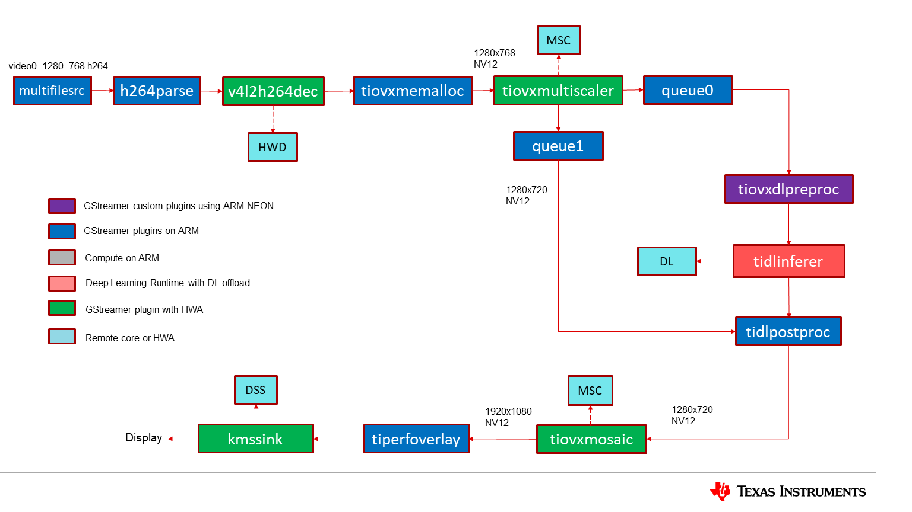
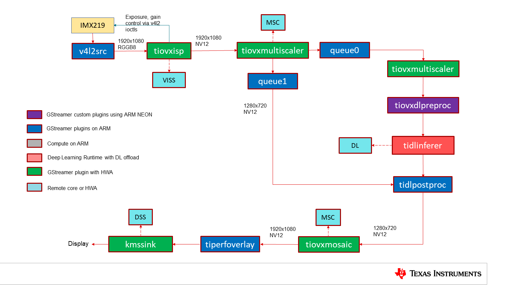

====================
Datasheet (Optiflow)
====================

The performance measurements includes the following,

#. **FPS** : Effective framerate at which the application runs
#. **Total time** : Average time taken to process each frame, which includes
   pre-processing, inference and post-processing time
#. **Inference time** : Average time taken to infer each frame
#. **CPU loading** : Loading on different CPU cores present
#. **DDR BW** : DDR read and write BW used
#. **HWA Loading** : Loading on different Hardware accelerators present

Following are the latest performance numbers of the OpTIFlow demos:

Source             : **Video**
==============================

| Resolution         : **1280x768**
| Encoding           : **h264**
|

   GStreamer based data-flow pipeline with video file input source and display output

.. csv-table::
   :file: datasheet/optiflow/optiflow_video_am62a.csv
   :header-rows: 1

Source             : **CSI Camera with VISS (imx219)**
======================================================

| Capture Framerate  : **30 fps**
| Resolution         : **1920x1080**
| format             : **SRGGB8**
|

   GStreamer based data-flow pipeline with IMX219 sensor, ISP and display

.. csv-table::
   :file: datasheet/optiflow/optiflow_camera_am62a.csv
   :header-rows: 1
