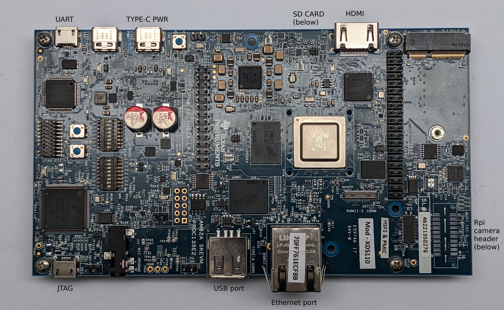
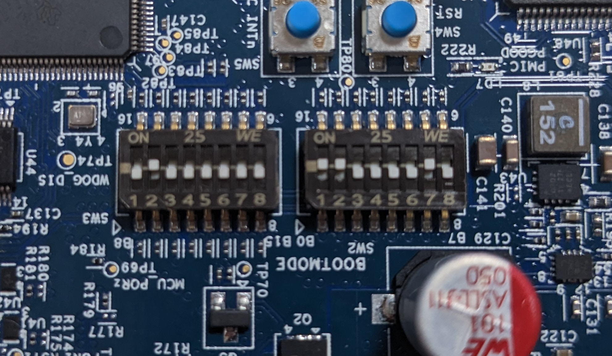
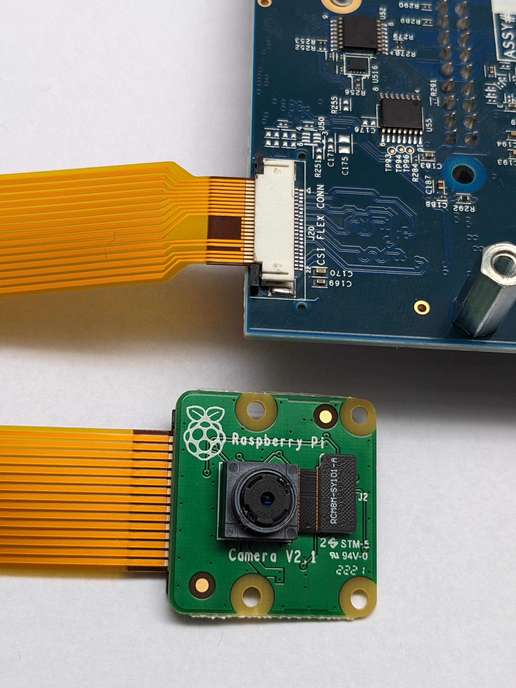
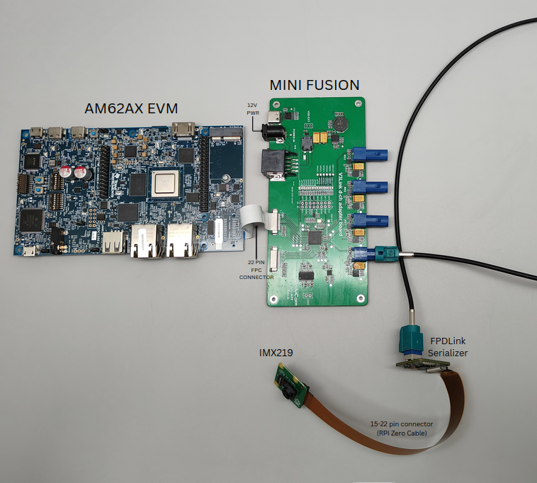

.. _pub_edgeai_getting_started:

===============
Getting started
===============

.. _pub_edgeai_getting_started_hardware:

Hardware setup
==============

.. _pub_edgeai_hw_requirements_eaik:

|__PART_FAMILY_NAME__| EVM
--------------------------

|__PART_FAMILY_NAME__| EVM is a low cost, small form factor board designed
to bring smart cameras, robots and intelligent machines to life.
For more information related to the board, full list of peripherals supported,
pin settings for boot modes and more
visit |__PART_FAMILY_NAME__| EVM `User guide <https://www.ti.com/lit/pdf/spruj66>`_

To run the demos on |__PART_FAMILY_NAME__| EVM you will require,

   - |__PART_FAMILY_NAME__| EVM
   - Minimum 16GB high performance SD card
   - External Power Supply or Power Accessory Requirements
   - USB 2.0 mouse
   - Full-HD (1080p) HDMI display
   - Optional 100Base-T Ethernet cable connected to internet
   - Optional UART cable
   - Optional USB camera (Any V4L2 compliant 1MP/2MP camera, Eg. Logitech C270/C920/C922)

      a. Nominal Output Voltage: 5-20VDC
      b. Maximum Output Current: 5000 mA
      c. Refer to |__PART_FAMILY_NAME__| EVM `User guide <https://www.ti.com/lit/pdf/spruj66>`_
         for more details.

Connect the components to the EVM as shown in the image.

   |__PART_FAMILY_NAME__| EVM connections

Set the boot pins to SD boot mode as shown in the following image.

   |__PART_FAMILY_NAME__| EVM boot pins

.. _pub_edgeai_usb_camera:

USB Camera
----------

UVC (USB video class) compliant USB cameras are supported by |__PART_FAMILY_NAME__| EVM.
The driver for the same is enabled in SDK. The SDK has been tested with
C270/C920/C922 versions of Logitech USB cameras. Please refer to
:ref:`pub_edgeai_multiple_usb_cams` to stream from multiple USB cameras
simultaneously.

.. _pub_edgeai_imx219_sensor:

RPiV2(IMX219) Raw sensor
------------------------

**RPiV2 camera module** is supported by |__PART_FAMILY_NAME__| EVM.
It is a 8MP sensor with no ISP, which can transmit raw SRGGB8 frames over
CSI lanes at 1080p resolution at 30 fps.

For more details visit `Rpi camera module v2 <https://www.raspberrypi.com/products/camera-module-v2>`_

.. note::

   For trying different resolutions of the same sensor we would also require
   different DCC binary files to work with tiovxisp and tiovxldc plugins.

   Below is a patch posted upstream to enable other higher fps with lower
   resolution modes
   https://patchwork.linuxtv.org/project/linux-media/patch/20210115185233.333407-1-angelogioacchino.delregno@somainline.org/

The camera can be connected to the RPi header as shown below on |__PART_FAMILY_NAME__|.
Note that the headers have to be lifted up to connect the cameras and put back
firmly to keep the connector cable in place.

   IMX219 CSI sensor connection with |__PART_FAMILY_NAME__| EVM

.. note::

   By default IMX219 is disabled. After connecting the camera you can enable it
   by specifying the dtb overlay file in :file:`/run/media/BOOT-mmcblk1p1/uEnv.txt` as below,

   ``name_overlays=ti/k3-am62x-sk-csi2-imx219.dtbo ti/k3-am62a7-sk-edgeai.dtbo``

   Reboot the board after editing and saving the file. Dtb files can be found
   under /boot/dtb/ti.

   Config file to run analytics pipeline with IMX219 camera is present under
   :file:`/opt/edgeai-gst-apps/configs/imx219_cam_example.yaml`. Please refer
   :ref:`pub_edgeai_sample_apps` to use the file.

Please refer :ref:`pub_edgeai_camera_sources` to know how to list all the cameras
connected and select which one to use for the demo.

By default IMX219 will be configured to capture at 8 bit, but it also supports
10 bit capture in 16 bit container. To use it in 10 bit mode, below steps are
required:

   - Call setup_cameras.sh script modifying the imx219 format.

   .. code-block:: bash

      export IMX219_CAM_FMT='[fmt:SRGGB10_1X10/1920x1080]'
      /opt/edgeai-gst-apps/scripts/setup_cameras.sh

   - Change the imaging binaries to use 10 bit versions

   .. code-block:: bash

      mv /opt/imaging/imx219/linear/dcc_2a.bin /opt/imaging/imx219/linear/dcc_2a_8b_1920x1080.bin
      mv /opt/imaging/imx219/linear/dcc_viss.bin /opt/imaging/imx219/linear/dcc_viss_8b_1920x1080.bin
      mv /opt/imaging/imx219/linear/dcc_2a_10b_1920x1080.bin /opt/imaging/imx219/linear/dcc_2a.bin
      mv /opt/imaging/imx219/linear/dcc_viss_10b_1920x1080.bin /opt/imaging/imx219/linear/dcc_viss.bin

   - Set the input format in the :file:`/opt/edgeai-gst-apps/configs/imx219_cam_example.yaml` as ``rggb10``

.. _pub_edgeai_fusion_mini:

Mini Fusion
-----------

**Mini Fusion** is supported by |__PART_FAMILY_NAME__| EVM.
Mini fusion can be used to connect FPDLink cameras to the EVM via CSI lanes.
Some of the cameras supported are IMX219, IMX390, 0V2312.

For more details visit `Arducam V3Link Camera Kit <https://www.arducam.com/product/arducam-v3link-camera-kit-for-ti-development-boards/>`_

The interface between |__PART_FAMILY_NAME__|, Mini Fusion board and the camera is shown below.
Note that the headers have to be lifted up to connect the cameras and put back
firmly to keep the connector cable in place.

   Fusion Mini connection with |__PART_FAMILY_NAME__| EVM

.. note::

   After connecting the camera you can enable it by specifying the dtb overlay
   file in ``/run/media/BOOT-mmcblk1p1/uEnv.txt``. Let's take an example of
   single IMX219 camera connected to Mini fusion board at Port 0.

   ``name_overlays=ti/k3-am62x-sk-csi2-v3link-fusion.dtbo ti/k3-v3link-imx219-0-0.dtbo ti/k3-am62a7-sk-edgeai.dtbo``

   Similarly for camera connected to other port, dtbo can be appended above.
   Reboot the board after editing and saving the file. Dtb files can be found
   under /boot/dtb/ti.

   Run the script to setup the cameras.

   ``source /opt/edgeai-gst-apps/scripts/setup_cameras_v3link.sh``

   Config file to run analytics pipeline with IMX219 camera is present under
   :file:`/opt/edgeai-gst-apps/configs/imx219_cam_example.yaml`. Please refer
   :ref:`pub_edgeai_sample_apps` to use the file.

Software setup
==============

.. _pub_edgeai_prepare_sd_card:

Preparing SD card image
-----------------------
Download the latest `SD card .wic image <https://www.ti.com/tool/download/PROCESSOR-SDK-LINUX-AM62A>`_
and flash it to SD card using Balena etcher tool available at:

https://www.balena.io/etcher/

.. note::

   We have tested with Balena Etcher version 1.7.0 which can be found here,
   https://github.com/balena-io/etcher/releases/tag/v1.7.0

   There seem to be a known-issue with latest 1.7.2 version of Balena Etcher
   https://forums.balena.io/t/etcher-error-message-cannot-read-property-message-of-null/350471

The tool can be installed either on Windows/Linux. Just download the
etcher image and follow the instructions to prepare the SD card.

.. figure:: ../../../images/edgeai/balena_etcher.png
   :scale: 100
   :align: center

   Balena Etcher tool to flash SD card with Processor SDK Linux Edge AI for |__PART_FAMILY_NAME__|

The etcher image is created for 16 GB SD cards, if you are using larger SD card,
the root filesystem will automatically expand to use the full SD card capacity
after the first boot. In case it does not automatically expand, use the steps
below on a **Linux PC**

.. code-block:: bash

   #find the SD card device entry using lsblk (Eg: /dev/sdc)
   #use the following commands to expand the filesystem
   #Make sure you have write permission to SD card or run the commands as root

   #Unmount the BOOT and rootfs partition before using parted tool
   umount /dev/sdX1
   umount /dev/sdX2

   #Use parted tool to resize the rootfs partition to use
   #the entire remaining space on the SD card
   #You might require sudo permissions to execute these steps
   parted -s /dev/sdX resizepart 2 '100%'
   e2fsck -f /dev/sdX2
   resize2fs /dev/sdX2

   #replace /dev/sdX in above commands with SD card device entry

.. _pub_edgeai_poweron_boot:

Power ON and Boot
-----------------
Ensure that the power supply is disconnected before inserting the SD card.
Once the SD card is firmly inserted in its slot and the board is powered ON,
the board will take less than 20sec to boot and start running the
**Edge AI Gallery Application** as shown

.. figure:: ../../../images/edgeai/am62a_oob_banner.jpg
   :scale: 25
   :align: center

   |__PART_FAMILY_NAME__| EVM out-of-box UI demo showing wallpaper

You can also view the boot log by connecting the UART cable to your PC and
use a serial port communications program. 4 serial ports will come up on your
PC, you should connect to port 0 to get the boot logs

For Linux OS minicom** works well.
Please refer to the below documentation on 'minicom' for more details.

https://help.ubuntu.com/community/Minicom

When starting minicom, turn on the colors options like below:

.. code-block:: bash

   sudo minicom -D /dev/ttyUSB0 -c on

.. note::

   If you are unable to input from keyboard, you might need to **disable Hardware
   Flow Control in minicom**.

For **Windows OS Tera Term** works well.
Please refer to the below documentation on 'TeraTerm' for more details

https://learn.sparkfun.com/tutorials/terminal-basics/tera-term-windows

.. note::

   If using a Windows computer, the user may need to install additional
   drivers for ports to show up: https://ftdichip.com/drivers/

.. note::

   Baud rate should be configured to 115200 bps in serial port communication
   program. You may not see any log in the UART console if you connect to it
   after the booting is complete or login prompt may get lost in between boot
   logs, press ENTER to get login prompt

.. _pub_edgeai_getting_started_init_script:

As part of the linux systemd :file:`/opt/edgeai-gst-apps/init_script.sh` is executed
which does the below,

   - This sets up necessary environment variables.
   - If any camera is connected to the board, the script sets it up and prints its device id and other information.

Once Linux boots login as ``root`` user with no password.

.. _pub_edgeai_connecting_remotely:

Connect remotely
----------------
If you don't prefer the UART console, you can also access the device with the
IP address that is shown on the display. With the IP address one can ssh directly
to the board, view the contents and run the demos. For best experience we recommend
using VSCode which can be downloaded from here,

https://code.visualstudio.com/download

You also require the "Remote development extension pack" installed in VSCode
as mentioned here:

https://code.visualstudio.com/docs/remote/ssh

.. figure:: ../../../images/edgeai/vs_code.png
   :scale: 90
   :align: center

   Microsoft Visual Studio Code for connecting to |__PART_FAMILY_NAME__| EVM via SSH

If you are using **Ubuntu 22.04** , add the following to **~/.ssh/config**

.. code-block:: bash

    # Add to ~/.ssh/config. Absolute IP or range of IP can be defined using *
   Host 10.24.*
      HostKeyAlgorithms=+ssh-rsa

You can now SSH using terminal.

.. code-block:: bash

   $ ssh root@10.24.69.123
