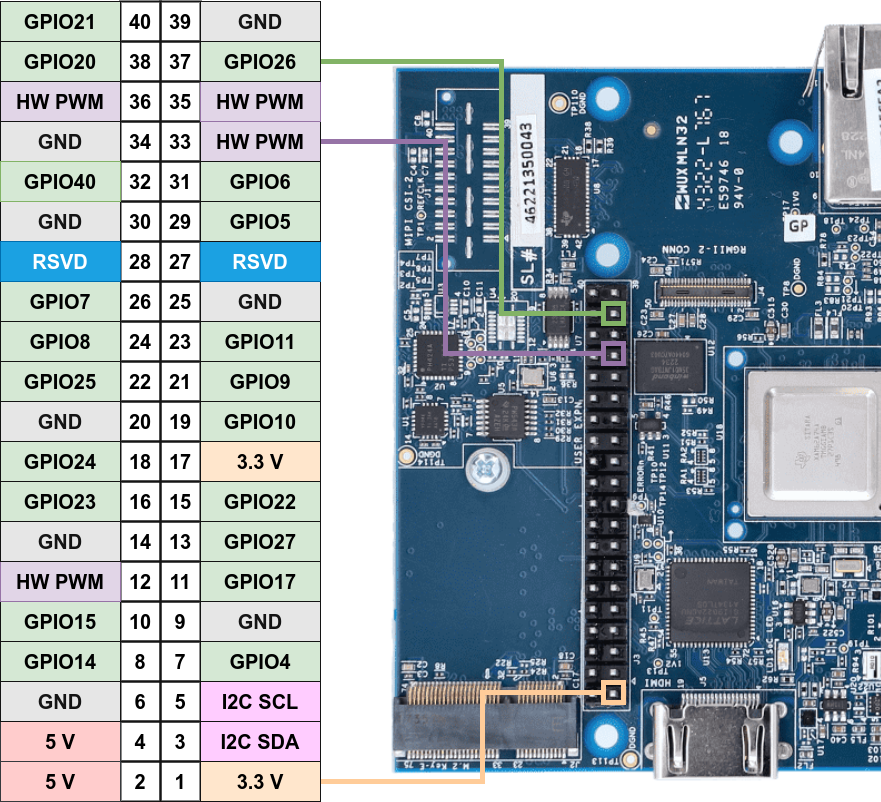

.. _pub_edgeai_pi_hdr_programming:

=============================
RPi 40-pin header programming
=============================

TI AM62A SK development board contain a 40 pin GPIO
header, similar to the 40 pin header in the Raspberry Pi. These GPIOs can be
controlled for digital input and output using the Python/CPP libraries provided in the
TI GPIO Library packages. The libraries have the same API as the RPi.GPIO
library for Raspberry Pi in order to provide an easy way to move applications
running on the Raspberry Pi to the TI board.

TI GPIO Libraries are packaged under :file:`/opt` directory. Run the below script
to build and install the gpio libraries

.. code-block:: bash

   /opt/edgeai-gst-apps# ./scripts/install_ti_gpio_libs.sh

By default, the 40-pin header is not enabled on AM69A SK board. This can be enabled by
specifying the dtb overlay file :file:`k3-am62a7-sk-rpi-hdr-ehrpwm.dtbo` in
:file:`/run/media/BOOT-mmcblk1p1/uEnv.txt` as given below.

.. code-block:: text

   name_overlays=ti/k3-am62a7-sk-rpi-hdr-ehrpwm.dtbo ti/k3-am62a7-sk-edgeai.dtbo

Reboot the board after editing and saving the file.

.. _pub_edgeai_default_pin_setup:

40-pin header default configuration
===================================

The default pin configuration on the SK board is as follows. Any deviation from this
needs modifications to the Linux DTBO. The table below lists pin numbers in all three
supported modes, namely BOARD, BCM, and SOC.

BOARD: **Physical Pin Number**
BCM  : **Broadcom SOC Numbering**
SOC  : **TI SOC Naming**

.. csv-table::
   :header: "BOARD","BCM","SOC","Function"

   "3",   "2",   "GPIO0_44",       "I2C1 SDA"
   "5",   "3",   "GPIO0_43",       "I2C1 SCL"
   "12",  "18",  "GPIO1_14",       "HW PWM"
   "13",  "27",  "GPIO0_42",       "GPIO"
   "15",  "22",  "GPIO1_22",       "GPIO"
   "16",  "23",  "GPIO0_38",       "GPIO"
   "18",  "24",  "GPIO0_39",       "GPIO"
   "22",  "25",  "GPIO0_14",       "GPIO"
   "29",  "5",   "GPIO0_36",       "GPIO"
   "31",  "6",   "GPIO0_33",       "GPIO"
   "32",  "12",  "GPIO0_40",       "GPIO"
   "33",  "13",  "GPIO1_10",       "HW PWM"
   "35",  "19",  "GPIO1_13",       "HW PWM"
   "36",  "16",  "GPIO1_09",       "HW PWM"
   "37",  "26",  "GPIO0_41",       "GPIO"

.. note::

   Please refer to `SK-AM62A User's Guide <https://www.ti.com/lit/ug/spruj66/spruj66.pdf>`_
   for details on the expansion header pin names and functionality. Also refer to section
   2.1.2 Power Budget Considerations for power/voltage limits on the expansion header pins.

Repositories
============
The Python and CPP projects are hosted on Texas Instruments GitHub. The links to the projects
are given below. The details on installation and testing can be found in the respective project
documentation.

**Python Library**: https://github.com/TexasInstruments/ti-gpio-py.git

**CPP Library**: https://github.com/TexasInstruments/ti-gpio-cpp.git

The above repositories are cloned and installed during the initialization process upon initial boot.
The ``gpiozero`` library is also installed as a part fo the initialization.

Additional References
=====================
Please refer to the lik below for information on the 40-pin header numbering and naming conventions:

| https://pinout.xyz/#
