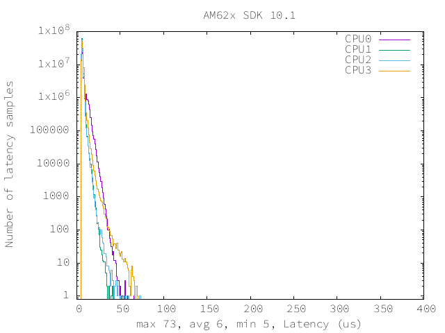

=================================
 RT-linux 11.01 Performance Guide
=================================

.. rubric::  **Read This First**
   :name: read-this-first-kernel-perf-guide

**All performance numbers provided in this document are gathered using
following Evaluation Modules unless otherwise specified.**

+----------------+----------------------------------------------------------------------------------------------------------------+
| Name           | Description                                                                                                    |
+================+================================================================================================================+
| AM62x SK       | AM62x Starter Kit rev E2 and E3 with ARM running at 1.4GHz, DDR data rate 1600 MT/S                            |
+----------------+----------------------------------------------------------------------------------------------------------------+
| AM62x LP SK    | AM62x LP Starter Kit rev E1 with ARM running at 1.25GHz, LPDDR4 data rate 1600 MT/S                            |
+----------------+----------------------------------------------------------------------------------------------------------------+
| AM62SIP SK     | AM62SIP Starter Kit rev E1 with ARM running at 1.4GHz, 512MB LPDDR4 data rate 1600 MT/S                        |
+----------------+----------------------------------------------------------------------------------------------------------------+

Table:  Evaluation Modules

.. rubric::  About This Manual
   :name: about-this-manual-rt-kernel-perf-guide

This document provides performance data for each of the device drivers
which are part of the Processor SDK Linux package. This document should be
used in conjunction with release notes and user guides provided with the
Processor SDK Linux package for information on specific issues present
with drivers included in a particular release.

.. rubric::  If You Need Assistance
   :name: if-you-need-assistance-rt-kernel-perf-guide

For further information or to report any problems, contact
https://e2e.ti.com/ or https://support.ti.com/

|

System Benchmarks
-----------------

Stress-ng and Cyclic Test

.. _RT-linux-performance:

stress-ng (next-generation) will stress test a embedded platform in various selectable ways.
It was designed to exercise various physical subsystems as well as the various
operating system kernel interfaces. stress-ng can also measure test throughput rates;
this can be useful to observe performance changes across different operating system or types of hardware.

Cyclictest is most commonly used for benchmarking RT systems.
It is one of the most frequently used tools for evaluating the relative performance of real-time systems.
Some performance tests which use Cyclictest are System benchmarking, Latency debugging with tracing and
approximating application performance.

Test commands used for running stress-ng and cyclictest together

.. code:: console

   stress-ng --cpu-method=all -c 4 &
   cyclictest -m -Sp80 -D6h -h400 -i200 -M -q

The latencies observed with this SDK are summarized below:

.. csv-table::
   :header: "Latencies","CPU 0","CPU 1","CPU 2","CPU 3"

   "Minimum (usec)","5","5","4","4"
   "Average (usec)","7","5","6","6"
   "Maximum (usec)","66","41","73","70"

