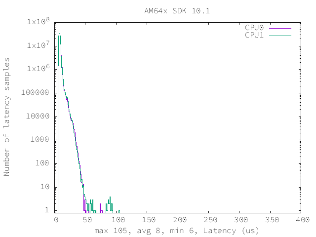
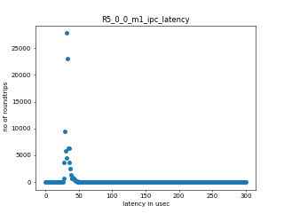
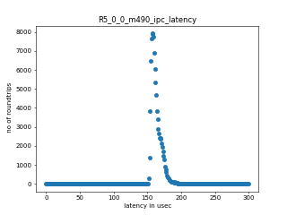
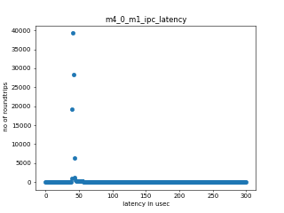
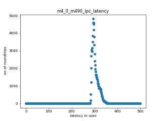

================================
RT-linux 11.01 Performance Guide
================================

.. rubric::  **Read This First**
   :name: read-this-first-rt-kernel-perf-guide

**All performance numbers provided in this document are gathered using
following Evaluation Modules unless otherwise specified.**

+----------------+---------------------------------------------------------------------------------------------------------------------+
| Name           | Description                                                                                                         |
+================+=====================================================================================================================+
| AM64x EVM      | AM64x Evaluation Module rev E1 with ARM running at 1GHz, DDR data rate 1600 MT/S                                    |
+----------------+---------------------------------------------------------------------------------------------------------------------+

Table:  Evaluation Modules

.. rubric::  About This Manual
   :name: about-this-manual-rt-kernel-perf-guide

This document provides performance data for each of the device drivers
which are part of the Processor SDK Linux package. This document should be
used in conjunction with release notes and user guides provided with the
Processor SDK Linux package for information on specific issues present
with drivers included in a particular release.

.. rubric::  If You Need Assistance
   :name: if-you-need-assistance-rt-kernel-perf-guide

For further information or to report any problems, contact
https://e2e.ti.com/ or https://support.ti.com/

|

System Benchmarks
-----------------

Stress-ng and Cyclic Test
^^^^^^^^^^^^^^^^^^^^^^^^^

.. _RT-linux-performance:

stress-ng (next-generation) will stress test a embedded platform in various selectable ways.
It was designed to exercise various physical subsystems as well as the various
operating system kernel interfaces. stress-ng can also measure test throughput rates;
this can be useful to observe performance changes across different operating system or types of hardware.

Cyclictest is most commonly used for benchmarking RT systems.
It is one of the most frequently used tools for evaluating the relative performance of real-time systems.
Some performance tests which use Cyclictest are System benchmarking, Latency debugging with tracing and
approximating application performance.

Test commands used for running stress-ng and cyclictest together

.. code:: console

   stress-ng --cpu-method=all -c 4 &
   cyclictest -m -Sp80 -D6h -h400 -i200 -M -q

The latencies observed with this DK are summarized below:

.. csv-table::
   :header: "Latencies","CPU 0","CPU 1"

   "Minimum (usec)","6","6"
   "Average (usec)","8","8"
   "Maximum (usec)","77","105"

|

LMBench
^^^^^^^
LMBench is a collection of microbenchmarks of which the memory bandwidth
and latency related ones are typically used to estimate processor
memory system performance. More information about lmbench at
http://lmbench.sourceforge.net/whatis_lmbench.html and
http://lmbench.sourceforge.net/man/lmbench.8.html

**Latency**: lat_mem_rd-stride128-szN, where N is equal to or smaller than the cache
size at given level measures the cache miss penalty. N that is at least
double the size of last level cache is the latency to external memory.

**Bandwidth**: bw_mem_bcopy-N, where N is equal to or smaller than the cache size at
a given level measures the achievable memory bandwidth from software doing
a memcpy() type operation. Typical use is for external memory bandwidth
calculation. The bandwidth is calculated as byte read and written counts
as 1 which should be roughly half of STREAM copy result.

Execute the LMBench with the following:

::

    cd /opt/ltp
    ./runltp -P j721e-idk-gw -f ddt/lmbench -s LMBENCH_L_PERF_0001

.. csv-table:: LMBench Benchmarks
    :header: "Benchmarks","am64xx-hsevm: perf"

    "af_unix_sock_stream_latency (microsec)","43.92 (min 40.29, max 49.64)"
    "af_unix_socket_stream_bandwidth (mb\s)","534.11 (min 521.33, max 538.82)"
    "bw_file_rd-io-1mb (mb/s)","848.55 (min 833.06, max 870.93)"
    "bw_file_rd-o2c-1mb (mb/s)","484.02 (min 461.04, max 493.83)"
    "bw_mem-bcopy-16mb (mb/s)","985.60 (min 970.29, max 999.00)"
    "bw_mem-bcopy-1mb (mb/s)","948.66 (min 922.65, max 989.94)"
    "bw_mem-bcopy-2mb (mb/s)","966.59 (min 936.48, max 1006.88)"
    "bw_mem-bcopy-4mb (mb/s)","942.89 (min 904.98, max 972.41)"
    "bw_mem-bcopy-8mb (mb/s)","967.26 (min 924.00, max 997.13)"
    "bw_mem-bzero-16mb (mb/s)","2116.75 (min 2116.40, max 2116.96)"
    "bw_mem-bzero-1mb (mb/s)","1531.23 (min 922.65, max 2117.90)"
    "bw_mem-bzero-2mb (mb/s)","1540.94 (min 936.48, max 2118.27)"
    "bw_mem-bzero-4mb (mb/s)","1526.44 (min 904.98, max 2113.05)"
    "bw_mem-bzero-8mb (mb/s)","1541.80 (min 924.00, max 2118.36)"
    "bw_mem-cp-16mb (mb/s)","568.31 (min 522.04, max 598.00)"
    "bw_mem-cp-1mb (mb/s)","1609.38 (min 584.20, max 2690.24)"
    "bw_mem-cp-2mb (mb/s)","1447.17 (min 534.47, max 2359.88)"
    "bw_mem-cp-4mb (mb/s)","1374.97 (min 536.91, max 2217.70)"
    "bw_mem-cp-8mb (mb/s)","1342.76 (min 529.07, max 2152.56)"
    "bw_mem-fcp-16mb (mb/s)","1012.13 (min 983.47, max 1038.08)"
    "bw_mem-fcp-1mb (mb/s)","1597.21 (min 1037.88, max 2117.90)"
    "bw_mem-fcp-2mb (mb/s)","1576.33 (min 1004.02, max 2118.27)"
    "bw_mem-fcp-4mb (mb/s)","1577.93 (min 985.71, max 2113.05)"
    "bw_mem-fcp-8mb (mb/s)","1573.48 (min 969.93, max 2118.36)"
    "bw_mem-frd-16mb (mb/s)","1302.42 (min 1283.39, max 1312.98)"
    "bw_mem-frd-1mb (mb/s)","1176.71 (min 1037.88, max 1287.47)"
    "bw_mem-frd-2mb (mb/s)","1173.57 (min 1004.02, max 1329.12)"
    "bw_mem-frd-4mb (mb/s)","1164.97 (min 985.71, max 1321.22)"
    "bw_mem-frd-8mb (mb/s)","1173.06 (min 969.93, max 1334.22)"
    "bw_mem-fwr-16mb (mb/s)","2121.88 (min 2118.36, max 2125.96)"
    "bw_mem-fwr-1mb (mb/s)","1951.85 (min 1252.46, max 2690.24)"
    "bw_mem-fwr-2mb (mb/s)","1824.75 (min 1296.39, max 2359.88)"
    "bw_mem-fwr-4mb (mb/s)","1742.03 (min 1258.06, max 2217.70)"
    "bw_mem-fwr-8mb (mb/s)","1729.04 (min 1285.76, max 2152.56)"
    "bw_mem-rd-16mb (mb/s)","1338.76 (min 1331.78, max 1342.62)"
    "bw_mem-rd-1mb (mb/s)","1078.25 (min 788.52, max 1365.85)"
    "bw_mem-rd-2mb (mb/s)","1079.56 (min 790.93, max 1355.01)"
    "bw_mem-rd-4mb (mb/s)","1086.93 (min 810.62, max 1351.58)"
    "bw_mem-rd-8mb (mb/s)","1111.91 (min 863.19, max 1350.44)"
    "bw_mem-rdwr-16mb (mb/s)","860.25 (min 847.73, max 871.32)"
    "bw_mem-rdwr-1mb (mb/s)","705.72 (min 584.20, max 847.17)"
    "bw_mem-rdwr-2mb (mb/s)","687.14 (min 534.47, max 851.18)"
    "bw_mem-rdwr-4mb (mb/s)","681.11 (min 536.91, max 839.72)"
    "bw_mem-rdwr-8mb (mb/s)","695.52 (min 529.07, max 856.16)"
    "bw_mem-wr-16mb (mb/s)","889.48 (min 888.15, max 890.47)"
    "bw_mem-wr-1mb (mb/s)","818.14 (min 785.67, max 847.17)"
    "bw_mem-wr-2mb (mb/s)","817.43 (min 773.69, max 851.18)"
    "bw_mem-wr-4mb (mb/s)","821.37 (min 784.01, max 843.79)"
    "bw_mem-wr-8mb (mb/s)","862.85 (min 844.24, max 885.54)"
    "bw_mmap_rd-mo-1mb (mb/s)","1297.19 (min 1274.58, max 1315.05)"
    "bw_mmap_rd-o2c-1mb (mb/s)","467.73 (min 455.72, max 477.86)"
    "bw_pipe (mb/s)","550.83 (min 538.93, max 563.59)"
    "bw_unix (mb/s)","534.11 (min 521.33, max 538.82)"
    "lat_connect (us)","76.50 (min 75.69, max 77.20)"
    "lat_ctx-2-128k (us)","10.52 (min 9.79, max 11.79)"
    "lat_ctx-2-256k (us)","25.39 (min 15.41, max 30.59)"
    "lat_ctx-4-128k (us)","11.98 (min 11.81, max 12.29)"
    "lat_ctx-4-256k (us)","12.54 (min 6.99, max 15.42)"
    "lat_fs-0k (num_files)","195.75 (min 188.00, max 202.00)"
    "lat_fs-10k (num_files)","86.50 (min 83.00, max 90.00)"
    "lat_fs-1k (num_files)","134.25 (min 129.00, max 139.00)"
    "lat_fs-4k (num_files)","119.75 (min 112.00, max 128.00)"
    "lat_mem_rd-stride128-sz1000k (ns)","48.27 (min 48.18, max 48.38)"
    "lat_mem_rd-stride128-sz125k (ns)","7.83 (min 7.81, max 7.86)"
    "lat_mem_rd-stride128-sz250k (ns)","12.79 (min 9.36, max 18.06)"
    "lat_mem_rd-stride128-sz31k (ns)","5.68 (min 5.13, max 6.57)"
    "lat_mem_rd-stride128-sz50 (ns)","3.02"
    "lat_mem_rd-stride128-sz500k (ns)","43.72 (min 42.55, max 44.62)"
    "lat_mem_rd-stride128-sz62k (ns)","7.41 (min 7.37, max 7.47)"
    "lat_mmap-1m (us)","71.50 (min 65.00, max 79.00)"
    "lat_ops-double-add (ns)","4.02 (min 4.02, max 4.03)"
    "lat_ops-double-div (ns)","22.12 (min 22.12, max 22.13)"
    "lat_ops-double-mul (ns)","4.02 (min 4.02, max 4.03)"
    "lat_ops-float-add (ns)","4.02"
    "lat_ops-float-div (ns)","13.07 (min 13.07, max 13.08)"
    "lat_ops-float-mul (ns)","4.02"
    "lat_ops-int-add (ns)","1.01"
    "lat_ops-int-bit (ns)","0.67"
    "lat_ops-int-div (ns)","6.04"
    "lat_ops-int-mod (ns)","6.38 (min 6.37, max 6.39)"
    "lat_ops-int-mul (ns)","4.35 (min 4.32, max 4.40)"
    "lat_ops-int64-add (ns)","1.01"
    "lat_ops-int64-bit (ns)","0.67"
    "lat_ops-int64-div (ns)","9.56 (min 9.55, max 9.56)"
    "lat_ops-int64-mod (ns)","7.38 (min 7.37, max 7.38)"
    "lat_ops-int64-mul (ns)","5.01 (min 4.99, max 5.06)"
    "lat_pagefault (us)","1.83 (min 1.81, max 1.84)"
    "lat_pipe (us)","26.04 (min 25.91, max 26.16)"
    "lat_proc-exec (us)","1208.90 (min 1194.20, max 1221.80)"
    "lat_proc-fork (us)","1035.45 (min 1016.67, max 1052.33)"
    "lat_proc-proccall (us)","0.01"
    "lat_select (us)","47.62 (min 46.19, max 49.96)"
    "lat_sem (us)","3.47 (min 3.28, max 3.55)"
    "lat_sig-catch (us)","5.64 (min 5.50, max 5.97)"
    "lat_sig-install (us)","0.92 (min 0.90, max 0.94)"
    "lat_sig-prot (us)","0.77 (min 0.49, max 0.88)"
    "lat_syscall-fstat (us)","2.48 (min 2.33, max 2.69)"
    "lat_syscall-null (us)","0.57 (min 0.57, max 0.58)"
    "lat_syscall-open (us)","415.84 (min 400.86, max 439.75)"
    "lat_syscall-read (us)","0.86 (min 0.82, max 0.93)"
    "lat_syscall-stat (us)","6.86 (min 6.57, max 7.24)"
    "lat_syscall-write (us)","0.80 (min 0.79, max 0.83)"
    "lat_tcp (us)","1.10 (min 1.09, max 1.11)"
    "lat_unix (us)","43.92 (min 40.29, max 49.64)"
    "latency_for_0.50_mb_block_size (nanosec)","43.72 (min 42.55, max 44.62)"
    "latency_for_1.00_mb_block_size (nanosec)","24.13 (min 0.00, max 48.38)"
    "pipe_bandwidth (mb\s)","550.83 (min 538.93, max 563.59)"
    "pipe_latency (microsec)","26.04 (min 25.91, max 26.16)"
    "procedure_call (microsec)","0.01"
    "select_on_200_tcp_fds (microsec)","47.62 (min 46.19, max 49.96)"
    "semaphore_latency (microsec)","3.47 (min 3.28, max 3.55)"
    "signal_handler_latency (microsec)","0.92 (min 0.90, max 0.94)"
    "signal_handler_overhead (microsec)","5.64 (min 5.50, max 5.97)"
    "tcp_ip_connection_cost_to_localhost (microsec)","76.50 (min 75.69, max 77.20)"
    "tcp_latency_using_localhost (microsec)","1.10 (min 1.09, max 1.11)"

Dhrystone
^^^^^^^^^
Dhrystone is a core only benchmark that runs from warm L1 caches in all
modern processors. It scales linearly with clock speed. For standard ARM
cores the DMIPS/MHz score will be identical with the same compiler and flags.

.. csv-table:: Dhrystone Benchmarks
    :header: "Benchmarks","am64xx-hsevm: perf"

    "cpu_clock (mhz)","1000.00"
    "dhrystone_per_mhz (dmips/mhz)","2.88 (min 2.80, max 2.90)"
    "dhrystone_per_second (dhrystonep)","5096153.75 (min 5000000.00, max 5128205.00)"

Whetstone
^^^^^^^^^

.. csv-table:: Whetstone Benchmarks
    :header: "Benchmarks","am64xx-hsevm: perf"

    "whetstone (mips)","5000.00"

Linpack
^^^^^^^
Linpack measures peak double precision (64 bit) floating point performance in
solving a dense linear system.

.. csv-table:: Linpack Benchmarks
    :header: "Benchmarks","am64xx-hsevm: perf"

    "linpack (kflops)","409028.75 (min 408609.00, max 409559.00)"

CoreMarkPro
^^^^^^^^^^^
CoreMark®-Pro is a comprehensive, advanced processor benchmark that works with
and enhances the market-proven industry-standard EEMBC CoreMark® benchmark.
While CoreMark stresses the CPU pipeline, CoreMark-Pro tests the entire processor,
adding comprehensive support for multicore technology, a combination of integer
and floating-point workloads, and data sets for utilizing larger memory subsystems.

.. csv-table:: CoreMarkPro Benchmarks
    :header: "Benchmarks","am64xx-hsevm: perf"

    "cjpeg-rose7-preset (workloads/)","29.56 (min 29.50, max 29.67)"
    "core (workloads/)","0.21"
    "coremark-pro ()","587.32 (min 583.40, max 594.37)"
    "linear_alg-mid-100x100-sp (workloads/)","10.41 (min 10.40, max 10.42)"
    "loops-all-mid-10k-sp (workloads/)","0.48"
    "nnet_test (workloads/)","0.77"
    "parser-125k (workloads/)","5.50 (min 5.35, max 5.71)"
    "radix2-big-64k (workloads/)","20.12 (min 19.27, max 21.25)"
    "sha-test (workloads/)","57.80"
    "zip-test (workloads/)","15.44 (min 15.38, max 15.63)"

.. csv-table:: CoreMarkProTwoCore Benchmarks
    :header: "Benchmarks","am64xx-hsevm: perf"

    "cjpeg-rose7-preset (workloads/)","58.15 (min 57.47, max 59.17)"
    "core (workloads/)","0.43"
    "coremark-pro ()","1047.54 (min 1043.17, max 1054.31)"
    "linear_alg-mid-100x100-sp (workloads/)","20.80 (min 20.77, max 20.82)"
    "loops-all-mid-10k-sp (workloads/)","0.87 (min 0.87, max 0.88)"
    "nnet_test (workloads/)","1.54"
    "parser-125k (workloads/)","5.84 (min 5.71, max 5.93)"
    "radix2-big-64k (workloads/)","32.26 (min 30.87, max 33.46)"
    "sha-test (workloads/)","115.28 (min 114.94, max 116.28)"
    "zip-test (workloads/)","28.37 (min 28.17, max 28.57)"

MultiBench
^^^^^^^^^^
MultiBench™ is a suite of benchmarks that allows processor and system designers to
analyze, test, and improve multicore processors. It uses three forms of concurrency:
Data decomposition: multiple threads cooperating on achieving a unified goal and
demonstrating a processor’s support for fine grain parallelism.
Processing multiple data streams: uses common code running over multiple threads and
demonstrating how well a processor scales over scalable data inputs.
Multiple workload processing: shows the scalability of general-purpose processing,
demonstrating concurrency over both code and data.
MultiBench combines a wide variety of application-specific workloads with the EEMBC
Multi-Instance-Test Harness (MITH), compatible and portable with most any multicore
processors and operating systems. MITH uses a thread-based API (POSIX-compliant) to
establish a common programming model that communicates with the benchmark through an
abstraction layer and provides a flexible interface to allow a wide variety of
thread-enabled workloads to be tested.

.. csv-table:: Multibench Benchmarks
    :header: "Benchmarks","am64xx-hsevm: perf"

    "4m-check (workloads/)","281.56 (min 281.15, max 281.85)"
    "4m-check-reassembly (workloads/)","61.33 (min 61.09, max 61.61)"
    "4m-check-reassembly-tcp (workloads/)","36.25 (min 35.77, max 36.60)"
    "4m-check-reassembly-tcp-cmykw2-rotatew2 (workloads/)","14.55 (min 14.38, max 14.71)"
    "4m-check-reassembly-tcp-x264w2 (workloads/)","0.75 (min 0.74, max 0.76)"
    "4m-cmykw2 (workloads/)","85.64 (min 84.64, max 86.24)"
    "4m-cmykw2-rotatew2 (workloads/)","18.45 (min 17.29, max 19.80)"
    "4m-reassembly (workloads/)","56.74 (min 56.63, max 56.88)"
    "4m-rotatew2 (workloads/)","21.89 (min 20.05, max 23.13)"
    "4m-tcp-mixed (workloads/)","85.56 (min 85.11, max 86.02)"
    "4m-x264w2 (workloads/)","0.76 (min 0.76, max 0.77)"
    "empty-wld (workloads/)","1.00"
    "idct-4m (workloads/)","13.68 (min 13.68, max 13.69)"
    "idct-4mw1 (workloads/)","13.68 (min 13.67, max 13.69)"
    "ippktcheck-4m (workloads/)","281.33 (min 280.65, max 282.01)"
    "ippktcheck-4mw1 (workloads/)","281.37 (min 280.87, max 281.85)"
    "ipres-4m (workloads/)","72.63 (min 72.46, max 72.92)"
    "ipres-4mw1 (workloads/)","71.88 (min 71.29, max 72.39)"
    "md5-4m (workloads/)","19.75 (min 19.58, max 19.93)"
    "md5-4mw1 (workloads/)","19.74 (min 19.45, max 20.00)"
    "rgbcmyk-4m (workloads/)","44.70 (min 44.68, max 44.72)"
    "rgbcmyk-4mw1 (workloads/)","44.69 (min 44.68, max 44.70)"
    "rotate-4ms1 (workloads/)","16.57 (min 16.51, max 16.59)"
    "rotate-4ms1w1 (workloads/)","16.60 (min 16.59, max 16.61)"
    "rotate-4ms64 (workloads/)","16.79 (min 16.79, max 16.80)"
    "rotate-4ms64w1 (workloads/)","16.79 (min 16.76, max 16.80)"
    "x264-4mq (workloads/)","0.41"
    "x264-4mqw1 (workloads/)","0.41"

Boot-time Measurement
---------------------

Boot media: MMCSD
^^^^^^^^^^^^^^^^^

.. csv-table:: Linux boot time MMCSD
    :header: "Boot Configuration","am64xx-hsevm: Boot time in seconds: avg(min,max)"

    "Linux boot time from SD with default rootfs (20 boot cycles)","22.75 (min 20.01, max 29.10)"

Boot time numbers [avg, min, max] are measured from "Starting kernel" to Linux prompt across 20 boot cycles.

|

Ethernet
--------
Ethernet performance benchmarks were measured using Netperf 2.7.1 https://hewlettpackard.github.io/netperf/doc/netperf.html
Test procedures were modeled after those defined in RFC-2544:
https://tools.ietf.org/html/rfc2544, where the DUT is the TI device
and the "tester" used was a Linux PC. To produce consistent results,
it is recommended to carry out performance tests in a private network and to avoid
running NFS on the same interface used in the test. In these results,
CPU utilization was captured as the total percentage used across all cores on the device,
while running the performance test over one external interface.

UDP Throughput (0% loss) was measured by the procedure defined in RFC-2544 section 26.1: Throughput.
In this scenario, netperf options burst_size (-b) and wait_time (-w) are used to limit bandwidth
during different trials of the test, with the goal of finding the highest rate at which
no loss is seen. For example, to limit bandwidth to 500Mbits/sec with 1472B datagram:

::

   burst_size = <bandwidth (bits/sec)> / 8 (bits -> bytes) / <UDP datagram size> / 100 (seconds -> 10 ms)
   burst_size = 500000000 / 8 / 1472 / 100 = 425

   wait_time = 10 milliseconds (minimum supported by Linux PC used for testing)

UDP Throughput (possible loss) was measured by capturing throughput and packet loss statistics when
running the netperf test with no bandwidth limit (remove -b/-w options).

In order to start a netperf client on one device, the other device must have netserver running.
To start netserver:

::

   netserver [-p <port_number>] [-4 (IPv4 addressing)] [-6 (IPv6 addressing)]

Running the following shell script from the DUT will trigger netperf clients to measure
bidirectional TCP performance for 60 seconds and report CPU utilization. Parameter -k is used in
client commands to summarize selected statistics on their own line and -j is used to gain
additional timing measurements during the test.

::

   #!/bin/bash
   for i in 1
   do
      netperf -H <tester ip> -j -c -l 60 -t TCP_STREAM --
         -k DIRECTION,THROUGHPUT,MEAN_LATENCY,LOCAL_CPU_UTIL,REMOTE_CPU_UTIL,LOCAL_BYTES_SENT,REMOTE_BYTES_RECVD,LOCAL_SEND_SIZE &

      netperf -H <tester ip> -j -c -l 60 -t TCP_MAERTS --
         -k DIRECTION,THROUGHPUT,MEAN_LATENCY,LOCAL_CPU_UTIL,REMOTE_CPU_UTIL,LOCAL_BYTES_SENT,REMOTE_BYTES_RECVD,LOCAL_SEND_SIZE &
   done

Running the following commands will trigger netperf clients to measure UDP burst performance for
60 seconds at various burst/datagram sizes and report CPU utilization.

- For UDP egress tests, run netperf client from DUT and start netserver on tester.

::

   netperf -H <tester ip> -j -c -l 60 -t UDP_STREAM -b <burst_size> -w <wait_time> -- -m <UDP datagram size>
      -k DIRECTION,THROUGHPUT,MEAN_LATENCY,LOCAL_CPU_UTIL,REMOTE_CPU_UTIL,LOCAL_BYTES_SENT,REMOTE_BYTES_RECVD,LOCAL_SEND_SIZE

- For UDP ingress tests, run netperf client from tester and start netserver on DUT.

::

   netperf -H <DUT ip> -j -C -l 60 -t UDP_STREAM -b <burst_size> -w <wait_time> -- -m <UDP datagram size>
      -k DIRECTION,THROUGHPUT,MEAN_LATENCY,LOCAL_CPU_UTIL,REMOTE_CPU_UTIL,LOCAL_BYTES_SENT,REMOTE_BYTES_RECVD,LOCAL_SEND_SIZE

CPSW/CPSW2g/CPSW3g Ethernet Driver
^^^^^^^^^^^^^^^^^^^^^^^^^^^^^^^^^^

- CPSW3g: AM64x

.. rubric::  TCP Bidirectional Throughput
   :name: CPSW2g-tcp-bidirectional-throughput

.. csv-table:: CPSW2g TCP Bidirectional Throughput
    :header: "Command Used","am64xx-hsevm: THROUGHPUT (Mbits/sec)","am64xx-hsevm: CPU Load % (LOCAL_CPU_UTIL)"

    "netperf -H 192.168.0.1 -j -c -C -l 60 -t TCP_STREAM; netperf -H 192.168.0.1 -j -c -C -l 60 -t TCP_MAERTS","1058.45 (min 964.24, max 1158.01)","88.12 (min 79.19, max 99.75)"

ICSSG Ethernet Driver
^^^^^^^^^^^^^^^^^^^^^

.. rubric::  TCP Bidirectional Throughput
   :name: tcp-bidirectional-throughput

.. csv-table:: ICSSG TCP Bidirectional Throughput
    :header: "Command Used","am64xx-hsevm: THROUGHPUT (Mbits/sec)","am64xx-hsevm: CPU Load % (LOCAL_CPU_UTIL)"

    "netperf -H 192.168.2.1 -j -c -C -l 60 -t TCP_STREAM; netperf -H 192.168.2.1 -j -c -C -l 60 -t TCP_MAERTS","1178","99.98"

.. rubric::  TCP Bidirectional Throughput Interrupt Pacing
   :name: ICSSG-tcp-bidirectional-throughput-interrupt-pacing

.. csv-table:: ICSSG TCP Bidirectional Throughput Interrupt Pacing
    :header: "Command Used","am64xx-hsevm: THROUGHPUT (Mbits/sec)","am64xx-hsevm: CPU Load % (LOCAL_CPU_UTIL)"

    "netperf -H 192.168.2.1 -j -c -C -l 60 -t TCP_STREAM; netperf -H 192.168.2.1 -j -c -C -l 60 -t TCP_MAERTS","1198","99.41"

.. rubric::  UDP Egress Throughput
   :name: udp-egress-throughput-0-loss

.. csv-table:: ICSSG UDP Egress Throughput 0 loss
    :header: "UDP Datagram Size(bytes)","am64xx-hsevm: THROUGHPUT (Mbits/sec)","am64xx-hsevm: Packets Per Second (kPPS)","am64xx-hsevm: CPU Load % (LOCAL_CPU_UTIL)"

    "64","41.45","48.87","77.24"
    "128","81.40","59.85","76.77"
    "256","156.24","65.53","76.00"
    "1024","592.23","69.44","74.74"
    "1472","834.46","68.89","74.10"

.. rubric::  UDP Ingress Throughput
   :name: udp-ingress-throughput-0-loss

.. csv-table:: ICSSG UDP Ingress Throughput 0 loss
    :header: "UDP Datagram Size(bytes)","am64xx-hsevm: THROUGHPUT (Mbits/sec)","am64xx-hsevm: Packets Per Second (kPPS)","am64xx-hsevm: CPU Load %"

    "64","1.54","3.00","0.10"
    "128","4.81","5.00","0.23"
    "256","10.24","5.00","7.35"
    "1024","40.14","5.00","3.28"
    "1472","374.79","32","49.37"

.. rubric:: Switch Mode
   :name: icssg-switch-mode

.. csv-table:: ICSSG Switch Mode Forwarding
   :header: "Mode","am64xx-hsevm: THROUGHPUT (Mbits/sec)","am64xx-hsevm: CPU Load % (SENDER)","am64xx-hsevm: CPU Load % (FORWARDING)","am64xx-hsevm: CPU Load % (RECIEVER)"

   "Switch with HW Offload","929","94.07","0","83.73"
   "Switch with SW Offload","915","96.23","30","85.38"

.. rubric:: HSR Mode
   :name: icssg-hsr-mode

.. csv-table:: ICSSG HSR Mode Forwarding
   :header: "Mode","am64xx-hsevm: THROUGHPUT (Mbits/sec)","am64xx-hsevm: CPU Load % (SENDER)","am64xx-hsevm: CPU Load % (FORWARDING)","am64xx-hsevm: CPU Load % (RECIEVER)"

   "HSR with HW Offload","466","62.01","0","69.11"
   "HSR with SW Offload","387","65","29.96","70"

|

OSPI Flash Driver
-----------------

AM64XX-EVM
^^^^^^^^^^

RAW
"""

.. csv-table:: OSPI Raw Flash Driver
    :header: "File size (Mbytes)","am64xx-hsevm: Raw Read Throughput (Mbytes/sec)"

    "50","142.86"

EMMC Driver
-----------
.. warning::

  **IMPORTANT**: The performance numbers can be severely affected if the media is
  mounted in sync mode. Hot plug scripts in the filesystem mount
  removable media in sync mode to ensure data integrity. For performance
  sensitive applications, umount the auto-mounted filesystem and
  re-mount in async mode.

EMMC EXT4 FIO 1G
""""""""""""""""

.. csv-table:: EMMC EXT4 FIO 1G
    :header: "Buffer size (bytes)","am64xx-hsevm: Write EXT4 Throughput (Mbytes/sec)","am64xx-hsevm: Write EXT4 CPU Load (%)","am64xx-hsevm: Read EXT4 Throughput (Mbytes/sec)","am64xx-hsevm: Read EXT4 CPU Load (%)"

    "1m","60.85 (min 60.00, max 61.40)","3.92 (min 3.78, max 4.06)","175.00","7.36 (min 6.89, max 7.69)"
    "4m","60.95 (min 60.10, max 61.60)","2.97 (min 2.80, max 3.07)","174.50 (min 174.00, max 175.00)","6.15 (min 5.69, max 6.48)"
    "4k","49.05 (min 48.60, max 49.50)","55.20 (min 54.38, max 56.44)","56.08 (min 55.90, max 56.30)","48.50 (min 46.00, max 50.60)"
    "256k","61.00 (min 60.50, max 61.40)","5.92 (min 5.70, max 6.06)","174.00","8.89 (min 8.66, max 9.25)"

EMMC EXT4
"""""""""

.. csv-table:: EMMC EXT4
    :header: "Buffer size (bytes)","am64xx-hsevm: Write EXT4 Throughput (Mbytes/sec)","am64xx-hsevm: Write EXT4 CPU Load (%)","am64xx-hsevm: Read EXT4 Throughput (Mbytes/sec)","am64xx-hsevm: Read EXT4 CPU Load (%)"

    "102400","54.23 (min 49.95, max 56.05)","11.05 (min 9.63, max 15.65)","174.86 (min 168.13, max 177.19)","29.58 (min 27.83, max 30.56)"
    "262144","53.37 (min 48.45, max 55.70)","10.88 (min 9.40, max 15.57)","180.84 (min 177.78, max 181.98)","33.37 (min 30.28, max 40.18)"
    "524288","53.33 (min 49.35, max 55.13)","11.16 (min 9.74, max 14.88)","182.92 (min 182.86, max 183.01)","27.58 (min 27.03, max 27.93)"
    "1048576","53.90 (min 49.57, max 56.36)","10.75 (min 9.38, max 14.46)","182.86 (min 182.82, max 182.90)","27.68 (min 26.79, max 28.57)"
    "5242880","53.72 (min 49.33, max 55.38)","10.40 (min 9.11, max 14.18)","182.79 (min 182.63, max 182.88)","27.64 (min 27.03, max 28.57)"

EMMC EXT2
"""""""""

.. csv-table:: EMMC EXT2
    :header: "Buffer size (bytes)","am64xx-hsevm: Write EXT2 Throughput (Mbytes/sec)","am64xx-hsevm: Write EXT2 CPU Load (%)","am64xx-hsevm: Read EXT2 Throughput (Mbytes/sec)","am64xx-hsevm: Read EXT2 CPU Load (%)"

    "102400","50.24 (min 41.49, max 52.87)","11.45 (min 9.39, max 18.33)","173.05 (min 172.80, max 173.40)","31.11 (min 30.28, max 32.14)"
    "262144","51.48 (min 42.38, max 54.31)","11.49 (min 9.18, max 18.46)","176.38 (min 173.55, max 177.82)","32.51 (min 30.28, max 36.28)"
    "524288","51.72 (min 42.47, max 54.95)","11.45 (min 9.44, max 18.60)","177.33 (min 174.83, max 178.79)","28.11 (min 27.19, max 28.70)"
    "1048576","51.82 (min 42.51, max 54.93)","11.24 (min 9.23, max 18.05)","178.63 (min 178.27, max 178.86)","27.70 (min 27.43, max 27.83)"
    "5242880","51.62 (min 41.99, max 54.77)","11.30 (min 9.32, max 18.16)","178.55 (min 178.35, max 178.84)","28.07 (min 27.68, max 28.70)"

EMMC VFAT
"""""""""

.. csv-table:: EMMC VFAT
    :header: "Buffer size (bytes)","am64xx-hsevm: Write VFAT Throughput (Mbytes/sec)","am64xx-hsevm: Write VFAT CPU Load (%)","am64xx-hsevm: Read VFAT Throughput (Mbytes/sec)","am64xx-hsevm: Read VFAT CPU Load (%)"

    "102400","48.75 (min 39.83, max 52.16)","13.28 (min 11.30, max 19.92)","166.81 (min 166.61, max 167.05)","31.22 (min 30.70, max 32.17)"
    "262144","50.50 (min 41.55, max 53.41)","13.72 (min 11.39, max 20.25)","168.89 (min 164.53, max 170.76)","34.76 (min 30.70, max 46.28)"
    "524288","50.46 (min 41.61, max 53.75)","13.86 (min 11.72, max 19.63)","169.99 (min 169.68, max 170.18)","27.74 (min 27.50, max 28.10)"
    "1048576","50.81 (min 41.99, max 54.38)","13.60 (min 11.53, max 20.17)","169.57 (min 169.41, max 169.83)","27.50"
    "5242880","50.90 (min 41.73, max 54.15)","13.40 (min 11.56, max 19.68)","169.96 (min 169.64, max 170.06)","28.10 (min 27.50, max 28.69)"

UBoot EMMC Driver
-----------------

.. csv-table:: UBOOT EMMC RAW
    :header: "File size (bytes in hex)","am64xx-hsevm: Write Throughput (Kbytes/sec)","am64xx-hsevm: Read Throughput (Kbytes/sec)"

    "2000000","60406.03 (min 60014.65, max 61248.60)","169126.01 (min 168907.22, max 169782.38)"
    "4000000","61165.23 (min 60907.06, max 61826.42)","173032.57 (min 172918.21, max 173375.66)"

MMCSD
-----

.. warning::

  **IMPORTANT**: The performance numbers can be severely affected if the media is
  mounted in sync mode. Hot plug scripts in the filesystem mount
  removable media in sync mode to ensure data integrity. For performance
  sensitive applications, umount the auto-mounted filesystem and
  re-mount in async mode.

MMC EXT4 FIO 1G
"""""""""""""""

.. csv-table:: MMC EXT4 FIO 1G
    :header: "Buffer size (bytes)","am64xx-hsevm: Write EXT4 Throughput (Mbytes/sec)","am64xx-hsevm: Write EXT4 CPU Load (%)","am64xx-hsevm: Read EXT4 Throughput (Mbytes/sec)","am64xx-hsevm: Read EXT4 CPU Load (%)"

    "4m","42.15 (min 41.50, max 43.00)","2.62 (min 2.56, max 2.71)","86.95 (min 86.80, max 87.10)","3.73 (min 3.60, max 3.92)"
    "1m","41.95 (min 41.10, max 42.30)","3.52 (min 3.34, max 3.70)","86.95 (min 86.90, max 87.10)","5.01 (min 4.85, max 5.31)"
    "4k","2.76 (min 2.71, max 2.82)","7.73 (min 7.65, max 7.76)","12.70 (min 12.50, max 12.80)","15.07 (min 14.49, max 15.69)"
    "256k","36.50 (min 35.50, max 37.30)","4.48 (min 4.17, max 4.66)","83.10 (min 83.00, max 83.20)","6.78 (min 5.99, max 7.20)"

MMC EXT4
""""""""

.. csv-table:: MMC EXT4
    :header: "Buffer size (bytes)","am64xx-hsevm: Write Raw Throughput (Mbytes/sec)","am64xx-hsevm: Write Raw CPU Load (%)","am64xx-hsevm: Read Raw Throughput (Mbytes/sec)","am64xx-hsevm: Read Raw CPU Load (%)"

    "102400","35.51 (min 33.07, max 37.45)","7.64 (min 6.31, max 11.15)","73.92 (min 70.24, max 78.38)","13.81 (min 12.28, max 15.00)"
    "262144","35.56 (min 34.43, max 37.31)","7.63 (min 6.38, max 11.15)","79.33 (min 76.51, max 82.53)","13.86 (min 13.06, max 14.92)"
    "524288","36.53 (min 35.02, max 37.89)","7.53 (min 6.06, max 11.27)","90.56 (min 90.39, max 90.83)","13.27 (min 12.78, max 13.60)"
    "1048576","36.79 (min 35.77, max 38.36)","7.50 (min 6.21, max 11.07)","89.75 (min 88.59, max 90.86)","12.83 (min 12.45, max 13.16)"
    "5242880","36.94 (min 36.11, max 38.11)","7.24 (min 6.02, max 11.13)","90.18 (min 88.74, max 90.76)","13.42 (min 13.16, max 13.60)"

MMC EXT3
""""""""

.. csv-table:: MMC EXT3
    :header: "Buffer size (bytes)","am64xx-hsevm: Write Raw Throughput (Mbytes/sec)","am64xx-hsevm: Write Raw CPU Load (%)","am64xx-hsevm: Read Raw Throughput (Mbytes/sec)","am64xx-hsevm: Read Raw CPU Load (%)"

    "102400","35.60 (min 29.10, max 38.72)","9.59 (min 7.56, max 16.54)","75.63 (min 73.59, max 77.51)","14.68 (min 13.67, max 15.38)"
    "262144","34.94 (min 29.45, max 38.84)","8.94 (min 7.00, max 15.25)","85.00 (min 84.90, max 85.05)","14.19 (min 12.77, max 15.06)"
    "524288","35.04 (min 29.43, max 40.16)","8.87 (min 6.99, max 15.13)","89.16 (min 88.79, max 89.60)","13.62 (min 13.36, max 14.29)"
    "1048576","34.48 (min 29.87, max 36.97)","8.60 (min 6.82, max 14.08)","88.16 (min 84.43, max 89.47)","13.86 (min 13.42, max 14.22)"
    "5242880","36.10 (min 29.24, max 40.71)","8.85 (min 6.89, max 15.43)","85.76 (min 84.45, max 89.52)","14.01 (min 13.58, max 14.69)"

MMC EXT2
""""""""

.. csv-table:: MMC EXT2
    :header: "Buffer size (bytes)","am64xx-hsevm: Write Raw Throughput (Mbytes/sec)","am64xx-hsevm: Write Raw CPU Load (%)","am64xx-hsevm: Read Raw Throughput (Mbytes/sec)","am64xx-hsevm: Read Raw CPU Load (%)"

    "102400","37.83 (min 32.12, max 39.96)","8.88 (min 7.14, max 14.78)","77.57 (min 77.14, max 77.81)","14.41 (min 13.90, max 15.06)"
    "262144","35.82 (min 31.13, max 38.76)","8.27 (min 6.17, max 13.51)","84.06 (min 80.46, max 85.35)","13.15 (min 12.12, max 14.51)"
    "524288","37.30 (min 31.09, max 41.07)","8.11 (min 6.16, max 14.38)","87.09 (min 84.25, max 89.67)","13.89 (min 13.52, max 14.29)"
    "1048576","35.75 (min 29.84, max 39.26)","7.80 (min 6.20, max 13.56)","89.35 (min 88.93, max 89.64)","13.62 (min 13.36, max 13.85)"
    "5242880","36.21 (min 30.33, max 40.10)","7.78 (min 6.06, max 14.01)","88.34 (min 84.79, max 89.80)","14.20 (min 13.85, max 14.69)"

The performance numbers were captured using the following:

-  SanDisk Max Endurance SD card (SDSQQVR-032G-GN6IA)
-  Partition was mounted with async option

|

CRYPTO Driver
-------------

OpenSSL Performance
^^^^^^^^^^^^^^^^^^^

.. csv-table:: OpenSSL Performance
    :header: "Algorithm","Buffer Size (in bytes)","am64xx-hsevm: throughput (KBytes/Sec)"

    "aes-128-cbc","1024","20959.06 (min 19965.27, max 21320.36)"
    "aes-128-cbc","16","314.21 (min 306.05, max 318.36)"
    "aes-128-cbc","16384","133997.91 (min 131858.43, max 135550.29)"
    "aes-128-cbc","256","5437.10 (min 5301.33, max 5531.31)"
    "aes-128-cbc","64","1338.92 (min 1300.12, max 1358.95)"
    "aes-128-cbc","8192","97014.44 (min 95608.83, max 97957.21)"
    "aes-128-ecb","1024","20929.19 (min 19151.87, max 21648.38)"
    "aes-128-ecb","16","316.54 (min 312.22, max 321.90)"
    "aes-128-ecb","16384","138835.29 (min 138067.97, max 139225.77)"
    "aes-128-ecb","256","5569.86 (min 5543.42, max 5597.95)"
    "aes-128-ecb","64","1381.94 (min 1351.47, max 1404.52)"
    "aes-128-ecb","8192","98376.36 (min 97315.50, max 99846.83)"
    "aes-192-cbc","1024","20155.73 (min 18997.25, max 21175.98)"
    "aes-192-cbc","16","301.27 (min 292.46, max 316.99)"
    "aes-192-cbc","16384","126993.75 (min 126528.17, max 127391.06)"
    "aes-192-cbc","256","5340.86 (min 5230.76, max 5599.91)"
    "aes-192-cbc","64","1325.11 (min 1298.11, max 1391.21)"
    "aes-192-cbc","8192","93233.83 (min 92883.63, max 93566.29)"
    "aes-192-ecb","1024","21606.31 (min 21497.86, max 21739.18)"
    "aes-192-ecb","16","308.54 (min 297.98, max 319.48)"
    "aes-192-ecb","16384","130969.60 (min 130804.39, max 131055.62)"
    "aes-192-ecb","256","5439.27 (min 5317.21, max 5579.35)"
    "aes-192-ecb","64","1347.27 (min 1306.52, max 1391.27)"
    "aes-192-ecb","8192","95673.69 (min 95341.23, max 96144.04)"
    "aes-256-cbc","1024","20149.93 (min 18618.71, max 21155.16)"
    "aes-256-cbc","16","305.02 (min 291.87, max 317.27)"
    "aes-256-cbc","16384","119682.39 (min 119177.22, max 120083.80)"
    "aes-256-cbc","256","5467.90 (min 5210.97, max 5604.61)"
    "aes-256-cbc","64","1361.79 (min 1306.24, max 1398.59)"
    "aes-256-cbc","8192","89436.84 (min 89022.46, max 89754.28)"
    "aes-256-ecb","1024","21332.99 (min 20724.05, max 21572.27)"
    "aes-256-ecb","16","309.47 (min 297.86, max 319.90)"
    "aes-256-ecb","16384","123528.53 (min 122836.31, max 124245.33)"
    "aes-256-ecb","256","5514.73 (min 5286.66, max 5620.48)"
    "aes-256-ecb","64","1361.30 (min 1325.67, max 1396.20)"
    "aes-256-ecb","8192","91379.71 (min 90923.01, max 92198.23)"
    "sha256","1024","26057.22 (min 25825.96, max 26321.58)"
    "sha256","16","433.83 (min 431.97, max 435.66)"
    "sha256","16384","209231.87 (min 208125.95, max 210031.96)"
    "sha256","256","6812.05 (min 6772.82, max 6881.45)"
    "sha256","64","1721.55 (min 1711.42, max 1737.02)"
    "sha256","8192","141288.79 (min 140610.22, max 141890.90)"
    "sha512","1024","18045.35 (min 18011.14, max 18106.71)"
    "sha512","16","420.20 (min 419.00, max 421.30)"
    "sha512","16384","48089.77 (min 48016.04, max 48147.11)"
    "sha512","256","5989.50 (min 5978.62, max 6010.03)"
    "sha512","64","1682.55 (min 1675.90, max 1690.75)"
    "sha512","8192","43149.99 (min 43092.65, max 43242.84)"

.. csv-table:: OpenSSL CPU Load
    :header: "Algorithm","am64xx-hsevm: CPU Load"

    "aes-128-cbc","43.25 (min 43.00, max 44.00)"
    "aes-128-ecb","45.00 (min 44.00, max 46.00)"
    "aes-192-cbc","42.75 (min 42.00, max 44.00)"
    "aes-192-ecb","44.25 (min 44.00, max 45.00)"
    "aes-256-cbc","42.75 (min 42.00, max 44.00)"
    "aes-256-ecb","43.75 (min 43.00, max 44.00)"
    "sha256","93.00"
    "sha512","93.00"

Listed for each algorithm are the code snippets used to run each benchmark test.

::

    time -v openssl speed -elapsed -evp aes-128-cbc

|

RP Message Inter-Processor Communication (IPC) Latency
------------------------------------------------------

RP Message latency Performance
^^^^^^^^^^^^^^^^^^^^^^^^^^^^^^

RP Message latency is the delay measured from sending a round trip echo message from 
a Linux application to a remote processor and back. The following measurements use 
a RP message length of 1 byte and 490 bytes for comparison.

The Linux user space application `rpmsg_char_benchmark <https://git.ti.com/cgit/rpmsg/ti-rpmsg-char/>`__ captures these latency values.

Test commands used for running IPC latency tests:

.. code:: console

   rpmsg_char_benchmark -r 2 -n 100000 -m 1 & chrt -f -p 80 $!

Latencies reported:

.. csv-table::
   :header: "Remote Processor","Message Size (in bytes)","Average round trip (usecs)","Max round trip (usecs)"

   "R5F0_0","1","32","205"
   "R5F0_0","490","162","272"
   "M4F","1","41","186"
   "M4F","490","301","446"

|
