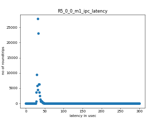
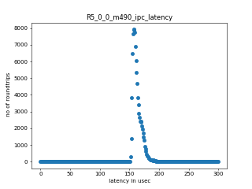
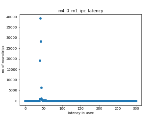
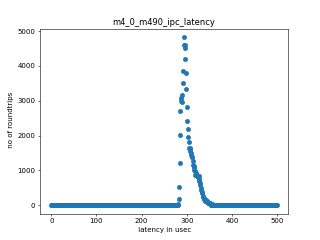

.. include:: <isonum.txt>

###################################
RT-linux 12.01.00 Performance Guide
###################################

***************
Read This First
***************

**All performance numbers provided in this document are gathered using
following Evaluation Modules unless otherwise specified.**

+----------------+---------------------------------------------------------------------------------------------------------------------+
| Name           | Description                                                                                                         |
+================+=====================================================================================================================+
| AM64x EVM      | AM64x Evaluation Module rev E1 with ARM running at 1GHz, DDR data rate 1600 MT/S                                    |
+----------------+---------------------------------------------------------------------------------------------------------------------+

Table:  Evaluation Modules

*****************
About This Manual
*****************

This document provides performance data for each of the device drivers
which are part of the Processor SDK Linux package. This document should be
used in conjunction with release notes and user guides provided with the
Processor SDK Linux package for information on specific issues present
with drivers included in a particular release.

For further information or to report any problems, contact
https://e2e.ti.com/ or https://support.ti.com/

|

System Benchmarks
-------------------------

LMBench
^^^^^^^^^^^^^^^^^^^^^^^^^^^
LMBench is a collection of microbenchmarks of which the memory bandwidth 
and latency related ones are typically used to estimate processor 
memory system performance. More information about lmbench at 
https://lmbench.sourceforge.net/whatis_lmbench.html and
https://lmbench.sourceforge.net/man/lmbench.8.html
  
**Latency**: :command:`lat_mem_rd-stride128-szN`, where N is equal to or smaller than the cache
size at given level measures the cache miss penalty. N that is at least
double the size of last level cache is the latency to external memory.

**Bandwidth**: :command:`bw_mem_bcopy-N`, where N is equal to or smaller than the cache size at
a given level measures the achievable memory bandwidth from software doing
a memcpy() type operation. Typical use is for external memory bandwidth
calculation. The bandwidth is calculated as byte read and written counts
as 1 which should be roughly half of STREAM copy result.

Execute the LMBench with the following:

.. code-block:: console

    cd /opt/ltp
    ./runltp -P j721e-idk-gw -f ddt/lmbench -s LMBENCH_L_PERF_0001

.. csv-table:: LMBench Benchmarks
    :header: "Benchmarks","am64xx-hsevm: perf"

    "af_unix_sock_stream_latency (microsec)","27.39 (min 24.71, max 29.42)"
    "af_unix_socket_stream_bandwidth (mb\s)","594.76 (min 552.76, max 635.67)"
    "bw_file_rd-io-1mb (mb/s)","857.64 (min 854.55, max 861.33)"
    "bw_file_rd-o2c-1mb (mb/s)","486.73 (min 470.29, max 497.35)"
    "bw_mem-bcopy-16mb (mb/s)","965.26 (min 942.17, max 1001.50)"
    "bw_mem-bcopy-1mb (mb/s)","940.31 (min 895.58, max 963.58)"
    "bw_mem-bcopy-2mb (mb/s)","935.99 (min 896.33, max 978.63)"
    "bw_mem-bcopy-4mb (mb/s)","954.25 (min 932.84, max 995.40)"
    "bw_mem-bcopy-8mb (mb/s)","949.57 (min 889.98, max 980.15)"
    "bw_mem-bzero-16mb (mb/s)","2116.79 (min 2113.61, max 2118.08)"
    "bw_mem-bzero-1mb (mb/s)","1529.33 (min 895.58, max 2119.77)"
    "bw_mem-bzero-2mb (mb/s)","1525.86 (min 896.33, max 2118.64)"
    "bw_mem-bzero-4mb (mb/s)","1535.25 (min 932.84, max 2117.52)"
    "bw_mem-bzero-8mb (mb/s)","1533.10 (min 889.98, max 2118.36)"
    "bw_mem-cp-16mb (mb/s)","585.42 (min 557.86, max 604.78)"
    "bw_mem-cp-1mb (mb/s)","1575.75 (min 593.94, max 2670.74)"
    "bw_mem-cp-2mb (mb/s)","1443.85 (min 561.96, max 2349.72)"
    "bw_mem-cp-4mb (mb/s)","1399.46 (min 548.25, max 2223.05)"
    "bw_mem-cp-8mb (mb/s)","1348.43 (min 525.73, max 2166.85)"
    "bw_mem-fcp-16mb (mb/s)","1056.91 (min 976.80, max 1116.69)"
    "bw_mem-fcp-1mb (mb/s)","1588.45 (min 1007.22, max 2119.77)"
    "bw_mem-fcp-2mb (mb/s)","1598.47 (min 1023.54, max 2118.64)"
    "bw_mem-fcp-4mb (mb/s)","1587.62 (min 1029.20, max 2117.52)"
    "bw_mem-fcp-8mb (mb/s)","1576.02 (min 986.80, max 2118.36)"
    "bw_mem-frd-16mb (mb/s)","1316.93 (min 1307.30, max 1339.25)"
    "bw_mem-frd-1mb (mb/s)","1195.59 (min 1007.22, max 1349.98)"
    "bw_mem-frd-2mb (mb/s)","1194.62 (min 1023.54, max 1325.60)"
    "bw_mem-frd-4mb (mb/s)","1190.04 (min 1029.20, max 1358.93)"
    "bw_mem-frd-8mb (mb/s)","1181.74 (min 986.80, max 1367.76)"
    "bw_mem-fwr-16mb (mb/s)","2117.43 (min 2107.48, max 2126.25)"
    "bw_mem-fwr-1mb (mb/s)","1943.02 (min 1297.98, max 2670.74)"
    "bw_mem-fwr-2mb (mb/s)","1806.97 (min 1288.45, max 2349.72)"
    "bw_mem-fwr-4mb (mb/s)","1768.35 (min 1310.62, max 2223.05)"
    "bw_mem-fwr-8mb (mb/s)","1739.76 (min 1303.14, max 2166.85)"
    "bw_mem-rd-16mb (mb/s)","1339.02 (min 1312.77, max 1365.54)"
    "bw_mem-rd-1mb (mb/s)","1096.12 (min 819.40, max 1400.28)"
    "bw_mem-rd-2mb (mb/s)","1082.03 (min 810.04, max 1376.70)"
    "bw_mem-rd-4mb (mb/s)","1120.93 (min 849.35, max 1400.07)"
    "bw_mem-rd-8mb (mb/s)","1121.04 (min 877.10, max 1394.46)"
    "bw_mem-rdwr-16mb (mb/s)","881.74 (min 873.03, max 885.64)"
    "bw_mem-rdwr-1mb (mb/s)","698.35 (min 593.94, max 827.81)"
    "bw_mem-rdwr-2mb (mb/s)","690.82 (min 561.96, max 809.61)"
    "bw_mem-rdwr-4mb (mb/s)","710.09 (min 548.25, max 855.80)"
    "bw_mem-rdwr-8mb (mb/s)","709.96 (min 525.73, max 892.56)"
    "bw_mem-wr-16mb (mb/s)","897.79 (min 887.07, max 901.56)"
    "bw_mem-wr-1mb (mb/s)","820.22 (min 767.75, max 875.66)"
    "bw_mem-wr-2mb (mb/s)","812.02 (min 791.35, max 834.61)"
    "bw_mem-wr-4mb (mb/s)","847.40 (min 824.66, max 863.74)"
    "bw_mem-wr-8mb (mb/s)","879.54 (min 867.40, max 892.56)"
    "bw_mmap_rd-mo-1mb (mb/s)","1296.25 (min 1276.94, max 1325.00)"
    "bw_mmap_rd-o2c-1mb (mb/s)","501.39 (min 483.64, max 517.51)"
    "bw_pipe (mb/s)","583.47 (min 550.48, max 607.12)"
    "bw_unix (mb/s)","594.76 (min 552.76, max 635.67)"
    "lat_connect (us)","69.03 (min 68.48, max 69.88)"
    "lat_ctx-2-128k (us)","29.98 (min 24.73, max 38.08)"
    "lat_ctx-2-256k (us)","107.07 (min 14.61, max 133.19)"
    "lat_ctx-4-128k (us)","75.24 (min 70.21, max 78.06)"
    "lat_ctx-4-256k (us)","136.86 (min 127.54, max 145.44)"
    "lat_fs-0k (num_files)","210.00 (min 195.00, max 220.00)"
    "lat_fs-10k (num_files)","93.00 (min 85.00, max 99.00)"
    "lat_fs-1k (num_files)","140.40 (min 138.00, max 143.00)"
    "lat_fs-4k (num_files)","132.00 (min 126.00, max 135.00)"
    "lat_mem_rd-stride128-sz1000k (ns)","46.77 (min 46.75, max 46.81)"
    "lat_mem_rd-stride128-sz125k (ns)","7.81 (min 7.80, max 7.82)"
    "lat_mem_rd-stride128-sz250k (ns)","12.05 (min 9.88, max 14.05)"
    "lat_mem_rd-stride128-sz31k (ns)","4.30 (min 3.05, max 5.13)"
    "lat_mem_rd-stride128-sz50 (ns)","3.02"
    "lat_mem_rd-stride128-sz500k (ns)","42.80 (min 42.29, max 43.16)"
    "lat_mem_rd-stride128-sz62k (ns)","7.35 (min 7.34, max 7.37)"
    "lat_mmap-1m (us)","65.60 (min 59.00, max 72.00)"
    "lat_ops-double-add (ns)","4.02 (min 4.02, max 4.03)"
    "lat_ops-double-div (ns)","22.13 (min 22.12, max 22.14)"
    "lat_ops-double-mul (ns)","4.02"
    "lat_ops-float-add (ns)","4.02"
    "lat_ops-float-div (ns)","13.07 (min 13.06, max 13.08)"
    "lat_ops-float-mul (ns)","4.02"
    "lat_ops-int-add (ns)","1.01"
    "lat_ops-int-bit (ns)","0.67"
    "lat_ops-int-div (ns)","6.03 (min 6.03, max 6.04)"
    "lat_ops-int-mod (ns)","6.37"
    "lat_ops-int-mul (ns)","4.32 (min 4.27, max 4.38)"
    "lat_ops-int64-add (ns)","1.01"
    "lat_ops-int64-bit (ns)","0.67"
    "lat_ops-int64-div (ns)","9.55 (min 9.55, max 9.56)"
    "lat_ops-int64-mod (ns)","7.37 (min 7.37, max 7.38)"
    "lat_ops-int64-mul (ns)","4.99 (min 4.98, max 5.02)"
    "lat_pagefault (us)","1.64 (min 1.56, max 1.67)"
    "lat_pipe (us)","18.39 (min 16.82, max 20.50)"
    "lat_proc-exec (us)","1164.84 (min 1146.20, max 1192.80)"
    "lat_proc-fork (us)","1024.07 (min 1005.33, max 1062.33)"
    "lat_proc-proccall (us)","0.01"
    "lat_select (us)","42.85 (min 42.44, max 43.23)"
    "lat_sem (us)","2.18 (min 1.65, max 3.00)"
    "lat_sig-catch (us)","5.77 (min 5.46, max 5.98)"
    "lat_sig-install (us)","0.88 (min 0.85, max 0.90)"
    "lat_sig-prot (us)","0.86 (min 0.83, max 0.89)"
    "lat_syscall-fstat (us)","2.15 (min 2.11, max 2.20)"
    "lat_syscall-null (us)","0.44 (min 0.43, max 0.45)"
    "lat_syscall-open (us)","344.84 (min 321.56, max 369.93)"
    "lat_syscall-read (us)","0.69"
    "lat_syscall-stat (us)","5.69 (min 5.48, max 5.85)"
    "lat_syscall-write (us)","0.65 (min 0.64, max 0.66)"
    "lat_tcp (us)","0.77 (min 0.74, max 0.78)"
    "lat_unix (us)","27.39 (min 24.71, max 29.42)"
    "latency_for_0.50_mb_block_size (nanosec)","42.80 (min 42.29, max 43.16)"
    "latency_for_1.00_mb_block_size (nanosec)","23.39 (min 0.00, max 46.81)"
    "pipe_bandwidth (mb\s)","583.47 (min 550.48, max 607.12)"
    "pipe_latency (microsec)","18.39 (min 16.82, max 20.50)"
    "procedure_call (microsec)","0.01"
    "select_on_200_tcp_fds (microsec)","42.85 (min 42.44, max 43.23)"
    "semaphore_latency (microsec)","2.18 (min 1.65, max 3.00)"
    "signal_handler_latency (microsec)","0.88 (min 0.85, max 0.90)"
    "signal_handler_overhead (microsec)","5.77 (min 5.46, max 5.98)"
    "tcp_ip_connection_cost_to_localhost (microsec)","69.03 (min 68.48, max 69.88)"
    "tcp_latency_using_localhost (microsec)","0.77 (min 0.74, max 0.78)"

Dhrystone
^^^^^^^^^^^^^^^^^^^^^^^^^^^
Dhrystone is a core only benchmark that runs from warm L1 caches in all
modern processors. It scales linearly with clock speed. For standard ARM
cores the DMIPS/MHz score will be identical with the same compiler and flags.

.. csv-table:: Dhrystone Benchmarks
    :header: "Benchmarks","am64xx-hsevm: perf"

    "cpu_clock (mhz)","1000.00"
    "dhrystone_per_mhz (dmips/mhz)","2.78 (min 2.70, max 2.80)"
    "dhrystone_per_second (dhrystonep)","4854820.20 (min 4761905.00, max 4878049.00)"

Whetstone
^^^^^^^^^^^^^^^^^^^^^^^^^^^

.. csv-table:: Whetstone Benchmarks
    :header: "Benchmarks","am64xx-hsevm: perf"

    "whetstone (mips)","3666.64 (min 3333.30, max 5000.00)"

Linpack
^^^^^^^^^^^^^^^^^^^^^^^^^^^
Linpack measures peak double precision (64 bit) floating point performance in
solving a dense linear system.

.. csv-table:: Linpack Benchmarks
    :header: "Benchmarks","am64xx-hsevm: perf"

    "linpack (kflops)","410801.60 (min 408682.00, max 411621.00)"

CoreMarkPro
^^^^^^^^^^^^^^^^^^^^^^^^^^^
CoreMark\ |reg|-Pro is a comprehensive, advanced processor benchmark that works
with and enhances the market-proven industry-standard EEMBC CoreMark\ |reg|
benchmark. While CoreMark stresses the CPU pipeline, CoreMark-Pro tests the
entire processor, adding comprehensive support for multicore technology, a
combination of integer and floating-point workloads, and data sets for utilizing
larger memory subsystems.

.. csv-table:: CoreMarkPro Benchmarks
    :header: "Benchmarks","am64xx-hsevm: perf"

    "cjpeg-rose7-preset (workloads/)","29.57 (min 29.50, max 29.67)"
    "core (workloads/)","0.21"
    "coremark-pro ()","598.19 (min 594.39, max 600.62)"
    "linear_alg-mid-100x100-sp (workloads/)","10.42 (min 10.41, max 10.43)"
    "loops-all-mid-10k-sp (workloads/)","0.49"
    "nnet_test (workloads/)","0.76 (min 0.76, max 0.77)"
    "parser-125k (workloads/)","5.93 (min 5.81, max 6.06)"
    "radix2-big-64k (workloads/)","20.78 (min 19.30, max 21.67)"
    "sha-test (workloads/)","57.80"
    "zip-test (workloads/)","16.03 (min 15.87, max 16.13)"

.. csv-table:: CoreMarkProTwoCore Benchmarks
    :header: "Benchmarks","am64xx-hsevm: perf"

    "cjpeg-rose7-preset (workloads/)","58.00 (min 57.14, max 58.82)"
    "core (workloads/)","0.43"
    "coremark-pro ()","1017.25 (min 940.54, max 1067.37)"
    "linear_alg-mid-100x100-sp (workloads/)","20.22 (min 17.56, max 20.85)"
    "loops-all-mid-10k-sp (workloads/)","0.88 (min 0.87, max 0.89)"
    "nnet_test (workloads/)","1.53 (min 1.52, max 1.53)"
    "parser-125k (workloads/)","5.69 (min 3.91, max 6.99)"
    "radix2-big-64k (workloads/)","31.93 (min 30.92, max 32.23)"
    "sha-test (workloads/)","114.39 (min 112.36, max 116.28)"
    "zip-test (workloads/)","24.56 (min 14.60, max 29.85)"

Boot-time Measurement
---------------------

Boot media: MMCSD
^^^^^^^^^^^^^^^^^

.. csv-table:: Linux boot time MMCSD
    :header: "Boot Configuration","am64xx-hsevm: Boot time in seconds: avg(min,max)"

    "Linux boot time from SD with default rootfs (20 boot cycles)","26.86 (min 22.82, max 31.72)"

Boot time numbers [avg, min, max] are measured from "Starting kernel" to Linux prompt across 20 boot cycles.
 

|

OSPI Flash Driver
-------------------------

.. rubric:: AM64XX-EVM
   :name: am64xx-evm-ospi

.. rubric:: RAW
   :name: am64xx-evm-ospi-raw

.. csv-table:: OSPI Raw Flash Driver
    :header: "File size (Mbytes)","am64xx-hsevm: Raw Read Throughput (Mbytes/sec)"

    "50","111.61 (min 40.98, max 147.06)"

EMMC Driver
-----------
.. warning::

  **IMPORTANT**: The performance numbers can be severely affected if the media is
  mounted in sync mode. Hot plug scripts in the filesystem mount
  removable media in sync mode to ensure data integrity. For performance
  sensitive applications, umount the auto-mounted filesystem and
  re-mount in async mode.

EMMC EXT4 FIO 1G
^^^^^^^^^^^^^^^^

.. csv-table:: EMMC EXT4 FIO 1G
    :header: "Buffer size (bytes)","am64xx-hsevm: Write EXT4 Throughput (Mbytes/sec)","am64xx-hsevm: Write EXT4 CPU Load (%)","am64xx-hsevm: Read EXT4 Throughput (Mbytes/sec)","am64xx-hsevm: Read EXT4 CPU Load (%)"

    "1m","59.84 (min 59.30, max 60.40)","4.15 (min 3.79, max 4.61)","175.00","7.95 (min 7.21, max 8.56)"
    "4m","59.54 (min 58.70, max 60.80)","3.05 (min 2.92, max 3.21)","174.80 (min 174.00, max 175.00)","6.44 (min 6.00, max 7.22)"
    "4k","51.16 (min 50.60, max 52.00)","47.30 (min 44.86, max 49.25)","56.20 (min 55.80, max 56.50)","41.64 (min 38.38, max 44.96)"
    "256k","60.00 (min 59.50, max 60.60)","5.89 (min 5.49, max 6.14)","174.00","8.77 (min 8.18, max 9.17)"

 
EMMC EXT4
"""""""""

.. csv-table:: EMMC EXT4
    :header: "Buffer size (bytes)","am64xx-hsevm: Write EXT4 Throughput (Mbytes/sec)","am64xx-hsevm: Write EXT4 CPU Load (%)","am64xx-hsevm: Read EXT4 Throughput (Mbytes/sec)","am64xx-hsevm: Read EXT4 CPU Load (%)"

    "102400","52.30 (min 48.85, max 53.65)","10.61 (min 9.30, max 14.88)","178.72 (min 178.37, max 178.89)","27.70 (min 26.61, max 29.82)"
    "262144","52.57 (min 47.81, max 55.09)","10.67 (min 9.18, max 14.70)","181.88 (min 181.13, max 182.45)","27.98 (min 26.36, max 30.63)"
    "524288","52.71 (min 48.37, max 54.89)","10.99 (min 9.18, max 17.52)","182.83 (min 182.65, max 182.98)","26.48 (min 25.89, max 28.18)"
    "1048576","53.08 (min 48.18, max 55.24)","10.78 (min 9.00, max 16.53)","182.84 (min 182.64, max 182.98)","25.90 (min 25.23, max 27.93)"
    "5242880","53.38 (min 48.84, max 56.21)","10.37 (min 8.79, max 14.04)","182.81 (min 182.47, max 183.04)","28.16 (min 27.68, max 28.44)"

EMMC EXT2
"""""""""

.. csv-table:: EMMC EXT2
    :header: "Buffer size (bytes)","am64xx-hsevm: Write EXT2 Throughput (Mbytes/sec)","am64xx-hsevm: Write EXT2 CPU Load (%)","am64xx-hsevm: Read EXT2 Throughput (Mbytes/sec)","am64xx-hsevm: Read EXT2 CPU Load (%)"

    "102400","49.36 (min 40.63, max 52.36)","11.53 (min 9.31, max 19.04)","174.21 (min 173.59, max 174.71)","29.57 (min 29.20, max 29.82)"
    "262144","49.59 (min 40.29, max 52.44)","11.33 (min 8.98, max 18.27)","175.66 (min 172.81, max 177.38)","29.19 (min 27.59, max 30.97)"
    "524288","49.40 (min 40.60, max 52.56)","11.38 (min 8.96, max 18.00)","177.27 (min 176.65, max 177.77)","26.55 (min 25.66, max 27.12)"
    "1048576","49.66 (min 40.98, max 52.68)","11.39 (min 9.20, max 18.20)","175.45 (min 173.19, max 177.56)","27.40 (min 26.27, max 30.77)"
    "5242880","49.73 (min 40.81, max 52.97)","11.19 (min 9.02, max 18.31)","177.16 (min 176.69, max 177.37)","28.90 (min 28.07, max 29.82)"

EMMC VFAT
"""""""""

.. csv-table:: EMMC VFAT
    :header: "Buffer size (bytes)","am64xx-hsevm: Write VFAT Throughput (Mbytes/sec)","am64xx-hsevm: Write VFAT CPU Load (%)","am64xx-hsevm: Read VFAT Throughput (Mbytes/sec)","am64xx-hsevm: Read VFAT CPU Load (%)"

    "102400","48.69 (min 38.37, max 53.54)","13.12 (min 11.00, max 19.92)","165.67 (min 159.84, max 169.88)","29.34 (min 28.81, max 30.16)"
    "262144","49.18 (min 38.51, max 53.39)","13.43 (min 11.17, max 19.75)","166.44 (min 160.68, max 171.10)","28.70 (min 26.50, max 32.20)"
    "524288","48.73 (min 38.48, max 53.44)","13.14 (min 11.00, max 19.57)","160.71 (min 149.59, max 169.30)","25.79 (min 25.19, max 26.23)"
    "1048576","49.26 (min 38.57, max 53.61)","13.22 (min 11.27, max 19.92)","163.64 (min 156.26, max 169.03)","26.18 (min 25.41, max 27.69)"
    "5242880","49.35 (min 38.56, max 53.73)","13.14 (min 10.73, max 20.23)","161.37 (min 152.76, max 168.52)","27.81 (min 26.87, max 28.57)"

UBoot EMMC Driver
-----------------

.. csv-table:: UBOOT EMMC RAW
    :header: "File size (bytes in hex)","am64xx-hsevm: Write Throughput (Kbytes/sec)","am64xx-hsevm: Read Throughput (Kbytes/sec)"

    "2000000","60691.75 (min 59362.32, max 61363.30)","168909.46 (min 168041.03, max 169782.38)"
    "4000000","61472.58 (min 60513.39, max 62534.35)","172691.88 (min 172010.50, max 173375.66)"

MMCSD
-----

.. warning::

  **IMPORTANT**: The performance numbers can be severely affected if the media is
  mounted in sync mode. Hot plug scripts in the filesystem mount
  removable media in sync mode to ensure data integrity. For performance
  sensitive applications, umount the auto-mounted filesystem and
  re-mount in async mode.

MMC EXT4 FIO 1G
^^^^^^^^^^^^^^^

.. csv-table:: MMC EXT4 FIO 1G
    :header: "Buffer size (bytes)","am64xx-hsevm: Write EXT4 Throughput (Mbytes/sec)","am64xx-hsevm: Write EXT4 CPU Load (%)","am64xx-hsevm: Read EXT4 Throughput (Mbytes/sec)","am64xx-hsevm: Read EXT4 CPU Load (%)"

    "1m","42.64 (min 42.00, max 43.90)","3.77 (min 3.51, max 4.05)","86.32 (min 85.40, max 87.70)","5.52 (min 5.29, max 5.75)"
    "4m","41.02 (min 40.00, max 42.00)","2.72 (min 2.63, max 2.88)","84.38 (min 82.10, max 86.60)","3.91 (min 3.67, max 4.34)"
    "4k","2.80 (min 2.77, max 2.82)","6.92 (min 6.60, max 7.23)","12.94 (min 12.80, max 13.00)","12.30 (min 11.57, max 13.03)"
    "256k","39.02 (min 37.40, max 39.80)","4.74 (min 4.54, max 4.86)","84.00 (min 83.20, max 84.70)","6.31 (min 6.01, max 6.51)"

MMC EXT4
^^^^^^^^

.. csv-table:: MMC EXT4
    :header: "Buffer size (bytes)","am64xx-hsevm: Write Raw Throughput (Mbytes/sec)","am64xx-hsevm: Write Raw CPU Load (%)","am64xx-hsevm: Read Raw Throughput (Mbytes/sec)","am64xx-hsevm: Read Raw CPU Load (%)"

    "102400","29.60 (min 27.49, max 32.57)","6.13 (min 4.88, max 9.34)","39.85 (min 38.87, max 41.46)","6.67 (min 6.19, max 7.06)"
    "262144","29.67 (min 27.73, max 31.53)","6.25 (min 5.03, max 9.06)","40.97 (min 39.82, max 43.21)","6.23 (min 5.86, max 6.68)"
    "524288","29.84 (min 28.74, max 32.57)","6.19 (min 5.05, max 8.93)","45.48 (min 45.32, max 45.61)","6.73 (min 6.32, max 7.39)"
    "1048576","29.15 (min 28.05, max 30.59)","5.79 (min 4.85, max 8.89)","45.48 (min 45.19, max 45.65)","6.57 (min 6.14, max 6.99)"
    "5242880","29.79 (min 28.65, max 32.21)","5.94 (min 4.83, max 9.37)","45.50 (min 45.04, max 45.68)","6.92 (min 6.78, max 7.06)"

MMC EXT3
^^^^^^^^

.. csv-table:: MMC EXT3
    :header: "Buffer size (bytes)","am64xx-hsevm: Write Raw Throughput (Mbytes/sec)","am64xx-hsevm: Write Raw CPU Load (%)","am64xx-hsevm: Read Raw Throughput (Mbytes/sec)","am64xx-hsevm: Read Raw CPU Load (%)"

    "102400","31.01 (min 25.48, max 35.58)","8.03 (min 5.77, max 14.63)","75.61 (min 73.95, max 76.35)","13.84 (min 13.53, max 14.07)"
    "262144","30.75 (min 26.18, max 33.65)","8.00 (min 6.17, max 13.48)","76.64 (min 68.04, max 81.39)","11.70 (min 10.40, max 13.25)"
    "524288","30.40 (min 26.39, max 33.04)","8.25 (min 6.07, max 13.45)","83.17 (min 77.44, max 84.87)","12.82 (min 10.94, max 13.93)"
    "1048576","30.78 (min 26.68, max 32.86)","7.72 (min 6.06, max 13.25)","82.20 (min 76.00, max 85.39)","12.34 (min 11.11, max 12.90)"
    "5242880","30.84 (min 25.70, max 33.54)","7.71 (min 5.61, max 13.69)","81.37 (min 75.32, max 84.56)","13.26 (min 12.60, max 13.77)"

MMC EXT2
^^^^^^^^

.. csv-table:: MMC EXT2
    :header: "Buffer size (bytes)","am64xx-hsevm: Write Raw Throughput (Mbytes/sec)","am64xx-hsevm: Write Raw CPU Load (%)","am64xx-hsevm: Read Raw Throughput (Mbytes/sec)","am64xx-hsevm: Read Raw CPU Load (%)"

    "102400","30.79 (min 25.64, max 35.90)","7.32 (min 5.20, max 13.91)","75.53 (min 73.32, max 76.39)","13.80 (min 12.96, max 14.18)"
    "262144","30.65 (min 26.80, max 32.38)","7.27 (min 5.62, max 12.06)","80.60 (min 78.03, max 82.44)","12.85 (min 11.15, max 13.90)"
    "524288","31.12 (min 26.72, max 33.97)","7.09 (min 5.51, max 12.33)","84.37 (min 81.81, max 85.23)","12.91 (min 12.40, max 13.17)"
    "1048576","30.86 (min 26.91, max 32.57)","6.95 (min 5.21, max 11.86)","83.73 (min 80.92, max 85.05)","12.74 (min 11.90, max 14.11)"
    "5242880","31.51 (min 27.06, max 34.34)","7.03 (min 5.19, max 12.21)","84.32 (min 83.61, max 84.96)","13.57 (min 13.11, max 13.99)"

The performance numbers were captured using the following:

-  SanDisk Max Endurance SD card (SDSQQVR-032G-GN6IA)
-  Partition was mounted with async option

|

CRYPTO Driver
-------------------------

OpenSSL Performance
^^^^^^^^^^^^^^^^^^^^^^^^^^^

.. csv-table:: OpenSSL Performance
    :header: "Algorithm","Buffer Size (in bytes)","am64xx-hsevm: throughput (KBytes/Sec)"

    "aes-128-cbc","1024","20092.44 (min 19409.24, max 20912.81)"
    "aes-128-cbc","16","370.45 (min 339.90, max 385.38)"
    "aes-128-cbc","16384","142622.72 (min 138002.43, max 145347.93)"
    "aes-128-cbc","256","6538.29 (min 5787.48, max 6921.98)"
    "aes-128-cbc","64","1652.21 (min 1450.18, max 1732.76)"
    "aes-128-cbc","8192","104928.60 (min 99431.77, max 107686.57)"
    "aes-128-ecb","1024","20184.89 (min 17888.94, max 21008.04)"
    "aes-128-ecb","16","357.95 (min 342.46, max 382.41)"
    "aes-128-ecb","16384","147342.09 (min 144173.74, max 149088.94)"
    "aes-128-ecb","256","6528.82 (min 5501.35, max 7081.30)"
    "aes-128-ecb","64","1649.37 (min 1423.64, max 1769.79)"
    "aes-128-ecb","8192","108434.38 (min 104131.24, max 111094.44)"
    "aes-192-cbc","1024","19555.47 (min 18000.55, max 20755.46)"
    "aes-192-cbc","16","349.64 (min 322.36, max 364.85)"
    "aes-192-cbc","16384","133654.43 (min 130815.32, max 136293.03)"
    "aes-192-cbc","256","6427.01 (min 5570.47, max 6915.84)"
    "aes-192-cbc","64","1587.62 (min 1379.84, max 1722.88)"
    "aes-192-cbc","8192","100264.62 (min 96299.69, max 102252.54)"
    "aes-192-ecb","1024","19812.45 (min 17911.81, max 20432.21)"
    "aes-192-ecb","16","359.74 (min 321.49, max 389.59)"
    "aes-192-ecb","16384","138255.21 (min 132246.19, max 141262.85)"
    "aes-192-ecb","256","6514.01 (min 5529.86, max 7099.73)"
    "aes-192-ecb","64","1573.00 (min 1369.86, max 1764.22)"
    "aes-192-ecb","8192","103121.68 (min 97834.33, max 105196.20)"
    "aes-256-cbc","1024","19915.53 (min 19302.06, max 20581.38)"
    "aes-256-cbc","16","348.60 (min 319.32, max 373.34)"
    "aes-256-cbc","16384","125540.45 (min 121454.59, max 127270.91)"
    "aes-256-cbc","256","6465.17 (min 5566.21, max 6873.60)"
    "aes-256-cbc","64","1567.93 (min 1379.14, max 1727.57)"
    "aes-256-cbc","8192","95682.95 (min 91906.05, max 97517.57)"
    "aes-256-ecb","1024","20179.29 (min 19632.81, max 20803.24)"
    "aes-256-ecb","16","356.29 (min 323.94, max 389.81)"
    "aes-256-ecb","16384","129798.73 (min 125736.28, max 131869.35)"
    "aes-256-ecb","256","6514.41 (min 5926.74, max 7078.49)"
    "aes-256-ecb","64","1581.10 (min 1477.53, max 1748.50)"
    "aes-256-ecb","8192","98926.98 (min 96722.94, max 100272.81)"
    "sha256","1024","24017.82 (min 23586.82, max 24276.31)"
    "sha256","16","398.84 (min 390.89, max 403.21)"
    "sha256","16384","203539.21 (min 202238.63, max 204925.61)"
    "sha256","256","6246.16 (min 6122.58, max 6310.31)"
    "sha256","64","1578.59 (min 1549.08, max 1596.01)"
    "sha256","8192","134940.96 (min 133150.04, max 136241.15)"
    "sha512","1024","19743.99 (min 19554.99, max 19840.00)"
    "sha512","16","385.23 (min 381.33, max 387.63)"
    "sha512","16384","78846.83 (min 78697.81, max 79052.80)"
    "sha512","256","5789.03 (min 5744.98, max 5818.37)"
    "sha512","64","1539.40 (min 1526.87, max 1548.95)"
    "sha512","8192","65578.91 (min 65448.62, max 65759.91)"

.. csv-table:: OpenSSL CPU Load
    :header: "Algorithm","am64xx-hsevm: CPU Load"

    "aes-128-cbc","43.43 (min 43.00, max 44.00)"
    "aes-128-ecb","44.86 (min 44.00, max 46.00)"
    "aes-192-cbc","43.43 (min 42.00, max 45.00)"
    "aes-192-ecb","44.14 (min 43.00, max 45.00)"
    "aes-256-cbc","42.57 (min 41.00, max 43.00)"
    "aes-256-ecb","43.29 (min 42.00, max 44.00)"
    "sha256","94.43 (min 94.00, max 95.00)"
    "sha512","94.43 (min 94.00, max 95.00)"

Listed for each algorithm are the code snippets used to run each benchmark test.

.. code-block:: console

    time -v openssl speed -elapsed -evp aes-128-cbc

|

RP Message Inter-Processor Communication (IPC) Latency
-------------------------------------------------------

RP Message latency Performance
^^^^^^^^^^^^^^^^^^^^^^^^^^^^^^

RP Message latency is the delay measured from sending a round trip echo message from
a Linux application to a remote processor and back. The following measurements use
a RP message length of 1 byte and 490 bytes for comparison.

The Linux user space application `rpmsg_char_benchmark <https://git.ti.com/cgit/rpmsg/ti-rpmsg-char/>`__ captures these latency values.

Test commands used for running IPC latency tests:

.. code:: console

   rpmsg_char_benchmark -r 2 -n 100000 -m 1 & chrt -f -p 80 $!

Latencies reported:

.. csv-table::
   :header: "Remote Processor","Message Size (in bytes)","Average round trip (usecs)","Max round trip (usecs)"

   "R5F0_0","1","35","194"
   "R5F0_0","490","154","255"
   "M4F","1","43","162"
   "M4F","490","282","439"

|
