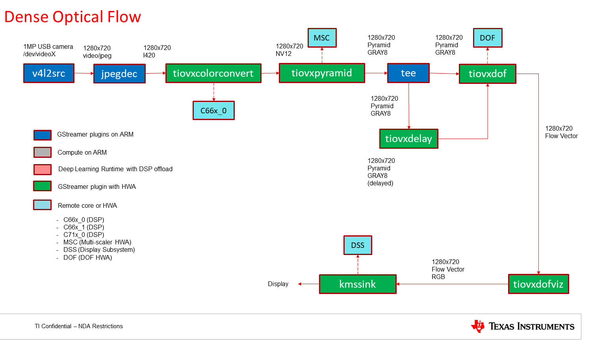
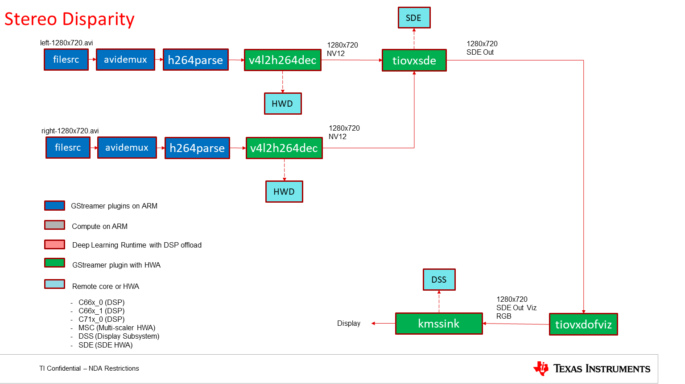

.. _pub_dmpac_demos:

=================================
Depth and Motion Perception Demos
=================================

The |__PART_FAMILY_NAME__| EVM hosts **Depth and Motion** hardware accelerator pack called **DMPAC**
which consists of **Dense Optical Flow** accelerator which can provide dense flow vector
map for upto 2MP resolution at 60fps and **Stereo Disparity Engine** which can provide
disparity values for upto 2MP resolution at 30fps. Below are example GStreamer
pipelines demonstrating the usage of both.

.. _pub_dmpac_dof_demo:

Dense Optical Flow
==================

The below pipeline shows basic functionality of the ``tiovxdof`` GStreamer element
which uses TI's Dense Optical Flow (DOF) accelerator on the SOC

.. code-block:: bash

   gst-launch-1.0                                                              \
   v4l2src io-mode=2 device=/dev/video2 ! image/jpeg, width=1280, height=720 ! \
   jpegdec ! tiovxdlcolorconvert ! video/x-raw, format=NV12 !                  \
   tiovxpyramid ! application/x-pyramid-tiovx, format=GRAY8 ! tee name=split ! \
   queue ! tiovxdof name=dof ! tiovxdofviz !                                   \
   kmssink sync=false driver-name=tidss                                        \
   split. ! tiovxdelay delay-size=1 ! dof.delayed_sink

   GStreamer based data-flow pipeline for DOF demo

.. _pub_dmpac_sde_demo:

Stereo Disparity
================

The below pipeline shows basic functionality of the ``tiovxdof`` GStreamer element
which uses TI's Stereo Disparity Engine (SDE) accelerator on the SOC

.. code-block:: bash

   gst-launch-1.0                                                              \
   filesrc location=$EDGEAI_DATA_PATH/videos/left-1280x720.avi !               \
   avidemux ! h264parse ! v4l2h264dec !                                        \
   video/x-raw, format=NV12 ! queue ! sde.left_sink                            \
   filesrc location=$EDGEAI_DATA_PATH/videos/right-1280x720.avi !              \
   avidemux ! h264parse ! v4l2h264dec !                                        \
   video/x-raw, format=NV12 ! queue ! sde.right_sink                           \
   tiovxsde name=sde ! tiovxsdeviz ! kmssink sync=false driver-name=tidss

   GStreamer based data-flow pipeline for SDE demo
