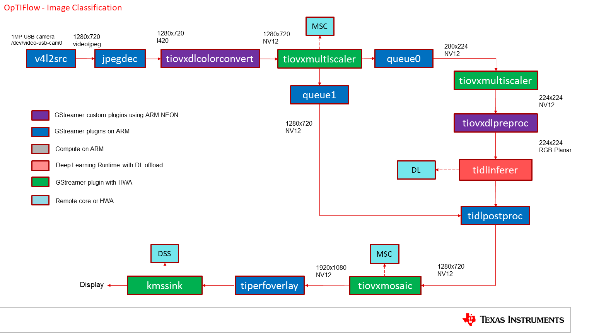
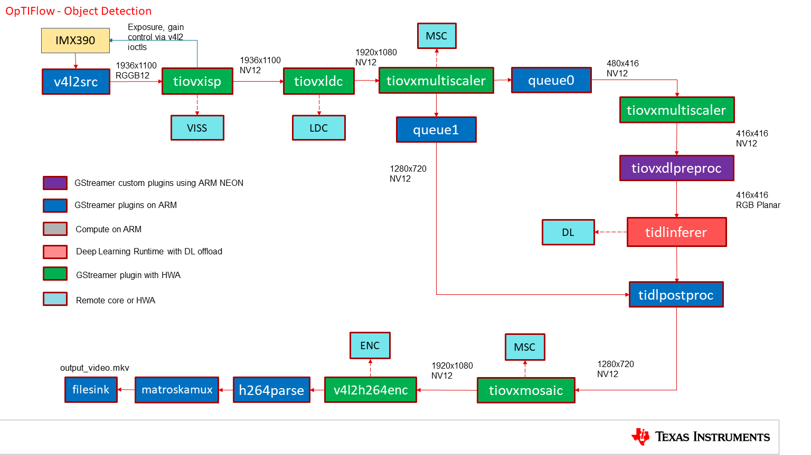
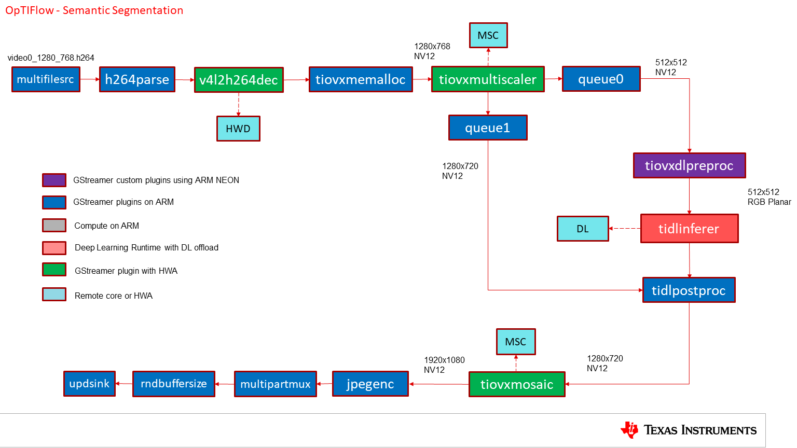
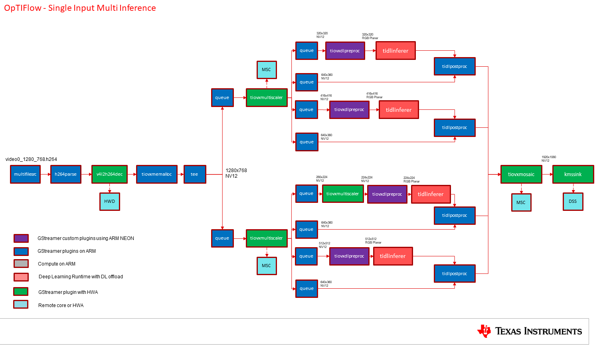
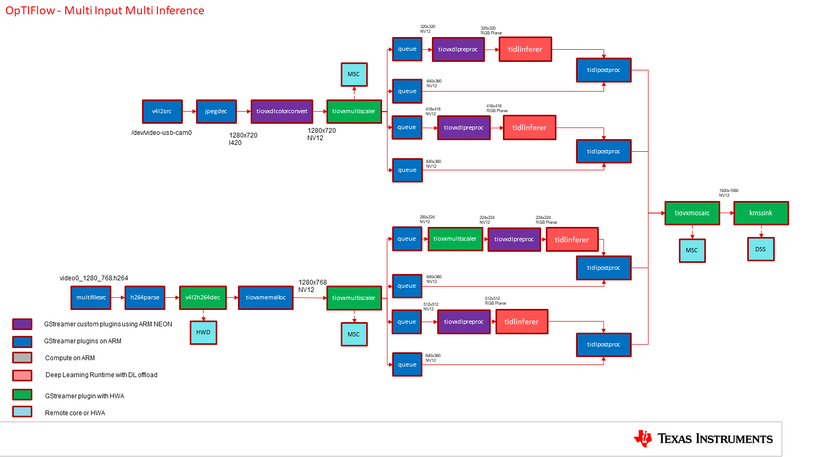
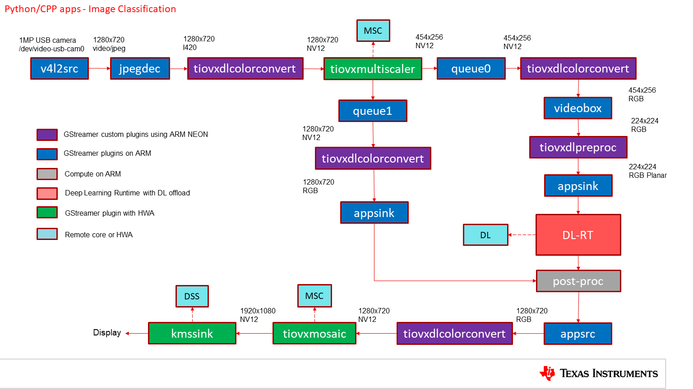
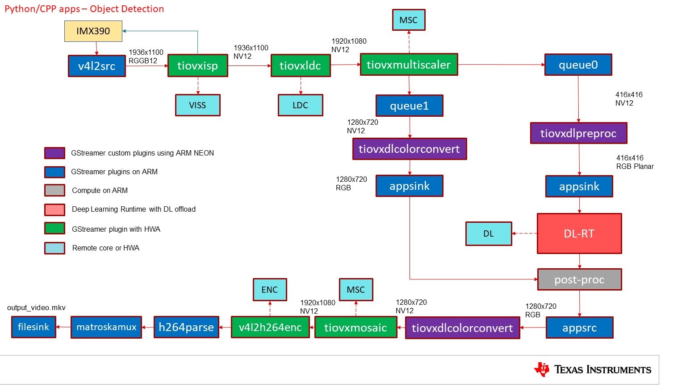
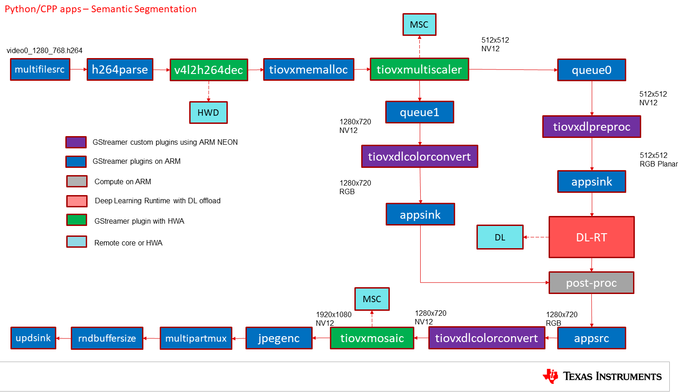
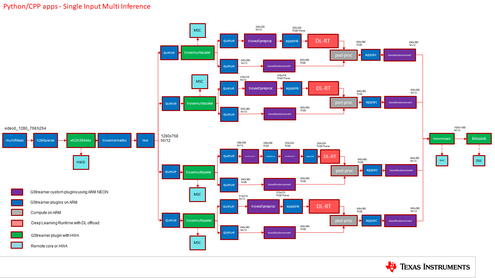
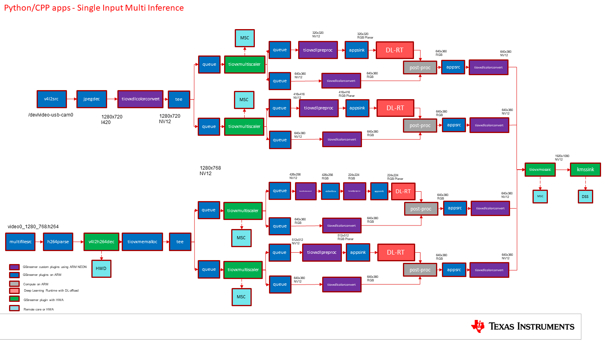

.. _pub_edgeai_dataflows:

=================
Edge AI dataflows
=================

The reference edgeai application at a high level can be split into 3 parts,

   - Input pipeline - Grabs a frame from camera, video, image or RTSP source
   - Compute pipeline - Performs pre-processing, inference and post-processing
   - Output pipeline - Sends the output to display , file or stream over network

Here are the some sample data flows for reference application and the corresponding
GStreamer launch strings that is generated. User can interact with the application via the
:ref:`pub_edgeai_configuration`

.. _pub_edgeai_optiflow_data_flow:

OpTIFlow
====================

Image Classification
--------------------

| **Input: USB Camera**
| **DL Task: Classification**
| **Output: Display**
|

A frame is grabbed from an input source and split into two paths.
The "analytics" path resizes the input maintaining the aspect ratio and crops
the input to match the resolution required to run the deep learning network.
The "visualization" path is provided to the post-processing plugin which
overlays the detected classes. Post-processed output is given to HW mosaic plugin
which positions and resizes the output window on an empty background before sending to display.

GStreamer pipeline:

.. code-block:: bash

	v4l2src device=/dev/video-usb-cam0 io-mode=2 ! image/jpeg, width=1280, height=720 ! jpegdec ! tiovxdlcolorconvert ! video/x-raw, format=NV12 ! \
	tiovxmultiscaler name=split_01 src_0::roi-startx=80 src_0::roi-starty=45 src_0::roi-width=1120 src_0::roi-height=630 target=0 \
	\
	split_01. ! queue ! video/x-raw, width=280, height=224 ! tiovxmultiscaler target=1 ! video/x-raw, width=224, height=224 ! \
	tiovxdlpreproc model=/opt/model_zoo/TFL-CL-0000-mobileNetV1-mlperf  out-pool-size=4 ! application/x-tensor-tiovx ! \
	tidlinferer target=1  model=/opt/model_zoo/TFL-CL-0000-mobileNetV1-mlperf ! post_0.tensor \
	\
	split_01. ! queue ! video/x-raw, width=1280, height=720 ! post_0.sink \
	\
	tidlpostproc name=post_0 model=/opt/model_zoo/TFL-CL-0000-mobileNetV1-mlperf alpha=0.4 viz-threshold=0.5 top-N=5 display-model=true ! queue ! mosaic_0. \
	\
	tiovxmosaic name=mosaic_0 target=1 src::pool-size=4 sink_0::startx="<320>" sink_0::starty="<150>" sink_0::widths="<1280>" sink_0::heights="<720>" ! \
	video/x-raw, format=NV12, width=1920, height=1080 ! queue ! tiperfoverlay title="Image Classification" overlay-type=graph ! kmssink driver-name=tidss sync=true

   OpTIFlow pipeline for image classification demo with USB camera and display

Object Detection
--------------------

| **Input: IMX219 Camera**
| **DL Task: Detection**
| **Output: File**
|

A frame is grabbed from an input source and split into two paths.
The "analytics" path resizes the input to match the resolution required to run
the deep learning network. The "visualization" path is provided to the
post-processing plugin which overlays rectangles around detected objects.
Post-processed output is given to HW mosaic plugin which positions and resizes
the output window on an empty background before sending to encode and save as file.

GStreamer pipeline:

.. code-block:: bash

	v4l2src device=/dev/video-imx219-cam0 io-mode=5 ! queue leaky=2 ! video/x-bayer, width=1920, height=1080, format=rggb ! \
	tiovxisp sensor-name=SENSOR_SONY_IMX219_RPI dcc-isp-file=/opt/imaging/imx219/linear/dcc_viss.bin format-msb=7 sink_0::dcc-2a-file=/opt/imaging/imx219/linear/dcc_2a.bin sink_0::device=/dev/v4l-imx219-subdev0 ! video/x-raw, format=NV12 ! \
	tiovxmultiscaler name=split_01 src_0::roi-startx=0 src_0::roi-starty=0 src_0::roi-width=1920 src_0::roi-height=1080 target=0 \
	\
	split_01. ! queue ! video/x-raw, width=480, height=416 ! tiovxmultiscaler target=1 ! video/x-raw, width=416, height=416 ! \
	tiovxdlpreproc model=/opt/model_zoo/ONR-OD-8200-yolox-nano-lite-mmdet-coco-416x416  out-pool-size=4 ! application/x-tensor-tiovx ! \
	tidlinferer target=1  model=/opt/model_zoo/ONR-OD-8200-yolox-nano-lite-mmdet-coco-416x416 ! post_0.tensor \
	\
	split_01. ! queue ! video/x-raw, width=1280, height=720 ! post_0.sink \
	\
	tidlpostproc name=post_0 model=/opt/model_zoo/ONR-OD-8200-yolox-nano-lite-mmdet-coco-416x416 alpha=0.4 viz-threshold=0.6 top-N=5 display-model=true ! queue ! mosaic_0. \
	\
	tiovxmosaic name=mosaic_0 target=1 src::pool-size=4 sink_0::startx="<320>" sink_0::starty="<150>" sink_0::widths="<1280>" sink_0::heights="<720>" ! \
	video/x-raw,format=NV12, width=1920, height=1080 ! v4l2h264enc extra-controls="controls, frame_level_rate_control_enable=1, video_bitrate=10000000, video_gop_size=30" ! \
	h264parse ! matroskamux ! filesink location=/opt/edgeai-test-data/output/output_video.mkv

   OpTIFlow pipeline for object detection demo with IMX219 camera and save to file

Semantic Segmentation
---------------------

| **Input: H264 Video**
| **DL Task: Segmentation**
| **Output: Remote streaming**
|

A frame is grabbed from an input source and split into two paths.
The "analytics" path resize the input to match the resolution required to run
the deep learning network. The "visualization" path is provided to the
post-processing plugin which blends each segmented pixel to a color map.
Post-processed output is given to HW mosaic plugin which positions and resizes
the output window on an empty background before sending to encode and stream.

GStreamer pipeline:

.. code-block:: bash

	multifilesrc location=/opt/edgeai-test-data/videos/video0_1280_768.h264 loop=true stop-index=-1 caps=video/x-h264,width=1280,height=768,framerate=30/1 ! \
	h264parse ! v4l2h264dec capture-io-mode=5 ! tiovxmemalloc pool-size=12 ! video/x-raw, format=NV12 ! \
	tiovxmultiscaler name=split_01 src_0::roi-startx=0 src_0::roi-starty=0 src_0::roi-width=1280 src_0::roi-height=768 target=0 \
	\
	split_01. ! queue ! video/x-raw, width=512, height=512 ! tiovxdlpreproc model=/opt/model_zoo/TFL-SS-2580-deeplabv3_mobv2-ade20k32-mlperf-512x512  out-pool-size=4 ! application/x-tensor-tiovx ! \
	tidlinferer target=1  model=/opt/model_zoo/TFL-SS-2580-deeplabv3_mobv2-ade20k32-mlperf-512x512 ! post_0.tensor \
	\
	split_01. ! queue ! video/x-raw, width=1280, height=720 ! post_0.sink \
	\
	tidlpostproc name=post_0 model=/opt/model_zoo/TFL-SS-2580-deeplabv3_mobv2-ade20k32-mlperf-512x512 alpha=0.4 viz-threshold=0.5 top-N=5 display-model=true ! queue ! mosaic_0. \
	\
	tiovxmosaic name=mosaic_0 target=1 src::pool-size=4 sink_0::startx="<320>" sink_0::starty="<150>" sink_0::widths="<1280>" sink_0::heights="<720>" ! \
	video/x-raw,format=NV12, width=1920, height=1080 ! queue ! tiperfoverlay title="Semantic Segmentation" overlay-type=graph ! \
	jpegenc ! multipartmux boundary=spionisto ! rndbuffersize max=65000 ! udpsink host=127.0.0.1 port=8081 sync=false

   OpTIFlow pipeline for semantic segmentation demo with file input and remote streaming

Single Input Multi Inference
----------------------------

| **Input: H264 Video**
| **DL Task: Detection, Detection, Classification, Segmentation**
| **Output: Display**
|

GStreamer pipeline:

.. code-block:: bash

	multifilesrc location=/opt/edgeai-test-data/videos/video0_1280_768.h264 loop=true stop-index=-1 caps=video/x-h264,width=1280,height=768,framerate=30/1 ! h264parse ! v4l2h264dec capture-io-mode=5 ! tiovxmemalloc pool-size=12 ! video/x-raw, format=NV12 ! \
	tee name=tee_split0 \
	tee_split0. ! queue ! tiovxmultiscaler name=split_01 src_0::roi-startx=0 src_0::roi-starty=0 src_0::roi-width=1280 src_0::roi-height=768 src_2::roi-startx=0 src_2::roi-starty=0 src_2::roi-width=1280 src_2::roi-height=768 target=0 \
	tee_split0. ! queue ! tiovxmultiscaler name=split_02 src_0::roi-startx=80 src_0::roi-starty=48 src_0::roi-width=1120 src_0::roi-height=672 src_2::roi-startx=0 src_2::roi-starty=0 src_2::roi-width=1280 src_2::roi-height=768 target=0 \
	\
	split_01. ! queue ! video/x-raw, width=320, height=320 ! tiovxdlpreproc model=/opt/model_zoo/TFL-OD-2020-ssdLite-mobDet-DSP-coco-320x320  out-pool-size=4 ! application/x-tensor-tiovx ! tidlinferer target=1  model=/opt/model_zoo/TFL-OD-2020-ssdLite-mobDet-DSP-coco-320x320 ! post_0.tensor \
	split_01. ! queue ! video/x-raw, width=640, height=360 ! post_0.sink \
	tidlpostproc name=post_0 model=/opt/model_zoo/TFL-OD-2020-ssdLite-mobDet-DSP-coco-320x320 alpha=0.400000 viz-threshold=0.600000 top-N=5 display-model=true ! queue ! mosaic_0. \
	\
	split_01. ! queue ! video/x-raw, width=416, height=416 ! tiovxdlpreproc model=/opt/model_zoo/ONR-OD-8200-yolox-nano-lite-mmdet-coco-416x416  out-pool-size=4 ! application/x-tensor-tiovx ! tidlinferer target=1  model=/opt/model_zoo/ONR-OD-8200-yolox-nano-lite-mmdet-coco-416x416 ! post_1.tensor \
	split_01. ! queue ! video/x-raw, width=640, height=360 ! post_1.sink \
	tidlpostproc name=post_1 model=/opt/model_zoo/ONR-OD-8200-yolox-nano-lite-mmdet-coco-416x416 alpha=0.400000 viz-threshold=0.600000 top-N=5 display-model=true ! queue ! mosaic_0. \
	\
	split_02. ! queue ! video/x-raw, width=280, height=224 ! tiovxmultiscaler target=1 ! video/x-raw, width=224, height=224 ! tiovxdlpreproc model=/opt/model_zoo/ONR-CL-6360-regNetx-200mf  out-pool-size=4 ! application/x-tensor-tiovx ! tidlinferer target=1  model=/opt/model_zoo/ONR-CL-6360-regNetx-200mf ! post_2.tensor \
	split_02. ! queue ! video/x-raw, width=640, height=360 ! post_2.sink \
	tidlpostproc name=post_2 model=/opt/model_zoo/ONR-CL-6360-regNetx-200mf alpha=0.400000 viz-threshold=0.500000 top-N=5 display-model=true ! queue ! mosaic_0. \
	\
	split_02. ! queue ! video/x-raw, width=384, height=384 ! tiovxdlpreproc model=/opt/model_zoo/ONR-SS-8690-fpnlite-aspp-regnetx400mf-ade20k32-384x384 out-pool-size=4 ! application/x-tensor-tiovx ! tidlinferer target=1  model=/opt/model_zoo/ONR-SS-8690-fpnlite-aspp-regnetx400mf-ade20k32-384x384 ! post_3.tensor \
	split_02. ! queue ! video/x-raw, width=640, height=360 ! post_3.sink \
	tidlpostproc name=post_3 model=/opt/model_zoo/ONR-SS-8690-fpnlite-aspp-regnetx400mf-ade20k32-384x384 alpha=0.400000 viz-threshold=0.500000 top-N=5 display-model=true ! queue ! mosaic_0. \
	\
	\
	tiovxmosaic name=mosaic_0 target=1 src::pool-size=4 \
	sink_0::startx="<320>" sink_0::starty="<150>" sink_0::widths="<640>" sink_0::heights="<360>" \
	sink_1::startx="<960>" sink_1::starty="<150>" sink_1::widths="<640>" sink_1::heights="<360>" \
	sink_2::startx="<320>" sink_2::starty="<530>" sink_2::widths="<640>" sink_2::heights="<360>" \
	sink_3::startx="<960>" sink_3::starty="<530>" sink_3::widths="<640>" sink_3::heights="<360>" \
	! video/x-raw,format=NV12, width=1920, height=1080 ! queue ! tiperfoverlay title="Single Input, Multi Inference" overlay-type=graph ! kmssink driver-name=tidss sync=false

   OpTIFlow pipeline for single input multi inference

Multi Input Multi Inference
----------------------------

| **Input: USB Camera, H264 Video**
| **DL Task: Detection, Detection, Classification, Segmentation**
| **Output: Display**
|

GStreamer pipeline:

.. code-block:: bash

	v4l2src device=/dev/video-usb-cam0 io-mode=2 ! image/jpeg, width=1280, height=720 ! jpegdec ! tiovxdlcolorconvert ! video/x-raw, format=NV12 ! \
	tiovxmultiscaler name=split_01 src_0::roi-startx=0 src_0::roi-starty=0 src_0::roi-width=1280 src_0::roi-height=720 src_2::roi-startx=0 src_2::roi-starty=0 src_2::roi-width=1280 src_2::roi-height=720 target=0 \
	\
	split_01. ! queue ! video/x-raw, width=320, height=320 ! tiovxdlpreproc model=/opt/model_zoo/TFL-OD-2020-ssdLite-mobDet-DSP-coco-320x320  out-pool-size=4 ! application/x-tensor-tiovx ! tidlinferer target=1  model=/opt/model_zoo/TFL-OD-2020-ssdLite-mobDet-DSP-coco-320x320 ! post_0.tensor \
	split_01. ! queue ! video/x-raw, width=640, height=360 ! post_0.sink \
	tidlpostproc name=post_0 model=/opt/model_zoo/TFL-OD-2020-ssdLite-mobDet-DSP-coco-320x320 alpha=0.400000 viz-threshold=0.600000 top-N=5 display-model=true ! queue ! mosaic_0. \
	\
	split_01. ! queue ! video/x-raw, width=416, height=416 ! tiovxdlpreproc model=/opt/model_zoo/ONR-OD-8200-yolox-nano-lite-mmdet-coco-416x416  out-pool-size=4 ! application/x-tensor-tiovx ! tidlinferer target=1  model=/opt/model_zoo/ONR-OD-8200-yolox-nano-lite-mmdet-coco-416x416 ! post_1.tensor \
	split_01. ! queue ! video/x-raw, width=640, height=360 ! post_1.sink \
	tidlpostproc name=post_1 model=/opt/model_zoo/ONR-OD-8200-yolox-nano-lite-mmdet-coco-416x416 alpha=0.400000 viz-threshold=0.600000 top-N=5 display-model=true ! queue ! mosaic_0. \
	\
	multifilesrc location=/opt/edgeai-test-data/videos/video0_1280_768.h264 loop=true stop-index=-1 caps=video/x-h264,width=1280,height=768,framerate=30/1 ! h264parse ! v4l2h264dec capture-io-mode=5 ! tiovxmemalloc pool-size=12 ! video/x-raw, format=NV12 ! \
	tiovxmultiscaler name=split_11 src_0::roi-startx=80 src_0::roi-starty=48 src_0::roi-width=1120 src_0::roi-height=672 src_2::roi-startx=0 src_2::roi-starty=0 src_2::roi-width=1280 src_2::roi-height=768 target=1 \
	\
	split_11. ! queue ! video/x-raw, width=280, height=224 ! tiovxmultiscaler target=0 ! video/x-raw, width=224, height=224 ! tiovxdlpreproc model=/opt/model_zoo/ONR-CL-6360-regNetx-200mf  out-pool-size=4 ! application/x-tensor-tiovx ! tidlinferer target=1  model=/opt/model_zoo/ONR-CL-6360-regNetx-200mf ! post_2.tensor \
	split_11. ! queue ! video/x-raw, width=640, height=360 ! post_2.sink \
	tidlpostproc name=post_2 model=/opt/model_zoo/ONR-CL-6360-regNetx-200mf alpha=0.400000 viz-threshold=0.500000 top-N=5 display-model=true ! queue ! mosaic_0. \
	\
	split_11. ! queue ! video/x-raw, width=384, height=384 ! tiovxdlpreproc model=/opt/model_zoo/ONR-SS-8690-fpnlite-aspp-regnetx400mf-ade20k32-384x384 out-pool-size=4 ! application/x-tensor-tiovx ! tidlinferer target=1  model=/opt/model_zoo/ONR-SS-8690-fpnlite-aspp-regnetx400mf-ade20k32-384x384 ! post_3.tensor \
	split_11. ! queue ! video/x-raw, width=640, height=360 ! post_3.sink \
	tidlpostproc name=post_3 model=/opt/model_zoo/ONR-SS-8690-fpnlite-aspp-regnetx400mf-ade20k32-384x384 alpha=0.400000 viz-threshold=0.500000 top-N=5 display-model=true ! queue ! mosaic_0. \
	\
	\
	tiovxmosaic name=mosaic_0 target=1 src::pool-size=4 \
	sink_0::startx="<320>" sink_0::starty="<150>" sink_0::widths="<640>" sink_0::heights="<360>" \
	sink_1::startx="<960>" sink_1::starty="<150>" sink_1::widths="<640>" sink_1::heights="<360>" \
	sink_2::startx="<320>" sink_2::starty="<530>" sink_2::widths="<640>" sink_2::heights="<360>" \
	sink_3::startx="<960>" sink_3::starty="<530>" sink_3::widths="<640>" sink_3::heights="<360>" \
	! video/x-raw,format=NV12, width=1920, height=1080 ! queue ! tiperfoverlay title="Multi Input, Multi Inference" overlay-type=graph ! kmssink driver-name=tidss sync=false

   OpTIFlow pipeline for multi input multi inference

Python/C++ apps
======================

Image Classification
--------------------

| **Input: USB Camera**
| **DL Task: Classification**
| **Output: Display**
|

A frame is grabbed from an input source and split into two paths.
The "analytics" path resizes the input maintaining the aspect ratio and crops
the input to match the resolution required to run the deep learning network.
A buffer is pulled from "analytics" path using appsink and provided to OSRT
libraries for inference. Another buffer is pulled from "visualization" path and
if provided to the post-processing module along with inference result. Post-processing
module uses OpenCV to overlay the detected classes. Post-processed output is given
to HW mosaic plugin which positions and resizes the output window on an empty
background before sending to display.

GStreamer input pipeline:

.. code-block:: bash

	v4l2src device=/dev/video-usb-cam0 ! capsfilter caps="image/jpeg, width=(int)1280, height=(int)720;" ! jpegdec ! tiovxdlcolorconvert ! capsfilter caps="video/x-raw, format=(string)NV12;" ! tiovxmultiscaler name=split_01
	split_01. ! queue ! capsfilter caps="video/x-raw, width=(int)1280, height=(int)720;" ! tiovxdlcolorconvert out-pool-size=4 ! capsfilter caps="video/x-raw, format=(string)RGB;" ! appsink max-buffers=2 drop=True name=sen_0
	split_01. ! queue ! capsfilter caps="video/x-raw, width=(int)454, height=(int)256;" ! tiovxdlcolorconvert out-pool-size=4 ! capsfilter caps="video/x-raw, format=(string)RGB;" ! videobox qos=True left=115 right=115 top=16 bottom=16 ! tiovxdlpreproc out-pool-size=4 channel-order=1 data-type=3 ! capsfilter caps="application/x-tensor-tiovx;" ! appsink max-buffers=2 drop=True name=pre_0

GStreamer output pipeline:

.. code-block:: bash

	appsrc do-timestamp=True format=3 block=True name=post_0 ! tiovxdlcolorconvert ! capsfilter caps="video/x-raw, format=(string)NV12, width=(int)1280, height=(int)720;" ! queue ! mosaic_0.sink_0

	tiovxmosaic target=1 background=/tmp/background_0 name=mosaic_0 src::pool-size=4
	sink_0::startx="<320>" sink_0::starty="<150>" sink_0::widths="<1280>" sink_0::heights="<720>"
	! capsfilter caps="video/x-raw, format=(string)NV12, width=(int)1920, height=(int)1080;" ! queue ! tiperfoverlay title=Image Classification ! kmssink sync=false force-modesetting=True

   Python/C++ application data-flow for image classification demo with USB camera and display

Object Detection
--------------------

| **Input: IMX219 Camera**
| **DL Task: Detection**
| **Output: File**
|

A frame is grabbed from an input source and split into two paths.
The "analytics" path resizes the input maintaining the aspect ratio and crops
the input to match the resolution required to run the deep learning network.
A buffer is pulled from "analytics" path using appsink and provided to OSRT
libraries for inference. Another buffer is pulled from "visualization" path and
if provided to the post-processing module along with inference result. Post-processing
module uses OpenCV to overlay rectangles around detected objects.
Post-processed output is given to HW mosaic plugin which positions and resizes
the output window on an empty background before sending to encode and save as file.

GStreamer input pipeline:

.. code-block:: bash

	v4l2src device=/dev/video-imx219-cam0 io-mode=5 pixel-aspect-ratio=None ! queue leaky=2 ! capsfilter caps="video/x-bayer, width=(int)1920, height=(int)1080, format=(string)rggb;" ! tiovxisp dcc-isp-file=/opt/imaging/imx219/linear/dcc_viss.bin sensor-name=SENSOR_SONY_IMX219_RPI ! capsfilter caps="video/x-raw, format=(string)NV12;" ! tiovxmultiscaler name=split_01
	split_01. ! queue ! capsfilter caps="video/x-raw, width=(int)1280, height=(int)720;" ! tiovxdlcolorconvert out-pool-size=4 ! capsfilter caps="video/x-raw, format=(string)RGB;" ! appsink max-buffers=2 drop=True name=sen_0
	split_01. ! queue ! capsfilter caps="video/x-raw, width=(int)1168, height=(int)748;" ! tiovxmultiscaler target=1 ! capsfilter caps="video/x-raw, width=(int)416, height=(int)416;" ! tiovxdlpreproc out-pool-size=4 data-type=3 tensor-format=1 ! capsfilter caps="application/x-tensor-tiovx;" ! appsink max-buffers=2 drop=True name=pre_0

GStreamer output pipeline:

.. code-block:: bash

	appsrc do-timestamp=True format=3 block=True name=post_0 ! tiovxdlcolorconvert ! capsfilter caps="video/x-raw, format=(string)NV12, width=(int)1280, height=(int)720;" ! queue ! mosaic_0.sink_0

	tiovxmosaic target=1 background=/tmp/background_0 name=mosaic_0 src::pool-size=2
	sink_0::startx="<320>" sink_0::starty="<150>" sink_0::widths="<1280>" sink_0::heights="<720>"
	! capsfilter caps="video/x-raw, format=(string)NV12, width=(int)1920, height=(int)1080;" !
	v4l2h264enc extra-controls="controls, frame_level_rate_control_enable=(int)1, video_bitrate=(int)10000000, video_gop_size=(int)30;" !
	h264parse ! matroskamux writing-app=GStreamer Matroska muxer ! filesink sync=False location=/opt/edgeai-test-data/output/output_video.mkv

   Python/C++ application data-flow for object detection demo with IMX219 camera and save to file

Semantic Segmentation
---------------------

| **Input: H264 Video**
| **DL Task: Segmentation**
| **Output: Remote streaming**
|

A frame is grabbed from an input source and split into two paths.
The "analytics" path resizes the input maintaining the aspect ratio and crops
the input to match the resolution required to run the deep learning network.
A buffer is pulled from "analytics" path using appsink and provided to OSRT
libraries for inference. Another buffer is pulled from "visualization" path and
if provided to the post-processing module along with inference result. Post-processing
module uses OpenCV to blend each segmented pixel to a color map.
Post-processed output is given to HW mosaic plugin which positions and resizes
the output window on an empty background before sending to encode and stream.

GStreamer input pipeline:

.. code-block:: bash

	multifilesrc location=/opt/edgeai-test-data/videos/video0_1280_768.h264 loop=True ! h264parse ! v4l2h264dec capture-io-mode=5 ! tiovxmemalloc pool-size=12 ! capsfilter caps="video/x-raw, format=(string)NV12;" ! tiovxmultiscaler name=split_01
	split_01. ! queue ! capsfilter caps="video/x-raw, width=(int)1280, height=(int)720;" ! tiovxdlcolorconvert out-pool-size=4 ! capsfilter caps="video/x-raw, format=(string)RGB;" ! appsink max-buffers=2 drop=True name=sen_0
	split_01. ! queue ! capsfilter caps="video/x-raw, width=(int)512, height=(int)512;" ! tiovxdlpreproc out-pool-size=4 channel-order=1 data-type=3 ! capsfilter caps="application/x-tensor-tiovx;" ! appsink max-buffers=2 drop=True name=pre_0

GStreamer output pipeline:

.. code-block:: bash

	appsrc do-timestamp=True format=3 block=True name=post_0 ! tiovxdlcolorconvert ! capsfilter caps="video/x-raw, format=(string)NV12, width=(int)1280, height=(int)720;" ! queue ! mosaic_0.sink_0

	tiovxmosaic target=1 background=/tmp/background_0 name=mosaic_0 src::pool-size=4
	sink_0::startx="<320>" sink_0::starty="<150>" sink_0::widths="<1280>" sink_0::heights="<720>"
	! capsfilter caps="video/x-raw, format=(string)NV12, width=(int)1920, height=(int)1080;" ! queue ! tiperfoverlay title=Semantic Segmentation !
	v4l2jpegenc ! multipartmux boundary=spionisto ! rndbuffersize max=65000 ! udpsink sync=False clients=127.0.0.1:8081 host=127.0.0.1 port=8081

   Python/C++ application data-flow for semantic segmentation demo with file input and remote streaming

Single Input Multi Inference
----------------------------

| **Input: H264 Video**
| **DL Task: Detection, Detection, Classification, Segmentation**
| **Output: Display**
|

GStreamer input pipeline:

.. code-block:: bash

	multifilesrc location=/opt/edgeai-test-data/videos/video0_1280_768.h264 loop=True ! h264parse ! v4l2h264dec capture-io-mode=5 ! tiovxmemalloc pool-size=12 ! capsfilter caps="video/x-raw, format=(string)NV12;" ! tee name=tee_split0
	tee_split0. ! queue ! tiovxmultiscaler name=split_01
	split_01. ! queue ! capsfilter caps="video/x-raw, width=(int)640, height=(int)360;" ! tiovxdlcolorconvert out-pool-size=4 ! capsfilter caps="video/x-raw, format=(string)RGB;" ! appsink max-buffers=2 drop=True name=sen_0
	split_01. ! queue ! capsfilter caps="video/x-raw, width=(int)320, height=(int)320;" ! tiovxdlpreproc out-pool-size=4 channel-order=1 data-type=3 ! capsfilter caps="application/x-tensor-tiovx;" ! appsink max-buffers=2 drop=True name=pre_0
	tee_split0. ! queue ! tiovxmultiscaler name=split_02
	split_02. ! queue ! capsfilter caps="video/x-raw, width=(int)640, height=(int)360;" ! tiovxdlcolorconvert out-pool-size=4 ! capsfilter caps="video/x-raw, format=(string)RGB;" ! appsink max-buffers=2 drop=True name=sen_1
	split_02. ! queue ! capsfilter caps="video/x-raw, width=(int)416, height=(int)416;" ! tiovxdlpreproc out-pool-size=4 data-type=3 tensor-format=1 ! capsfilter caps="application/x-tensor-tiovx;" ! appsink max-buffers=2 drop=True name=pre_1
	tee_split0. ! queue ! tiovxmultiscaler name=split_03
	split_03. ! queue ! capsfilter caps="video/x-raw, width=(int)640, height=(int)360;" ! tiovxdlcolorconvert out-pool-size=4 ! capsfilter caps="video/x-raw, format=(string)RGB;" ! appsink max-buffers=2 drop=True name=sen_2
	split_03. ! queue ! capsfilter caps="video/x-raw, width=(int)426, height=(int)256;" ! tiovxdlcolorconvert out-pool-size=4 ! capsfilter caps="video/x-raw, format=(string)RGB;" ! videobox qos=True left=101 right=101 top=16 bottom=16 ! tiovxdlpreproc out-pool-size=4 data-type=3 tensor-format=1 ! capsfilter caps="application/x-tensor-tiovx;" ! appsink max-buffers=2 drop=True name=pre_2
	tee_split0. ! queue ! tiovxmultiscaler name=split_04
	split_04. ! queue ! capsfilter caps="video/x-raw, width=(int)640, height=(int)360;" ! tiovxdlcolorconvert out-pool-size=4 ! capsfilter caps="video/x-raw, format=(string)RGB;" ! appsink max-buffers=2 drop=True name=sen_3
	split_04. ! queue ! capsfilter caps="video/x-raw, width=(int)512, height=(int)512;" ! tiovxdlpreproc out-pool-size=4 data-type=3 ! capsfilter caps="application/x-tensor-tiovx;" ! appsink max-buffers=2 drop=True name=pre_3

GStreamer output pipeline:

.. code-block:: bash

	appsrc do-timestamp=True format=3 block=True name=post_0 ! tiovxdlcolorconvert ! capsfilter caps="video/x-raw, format=(string)NV12, width=(int)640, height=(int)360;" ! queue ! mosaic_0.sink_0

	appsrc do-timestamp=True format=3 block=True name=post_1 ! tiovxdlcolorconvert ! capsfilter caps="video/x-raw, format=(string)NV12, width=(int)640, height=(int)360;" ! queue ! mosaic_0.sink_1

	appsrc do-timestamp=True format=3 block=True name=post_2 ! tiovxdlcolorconvert ! capsfilter caps="video/x-raw, format=(string)NV12, width=(int)640, height=(int)360;" ! queue ! mosaic_0.sink_2

	appsrc do-timestamp=True format=3 block=True name=post_3 ! tiovxdlcolorconvert ! capsfilter caps="video/x-raw, format=(string)NV12, width=(int)640, height=(int)360;" ! queue ! mosaic_0.sink_3

	tiovxmosaic target=1 background=/tmp/background_0 name=mosaic_0 src::pool-size=4
	sink_0::startx="<320>" sink_0::starty="<150>" sink_0::widths="<640>" sink_0::heights="<360>"
	sink_1::startx="<960>" sink_1::starty="<150>" sink_1::widths="<640>" sink_1::heights="<360>"
	sink_2::startx="<320>" sink_2::starty="<530>" sink_2::widths="<640>" sink_2::heights="<360>"
	sink_3::startx="<960>" sink_3::starty="<530>" sink_3::widths="<640>" sink_3::heights="<360>"
	! capsfilter caps="video/x-raw, format=(string)NV12, width=(int)1920, height=(int)1080;" ! queue ! tiperfoverlay title=Single Input, Multi Inference ! kmssink sync=false driver-name=tidss force-modesetting=True

   Python/C++ application data-flow for single input multi inference

Multi Input Multi Inference
----------------------------

| **Input: USB Camera, H264 Video**
| **DL Task: Detection, Detection, Classification, Segmentation**
| **Output: Display**
|

GStreamer input pipeline:

.. code-block:: bash

	v4l2src device=/dev/video-usb-cam0 ! capsfilter caps="image/jpeg, width=(int)1280, height=(int)720;" ! jpegdec ! tiovxdlcolorconvert ! capsfilter caps="video/x-raw, format=(string)NV12;" ! tee name=tee_split0
	tee_split0. ! queue ! tiovxmultiscaler name=split_01
	split_01. ! queue ! capsfilter caps="video/x-raw, width=(int)640, height=(int)360;" ! tiovxdlcolorconvert out-pool-size=4 ! capsfilter caps="video/x-raw, format=(string)RGB;" ! appsink max-buffers=2 drop=True name=sen_0
	split_01. ! queue ! capsfilter caps="video/x-raw, width=(int)320, height=(int)320;" ! tiovxdlpreproc out-pool-size=4 channel-order=1 data-type=3 ! capsfilter caps="application/x-tensor-tiovx;" ! appsink max-buffers=2 drop=True name=pre_0
	tee_split0. ! queue ! tiovxmultiscaler name=split_02
	split_02. ! queue ! capsfilter caps="video/x-raw, width=(int)640, height=(int)360;" ! tiovxdlcolorconvert out-pool-size=4 ! capsfilter caps="video/x-raw, format=(string)RGB;" ! appsink max-buffers=2 drop=True name=sen_1
	split_02. ! queue ! capsfilter caps="video/x-raw, width=(int)416, height=(int)416;" ! tiovxdlpreproc out-pool-size=4 data-type=3 tensor-format=1 ! capsfilter caps="application/x-tensor-tiovx;" ! appsink max-buffers=2 drop=True name=pre_1

	multifilesrc location=/opt/edgeai-test-data/videos/video0_1280_768.h264 index=1 loop=True ! h264parse ! v4l2h264dec capture-io-mode=5 ! tiovxmemalloc pool-size=12 ! capsfilter caps="video/x-raw, format=(string)NV12;" ! tee name=tee_split1
	tee_split1. ! queue ! tiovxmultiscaler name=split_11
	split_11. ! queue ! capsfilter caps="video/x-raw, width=(int)640, height=(int)360;" ! tiovxdlcolorconvert out-pool-size=4 ! capsfilter caps="video/x-raw, format=(string)RGB;" ! appsink max-buffers=2 drop=True name=sen_2
	split_11. ! queue ! capsfilter caps="video/x-raw, width=(int)426, height=(int)256;" ! tiovxdlcolorconvert out-pool-size=4 ! capsfilter caps="video/x-raw, format=(string)RGB;" ! videobox qos=True left=101 right=101 top=16 bottom=16 ! tiovxdlpreproc out-pool-size=4 data-type=3 tensor-format=1 ! capsfilter caps="application/x-tensor-tiovx;" ! appsink max-buffers=2 drop=True name=pre_2
	tee_split1. ! queue ! tiovxmultiscaler name=split_12
	split_12. ! queue ! capsfilter caps="video/x-raw, width=(int)640, height=(int)360;" ! tiovxdlcolorconvert out-pool-size=4 ! capsfilter caps="video/x-raw, format=(string)RGB;" ! appsink max-buffers=2 drop=True name=sen_3
	split_12. ! queue ! capsfilter caps="video/x-raw, width=(int)512, height=(int)512;" ! tiovxdlpreproc out-pool-size=4 data-type=3 ! capsfilter caps="application/x-tensor-tiovx;" ! appsink max-buffers=2 drop=True name=pre_3

GStreamer output pipeline:

.. code-block:: bash

	appsrc do-timestamp=True format=3 block=True name=post_0 ! tiovxdlcolorconvert ! capsfilter caps="video/x-raw, format=(string)NV12, width=(int)640, height=(int)360;" ! queue ! mosaic_0.sink_0

	appsrc do-timestamp=True format=3 block=True name=post_1 ! tiovxdlcolorconvert ! capsfilter caps="video/x-raw, format=(string)NV12, width=(int)640, height=(int)360;" ! queue ! mosaic_0.sink_1

	appsrc do-timestamp=True format=3 block=True name=post_2 ! tiovxdlcolorconvert ! capsfilter caps="video/x-raw, format=(string)NV12, width=(int)640, height=(int)360;" ! queue ! mosaic_0.sink_2

	appsrc do-timestamp=True format=3 block=True name=post_3 ! tiovxdlcolorconvert ! capsfilter caps="video/x-raw, format=(string)NV12, width=(int)640, height=(int)360;" ! queue ! mosaic_0.sink_3

	tiovxmosaic target=1 background=/tmp/background_0 name=mosaic_0 src::pool-size=4
	sink_0::startx="<320>" sink_0::starty="<150>" sink_0::widths="<640>" sink_0::heights="<360>"
	sink_1::startx="<960>" sink_1::starty="<150>" sink_1::widths="<640>" sink_1::heights="<360>"
	sink_2::startx="<320>" sink_2::starty="<530>" sink_2::widths="<640>" sink_2::heights="<360>"
	sink_3::startx="<960>" sink_3::starty="<530>" sink_3::widths="<640>" sink_3::heights="<360>"
	! capsfilter caps="video/x-raw, format=(string)NV12, width=(int)1920, height=(int)1080;" ! queue ! tiperfoverlay title=Multi Input, Multi Inference ! kmssink sync=false driver-name=tidss force-modesetting=True

   Python/C++ application data-flow for multi input multi inference
