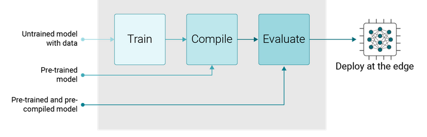
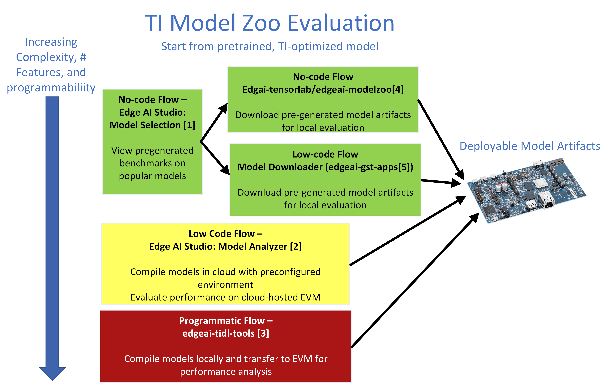
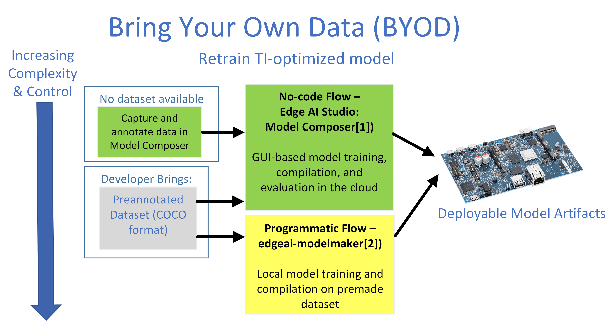
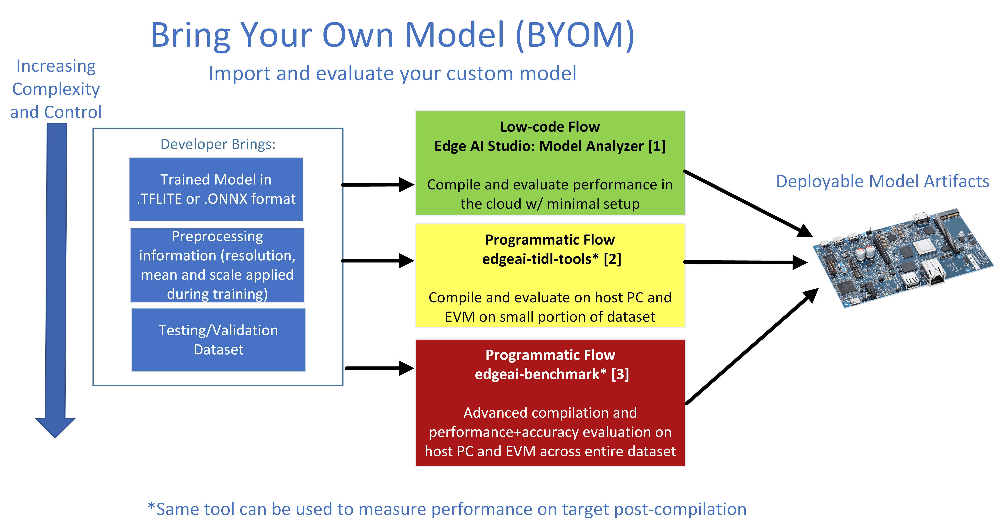

.. _pub_edgeai_inference_models:

====================
Deep learning models
====================

Neural networks run on TI's C7xMMA accelerator using the TI Deep Learning (TIDL)
software. Development tools are available for different levels of expertise to help
users implement and optimize deep neural network (DNN) models for the
|__PART_FAMILY_NAME__| SoC.

Deep learning models and development can be broken down into multiple phases:
Train, Compile, Evaluate, and Deploy. This can be intersected at various stages,
allowing developers to begin as it best suites them.

For each task, there is a GUI-based (also called No Code or Low Code)
tool available within `Edge AI Studio <https://dev.ti.com/edgeaistudio/>`_ and a
programmatic / command line tool from the `TI github <https://github.com/TexasInstruments/edgeai>`_

In each case, the goal is to acquire or generate a series of
`"Model Artifacts" <#dnn-directory-structure>`_ that may be deployed to the
|__PART_FAMILY_NAME__| SoC.

Pretrained Model Evaluation
===========================

`TI Edge AI Model Zoo <https://github.com/TexasInstruments/edgeai-tensorlab/tree/main/edgeai-modelzoo>`__
is a large collection of deep learning models validated to work on TI processors
for Edge AI. It hosts several pre-trained and pre-compiled model artifacts
for TI hardware.

There are multiple tools that can used to download or generate model artifacts for
pretrained models. No/Low code approaches use Edge AI Studio to find or compile
models from TI's model zoo. Model Analyzer (part of Edge AI Studio) and edgeai-tidl-tools
expose the programming interfaces used to generate these artifacts, allowing developers to
understand and experiment with the tools. For these programmatic tools, validated
out-of-box examples are available.

#. https://dev.ti.com/gallery/view/7478209/edgeai-modelselection/ver/1.0.0/
#. https://dev.ti.com/edgeaisession
#. https://github.com/TexasInstruments/edgeai-tidl-tools
#. https://github.com/TexasInstruments/edgeai-tensorlab/tree/main/edgeai-modelzoo
#. https://github.com/TexasInstruments/edgeai-gst-apps

Precompiled model artifacts may be downloaded directly from the TI model zoo with a browser
or by using the `Model Downloader Tool`_ directly in the SDK.

Model Downloader Tool
---------------------

Use the **Model Downloader Tool** in the SDK to download more models on target as shown,

.. code-block:: bash

   /opt/edgeai-gst-apps# ./download_models.sh

The script will launch an interactive menu showing the list of available,
pre-imported models for download. The downloaded models will be placed
under ``/opt/model_zoo/`` directory

.. figure:: ../images/edgeai/model_downloader.png
   :align: center

   Model downloader tool menu option to download models

The script can also be used in a non-interactive way as shown below:

.. code-block:: bash

   /opt/edgeai-gst-apps# ./download_models.sh --help

.. _pub_edgeai_model_development_for_beginners:

Model Training Tools
====================

Models within the TI model zoo are used as a starting point for "Transfer Learning",
and may be retrained for custom use-cases on the developer's dataset. This is considered
a "Bring Your Own Data" or BYOD flow. Custom DNN architectures are not supported in BYOD.
The set of Model Zoo models that are available for retraining is hand-picked to be an
optimally performing subset of the entire Model Zoo.

#. https://dev.ti.com/modelcomposer/
#. https://github.com/TexasInstruments/edgeai-tensorlab/tree/main/edgeai-modelmaker

`Edge AI Studio <https://dev.ti.com/edgeaistudio>`__ **Model Composer**
is an integrated environment to allow end to end development of AI application
with all necessary stages including data collection, annotation, training,
compilation and deployment of machine learning models. It is bundled with optimal
models from model zoo for user to select at different performance points. It allows
development flow of bring your own data (**BYOD**) with TI recommended models.
Object detection, classification, and segmentation tasks are currntly supported.

`EdgeAI-ModelMaker <https://github.com/TexasInstruments/edgeai-tensorlab/tree/main/edgeai-modelmaker>`__
is an end-to-end model development tool that integrates dataset handling,
model training and model compilation and provides a simple config file interface
that is friendly to beginners. Model training and Model compilation tools are
automatically installed as part of the setup of the ModelMaker. This tool can accept
annotated datasets from another tool (including Model Composer) as explained in its documentation.
The output of ModelMaker is a trained and compiled DNN model artifact package
that has all the required side information to be consumed by this SDK.
Training code is open source and available for modification as necessary.

.. _pub_edgeai_import_custom_models:

Import Custom Models
====================

The Processor SDK Linux Edge AI for |__PART_FAMILY_NAME__| supports importing
pre-trained custom models to run inference on target using the "Bring Your Own Model"
or BYOM flow.

Most experienced Edge AI developers will use this flow on their own models, since they
may already have trained models with acceptable accuracy. For best performance, it is
important that all layers are supported -- see the
`set of supported layer/operators here <https://github.com/TexasInstruments/edgeai-tidl-tools/blob/master/docs/supported_ops_rts_versions.md>`__

A developer will need to bring their model in ONNX or TFLITE format, information about
preprocessing (channel ordering, mean/scale values, input resolution), and a small set of
images for running calibration (part of quantization) and accuracy validation. Object
detection models like YOLO-based architectures also require a "PROTOTXT" file describing
the `detection head's architecture <https://github.com/TexasInstruments/edgeai-tidl-tools/blob/master/docs/tidl_fsg_od_meta_arch.md>`__.

It is recommended to validate the entire flow with
simple file-based `examples <https://github.com/TexasInstruments/edgeai-tidl-tools#compile-and-benchmark-custom-model>`__
provided in `Edge AI TIDL tools <https://github.com/TexasInstruments/edgeai-tidl-tools>`_.
Note that this compilation or 'import' step of the BYOM flow is handled on an x86
PC or server. The |__PART_FAMILY_NAME__| SoC cannot natively compile a model for itself.

#. https://dev.ti.com/edgeaisession
#. https://github.com/TexasInstruments/edgeai-tidl-tools
#. https://github.com/TexasInstruments/edgeai-tensorlab/tree/main/edgeai-benchmark

This compilation is an important step, and there are many settings used to alter and
optimize the resulting model artifacts. Please refer to the
`TIDL User Options <https://github.com/TexasInstruments/edgeai-tidl-tools/blob/master/examples/osrt_python/README.md#user-options-for-tidl-acceleration>`__
for the full list of settings. These settings are applicable in each of the BYOM tools,
since they all use the same underlying Python open source runtimes (ONNX,
Tensorflow Lite, TVM) with TIDL backend. Please view documentation in the corresponding
tools for their exact usage, although common documentation and debugging guidance is found
in the
`edgeai-tidl-tools documentation <https://github.com/TexasInstruments/edgeai-tidl-tools/tree/master/docs>`__.
This documentation also describes additional features like model optimization,
quantization-aware training, how to use multiple C7x cores (if applicable), and more.

Model Artifacts and Deployments
===============================

The SDK makes use of pre-compiled DNN (Deep Neural Network) models and performs
inference using various OSRT (open source runtime) such as TFLite runtime,
ONNX runtime and Neo AI-DLR (related to TVM).

Model deployment can be performed in several ways --
Please view the :doc:`Sample Apps page <./sample_apps>` for more details on
deploying within a live application.

In order to infer a DNN, SDK expects the DNN and
associated artifacts in the below directory structure.

.. code-block:: text

   TFL-OD-2010-ssd-mobV2-coco-mlperf-300x300
   │
   ├── param.yaml
   |
   ├── dataset.yaml
   │
   ├── artifacts
   │   ├── 264_tidl_io_1.bin
   │   ├── 264_tidl_net.bin
   │   ├── 264_tidl_net.bin.layer_info.txt
   │   ├── 264_tidl_net.bin_netLog.txt
   │   ├── 264_tidl_net.bin.svg
   │   ├── allowedNode.txt
   │   └── runtimes_visualization.svg
   │
   └── model
      └── ssd_mobilenet_v2_300_float.tflite

DNN directory structure
-----------------------

Each DNN must have the following 4 components:

#. **model**: This directory contains the DNN being targeted to infer
#. **artifacts**: This directory contains the artifacts generated after the
   compilation of DNN for SDK. These artifacts can be generated and validated
   with simple file based examples provided in Edge AI TIDL Tools
#. **param.yaml**: A configuration file in yaml format to provide basic
   information about DNN, and associated pre and post processing parameters
#. **dataset.yaml**: A configuration file in yaml format needed for only
   classification and detection. It contains the mapping from output key to
   actual labels.

.. _pub_edgeai_params:

Param file format
-----------------

Each DNN has its own pre-process, inference and post-process
parameters to get the correct output. This information is typically available in
the training software that was used to train the model. In order to convey this
information to the SDK in a standardized fashion, we have defined a set of
parameters that describe these operations. These parameters are in the
param.yaml file.

Please see sample yaml files for various tasks such as image classification,
semantic segmentation and object detection in
`edgeai-benchmark examples <https://github.com/TexasInstruments/edgeai-tensorlab/tree/main/edgeai-benchmark/examples/configs/yaml>`_.
Descriptions of various parameters are also in the yaml files. If users want to
bring their own model to the SDK, then they need to prepare this information
for the `model compilation / import procedure <#import-custom-models>`__.

