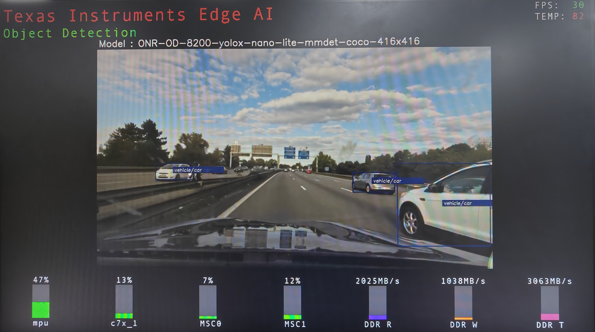
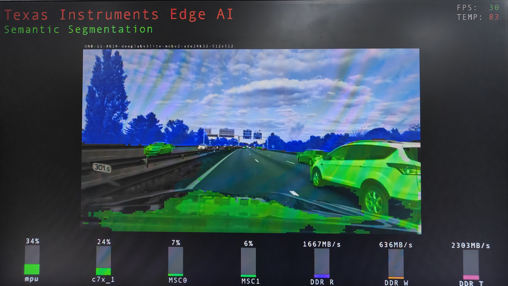

.. _pub_edgeai_sample_apps:

===================
Edge AI sample apps
===================

There are various ways you can explore running a typical Edge AI usecase on
|__PART_FAMILY_NAME__| EVM,

    - Trying the out-of-box **Edge AI gallery**
    - Develop Edge AI applications using **Python and C++ reference applications**
    - Run optimized end-to-end GStreamer pipelines using **OpTIFlow**
    - Run optimized end-to-end OpenVX pipelines using **TIOVX Apps**

The SDK is packaged with networks which does 3 DL tasks as below,

    - **Image Classification**: Detects top N most approximate classes in the dataset for the given input frame
    - **Object Detection**: Detects and draws bounding boxes around the objects, also classifies the objects to one of the classes in dataset
    - **Semantic Segmentation**: Classifies each pixel into class in dataset

Out-of-box GUI app
==================

When the |__PART_FAMILY_NAME__| EVM is powered on with SD card in place, the
**Edge AI Gallery** comes up on boot as shown.

One can connect a USB 2.0 mouse and click on the buttons in the left panel which
starts the Edge AI application running the selected DL task. In the background,
a GStremer pipeline is launched which reads a compressed video file and runs a
DL network on the decoded content. The output of DL inference is overlayed on the
image and sent to display. Users can select different DL tasks to execute on the
compressed video.

There is also a "Custom" button, which when pressed allows users to select a
custom input (Camera/VideoFile/Image) and a custom model available in the
filesystem. This will automatically construct a GStreamer pipeline with required
elements and launch the application.

- For a model to pop up on GUI, it needs to be present under ``/opt/model_zoo/``
- For a videofile to pop up on GUI, the videos needs to be present under ``/opt/edgeai-test-data/videos/``
- For an image to pop up on GUI, the images needs to be present under ``/opt/edgeai-test-data/iamges/``

.. note::

   Only Raw .H264/.H265 video will loop if selected as Input source.
   Other formats like .MP4/.MOV/.AVI/.MKV will not loop.

.. ifconfig:: CONFIG_part_variant in ('AM62AX')

   .. figure:: ../images/edgeai/am62a_oob_demo.jpg
      :scale: 30
      :align: center

.. ifconfig:: CONFIG_part_variant in ('AM68A')

   .. figure:: ../images/edgeai/am68a_oob_demo.jpg
      :scale: 30
      :align: center

.. ifconfig:: CONFIG_part_variant in ('AM69A')

   .. figure:: ../images/edgeai/am69a_oob_demo.jpg
      :scale: 30
      :align: center

.. ifconfig:: CONFIG_part_variant in ('TDA4VM')

   .. figure:: ../images/edgeai/tda4vm_oob_demo.jpg
      :scale: 30
      :align: center

.. ifconfig:: CONFIG_part_variant in ('AM67A')

   .. figure:: ../images/edgeai/am67a_oob_demo.jpg
      :scale: 30
      :align: center

.. _pub_edgeai_python_cpp_demos:

Python/C++ apps
===============

Python based demos are simple executable scripts written for image
classification, object detection and semantic segmentation. Demos are
configured using a YAML file. Details on configuration file parameters can
be found in :ref:`pub_edgeai_configuration`

Sample configuration files for out of the box demos can be found in
``edgeai-gst-apps/configs`` this folder also contains a template config file
which has brief info on each configurable parameter ``edgeai-gst-apps/configs/app_config_template.yaml``

Here is how a Python based image classification demo can be run,

.. code-block:: bash

   /opt/edgeai-gst-apps/apps_python# ./app_edgeai.py ../configs/image_classification.yaml

The demo captures the input frames from connected USB camera and passes
through pre-processing, inference and post-processing before sent to display.
Sample output for image classification and object detection demos are as below,

.. |logo1| image:: ../images/edgeai/edgeai-image-classify.jpg
   :align: middle

+---------+---------+---------+
| |logo1| | |logo2| | |logo3| |
+---------+---------+---------+

To exit the demo press Ctrl+C.

C++ apps are cross compiled while packaging, they can be directly tested as
given below

.. code-block:: bash

   /opt/edgeai-gst-apps/apps_cpp# ./bin/Release/app_edgeai ../configs/image_classification.yaml

To exit the demo press Ctrl+C.

C++ apps can be modified and built on the target as well using below steps

.. code-block:: bash

   /opt/edgeai-gst-apps/apps_cpp# rm -rf build bin lib
   /opt/edgeai-gst-apps/apps_cpp# mkdir build
   /opt/edgeai-gst-apps/apps_cpp# cd build
   /opt/edgeai-gst-apps/apps_cpp/build# cmake ..
   /opt/edgeai-gst-apps/apps_cpp/build# make -j2

.. _pub_edgeai_optiflow_apps:

OpTIFlow
========

In Edge AI Python and C++ applications, post processing and DL inference are done between
appsink and appsrc application boundaries. This makes the data flow sub-optimal because of
unnecessary data format conversions to work with open source components.

This is solved by providing DL-inferer plugin which calls one of the supported DL runtime and a post-process
plugin which works natively on NV12 format, avoiding unnecessary color formats conversions.

Users can write their own pipeline or use optiflow application to generate and run the end-to-end pipeline.
Optiflow application shares the same config file as used by :ref:`pub_edgeai_python_cpp_demos`.

To directly run the end-to-end pipeline use the following command.

.. code-block:: bash

   /opt/edgeai-gst-apps/optiflow# ./optiflow.py ../configs/object_detection.yaml

To exit the demo press Ctrl+C.

To just dump the end-to-end pipeline use the following command.

.. code-block:: bash

   /opt/edgeai-gst-apps/optiflow# ./optiflow.py ../configs/object_detection.yaml -t

.. note::

   Python, C++ and OpTIFlow applications are similar by construction and can accept
   the same config file

EdgeAI Tiovx Apps
=================

EdgeAI Tiovx Apps creates and runs optimized end-to-end OpenVx analytics pipelines
based on the user defined configuration.

Please visit `EdgeAI Tiovx Apps wiki <https://github.com/TexasInstruments/edgeai-tiovx-apps/wiki/Edge-AI-TIOVX-Apps-reference-guide>`_
for in-depth documentation.

To run a sample demo

.. code-block:: bash

   /opt/edgeai-tiovx-apps/# ./bin/Release/edgeai-tiovx-apps-main configs/linux/object_detection.yaml

To exit the demo press Ctrl+C.

To run a multi-input multi-inference demo

.. code-block:: bash

   /opt/edgeai-tiovx-apps/# ./bin/Release/edgeai-tiovx-apps-main configs/linux/multi_input_multi_inference.yaml

To exit the demo press Ctrl+C.
