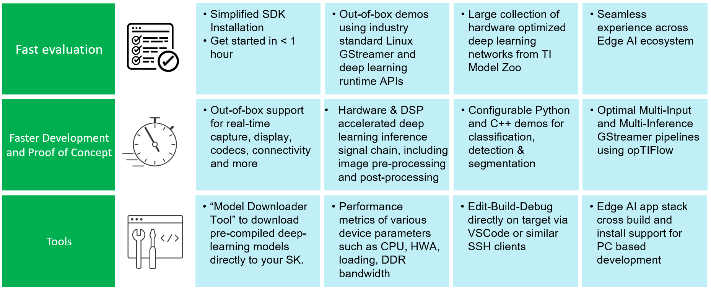

.. _pub_sdk_overview:

========
Overview
========

**Welcome to Processor SDK Linux Edge AI for** |__PART_FAMILY_NAME__| **!**

The SDK provides software and tools to let the users effectively balance
deep learning performance with system power and cost on Texas Instrument’s
processors for edge AI applications. We offer a practical embedded inference
solution for next-generation vehicles, smart cameras, edge AI boxes, and
autonomous machines and robots. In addition to general purpose micro processors,
|__PART_FAMILY_NAME__| has integrated micro controllers, DSP, and accelerators
for neural network, image, vision, and multimedia processing. With a few simple
steps one can run high performance computer vision and deep learning demos
using a live camera and display.

.. |pic1| image:: ../images/edgeai/edgeai-overview-image1.jpg
   :align: middle
.. |pic2| image:: ../images/edgeai/edgeai-overview-image2.jpg
   :align: middle
.. |pic3| image:: ../images/edgeai/edgeai-overview-image3.jpg
   :align: middle

+--------+--------+--------+
| |pic1| | |pic2| | |pic3| |
+--------+--------+--------+

   Processor SDK Linux Edge AI for |__PART_FAMILY_NAME__| feature overview

The SDK also enables an interplay of multiple open-source components such as
GStreamer, OpenVx, OpenCV and deep learning runtime such as TFLite, ONNX and
Neo-AI DLR. The reference applications showcase perception based examples such
as image classification, object detection and semantic segmentation in both
Python and C++ variants. The SDK supports edit-build-debug cycles directly on
the target and also on PC to cross compile and build the applications.

.. figure:: ../images/edgeai/open-src-components.png
   :scale: 50
   :align: center

   Industry Standard Components supported in Processor SDK Linux Edge AI for |__PART_FAMILY_NAME__|

The SDK mainly comprises of three parts as shown in the illustration below.
The Edge AI application stack is used to run analytics applications with
real-time inputs/outputs. The Foundational Linux components providing OS, uBoot,
kernel, filesystem, linux drivers and firmware for the remote core and hardware
accelerators.

.. ifconfig:: CONFIG_part_variant in ('AM62AX')

   .. figure:: ../images/edgeai/sdk_overview_am62a.jpg
      :scale: 75
      :align: center

.. ifconfig:: CONFIG_part_variant in ('AM68A')

   .. figure:: ../images/edgeai/sdk_overview_am68a.jpg
      :scale: 75
      :align: center

.. ifconfig:: CONFIG_part_variant in ('AM69A')

   .. figure:: ../images/edgeai/sdk_overview_am69a.jpg
      :scale: 75
      :align: center

.. ifconfig:: CONFIG_part_variant in ('TDA4VM')

   .. figure:: ../images/edgeai/sdk_overview_tda4vm.jpg
      :scale: 75
      :align: center

To get started with the setup click the **Next** button.
