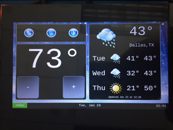
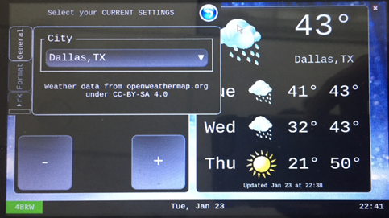
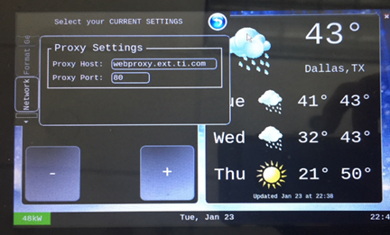
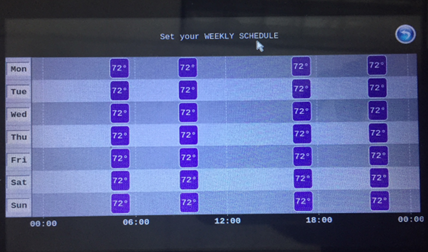
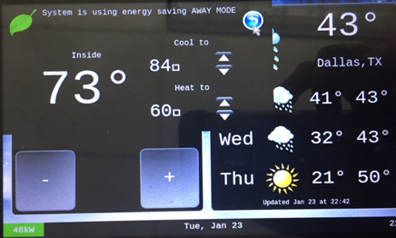

Qt5 Thermostat HMI Demo
========================

.. rubric:: Qt-based Thermostat HMI demo
   :name: qt-thermostat-demo

The morphing of devices like the basic thermostat into a breed of power smart
thermostats has shown how the appliances in residences today must adapt,
re-imagine and, in some cases, reinvent their role in the connected home of
the future or risk being left behind. Thermostats in particular have come a
long way since they were first created. There was a time when the mechanical
dial thermostat was the only option. It was simple and intuitive to operate
because what you saw was what you got. The user simply set the temperature
and walked away. Unfortunately, it was not efficient. Energy and money could
be wasted since its settings would only change when someone manually turned
the dial to a new temperature. Modern thermostats provide a much richer Graphical
Interface, with several features. Processor SDK now includes a Qt5 based
thermostat with the following key features - that should easily enable customers
to use as a starting point for further innovation.

- Display three-day weather forecast, daily temperature range for the selected city from openweathermap.org
- Display and adjust room temperature
- Pop-up menu to select city, temperature format and set network proxy
- Weekly temperature schedule
- Away Energy saving mode

|

   Figure1: three-day weather forecast

|

   Figure2: Select City for weather forecasts

|

   Figure3: Set Proxy for Internet connectivity

|

   Figure4: Weekly temperature schedule

|

   Figure5: Inside temperature, Away energy saving settings

|

The demo is hosted at http://git.ti.com/apps/thermostat-demo, and also the sources are located at

.. code-block:: bash

   <SDK-install-dir>/example-applications/qt-tstat-2.0/

The code can be compiled, installed using top-level SDK Makefile

.. code-block:: bash

   make qt-tstat-clean
   make qt-tstat
   make qt-tstat-install

