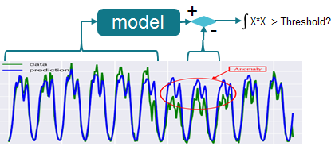
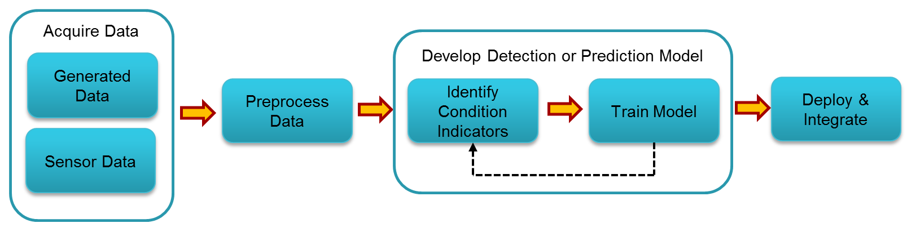
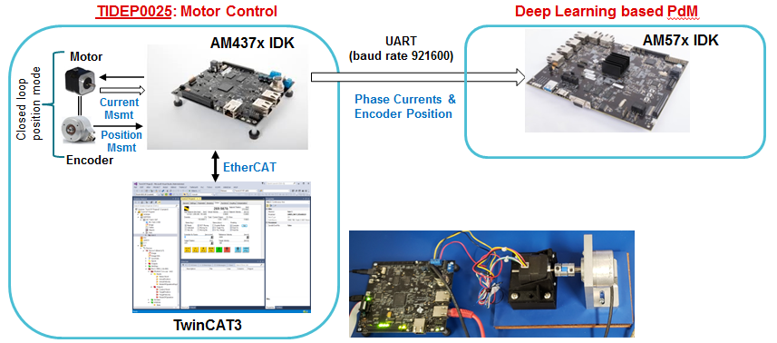
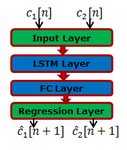
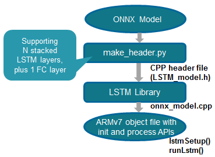
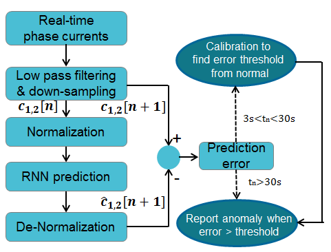
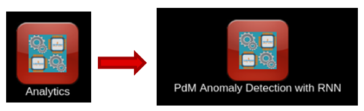
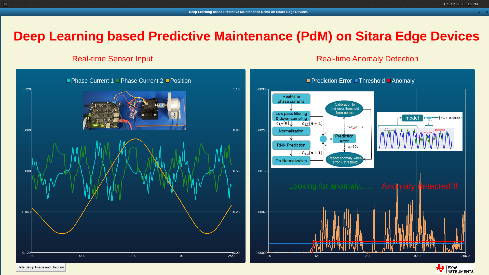

Predictive Maintenance Demo
===========================

Introduction
--------------

Predictive Maintenance (PdM) promises to achieve levels of efficiency and safety on the factory floor never seen before
in the current established best practices for systems and processes. Machine downtime is one of the biggest challenges
on the production line. The current method of MRO (maintain, repair, operate) is far from what the optimum level of
production can be. With predictive maintenance, once data is coming from equipment in real-time (or near real-time depending on application needs),
advanced analytics are used to identify asset reliability risks that could impact business operations. By applying machine
learning and analytics to operational data generated by critical assets to gain a better understanding of asset performance,
companies can act on these insights as part of a continuous improvement process.

Predictive maintenance employs advanced analytics on the machine data collected from end sensor nodes to draw meaningful insights
that more accurately predict machine failures. It is comprised of three steps: sense, compute and act. Data is collected from sensors
that are already available in machines, by adding NEW sensors, or by using control inputs. Depending upon the machine types
and the required failure analysis, different sensor signals -- such as temperature, sound, magnetic field, current, voltage, ultrasonic,
vibration -- are analyzed to predict the failure. The predicted information from sensor data analysis is used to generate an event,
work order and notification. The sensor data is also used to visualize the machine's overall operating condition.
An action is taken when the event reports an anomaly, a machine that is nearing the end of its useful life, or when wear and tear
is detected in machine parts.

The following are the advantages of predictive maintenance using analytics:

* Detects incipient failures and breakdowns in early stages and facilitates early repair
* Establishes shelf life of asset and assesses product warranty
* Maintains inventory and tabs on spare parts
* Explores hypothetical scenarios
* Early notification and alerts to field operators and improves safety standards
* Prevents unnecessary downtime in production processes
* Maximizes lifecycle of equipment
* Enables product innovation . new features, services and pricing models

Some of the examples of predictive maintenance from real-life scenario includes:

* Find defective bearings long before defects are visually seen
* Find misalignment between two rotating pieces of equipment
* Recognize when fans become unbalanced
* Identify when bearings need lubrication
* Tell when an electrical connection needs to be tightened
* Alert when oil is contaminated or in need of replacement

An overview video for predictive maintenance can be found from 
`predictive maintenance overview training <https://training.ti.com/using-deep-learning-predictive-maintenance>`__.

Processor SDK Linux now provides a predictive maintenance demo which leverages Recurrent Neural Network (RNN)
for anomaly detection over motor drive control. The sections below describes the demo in details, including
the system model for anomaly detection with RNN, the workflow of developing the PdM demo with step by step
instructions, the benchmarking results, and the PdM demo deliverables from Processor SDK Linux.

Anomaly detection system model with RNN
-----------------------------------------
In addition to Convolutional Neural Network (CNN), recently RNN emerged as high-quality
universal approximation method for time series. It is becoming more effective with 
many desktop tools supported by GPU acceleration.

For anomaly detection, a system model is established to predict the output from the input
for the normal scenario. If prediction of the output values is good, the system model
acts as a high-accuracy approximation of the physical system. With this system model,
if there are significant and continuous prediction errors, it indicates anomalies are happening.

    System model for anomaly detection with RNN

Workflow for developing the PdM demo
-------------------------------------------------

The figure below illustrates the workflow for developing the PdM demo.
It begins with acquiring data that describes the physical system in a range of healthy and faulty conditions.
The data can be from sensors, or generated from a physical model. Then, the acquired data will go through
some pre-processing, such as down-sampling to reduce the data dimension. After that, it comes to the stage
of developing the model. For PdM, the model can be either a detection model for condition monitoring (e.g.,
anomaly detection) or a prediction model for prognostics (e.g., estimating the remaining useful life).
The model development requires identifying appropriate condition indicators and then training a model to
interpret these condition indicators. This is likely an iterative process, as you try different models 
and indicators and tune the model parameters such as the number of RNN layers and nodes. The last step is
to deploy the model and integrate the solution into a system for machine monitoring and maintenance
at the edge devices.

    Workflow for developing the PdM demo

In the following subsections, details are provided for the individual steps of this workflow using
the anomaly detection for motor drive as the example.

Sensor data acquisition
^^^^^^^^^^^^^^^^^^^^^^^^^^^^^^^^^^
In our PdM anomaly detection demo, the sensor data are originating from `motor drive TI design <http://www.ti.com/tool/TIDEP0025>`__.
In this TI design, AM437x IDK (running Processor SDK RTOS, PRU-ICSS EtherCAT Slave, and PRU-ICSS Industrial Drives)
is conducting motor control. It also receives the feedback about the phase current measurement and the position
measurement. On the other hand, AM437x IDK acts as Ethercat slave and communicates with TwinCAT master
on a host machine for setting the target velocity, target position, and etc.

To acquire the sensor data in real-time, high-speed (921600 baud rate) UART is implemented to send out the
two phase currents (2 bytes each), and the motor position (4 bytes) with sampling rate of 10KHz.
To get continuous sensor data, PyAutoGUI is employed to achieve automated control of TwinCAT, so that
the motor can repeatedly move from position 1 to position 2, and then from position 2 back to position 1.

    Sensor data acquisition from motor drive

Sensor data pre-processing
^^^^^^^^^^^^^^^^^^^^^^^^^^^^^^^^^^

For the sensor data with a frequency of 10KHz, simple pre-processing of
low-pass filtering and down-sampling to 50Hz is done to reduce the high frequency noise.
After that, normalization is done for the down-sampled sensor data.

Depending on the application, some Other preprocessing techniques can be applied, such as
FFT, high order statistics, and wavelets.

Offline training to establish the model
^^^^^^^^^^^^^^^^^^^^^^^^^^^^^^^^^^^^^^^^

To establish the RNN model, offline desktop training in MATLAB is done with the two
down-sampled phase currents. The RNN topology contains a single Long Short-Term Memory (LSTM) layer, and a
Fully Connected (FC) layer. There are 31 hidden nodes for the LSTM layer, and 
31 inputs and 2 outputs for the FC layer. This is a simple RNN model, which is
specified to avoid overfitting and control the computation load. The trained
model is in Open Neural Network Exchange (ONNX) format. The last layer, regression layer, is the
output layer used for prediction.

    Offline training RNN model with LSTM and FC layers

The RNN model is trained with the normal scenario data: motor moves with velocity of 100 degree
per second from 45 degree to 270 degree and back to 45, and so on so forth.
With a single training sequence about 50s long, the training with Matlab on a desktop
PC is completed in less than three minutes.

Some other open source tools, such as Keras/Tensor Flow, Pytorch, can also be used
for the training.

Deploy and integration
^^^^^^^^^^^^^^^^^^^^^^^^^^^^^
After getting the model, the last step is to deploy the model and integrate it for anomaly
detection at the edge.

**Build RNN inference library**

To establish the RNN inference library implementing the LSTM and FC layers, our initial
solution is using python scripts to convert the ONNX model into CPP header file, which
contains the initialized data structures with all the weights information.
The python scripts supports N stacked LSTM layers, plus one FC layer. The generated
CPP header is then compiled with the LSTM library to create the ARMv7 object file with 
the initialization and processing APIs.

    Build RNN inference library

**Real time anomaly detection at the edge**

With the RNN inference library, we build the Linux user space application running on Arm
to perform anomaly detection. The figure below shows the call flow of the anomaly detection.
The two phase currents are received in real-time from the motor control application running on AM4 IDK.
Then, low pass filtering and down-sampling are applied to the phase currents, followed by normalization.
After that, RNN prediction is done upon the pre-processed phase currents, using the RNN inference library
built above. The predicted phase currents are then de-normalized, and compared with the actual phase
currents to calculate the prediction error. The prediction errors at the beginning for the normal
scenario are used for calibration: the maximal prediction error in this stage is scaled with a ratio
larger than 1 to be the anomaly detection threshold. After that, the prediction error will be used
to report anomalies: if the prediction is larger than the threshold found in the calibration stage,
then anomaly is reported.

    Real time anomaly detection

Deliverables from Processor SDK Linux
--------------------------------------

Processor SDK Linux provides an out of box PdM demo from Matrix GUI. It also supports
re-building the demo from the top-level Makefile. Python-based conversion tool
is also provided to convert an ONNX model into CPP header file.

Out of box demo with with pre-recorded sensor data
^^^^^^^^^^^^^^^^^^^^^^^^^^^^^^^^^^^^^^^^^^^^^^^^^^^

The PdM demo for anomaly detection is provided from Matrix GUI under
Analytics submenu - PdM Anomaly Detection with RNN.

    PdM anomaly detection demo in Matrix GUI

For this out of box demo, pre-recorded sensor data (/usr/share/ti/examples/pdm/normal100-anomaly150-normal100.log)
is used as the testing sequence, as shown in the demo scripts (/usr/bin/runPdmAnomalyDetection.sh).
This testing sequence starts with the normal scenario data, i.e., motor moves with velocity of 100 degree
per second from 45 degree to 270 degree and back to 45, and so on so forth. To create anomalies, the motor
moves with a higher velocity of 150 degree per second after some time. The figure below shows the Qt GUI display
of the demo. The left-side panel shows the real-time sensor input: the two phase currents in blue and green,
and the motor position in orange. The right-side panel shows the detection results: the blue line is the anomaly
detection threshold found from the calibration, the orange line draws the prediction error, while the red line
draws the time period of the detected anomaly.

    Anomaly detection demo display

Filesystem of Processor SDK Linux also packages two more pre-recorded testing sequences
(under /usr/share/ti/examples/pdm/), for some other anomalies. 

* normal270-anomaly170-normal270.log: motor moving from 45 degree to a different (170 instead of 270) degree.
* normal45-270-v100-with-friction2-iter10-15.log: hand-pressing the coupler between the motor and the encoder to add more friction.

Support rebuilding the demo from top-level Makefile
^^^^^^^^^^^^^^^^^^^^^^^^^^^^^^^^^^^^^^^^^^^^^^^^^^^

The source of the PdM demo for real-time inference is available at 
`pdm-anomaly-detection git rep <http://git.ti.com/apps/pdm-anomaly-detection>`__.
The source is also bundled with Processor SDK Linux installer, under the example-applications
directory:

::

  [plsdk_install_dir]/example-applications/pdm-anomaly-detection-1.0

Rebuilding of the demo can be done via the top-level Makefile of Processor SDK Linux:

::
  
  cd [plsdk_install_dir]
  make pdm-anomaly-detection

After the compilation is completed, the demo binary can be found at 
[plsdk_install_dir]/example-applications/pdm-anomaly-detection-1.0/RnnPdmAnomalyDetection.

 
ONNX model conversion tool
^^^^^^^^^^^^^^^^^^^^^^^^^^^^^^^^^^^^^^^^^^^^^^^^^^^^^

Python scripts are provided in the PdM demo source under the model folder 
to convert ONNX model to CPP header file with initialized data structures.
It supports N stacked LSTM layers plus on fully connected layer as the last layer.

Before running the scripts, install the python packages below if this has
not been done earlier.

::

  sudo apt install python-pip
  pip install numpy pandas scipy onnx

Then, run the command below to do the conversion:

::

  cd pdm-anomaly-detection/model or pdm-anomaly-detection-1.0/model
  python ./make_header.py -m ./[onnx-model-file]

The output CPP header file is called LSTM_model.h which is placed under the same model folder.

Benchmarking for anomaly detection with RNN
---------------------------------------------

To conduct benchmarking for the RNN based anomaly detection, two threads are used with Qt/QML display
not in the picture.

* thread 1: main processing thread with RNN prediction and anomaly detection
* thread 2: parsing thread to read senor data

Linux clock_gettime() function is used for reading the time:

::

        clock_gettime(CLOCK_REALTIME, &ts0);

        /* Run LSTM network for prediction */
        runLstm(lstm_in1, lstm_in2, &lstm_out1, &lstm_out2);

        clock_gettime(CLOCK_REALTIME, &ts1);
        ns_lstm = (ts1.tv_sec-ts0.tv_sec) * 1000000000 + ts1.tv_nsec-ts0.tv_nsec;

Two benchmarking points are used:

* Pre-processing: low-pass filtering and down-sampling to reduce 200 samples to 1 sample
* RNN prediction (LSTM + FC) on 1 sample

Average compute time per sample:

* RNN prediction: 0.083ms
* Pre-processing: 0.014ms
* Total (RNN prediction and pre-processing): 0.097ms

With a sampling rate 50Hz, RNN based anomaly detection consumes around 0.5% of CPU running at 1GHz,
showing a low computation load.
