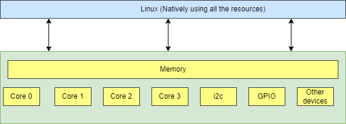
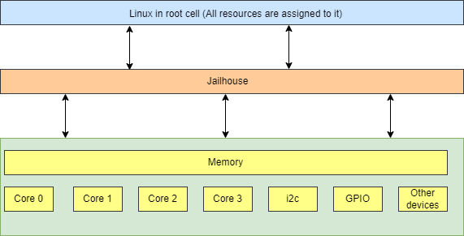
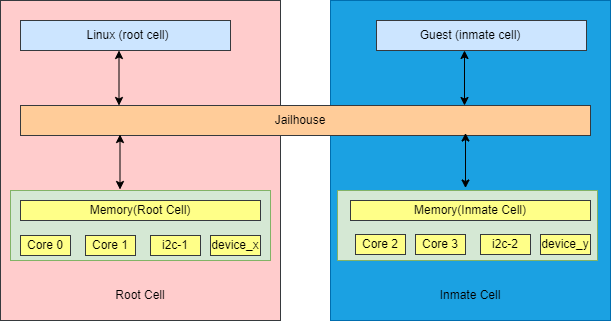

.. include:: /_replacevars.rst

#########
Jailhouse
#########

********
Overview
********

Jailhouse is a static partitioning hypervisor that runs bare metal binaries. It
cooperates closely with Linux. Jailhouse doesn't emulate resources that don't
exist. It splits existing hardware resources into isolated compartments called
"cells" that are wholly dedicated to guest software programs called "inmates".
One of these cells runs the Linux OS and is known as the "root cell". Other cells
borrow CPUs and devices from the root cell as they are created.

* The picture below shows the Jailhouse on a system before the Jailhouse is enabled

* After the Jailhouse is enabled

* After a cell is created

Jailhouse consists of three parts:

- A Kernel module
- A Hypervisor firmware
- Tools

The tools helps in enabling the hypervisor on the device at runtime, in creating a cell, to load inmate a binary,
to run the inmate binary and to stop the hypervisor itself.

**************************************************************
Enabling hypervisor on |__PART_FAMILY_DEVICE_NAMES__| platform
**************************************************************

Jailhouse is an example of Asynchronous Multiprocessing (AMP) architecture. When we boot Linux on |__PART_FAMILY_DEVICE_NAMES__|,
which has 4 ARM cores, Linux uses the all four cores. After we enable hypervisor
it moves Linux to the root-cell. The root cell still uses the all ARM cores.
When we create a new cell (ex. for linux-demo), hypervisor calls cpu_down()
for the ARM1,ARM2 and ARM3 core, leaving ARM0 for Linux.The new cell will use
the three ARM cores and hardware resources dedicated for this cell in the cell
configuration file.

The open source Jailhouse project from https://github.com/siemens/jailhouse is integrated in Yocto build environment.

- Yocto recipe (Scarthgap) for Jailhouse can be found here: `meta-ti <https://git.ti.com/cgit/arago-project/meta-ti/tree/meta-ti-extras/recipes-ti/jailhouse?h=scarthgap>`__.

- Jailhouse kernel patches are integrated with TI Linux Kernel (v6.6) and hosted here `Linux git.ti <https://git.ti.com/cgit/processor-sdk/linux/>`__. This repository includes Jailhouse module,
  uio_ivshmem module for shared-memory and device tree changes for Jailhouse.

- U-Boot port for Jailhouse can be found here `U-Boot git.ti <https://git.ti.com/cgit/processor-sdk/u-boot/>`__. This repository contains the fix for error
  message during boot after memory for Jailhouse is reserved in device tree.

********************************************************************
Building Jailhouse Image for |__PART_FAMILY_DEVICE_NAMES__| platform
********************************************************************

The list of components which should be built to get Jailhouse Image for |__PART_FAMILY_DEVICE_NAMES__| are:

* U-Boot ( :file:`tiboot3.bin`, :file:`tispl.bin`, :file:`u-boot.img` ).
* Kernel ( with Jailhouse and shared memory module ).
* Filesystem for root cell and RAM filesystem for inmate.

There are two options to build Jailhouse Image, one is using open source Yocto build
environment with public repositories mentioned above or the other method is to
use sources and makefile from TI Processors SDK installer.

Building Jailhouse Image using Yocto
====================================

Refer to prerequisites for Yocto build for an Ubuntu host: :ref:`Host Setup - ubuntu (Recommended)`.

The steps to download and build the |__PART_FAMILY_DEVICE_NAMES__| wic Image containing Jailhouse (tisdk-
jailhouse-image) using Yocto build environment are as listed below :

.. code-block:: console

    $ git clone https://git.ti.com/git/arago-project/oe-layersetup.git tisdk
    $ cd tisdk
    $ ./oe-layertool-setup.sh -f configs/processor-sdk/processor-sdk-<version>-config.txt
    $ cd build
    $ . conf/setenv
    $ echo 'TI_EXTRAS="tie-jailhouse"' >> conf/local.conf
    $ MACHINE=<machine> bitbake -k tisdk-jailhouse-image

The bitbake command mentioned in the last line above builds the tisdk-jailhouse-image,
the image can be located at tisdk/build/deploy-ti/images/|__SDK_BUILD_MACHINE__|.

This image includes a host cell filesystem Image based on arago 'default' filesystem,
boot partition with bootloader binaries and kernel Image with Jailhouse components and
uio_ivshmem kernel module for shared memory applications. The filesystem image
also contains a RAM filesystem (cpio) which gets mounted by kernel booting on an
inmate cell.

Building Jailhouse using TI SDK Installer
=========================================

The latest Processor SDK Linux |__PART_FAMILY_DEVICE_NAMES__| installer is available on |__SDK_DOWNLOAD_URL__|.

The installer should be downloaded on a Linux ubuntu host machine. The steps to
install the sources using installer are:

.. code-block:: console

    chmod +x ./ti-processor-sdk-linux-<machine>-<version>-Linux-x86-Install.bin
    ./ti-processor-sdk-linux-<machine>-<version>-Linux-x86-Install.bin

Create an SD card with prepackaged filesystem image by following instructions from
the link :ref:`processor-sdk-linux-create-sd-card-with-custom-images`.

The Jailhouse kernel sources, Jailhouse firmware and u-boot bootloader sources
can be customized or modified and then built using the steps given below.

Jailhouse sources are located at :file:`$TI_SDK_PATH/board-support/extra-drivers/jailhouse`
directory. The top level SDK Makefile has the :code:`jailhouse_clean`, :code:`jailhouse` and
:code:`jailhouse_install` targets which can be used to clean, build and install Jailhouse
to the target file system using the default configs or after making any required changes.

Following are the additional dependencies needed to be installed in host PC for jailhouse
build.

.. code-block:: console

    sudo apt-get install device-tree-compiler python3-dev

    Python package:
    pip3 install Mako

The exact commands are:

.. code-block:: console

    make jailhouse_clean
    make jailhouse
    make jailhouse_install DESTDIR=<root partition of target>

These commands can be used to install Jailhouse kernel module, firmware and
management tools in the target filesystem.

The kernel and u-boot sources for Jailhouse image are located at
:file:`$TI_SDK_PATH/board-support/linux-extras-*` and
:file:`$TI_SDK_PATH/board-support/uboot-extras-*`. These targets can be build
and installed using top-level Makefile.

Below commands can be used to install kernel image and modules to root of the target
filesystem.

.. code-block:: console

    make linux-extras
    make linux-extras_install DESTDIR=<root partition of target>

Below commands can be used to install bootloader binaries to the boot partition
of target.

.. code-block:: console

    make u-boot-extras
    make u-boot-extras_install DESTDIR=<boot partition of target>

************************************
Generate SD Card Image for Jailhouse
************************************

You can download the tisdk-jailhouse-image-|__SDK_BUILD_MACHINE__|.rootfs.wic.xz from here |__SDK_DOWNLOAD_URL__|.

After that you need to flash the tisdk-jailhouse-image-|__SDK_BUILD_MACHINE__|.rootfs.wic.xz
to a SD Card. Various ways to flash wic image on SD card are mentioned
here :ref:`processor-sdk-linux-create-sd-card`.

*************************
Booting the SD Card Image
*************************

After the tisdk-jailhouse-image-|__SDK_BUILD_MACHINE__|.rootfs.wic.xz is flashed to SD Card. Change
the boot mode pins in |__PART_FAMILY_DEVICE_NAMES__| board for SD Card boot.

.. code-block:: console

    SW1[1:8] = 11000010 and SW2[1:8] = 01000000

Insert the SD Card in SD Card slot in |__PART_FAMILY_DEVICE_NAMES__| board. Use a
USB Micro-B cable to connect the host PC to the USB Micro-B interface for UART
on the EVM then power on the board, the following logs can be observed on the terminal window:

.. ifconfig:: CONFIG_part_variant in ('AM62X')

    .. code-block:: console

        U-Boot SPL 2024.04-ti-g6301979bc99c (Jul 29 2024 - 09:10:51 +0000)
        SYSFW ABI: 4.0 (firmware rev 0x000a '10.0.8--v10.00.08 (Fiery Fox)')
        SPL initial stack usage: 13384 bytes
        Trying to boot from MMC2
        Authentication passed
        Authentication passed
        Authentication passed
        Authentication passed
        Authentication passed
        Starting ATF on ARM64 core...
        ...

         _____                    _____           _         _
        |  _  |___ ___ ___ ___   |  _  |___ ___  |_|___ ___| |_
        |     |  _| .'| . | . |  |   __|  _| . | | | -_|  _|  _|
        |__|__|_| |__,|_  |___|  |__|  |_| |___|_| |___|___|_|
              |___|                    |___|

        Arago Project am62xx-evm -

        Arago 2023.10 am62xx-evm -

        am62xx-evm login:

.. ifconfig:: CONFIG_part_variant in ('AM62PX')

   .. code-block:: console

        U-Boot SPL 2024.04-ti-g6301979bc99c (Jul 29 2024 - 09:10:51 +0000)
        SYSFW ABI: 4.0 (firmware rev 0x000a '10.0.8--v10.00.08 (Fiery Fox)')
        SPL initial stack usage: 13384 bytes
        Trying to boot from MMC2
        Authentication passed
        Authentication passed
        Authentication passed
        Authentication passed
        Authentication passed
        Starting ATF on ARM64 core...

        ...

         _____                    _____           _         _
        |  _  |___ ___ ___ ___   |  _  |___ ___  |_|___ ___| |_
        |     |  _| .'| . | . |  |   __|  _| . | | | -_|  _|  _|
        |__|__|_| |__,|_  |___|  |__|  |_| |___|_| |___|___|_|
              |___|                    |___|

        Arago Project am62pxx-evm -

        Arago 2023.10 am62pxx-evm -

        am62pxx-evm login:

.. note:: 
   Jailhouse module is not autoloaded during boot-up. To load the jailhouse module
   after boot, run following commands:

    .. ifconfig:: CONFIG_part_variant in ('AM62X')

        .. code-block:: console

            am62xx-evm@ modprobe jailhouse

    .. ifconfig:: CONFIG_part_variant in ('AM62PX')

        .. code-block:: console

            am62pxx-evm@ modprobe jailhouse

***************************************
Pre-built components in Jailhouse Image
***************************************

The target filesystem on |__PART_FAMILY_DEVICE_NAMES__| platform will consists
of the following Jailhouse components:

#. :file:`jailhouse.ko`  : kernel module at
   :file:`/lib/modules/<linux_kernel_version>/extra/driver` directory;
#. :file:`jailhouse.bin` : hypervisor at :file:`/lib/firmware` directory;
#. Jailhouse management tools:
   :file:`/usr/local/libexec/jailhouse` and :file:`/usr/sbin` directories;

In order to create the root-cell and an inmate cell we need to provide
cell configuration files. Those configuration files and example binaries
are located at :file:`/usr/share/jailhouse/cells` and :file:`/usr/share/jailhouse/inmates`.

*******************
Jailhouse Interface
*******************

Jailhouse provides several user-space interfaces. Some important ones are listed
below:

- Enable Jailhouse

.. ifconfig:: CONFIG_part_variant in ('AM62X')

    .. code-block:: console

        root@am62xx-evm: jailhouse cell enable <root cell config>

.. ifconfig:: CONFIG_part_variant in ('AM62PX')

    .. code-block:: console

        root@am62pxx-evm: jailhouse cell enable <root cell config>

- To create a new cell

.. ifconfig:: CONFIG_part_variant in ('AM62X')

    .. code-block:: console

        root@am62xx-evm: jailhouse cell create <inmate cell config>

.. ifconfig:: CONFIG_part_variant in ('AM62PX')

    .. code-block:: console

        root@am62pxx-evm: jailhouse cell create <inmate cell config>

- To list the running cell(s)

.. ifconfig:: CONFIG_part_variant in ('AM62X')

    .. code-block:: console

        root@am62xx-evm: jailhouse cell list

.. ifconfig:: CONFIG_part_variant in ('AM62PX')

    .. code-block:: console

        root@am62pxx-evm: jailhouse cell list

-  Stop inmate cell

.. ifconfig:: CONFIG_part_variant in ('AM62X')

    .. code-block:: console

        root@am62xx-evm: jailhouse cell shutdown <id or name of inmate cell>

.. ifconfig:: CONFIG_part_variant in ('AM62PX')

   .. code-block:: console

        root@am62pxx-evm: jailhouse cell shutdown <id or name of inmate cell>

-  Destroy cell

.. ifconfig:: CONFIG_part_variant in ('AM62X')

    .. code-block:: console

        root@am62xx-evm: jailhouse cell destroy <id or name of inmate cell>

.. ifconfig:: CONFIG_part_variant in ('AM62PX')

   .. code-block:: console

        root@am62pxx-evm: jailhouse cell destroy <id or name of inmate cell>

-  Disable Jailhouse

.. ifconfig:: CONFIG_part_variant in ('AM62X')

    .. code-block:: console

        root@am62xx-evm: jailhouse disable

.. ifconfig:: CONFIG_part_variant in ('AM62PX')

   .. code-block:: console

        root@am62pxx-evm: jailhouse disable

*********************************************************
Running Jailhouse Demos on |__PART_FAMILY_DEVICE_NAMES__|
*********************************************************

Host Setup
==========

Flash tisdk-jailhouse-image-|__SDK_BUILD_MACHINE__|.wic.xz to SD card using balena
and boot |__PART_FAMILY_DEVICE_NAMES__| from the SD card. As we will be running 
two instances ,two terminals are required. Connect one terminal to the primary 
UART (e.g. :file:`/dev/ttyUSB0`) and the other to the secondary UART (e.g. :file:`/dev/ttyUSB1`).

Running Linux Demo
==================

The goal of this demo is to partition the CPU cores and run a second instance of
the Linux kernel with a RAM filesystem. The inmate kernel will use the
secondary UART to provide a login shell to the user. The steps to run
the demo are:

- First enable Jailhouse

.. ifconfig:: CONFIG_part_variant in ('AM62X')

    .. code-block:: console

        root@am62xx-evm: jailhouse enable /usr/share/jailhouse/cells/k3-am625-sk.cell

.. ifconfig:: CONFIG_part_variant in ('AM62PX')

    .. code-block:: console

        root@am62pxx-evm: jailhouse enable /usr/share/jailhouse/cells/k3-am62p5-sk.cell

- Create an inmate cell for linux

.. ifconfig:: CONFIG_part_variant in ('AM62X')

    .. code-block:: console

        root@am62xx-evm: jailhouse cell create /usr/share/jailhouse/cells/k3-am625-sk-linux-demo.cell

.. ifconfig:: CONFIG_part_variant in ('AM62PX')

    .. code-block:: console

        root@am62pxx-evm: jailhouse cell create /usr/share/jailhouse/cells/k3-am62p5-sk-linux-demo.cell

-  Load the required inmate binaries

.. ifconfig:: CONFIG_part_variant in ('AM62X')

    .. code-block:: console

        root@am62xx-evm: jailhouse cell load k3-am625-sk-linux-demo /usr/libexec/jailhouse/linux-loader.bin -a 0x0 -s "kernel=0xe0200000 dtb=0xe0000000" -a 0x1000 /boot/Image -a 0xe0200000 /boot/tisdk-jailhouse-inmate-am62xx-evm.rootfs.cpio -a 0xe28d4000 /usr/share/jailhouse/inmate-k3-am625-sk.dtb -a 0xe0000000

    linux-loader.bin is a small application provided and built by Jailhouse source
    tree to run inmates. As you can see (-a 0x0) it is loaded to virtual address 0x0.
    "-s "kernel=0xe0200000 dtb=0xe0000000" -a 0x1000" - is the linux_loader argument
    loaded as string to virtual address 0x1000, which instructs the linux-loader to
    branch to the those addresses. Kernel Image is loaded to the virtual address
    0xe0200000, jailhouse inmate ramfs to 0xe28d4000 and device tree for inmate to 0xe0000000.

.. ifconfig:: CONFIG_part_variant in ('AM62PX')

    linux-loader.bin is a small application provided and built by Jailhouse source
    tree to run inmates. As you can see (-a 0x0) it is loaded to virtual address 0x0.
    "-s "kernel=0x9e0200000 dtb=0x9e0000000" -a 0x1000" - is the linux_loader argument
    loaded as string to virtual address 0x1000, which instructs the linux-loader to
    branch to the those addresses. Kernel Image is loaded to the virtual address
    0x9e0200000, jailhouse inmate ramfs to 0x9e28d4000 and device tree for inmate to 0x9e0000000.

    .. code-block:: console

        root@am62pxx-evm: jailhouse cell load k3-am62p5-sk-linux-demo /usr/libexec/jailhouse/linux-loader.bin -a 0x0 -s "kernel=0x9e0200000 dtb=0x9e0000000" -a 0x1000 /boot/Image -a 0x9e0200000 /boot/tisdk-jailhouse-inmate-am62pxx-evm.rootfs.cpio -a 0x9e28d4000 /usr/share/jailhouse/inmate-k3-am62p5-sk.dtb -a 0x9e0000000

-  Start inmate cell

.. ifconfig:: CONFIG_part_variant in ('AM62X')

    .. code-block:: console

        root@am62xx-evm: jailhouse cell start k3-am625-sk-linux-demo

.. ifconfig:: CONFIG_part_variant in ('AM62PX')

    .. code-block:: console

        root@am62pxx-evm: jailhouse cell start k3-am62p5-sk-linux-demo

- Now, on the secondary terminal, verify that the inmate kernel has booted with RAM filesystem.
  Also note that the :file:`/dev/ttySX` number used for root cell and inmate may or may not match.

.. ifconfig:: CONFIG_part_variant in ('AM62X')

    .. code-block:: console

        [  OK  ] Finished Record Runlevel Change in UTMP.

         _____                    _____           _         _
        |  _  |___ ___ ___ ___   |  _  |___ ___  |_|___ ___| |_
        |     |  _| .'| . | . |  |   __|  _| . | | | -_|  _|  _|
        |__|__|_| |__,|_  |___|  |__|  |_| |___|_| |___|___|_|
              |___|                    |___|

        Arago Project am62xx-evm -

        Arago 2023.10 am62xx-evm -

        am62xx-evm login: root

.. ifconfig:: CONFIG_part_variant in ('AM62PX')

   .. code-block:: console

        [  OK  ] Finished Record Runlevel Change in UTMP.

        |  _  |___ ___ ___ ___   |  _  |___ ___  |_|___ ___| |_
        |     |  _| .'| . | . |  |   __|  _| . | | | -_|  _|  _|
        |__|__|_| |__,|_  |___|  |__|  |_| |___|_| |___|___|_|
            |___|                    |___|
 
        Arago Project am62pxx-evm -
 
        Arago 2023.10 am62pxx-evm -
 
        am62pxx-evm login: root

The Linux demo (i.e Two Guest VMs) can be started using the :file:`linux-demo.sh` script
in that folder. There is no such script for the bare-metal demos but the commands
are very similar (all the needed pieces are in the filesystem already).

Run Crash Test To Detect Inmate Failure
=======================================

The Jailhouse image also packages crash-test application, designed to detect crashes
in the inmate Linux system by sending ICMP packets at regular intervals from the root
side. If the application fails to receive ICMP echo reply packets within the expected
timeframe, it prints "No response received for packet x" on the console which signifies
a potential crash in the inmate Linux system.

It utilizes network interface created on both root and inmate side using the ivshmem
net module to facilitate communication between the root side and the inmate Linux
system. It ensures continuous monitoring for effective crash detection.

Crash test application can be run by using the :file:`linux-demo.sh` script present in
:file:`/usr/share/jailhouse`.

To start crash test after linux demo

.. code-block:: console

    ./usr/share/jailhouse/linux-demo.sh -c

To start crash test in background mode

.. code-block:: console

    ./usr/share/jailhouse/linux-demo.sh -c -b

To skip crash test and only start linux demo

.. code-block:: console

    ./usr/share/jailhouse/linux-demo.sh

Adding custom demos or applications in Inmate Filesystem
========================================================

Custom demos can also be run in inmate after copying the required files in RAM filesystem.
This can be done using following steps:-

- Extract the tisdk-jailhouse-inmate-|__SDK_BUILD_MACHINE__|.rootfs.cpio file in a separate folder(ex. temp) in
  linux host PC. This file is present in :file:`/media/$USER/root/boot/` or from output from
  yocto build.

.. code-block:: console

    $ cpio -iv < <path to cpio>/tisdk-jailhouse-inmate-image-<machine>.rootfs.cpio

- Copy the your :file:`demo/app` to folder where cpio is extracted

.. code-block:: console

    $ cp <TI-SDK-PATH>/board-support/extra-drivers/jailhouse/tools/demos/ivshmem-demo <path to extracted cpio>

- Generate a new cpio file

.. code-block:: console

    $ find . | sort | cpio --reproducible -o -H newc -R root:root > <path you want to save your new cpio>/tisdk-jailhouse-inmate-<machine>.rootfs.cpio

Running Shared Memory Demo
==========================

The Jailhouse image contains modules for userspace I/O system (UIO) and Inter-VM
shared memory (IVSHMEM). This allows VMs to communicate with each other via a
shared memory mechanism.The IVSHMEM device is emulated in the hypervisor, and the
shared memory regions are reserved in the DTB for cross-cell communication.

For shared-memory demo we can use :file:`ivshmem-demo` application located at :file:`tools/demos`
in Jailhouse source directory. :file:`ivshmem-demo` application is already packaged in root and inmate.

Boot the Jailhouse image and run the linux demo script. After both root and
linux inmate are is started to check whether the device node exists run

.. code-block:: console

    ls /dev/uio0
    cat /proc/interrupts | grep uio.

Run ivshmem-demo on both root and inmate cell

- Root cell

.. ifconfig:: CONFIG_part_variant in ('AM62X')

    .. code-block:: console

        root@am62xx-evm:/usr/share/jailhouse# ivshmem-demo
        ID = 0
        Maximum peers = 3
        state[0] = 1
        state[1] = 0
        state[2] = 3
        rw[0] = 0
        rw[1] = -1
        rw[2] = 1
        in@0x0000 = 0
        in@0x2000 = -1
        in@0x4000 = -1

        Sending interrupt 1 to peer 1

        Sending interrupt 1 to peer 1

        Sending interrupt 1 to peer 1

        Sending interrupt 1 to peer 1

        Interrupt #1
        state[0] = 1
        state[1] = 0
        state[2] = 0
        rw[0] = 1
        rw[1] = -1
        rw[2] = 1
        in@0x0000 = 10
        in@0x2000 = -1
        in@0x4000 = -1

.. ifconfig:: CONFIG_part_variant in ('AM62PX')

    .. code-block:: console

        root@am62pxx-evm:/usr/share/jailhouse# ivshmem-demo
        ID = 0
        Maximum peers = 3
        state[0] = 1
        state[1] = 0
        state[2] = 3
        rw[0] = 0
        rw[1] = -1
        rw[2] = 1
        in@0x0000 = 0
        in@0x2000 = -1
        in@0x4000 = -1

        Sending interrupt 1 to peer 1

        Sending interrupt 1 to peer 1

        Sending interrupt 1 to peer 1

        Sending interrupt 1 to peer 1

        Interrupt #1
        state[0] = 1
        state[1] = 0
        state[2] = 0
        rw[0] = 1
        rw[1] = -1
        rw[2] = 1
        in@0x0000 = 10
        in@0x2000 = -1
        in@0x4000 = -1

- Inmate cell

.. ifconfig:: CONFIG_part_variant in ('AM62X')

    .. code-block:: console

        root@am62xx-evm:/home# ./ivshmem-demo
        main program startedID = 2
        Maximum peers = 3
        state[0] = 0
        state[1] = 0
        state[2] = 3
        rw[0] = -1
        rw[1] = -1
        rw[2] = 0
        in@0x0000 = �
        in@0x2000 = -1
        in@0x4000 = -1

        Sending interrupt 3 to peer 0

        Sending interrupt 3 to peer 0

        Interrupt #1
        state[0] = 1
        state[1] = 0
        state[2] = 3
        rw[0] = 0
        rw[1] = -1
        rw[2] = 1
        in@0x0000 =
        in@0x2000 = -1
        in@0x4000 = -1

        Sending interrupt 3 to peer 0

        Sending interrupt 3 to peer 0

        Sending interrupt 3 to peer 0

        Sending interrupt 3 to peer 0
        ^C

.. ifconfig:: CONFIG_part_variant in ('AM62PX')

   .. code-block:: console

        root@am62pxx-evm:/home# ./ivshmem-demo
        main program startedID = 2
        Maximum peers = 3
        state[0] = 0
        state[1] = 0
        state[2] = 3
        rw[0] = -1
        rw[1] = -1
        rw[2] = 0
        in@0x0000 = �
        in@0x2000 = -1
        in@0x4000 = -1

        Sending interrupt 3 to peer 0

        Sending interrupt 3 to peer 0

        Interrupt #1
        state[0] = 1
        state[1] = 0
        state[2] = 3
        rw[0] = 0
        rw[1] = -1
        rw[2] = 1
        in@0x0000 =
        in@0x2000 = -1
        in@0x4000 = -1

        Sending interrupt 3 to peer 0

        Sending interrupt 3 to peer 0

        Sending interrupt 3 to peer 0

        Sending interrupt 3 to peer 0
        ^C

You can see interrupts will be received in both inmate and root cell. Also, check
the values using 

.. code-block:: console

    target# cat /proc/interrupts | grep uio

Below changes in :file:`ivshmem-demo.c` can be done to send characters from root to inmate
and vice versa.

.. code-block:: console

    diff --git a/tools/demos/ivshmem-demo.c b/tools/demos/ivshmem-demo.c
    index f9ef438e..4e1d26db 100644
    --- a/tools/demos/ivshmem-demo.c
    +++ b/tools/demos/ivshmem-demo.c
    @@ -75,7 +75,9 @@ static void print_shmem(void)
        printf("rw[0] = %d\n", rw[0]);
        printf("rw[1] = %d\n", rw[1]);
        printf("rw[2] = %d\n", rw[2]);
    -   printf("in@0x0000 = %d\n", in[0/4]);
    +   //printf("in@0x0000 = %d\n", in[0/4]);
    +   char *s = (char *)in;
    +   printf("in@0x0000 = %c\n", s[0]);
        printf("in@0x2000 = %d\n", in[0x2000/4]);
        printf("in@0x4000 = %d\n", in[0x4000/4]);
    }
    @@ -193,7 +195,8 @@ int main(int argc, char *argv[])
                                error(1, errno, "read(uio)");

                        rw[id] = int_count;
    -                   out[0] = int_count * 10;
    +                   //out[0] = int_count * 10;
    +                   memcpy((void *)out, "H", sizeof("H"));
                        printf("\nInterrupt #%d\n", int_count);
                        print_shmem();

It will send character (here "H") to root to inmate or vice versa when an interrupt
is received.

.. note::

    You may shutdown and start the same binary multiple times. Every time you start
    the binary, it starts from the beginning.

    If you have different binaries which use the same cell resources, you may reuse
    the created cell to run them. You need just shutdown the cell, load another
    binary and start it. If you need to run different binaries that requires different
    resources, you need to shutdown the running cell, destroy it, create a new one
    with required resources, load a new binary and start it.

Running Ethernet Demo
=====================

This application demonstrates how to use IVSHMEM Ethernet to communicate with another 
linux inmate cell in the Jailhouse hypervisor. Configure the eth1 in root cell and eth0 in
inmate cell and ping.

- In inmate cell

.. code-block:: console

    $ ifconfig enp0s1 192.168.0.2

- In root cell

.. code-block:: console

    $ ifconfig enP1p0s1 192.168.0.3

Ping enp0s1 using enP1p0s1 #ping 192.168.0.2 in root cell or ping enP1p0s1 using enp0s1
ping 192.168.0.3 in inmate cell.

Ex. ping to inmate cell from root cell

.. code-block:: console

    $ ping 192.168.0.2
    PING 192.168.0.2 (192.168.0.2): 56 data bytes
    64 bytes from 192.168.0.2: seq=0 ttl=64 time=0.707 ms
    64 bytes from 192.168.0.2: seq=1 ttl=64 time=0.373 ms
    64 bytes from 192.168.0.2: seq=2 ttl=64 time=0.355 ms
    64 bytes from 192.168.0.2: seq=3 ttl=64 time=0.308 ms
    64 bytes from 192.168.0.2: seq=4 ttl=64 time=0.285 ms
    64 bytes from 192.168.0.2: seq=5 ttl=64 time=0.352 ms

Running Baremetal Demos
=======================

Jailhouse comes with inmate demos located at the :file:`inmates/demos` directory. We will
see the working of two demo inmates: gic-demo and uart-demo. Those are very simple
bare-metal applications that demonstrate a uart and arm-timer interrupt. These
demos are common for all Jailhouse platforms.

Running UART Demo
-----------------

- Enable Jailhouse

.. ifconfig:: CONFIG_part_variant in ('AM62X')

    .. code-block:: console

        root@am62xx-evm: jailhouse enable /usr/share/jailhouse/cells/k3-am625-sk.cell

.. ifconfig:: CONFIG_part_variant in ('AM62PX')

   .. code-block:: console

        root@am62pxx-evm: jailhouse enable /usr/share/jailhouse/cells/k3-am62p5-sk.cell

- Create a inmate cell

.. ifconfig:: CONFIG_part_variant in ('AM62X')

    .. code-block:: console

        root@am62xx-evm: jailhouse cell create /usr/share/jailhouse/cells/k3-am625-sk-inmate-demo.cell

.. ifconfig:: CONFIG_part_variant in ('AM62PX')

   .. code-block:: console

        root@am62pxx-evm: jailhouse cell create /usr/share/jailhouse/cells/k3-am62p5-sk-inmate-demo.cell

- load uart-demo.bin in inmate cell

.. ifconfig:: CONFIG_part_variant in ('AM62X')

    .. code-block:: console

        root@am62xx-evm: jailhouse cell load inmate-demo /usr/share/jailhouse/inmates/uart-demo.bin

.. ifconfig:: CONFIG_part_variant in ('AM62PX')

   .. code-block:: console

        root@am62pxx-evm: jailhouse cell load inmate-demo /usr/share/jailhouse/inmates/uart-demo.bin

- Start inmate cell

.. ifconfig:: CONFIG_part_variant in ('AM62X')

    .. code-block:: console

        root@am62xx-evm: jailhouse cell start inmate-demo

.. ifconfig:: CONFIG_part_variant in ('AM62PX')

   .. code-block:: console

        root@am62pxx-evm: jailhouse cell start inmate-demo 

- You will see UART demo running in secondary terminal for inmate

.. code-block:: console

    Hello 1 from cell!
    Hello 2 from cell!
    Hello 3 from cell!
    Hello 4 from cell!
    Hello 5 from cell!
    Hello 6 from cell!
    Hello 7 from cell!
    Hello 8 from cell!

Running GIC Demo
----------------

- Enable Jailhouse

.. ifconfig:: CONFIG_part_variant in ('AM62X')

    .. code-block:: console

        root@am62xx-evm: jailhouse enable /usr/share/jailhouse/cells/k3-am625-sk.cell

.. ifconfig:: CONFIG_part_variant in ('AM62PX')

   .. code-block:: console

        root@am62pxx-evm: jailhouse enable /usr/share/jailhouse/cells/k3-am62p5-sk.cell

- Create a inmate cell

.. ifconfig:: CONFIG_part_variant in ('AM62X')

    .. code-block:: console

        root@am62xx-evm: jailhouse cell create /usr/share/jailhouse/cells/k3-am625-sk-inmate-demo.cell

.. ifconfig:: CONFIG_part_variant in ('AM62PX')

   .. code-block:: console

        root@am62pxx-evm: jailhouse cell create /usr/share/jailhouse/cells/k3-am62p5-sk-inmate-demo.cell

- Load gic-demo.bin in inmate cell

.. ifconfig:: CONFIG_part_variant in ('AM62X')

    .. code-block:: console

        root@am62xx-evm: jailhouse cell load inmate-demo /usr/share/jailhouse/inmates/gic-demo.bin

.. ifconfig:: CONFIG_part_variant in ('AM62PX')

   .. code-block:: console

        root@am62pxx-evm: jailhouse cell load inmate-demo /usr/share/jailhouse/inmates/gic-demo.bin

- Start inmate cell

.. ifconfig:: CONFIG_part_variant in ('AM62X')

    .. code-block:: console

        root@am62xx-evm: jailhouse cell start inmate-demo

.. ifconfig:: CONFIG_part_variant in ('AM62PX')

   .. code-block:: console

        root@am62pxx-evm: jailhouse cell start inmate-demo

- You will see GIC demo running in secondary terminal inmate

.. code-block:: console

    Initializing the GIC...
    Initializing the timer...
    Timer fired, jitter:   9324 ns, min:   9324 ns, max:   9324 ns
    Timer fired, jitter:   4794 ns, min:   4794 ns, max:   9324 ns
    Timer fired, jitter:   4289 ns, min:   4289 ns, max:   9324 ns
    Timer fired, jitter:   4249 ns, min:   4249 ns, max:   9324 ns
    Timer fired, jitter:    739 ns, min:    739 ns, max:   9324 ns
    Timer fired, jitter:   4489 ns, min:    739 ns, max:   9324 ns
    Timer fired, jitter:   4184 ns, min:    739 ns, max:   9324 ns
    Timer fired, jitter:   4184 ns, min:    739 ns, max:   9324 ns
    Timer fired, jitter:   5034 ns, min:    739 ns, max:   9324 ns

******************
Memory Reservation
******************

Linux kernel has to reserve some memory for Jailhouse hypervisor and for inmate.
This memory has to be reserved statically. Following example shows reservation of
518MB physical memory for hypervisor, inmates and also shared memory region for
cross-cell communication.

.. ifconfig:: CONFIG_part_variant in ('AM62X')

    .. code-block:: dts

        hyp_mem: jailhouse@dfa00000 {
            reg = <0x0 0xdfa00000 0x0 0x20600000>;
            alignment = <0x1000>;
            no-map;
        };

.. ifconfig:: CONFIG_part_variant in ('AM62PX')

    .. code-block:: dts

        hyp_mem: jailhouse@9dfa00000 {
            reg = <0x00000009 0xdfa00000 0x0 0x20600000>;
            alignment = <0x1000>;
            no-map;
        };

****************************
Hardware Modules Reservation
****************************

Jailhouse is a partitioning hypervisor. This means a HW peripheral is in exclusive
control of one of the cells. Jailhouse cell config file defines this ownership to
ensure that all accesses to peripherals are isolated between different cells.
Access to any peripheral outside of the owned will be treated as violation, and
Jailhouse will park that cell. To ensure that Linux uses only the assigned peripheral,
we can disable the peripherals which are owned by the other cell.

Following nodes describe an example of how devices are disabled in the root cell
device tree.

.. code-block:: dts

    /* Disable uart used by inmate cell */
    &main_uart1 {
        status = "disabled";
    };

    /* Disable emmc instance used by inmate cell */
    &sdhci0 {
        status = "disabled";
    };

***********************
Root-cell configuration
***********************

When hypervisor is being enabled it creates a cell for Linux and moves it to that
cell. The cell is called as "root-cell". The cell configuration as a "*.c" which
gets compiled to "*.cell" file. The hypervisor uses the "cell" file to create a
cell. The cell configuration describes memory regions and their attributes which
will be used by the cell,

.. ifconfig:: CONFIG_part_variant in ('AM62X')

    .. code-block:: c

        .mem_regions = {
        /* IVSHMEM shared memory regions for 00:00.0 (demo)
        {
            .phys_start = 0xdfa00000,
            .virt_start = 0xdfa00000,
            .size = 0x10000,
            .flags = JAILHOUSE_MEM_READ,
        },
        {
            .phys_start = 0xdfa10000,
            .virt_start = 0xdfa10000,
            .size = 0x10000,
            .flags = JAILHOUSE_MEM_READ | JAILHOUSE_MEM_WRITE,
        },
        /* Peer 0  {
            .phys_start = 0xdfa20000,
            .virt_start = 0xdfa20000,
            .size = 0x10000,
            .flags = JAILHOUSE_MEM_READ | JAILHOUSE_MEM_WRITE,
        },
        /* Peer 1  {
            .phys_start = 0xdfa30000,
            .virt_start = 0xdfa30000,
            .size = 0x10000,
            .flags = JAILHOUSE_MEM_READ,
        },
        /* Peer 2  {
            .phys_start = 0xdfa40000,
            .virt_start = 0xdfa40000,
            .size = 0x10000,
            .flags = JAILHOUSE_MEM_READ,
        },
        /* IVSHMEM shared memory region for 00:01.0
        JAILHOUSE_SHMEM_NET_REGIONS(0xdfb00000, 0),
        {
            .phys_start = 0x01810000,
            .virt_start = 0x01810000,
            .size = 0x00070000,
            .flags = JAILHOUSE_MEM_READ | JAILHOUSE_MEM_WRITE |
            JAILHOUSE_MEM_IO,
        },
        {
            .phys_start = 0x018a0000,
            .virt_start = 0x018a0000,
            .size = 0x00060000,
            .flags = JAILHOUSE_MEM_READ | JAILHOUSE_MEM_WRITE |
            JAILHOUSE_MEM_IO,
        },
        /* RAM  {
            .phys_start = 0x80000000,
            .virt_start = 0x80000000,
            .size = 0x5fa00000,
            .flags = JAILHOUSE_MEM_READ | JAILHOUSE_MEM_WRITE |
            JAILHOUSE_MEM_EXECUTE,
        },
        /* RAM. Reserved for inmates {
            .phys_start = 0xe0000000,
            .virt_start = 0xe0000000,
            .size = 0x20000000,
            .flags = JAILHOUSE_MEM_READ | JAILHOUSE_MEM_WRITE |
            JAILHOUSE_MEM_EXECUTE,
        },

.. ifconfig:: CONFIG_part_variant in ('AM62PX')

    .. code-block:: c
        
        .mem_regions = {
        /* IVSHMEM shared memory regions for 00:00.0 (demo)
        {
            .phys_start = 0x9dfa00000,
            .virt_start = 0x9dfa00000,
            .size = 0x10000,
            .flags = JAILHOUSE_MEM_READ,
        },
        {
            .phys_start = 0x9dfa10000,
            .virt_start = 0x9dfa10000,
            .size = 0x10000,
            .flags = JAILHOUSE_MEM_READ | JAILHOUSE_MEM_WRITE,
        },
        /* Peer 0 {
            .phys_start = 0x9dfa20000,
            .virt_start = 0x9dfa20000,
            .size = 0x10000,
            .flags = JAILHOUSE_MEM_READ | JAILHOUSE_MEM_WRITE,
        },
        /* Peer 1 {
            .phys_start = 0x9dfa30000,
            .virt_start = 0x9dfa30000,
            .size = 0x10000,
            .flags = JAILHOUSE_MEM_READ,
        },
        /* Peer 2 {
            .phys_start = 0x9dfa40000,
            .virt_start = 0x9dfa40000,
            .size = 0x10000,
            .flags = JAILHOUSE_MEM_READ,
        },
        /* IVSHMEM shared memory region for 00:01.0
        JAILHOUSE_SHMEM_NET_REGIONS(0x9dfb00000, 0),
        {
            .phys_start = 0x01810000,
            .virt_start = 0x01810000,
            .size = 0x00070000,
            .flags = JAILHOUSE_MEM_READ | JAILHOUSE_MEM_WRITE |
            JAILHOUSE_MEM_IO,
        },
        {
            .phys_start = 0x018a0000,
            .virt_start = 0x018a0000,
            .size = 0x00060000,
            .flags = JAILHOUSE_MEM_READ | JAILHOUSE_MEM_WRITE |
            JAILHOUSE_MEM_IO,
        },
        /* RAM {
            .phys_start = 0x80000000,
            .virt_start = 0x80000000,
            .size = 0x80000000,
            .flags = JAILHOUSE_MEM_READ | JAILHOUSE_MEM_WRITE |
            JAILHOUSE_MEM_EXECUTE,
        },
        /* RAM {
            .phys_start = 0x880000000,
            .virt_start = 0x880000000,
            .size = 0x15fa00000,
            .flags = JAILHOUSE_MEM_READ | JAILHOUSE_MEM_WRITE |
            JAILHOUSE_MEM_EXECUTE,
        },
        /* RAM. Reserved for inmates {
            .phys_start = 0x9e0000000,
            .virt_start = 0x9e0000000,
            .size = 0x20000000,
            .flags = JAILHOUSE_MEM_READ | JAILHOUSE_MEM_WRITE |
            JAILHOUSE_MEM_EXECUTE,
        },

bitmap of CPU cores dedicated for the cell,

.. code-block:: c

    .cpus = {
            0xf,
        },

bitmap of interrupt controller SPI interrupts

.. code-block:: c

    .irqchips = {
        {
            .address = 0x01800000,
            .pin_base = 32,
            .pin_bitmap = {
            0xffffffff, 0xffffffff, 0xffffffff, 0xffffffff,
            },
        },
        {
            .address = 0x01800000,
            .pin_base = 160,
            .pin_bitmap = {
            0xffffffff, 0xffffffff, 0xffffffff, 0xffffffff,
            },
        },
        {
            .address = 0x01800000,
            .pin_base = 288,
            .pin_bitmap = {
            0xffffffff, 0xffffffff, 0xffffffff, 0xffffffff,
            },
        },
        {
            .address = 0x01800000,
            .pin_base = 416,
            .pin_bitmap = {
            0xffffffff, 0xffffffff, 0xffffffff, 0xffffffff,
            },
        },
        {
            .address = 0x01800000,
            .pin_base = 544,
            .pin_bitmap = {
            0xffffffff, 0xffffffff, 0xffffffff, 0xffffffff,
            },
        },
    },

and some other parameters. That is for all the cells.

In addition to that the root cell also allocates the physical memory for the
hypervisor.

.. ifconfig:: CONFIG_part_variant in ('AM62X')

    .. code-block:: c

        .hypervisor_memory = {
            .phys_start = 0xdfc00000,
            .size = 0x400000,
        },

.. ifconfig:: CONFIG_part_variant in ('AM62PX')

   .. code-block:: c

        .hypervisor_memory = {
            .phys_start = 0x9dfc00000,
            .size = 0x400000,
        },

The "memory regions" section is used by hypervisor to create the second stage
MMU translation table.

***********
Performance
***********

Cache Benchmark
===============

In the Jailhouse hypervisor environment, cache benchmarking involves executing
cache-intensive operations, like the dd command, on the root side, while simultaneously
employing the perf tool on the inmate side to measure cache performance metrics.
This setup ensures that the cache activity generated on the root side is monitored
in real-time on the inmate side, allowing user to analyze cache hit rates, misses,
and other relevant metrics. Both the root and inmate system share one instance of L2
cache sized at 512KiB. It's important to emphasize that the performance observed
during cache benchmarking in a Jailhouse hypervisor environment may vary due to
several factors. These include workload characteristics, cache utilization patterns,
system resource availability, and potential interference from other processes or
system activities.

.. ifconfig:: CONFIG_part_variant in ('AM62X')

    Root

    .. code-block:: console

        root@am62xx-evm:/usr/share/jailhouse# dd if=/dev/zero of=large_file bs=1M count=2000
        2000+0 records in
        2000+0 records out
        2097152000 bytes (2.1 GB, 2.0 GiB) copied, 55.4181 s, 37.8 MB/s

    Inmate

    .. code-block:: console

        root@am62xx-evm:~# perf stat -B -e cache-references,cache-misses,cycles,instructions,branches,faults,migrations sleep 5

        Performance counter stats for 'sleep 5':

            344746      cache-references
             10291      cache-misses                     #    2.99% of all cache refs
           3412780      cycles
            918681      instructions                     #    0.27  insn per cycle
            104012      branches
                57      faults
                 0      migrations

        5.004293725 seconds time elapsed

        0.000000000 seconds user
        0.004632000 seconds sys

        root@am62xx-evm:~# perf stat -B -e cache-references,cache-misses,cycles,instructions,branches,faults,migrations sleep 5

        Performance counter stats for 'sleep 5':

            342780      cache-references
              9929      cache-misses                     #    2.90% of all cache refs
           3417097      cycles
            911493      instructions                     #    0.27  insn per cycle
            103554      branches
                58      faults
                 0      migrations

        5.004324530 seconds time elapsed

        0.000000000 seconds user
        0.004692000 seconds sys

.. ifconfig:: CONFIG_part_variant in ('AM62PX')

    Root

    .. code-block:: console

        root@am62pxx-evm:/usr/share/jailhouse# dd if=/dev/zero of=large_file bs=1M count=2000
        2000+0 records in
        2000+0 records out
        2097152000 bytes (2.1 GB, 2.0 GiB) copied, 26.8668 s, 78.1 MB/s

    Inmate

    .. code-block:: console

        root@am62xx-evm:~# perf stat -B -e cache-references,cache-misses,cycles,instructions,branches,faults,migrations sleep 5

        Performance counter stats for 'sleep 5':

            342780      cache-references
              9929      cache-misses                     #    2.90% of all cache refs
           3417097      cycles
            911493      instructions                     #    0.27  insn per cycle
            103554      branches
                58      faults
                 0      migrations

        5.004324530 seconds time elapsed

        0.000000000 seconds user
        0.004692000 seconds sys

        root@am62pxx-evm:~# perf stat -B -e cache-references,cache-misses,cycles,instructions,branches,faults,migrations sleep 5

        Performance counter stats for 'sleep 5':

            342453      cache-references
              9657      cache-misses                     #    2.82% of all cache refs
           2729625      cycles
            908783      instructions                     #    0.33  insn per cycle
            102995      branches
                58      faults
                 0      migrations

       5.003581220 seconds time elapsed

       0.003911000 seconds user
       0.000000000 seconds sys

