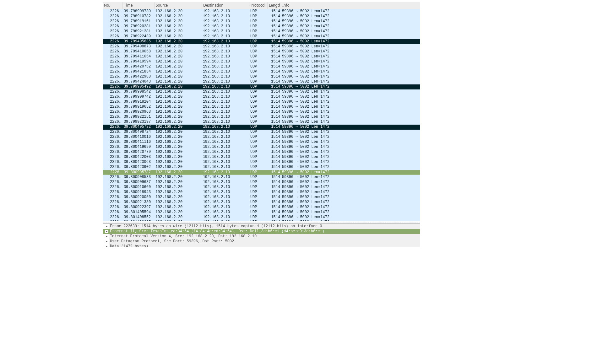

EST
===

.. contents:: :local:
    :depth: 3

Introduction
------------

IEEE 802.1Qbv/D2.2 Enhancements for Scheduled Traffic (EST), Formerly known as Time Aware Shaper (TAS), is an enhancement to Transmission Selection algorithm defined in 802.1Q standard. It became formally part of 802.1Q-2018 edition of the standard. As per standard, a Bridge or an end station may support enhancements that allow transmission from each queue to be scheduled relative to a known timescale.  In order to achieve this, a transmission gate is associated with each queue; the state of the transmission gate determines whether or not queued frames can be selected for transmission. For a given queue, the transmission gate can be in one of two states:

 * Open: Queued frames are selected for transmission, in accordance with the definition of the transmission selection algorithm associated with the queue.
 * Closed: Queued frames are not selected for transmission.

In Linux, EST/TAS offload to hardware is implemented using taprio offload. Time Aware Priority Shaper (TAPRIO) TAPRIO, is a qdisc that implements a simplified version of the scheduling state machine defined by IEEE 802.1Q-2018 Section 8.6.9, which allows configuration of a sequence of gate states, where each gate state allows outgoing traffic for a subset (potentially empty) of traffic classes. EST is configured using tc command. Please refer the manual page `TAPRIO for more details on command syntax and description <http://www.man7.org/linux/man-pages/man8/tc-taprio.8.html>`__

CPSW hardware supports EST configuration or offload. EST is configured through tc command as described in the above manual page. User indicate "flag 2" in the command which is then parsed by taprio scheduler in net core and indicate that the command is to be offloaded to hardware. taprio then offloads the command to the
driver by calling ndo_setup_tc() ndo ops.

Driver supports only SetGateStates operation. EST operates on a repeating time interval generated by the CPTS EST function generator. Each Ethernet port has a global EST fetch RAM that can be configured as 2 buffers, each of 64 locations or one large buffer of 128 location. In 2 buffer configuration, a ping pong mechanism is used to hold the active schedule (oper) in one buffer and new (admin) command in the other.  Each 22-bit fetch command consists of a 14-bit fetch count (14 MSB’s) and an 8-bit priority fetch allow (8 LSB’s) that will be applied for the fetch count time in wireside clocks. Driver process each of the sched-entry in the offload command and update the fetch RAM.  Driver configures duration in sched-entry into the fetch count and Gate mask into the priority fetch bits of the RAM. Then configures the CPTS EST function generator to activate the schedule. Since driver uses 2 buffer configuration for fetch ram, this results in a max cycle time of ~8 msec (64 * 128 usec).

CPSW supports a configurable number of priority queues (up to 8) and needs to be switched to this mode from the default round robin mode before EST can be configured. User configures these through ethtool commands:- -L for changing number of queues and --set-priv-flags to disable round robin mode. Driver doesn't enable EST if pf_p0_rx_ptype_rrobin privat flag is set. The flag is common for all ports, and so can't be just overridden by taprio configuration w/o user involvement. Command fails if pf_p0_rx_ptype_rrobin is already set in the driver. Also note that --set-priv-flags ethtool can be execute only when the Ethernet interface is down. So execute ifconfig down or equivalent command before execute the ethtool command.

Schedule (commands) configuration depends on interface speed so driver translates the duration to the fetch count based on link speed. Each schedule can be constructed with several command entries in fetch RAM depending on interval. For example if each schedule has timer interval < ~128us on 1G link then each sched consumes one command and have 1:1 mapping. When Ethernet link goes down, driver purge the configuration if link is down for more than 1 second.

.. rubric:: example schedule
   :name: est-example-schedule

An example configuration with 3 schedule entries given below:-
 * Uses 3 Queues (Q0-Q2). Each Q has a Gate associated in hardware. Maximum 8 Queues/Gates supported
 * 2 higher priority Gates open for 125usec (Q1 and Q2) each about 10 packets
 * Q7 is the highest priority Queue and Q0 is the lowest priority
 * 1 lower priority (Q0) opens remaining gates for 250 usec

Here are the steps to configure this schedule.

::

 #Setup interface and queue configuration
        ip link set dev eth0 down
        ethtool -L eth0 tx 3

 #disable rrobin
 ethtool --set-priv-flags eth0 p0-rx-ptype-rrobin off

 #bring up eth0 interface
 ip link set dev eth0 up
 #Setup EST schedule with 3 Gates (Q0-Q2). For description of Command parameters, see manual page for taprio.
 #TC0 <-> Q0, TC1 <-> Q1, and TC2 <-> Q2
 tc qdisc replace dev eth0 parent root handle 100 taprio \
    num_tc 3 \
    map 0 0 1 2 0 0 0 0 0 0 0 0 0 0 0 0 \
    queues 1@0 1@1 1@2 \
    base-time 0000 \
    sched-entry S 4 125000 \
    sched-entry S 2 125000 \
    sched-entry S 1 250000 \
    flags 2

 #Where num_tc is same as number of queues = 3, map, maps 16 priorities to one of 3 TCs, queues specify the
 #Queue associated with each TC, TC0 - One queue @0, TC1 - One queue @1 and TC2 - One queue @2
 # sched-entry S 4 125000
 #  S - SetGateStates operation
 #  4 - Bit mask showing bit 2 set (Q2/TC2)
 #  125000 - 125000 nsecs (125 usecs ) duration of Gate open
 #  The cycle-time is 500 msec

 #enable classifier. Classifier is used to mark the packet based on packet meta data. For example UDP port
 #number
 tc qdisc add dev eth0 clsact

 #Using tc filter command edit the SKB priority based on udp port number. i.e Udp port 5003 -> prio 3 (TC2/Q2), port 5002 -> prio 2 (TC1/Q1),  5001 -> prio 1( TC0/Q0)
 tc filter add dev eth0 egress protocol ip prio 1 u32 match ip dport 5003 0xffff action skbedit priority 3
 tc filter add dev eth0 egress protocol ip prio 1 u32 match ip dport 5002 0xffff action skbedit priority 2
 tc filter add dev eth0 egress protocol ip prio 1 u32 match ip dport 5001 0xffff action skbedit priority 1

 #Network core and Driver uses the skb priority to deliver frames to specific hardware queues. In the above case,
 #priority 3 SKB (packet) goes to Q2 (4th entry in map in the tc qdisc command), priority 2 SKB goes to Q1
 #(3rd entry in map) and priority 1 SKB goes to Q0 (2nd entry in map)

 #Run 3 iperf sessions, each with udp port 5001, 5002 and 5003 as
 #Remote PC connected to eth0 with IP address 192.168.2.10
 iperf3 -s -i30 -p5001&
 iperf3 -s -i30 -p5002&
 iperf3 -s -i30 -p5003&

 #At DUT, start trasmission of stream using iperf3
 ip addr add 192.168.2.20/24 dev eth0
 ip link set dev eth0 up
 iperf3 -c 192.168.2.10 -u -b100M  -p 5003 -l1472 -t10 -i5&
 iperf3 -c 192.168.2.10 -u -b100M  -p 5002 -l1472 -t10 -i5&
 iperf3 -c 192.168.2.10 -u -b100M  -p 5001 -l1472 -t10 -i5&

 #Capture frame using wireshark at the PC to see how EST work. The frames will be on the wire only at
 #scheduled time and a periodic burst of frames will be seen every 500 milli seconds.

A sample wireshark capture for the example above is shown below

.. raw:: html

   

.. raw:: html

   

Packet highlighted are the first packet transmitted during Gate open of Q2/TC2 and are spaced apart by about 500 msec which is the cycle-time of the TAS schedule. Also there are about 9 packets transmitted during the window which is about 12 * 9 = 108 usec within the Gate open interval of 125 usec.

.. rubric:: Guard band
   :name: est-guard-band

CPSW EST hardware will transmit the frame during Gate open. If a frame happens to arrive at the hardware queue just before the Gate closes, it gets spilled over to the next schedule window. If this is not desirable, user may add a guard band between schedule window, duration of which should equal to the transmission time of a MTU frame (1518 * 8 = 12144 nsec) + 2336 nsec (TRM describes this as 292 wire clocks = 292 * 8 = 2336).  This ensures that frames don't spill over to the next sched window. For example, for the example schedule described above, to ensure no spill over, guard bands may be introduced as follows:-

::

 tc qdisc replace dev eth0 parent root handle 100 taprio \
    num_tc 3 \
    map 0 0 1 2 0 0 0 0 0 0 0 0 0 0 0 0 \
    queues 1@0 1@1 1@2 \
    base-time 0000 \
    sched-entry S 4 110520 \
    sched-entry S 0 14480  \
    sched-entry S 2 110520 \
    sched-entry S 0 14480  \
    sched-entry S 1 235520 \
    sched-entry S 0 14480  \
    flags 2

The above schedule still have a cycle-time of 500 msec, however there are guard bands inserted between Gate Close/Open and uses 0 Gate mask during the period of 12144 usec.

.. rubric:: cycle-time
   :name: est-cycle-time

In the example schedule described earlier, there are 3 schedule windows described by sched-entry, first 2 being each of 125 usec and a third of 250 usec. So the schedule has a cycle-time of 500 msec which is the sum of the intervals of individual schedule. tc command also allow user to specify cycle-time as part of the command which can be used to truncate or stretch an entry. For example in the typical schedule, if user specify cycle-time of 600000

::

 tc qdisc replace dev eth0 parent root handle 100 taprio \
    num_tc 3 \
    map 0 0 1 2 0 0 0 0 0 0 0 0 0 0 0 0 \
    queues 1@0 1@1 1@2 \
    base-time 0000 \
    sched-entry S 4 110520 \
    sched-entry S 0 14480  \
    sched-entry S 2 110520 \
    sched-entry S 0 14480  \
    sched-entry S 1 235520 \
    sched-entry S 0 14480  \
    cycle-time 600000 \
    flags 2

In the above example, the last window gets stretched for a total of 350 usec instead of 250 usec resulting in a cycle-time of 600 usec. Similarly if the cycle-time is less than the sum of individual sched-entry, then schedule would get truncated.

::

 tc qdisc replace dev eth0 parent root handle 100 taprio \
    num_tc 3 \
    map 0 0 1 2 0 0 0 0 0 0 0 0 0 0 0 0 \
    queues 1@0 1@1 1@2 \
    base-time 0000 \
    sched-entry S 4 110520 \
    sched-entry S 0 14480  \
    sched-entry S 2 110520 \
    sched-entry S 0 14480  \
    sched-entry S 1 235520 \
    sched-entry S 0 14480  \
    cycle-time 400000 \
    flags 2

In the above case, last sched-entry will become truncated to 150 usec resulting in a cycle-time of 400 usec.  Also it takes about 16 wireside clock cycles (128 nsec) to fetch the sched-entry from the fetch ram. So that determines the minimum value of sched-entry interval. If it is less than this, packet spills over to the next window.

.. rubric:: Admin command
   :name: est-admin-command

802.1Q standard describes admin as a way for operator to switch to a new schedule while there is an existing (oper) schedule running. In Linux this is done by sending another tc command while one is running. A limited admin command support is provided by driver with following constraints:-
 * cycle-time of the new schedule must match that of the existing schedule
 * start-time must be in the past

.. rubric:: Not supported features
   :name: est-not-supported-features

* Admin command with cycle-time different from oper schedule
* Admin command at a future time
* AdminCycleTimeExtension/OperCycleTimeExtension
* Configuring of queueMaxSDUTable
* Configuring of ConfigChange
* Show ConfigPending status (tc command shows  Oper and Admin schedule. So if admin schedule shows up, user application may consider this as ConfigPending)
* Show ConfigChangeError
* Show SupportedListMax - Maximum supported is 64 sched-entries if interval is < 128 usec)

Setup
------

1. Clone plget repo from: https://github.com/ikhorn/plget

2. Cross-compile and build the executable using:

::

    make ARCH=arm64 CROSS_COMPILE=aarch64-none-linux-gnu-

3. Copy the generated executable named "plget" to J7VCL and AM625-SK.

EST Testing in MAC mode
-----------------------

EST scheduled on AM625-SK with J7VCL receiving the packets
^^^^^^^^^^^^^^^^^^^^^^^^^^^^^^^^^^^^^^^^^^^^^^^^^^^^^^^^^^

Connect eth0 of AM625-SK to eth1 of J7VCL.

**Steps:**

1. Run the following on AM625-SK:

::

    #!/bin/sh

    # AM625-SK CPSW3G Port-1
    ifconfig eth0 down
    ethtool -L eth0 tx 3
    ethtool --set-priv-flags eth0 p0-rx-ptype-rrobin off
    ifconfig eth0 up
    sleep 30

    #sync system time to CPSW CPTS
    phc2sys -s CLOCK_REALTIME -c eth0 -m -O 0 > /dev/null &

    #calc base_time as now + 2min, give it time to sync
    base=$(((`date +%s` + 2 * 60)*1000000000))

    tc qdisc replace dev eth0 parent root handle 100 taprio \
        num_tc 3 \
        map 0 0 1 2 0 0 0 0 0 0 0 0 0 0 0 0 \
        queues 1@0 1@1 1@2 \
        base-time $base \
        sched-entry S 4 125000 \
        sched-entry S 2 125000 \
        sched-entry S 1 250000 \
        flags 2

    tc qdisc add dev eth0 clsact
    tc filter add dev eth0 egress protocol ip prio 1 u32 match ip dport 5001 0xffff action skbedit priority 3
    tc filter add dev eth0 egress protocol ip prio 1 u32 match ip dport 5002 0xffff action skbedit priority 2
    tc filter add dev eth0 egress protocol ip prio 1 u32 match ip dport 5003 0xffff action skbedit priority 1
    tc qdisc show dev eth0

    # Wait for 2 minutes for sync to complete
    sleep 120

    # NOTE: Replace 70:ff:76:1d:8c:08 with the MAC address of CPSW5G port-1 of J7VCL
    ./plget -i eth0 -m pkt-gen -p 3 -t ptpl2 -n 128 -a 70:ff:76:1d:8c:08 -l 1500
    sleep 5
    ./plget -i eth0 -m pkt-gen -p 2 -t ptpl2 -n 128 -a 70:ff:76:1d:8c:08 -l 1500
    sleep 5
    ./plget -i eth0 -m pkt-gen -p 1 -t ptpl2 -n 128 -a 70:ff:76:1d:8c:08 -l 1500

2.  Wait for eth0 on AM625-SK to be up and then run the following on J7VCL:

::

    #!/bin/sh
    while sleep 1; do ./plget -m rx-lat -f ipgap -n 128 -i eth1 -t ptpl2 -f hwts; done

**Observed Outputs:**

On J7VCL:

::

    Priority 3 Output:
    hw rx time, us: packets 128:
    relative abs time 228493286405 ns
    first packet abs time 228493286405 ns
    ------------------------------------------------------------------------------------------------------------------------
                0 |        12.19 |        24.38 |        36.57 |        48.76 |        60.95 |       73.145 |        85.34 |
            97.53 |      109.725 |      121.915 |      499.985 |      512.185 |      524.375 |      536.565 |      548.755 |
           560.95 |       573.14 |       585.33 |       597.53 |       609.72 |       621.91 |       999.98 |      1012.18 |
          1024.37 |      1036.56 |      1048.76 |      1060.94 |      1073.13 |      1085.33 |      1097.53 |      1109.71 |
           1121.9 |      1499.98 |      1512.17 |      1524.37 |      1536.56 |      1548.75 |      1560.94 |      1573.13 |
          1585.32 |      1597.51 |      1609.71 |       1621.9 |      1999.97 |      2012.16 |      2024.37 |      2036.56 |
          2048.74 |      2060.93 |      2073.12 |      2085.32 |      2097.51 |       2109.7 |      2121.89 |      2499.97 |
          2512.16 |      2524.35 |      2536.55 |      2548.74 |      2560.93 |      2573.12 |      2585.31 |      2597.51 |
           2609.7 |      2621.89 |      2999.97 |      3012.16 |      3024.34 |      3036.55 |      3048.74 |      3060.93 |
          3073.11 |      3085.31 |       3097.5 |      3109.69 |      3121.89 |      3499.96 |      3512.15 |      3524.34 |
          3536.53 |      3548.73 |      3560.92 |      3573.11 |       3585.3 |      3597.49 |      3609.68 |      3621.88 |
          3999.95 |      4012.14 |      4024.34 |      4036.53 |      4048.72 |      4060.92 |      4073.11 |       4085.3 |
          4097.49 |      4109.68 |      4121.87 |      4499.95 |      4512.15 |      4524.34 |      4536.52 |      4548.72 |
          4560.91 |       4573.1 |       4585.3 |      4597.48 |      4609.68 |      4621.86 |      4999.95 |      5012.14 |
          5024.33 |      5036.52 |      5048.71 |      5060.91 |       5073.1 |      5085.29 |      5097.48 |      5109.67 |
          5121.86 |      5499.94 |      5512.14 |      5524.32 |      5536.52 |       5548.7 |       5560.9 |       5573.1 |
    ------------------------------------------------------------------------------------------------------------------------

    gap of hw rx time, us: packets 128:
    ------------------------------------------------------------------------------------------------------------------------
                0 |        12.19 |        12.19 |        12.19 |        12.19 |        12.19 |       12.195 |       12.195 |
            12.19 |       12.195 |        12.19 |       378.07 |         12.2 |        12.19 |        12.19 |        12.19 |
           12.195 |        12.19 |        12.19 |         12.2 |        12.19 |        12.19 |       378.07 |         12.2 |
            12.19 |        12.19 |       12.195 |        12.19 |        12.19 |        12.19 |         12.2 |        12.19 |
            12.19 |      378.075 |        12.19 |       12.195 |       12.195 |        12.19 |        12.19 |        12.19 |
            12.19 |        12.19 |         12.2 |        12.19 |      378.075 |        12.19 |         12.2 |        12.19 |
            12.19 |        12.19 |        12.19 |        12.19 |        12.19 |         12.2 |        12.19 |      378.075 |
            12.19 |        12.19 |         12.2 |        12.19 |        12.19 |        12.19 |        12.19 |       12.195 |
            12.19 |       12.195 |      378.075 |        12.19 |        12.19 |         12.2 |        12.19 |        12.19 |
            12.19 |       12.195 |        12.19 |        12.19 |         12.2 |       378.07 |        12.19 |        12.19 |
           12.195 |       12.195 |        12.19 |       12.195 |        12.19 |        12.19 |        12.19 |        12.19 |
           378.08 |        12.19 |       12.195 |        12.19 |       12.195 |       12.195 |        12.19 |        12.19 |
            12.19 |        12.19 |        12.19 |       378.08 |       12.195 |        12.19 |        12.19 |        12.19 |
             12.2 |        12.19 |        12.19 |        12.19 |        12.19 |        12.19 |      378.085 |        12.19 |
            12.19 |        12.19 |        12.19 |         12.2 |        12.19 |        12.19 |        12.19 |        12.19 |
           12.195 |       378.08 |        12.19 |        12.19 |        12.19 |        12.19 |        12.19 |         12.2 |
    ------------------------------------------------------------------------------------------------------------------------
    max val(#110) = 378.08us
    min val(#1) = 12.19us
    peak-to-peak = 365.89us
    mean +- RMS = 43.88 +- 102.91 us

    Priority 2 Output:
    hw rx time, us: packets 128:
    relative abs time 233544362395 ns
    first packet abs time 233544362395 ns
    ------------------------------------------------------------------------------------------------------------------------
                0 |       12.195 |        24.39 |        36.58 |        48.77 |        60.96 |        73.15 |        85.34 |
            97.54 |       109.73 |       121.92 |      499.995 |       512.19 |      524.385 |      536.575 |      548.765 |
          560.955 |      573.145 |      585.335 |      597.535 |      609.725 |      621.915 |       999.99 |      1012.18 |
          1024.38 |      1036.57 |      1048.76 |      1060.95 |      1073.14 |      1085.33 |      1097.53 |      1109.72 |
          1121.91 |      1499.98 |      1512.17 |      1524.38 |      1536.57 |      1548.76 |      1560.94 |      1573.13 |
          1585.33 |      1597.52 |      1609.72 |      1621.91 |      1999.98 |      2012.17 |      2024.36 |      2036.56 |
          2048.75 |      2060.94 |      2073.14 |      2085.32 |      2097.51 |       2109.7 |      2121.91 |      2499.97 |
          2512.16 |      2524.36 |      2536.55 |      2548.74 |      2560.94 |      2573.13 |      2585.32 |      2597.51 |
           2609.7 |       2621.9 |      2999.97 |      3012.16 |      3024.36 |      3036.55 |      3048.74 |      3060.93 |
          3073.12 |      3085.32 |      3097.51 |       3109.7 |      3121.89 |      3499.97 |      3512.16 |      3524.35 |
          3536.54 |      3548.74 |      3560.93 |      3573.12 |      3585.31 |       3597.5 |      3609.69 |      3621.89 |
          3999.97 |      4012.16 |      4024.34 |      4036.53 |      4048.74 |      4060.93 |      4073.11 |       4085.3 |
          4097.49 |      4109.69 |      4121.88 |      4499.96 |      4512.15 |      4524.34 |      4536.53 |      4548.72 |
          4560.92 |      4573.11 |       4585.3 |      4597.49 |      4609.69 |      4621.88 |      4999.95 |      5012.15 |
          5024.34 |      5036.52 |      5048.72 |      5060.91 |       5073.1 |       5085.3 |      5097.49 |      5109.68 |
          5121.87 |      5499.95 |      5512.14 |      5524.33 |      5536.52 |      5548.72 |       5560.9 |       5573.1 |
    ------------------------------------------------------------------------------------------------------------------------

    gap of hw rx time, us: packets 128:
    ------------------------------------------------------------------------------------------------------------------------
                0 |       12.195 |       12.195 |        12.19 |        12.19 |        12.19 |        12.19 |        12.19 |
             12.2 |        12.19 |        12.19 |      378.075 |       12.195 |       12.195 |        12.19 |        12.19 |
            12.19 |        12.19 |        12.19 |         12.2 |        12.19 |        12.19 |      378.075 |        12.19 |
             12.2 |        12.19 |        12.19 |        12.19 |        12.19 |        12.19 |       12.195 |       12.195 |
           12.195 |       378.07 |        12.19 |         12.2 |        12.19 |        12.19 |        12.19 |        12.19 |
           12.195 |        12.19 |         12.2 |        12.19 |       378.07 |        12.19 |        12.19 |         12.2 |
            12.19 |        12.19 |       12.195 |        12.19 |        12.19 |        12.19 |         12.2 |       378.07 |
            12.19 |       12.195 |       12.195 |        12.19 |       12.195 |        12.19 |        12.19 |        12.19 |
            12.19 |         12.2 |       378.07 |       12.195 |        12.19 |        12.19 |         12.2 |        12.19 |
            12.19 |        12.19 |        12.19 |        12.19 |         12.2 |      378.075 |        12.19 |        12.19 |
            12.19 |         12.2 |        12.19 |        12.19 |        12.19 |        12.19 |        12.19 |       12.195 |
           378.08 |        12.19 |        12.19 |        12.19 |         12.2 |        12.19 |        12.19 |        12.19 |
            12.19 |       12.195 |        12.19 |       378.08 |        12.19 |        12.19 |        12.19 |        12.19 |
             12.2 |        12.19 |        12.19 |       12.195 |        12.19 |        12.19 |       378.08 |        12.19 |
            12.19 |        12.19 |       12.195 |       12.195 |        12.19 |       12.195 |        12.19 |        12.19 |
            12.19 |       378.08 |        12.19 |        12.19 |       12.195 |        12.19 |        12.19 |         12.2 |
    ------------------------------------------------------------------------------------------------------------------------
    max val(#88) = 378.08us
    min val(#3) = 12.19us
    peak-to-peak = 365.89us
    mean +- RMS = 43.88 +- 102.91 us

    Priority 1 Output:
    hw rx time, us: packets 128:
    relative abs time 238600085525 ns
    first packet abs time 238600085525 ns
    ------------------------------------------------------------------------------------------------------------------------
                0 |       66.805 |       82.395 |        96.97 |      352.715 |       364.91 |      377.105 |      389.295 |
           401.49 |       413.68 |       425.87 |       438.06 |       450.25 |       462.45 |       474.64 |       486.83 |
           499.02 |       511.21 |      523.405 |      535.595 |       547.79 |      559.985 |      572.175 |      584.365 |
          596.555 |       852.71 |      864.905 |      877.095 |      889.295 |      901.485 |      913.675 |      925.865 |
          938.055 |      950.245 |      962.435 |      974.635 |      986.825 |      999.015 |      1011.21 |       1023.4 |
          1035.59 |      1047.79 |      1059.98 |      1072.17 |      1084.36 |      1096.55 |      1352.71 |       1364.9 |
          1377.09 |      1389.29 |      1401.48 |      1413.67 |      1425.86 |      1438.05 |      1450.24 |      1462.43 |
          1474.63 |      1486.82 |      1499.02 |       1511.2 |      1523.39 |      1535.59 |      1547.78 |      1559.97 |
          1572.16 |      1584.36 |      1596.55 |       1852.7 |      1864.89 |      1877.09 |      1889.28 |      1901.47 |
          1913.66 |      1925.86 |      1938.05 |      1950.24 |      1962.43 |      1974.62 |      1986.82 |      1999.01 |
           2011.2 |      2023.39 |      2035.58 |      2047.77 |      2059.97 |      2072.16 |      2084.35 |      2096.54 |
           2352.7 |      2364.89 |      2377.08 |      2389.27 |      2401.47 |      2413.66 |      2425.85 |      2438.04 |
          2450.24 |      2462.43 |      2474.61 |      2486.82 |      2499.01 |       2511.2 |      2523.39 |      2535.57 |
          2547.76 |      2559.96 |      2572.16 |      2584.34 |      2596.54 |       2852.7 |      2864.89 |      2877.07 |
          2889.26 |      2901.46 |      2913.66 |      2925.84 |      2938.04 |      2950.23 |      2962.42 |      2974.61 |
          2986.81 |         2999 |      3011.19 |      3023.38 |      3035.57 |      3047.76 |      3059.95 |      3072.15 |
    ------------------------------------------------------------------------------------------------------------------------

    gap of hw rx time, us: packets 128:
    ------------------------------------------------------------------------------------------------------------------------
                0 |       66.805 |        15.59 |       14.575 |      255.745 |       12.195 |       12.195 |        12.19 |
           12.195 |        12.19 |        12.19 |        12.19 |        12.19 |         12.2 |        12.19 |        12.19 |
            12.19 |        12.19 |       12.195 |        12.19 |       12.195 |       12.195 |        12.19 |        12.19 |
            12.19 |      256.155 |       12.195 |        12.19 |         12.2 |        12.19 |        12.19 |        12.19 |
            12.19 |        12.19 |        12.19 |         12.2 |        12.19 |        12.19 |       12.195 |        12.19 |
            12.19 |         12.2 |        12.19 |        12.19 |        12.19 |        12.19 |       256.16 |        12.19 |
            12.19 |         12.2 |        12.19 |        12.19 |        12.19 |        12.19 |        12.19 |       12.195 |
           12.195 |        12.19 |       12.195 |        12.19 |        12.19 |        12.19 |        12.19 |         12.2 |
            12.19 |        12.19 |        12.19 |       256.16 |        12.19 |        12.19 |        12.19 |         12.2 |
            12.19 |        12.19 |        12.19 |       12.195 |        12.19 |       12.195 |       12.195 |        12.19 |
            12.19 |        12.19 |        12.19 |        12.19 |         12.2 |        12.19 |        12.19 |        12.19 |
           256.16 |        12.19 |        12.19 |        12.19 |         12.2 |        12.19 |        12.19 |        12.19 |
           12.195 |        12.19 |        12.19 |         12.2 |        12.19 |        12.19 |        12.19 |        12.19 |
            12.19 |       12.195 |       12.195 |        12.19 |       12.195 |      256.155 |        12.19 |        12.19 |
            12.19 |       12.195 |       12.195 |        12.19 |       12.195 |        12.19 |        12.19 |        12.19 |
             12.2 |        12.19 |        12.19 |        12.19 |        12.19 |       12.195 |        12.19 |       12.195 |
    ------------------------------------------------------------------------------------------------------------------------
    max val(#46) = 256.16us
    min val(#7) = 12.19us
    peak-to-peak = 243.97us
    mean +- RMS = 24.19 +- 51.87 us

**Explanation:**

::

    Looking at the inter-packet gaps, which correspond to the second table within each of the priorities, for Priority 3,
    we see that the inter-packet gap is roughly 12 microseconds for about 10 packets, after which it suddenly jumps to
    around 378.07 microseconds. This jump corresponds to the time that the packets with Priorities 2 and 1, with
    duration of 125 and 250 micro seconds (125 + 250 = 375 ~ 378.07) were being transmitted.

    Similarly, for packets with Priority 2, there is a sudden gap of 378.075 microseconds, which corresponds to the time that
    the packets with Priorities 1 and 3, with duration of 250 and 125 microseconds (250 + 125 = 375 ~ 378.075) were
    being transmitted.

    Now, for packets with Priority 1, the gap is of 256.155 microseconds, which corresponds to the time that the packets
    with Priorities 3 and 2, with duration of 125 and 125 microseconds (125 + 125 = 250 ~ 256.155) were being transmitted.

EST scheduled on J7VCL with AM625-SK receiving the packets
^^^^^^^^^^^^^^^^^^^^^^^^^^^^^^^^^^^^^^^^^^^^^^^^^^^^^^^^^^

Connect eth1 of J7VCL to eth0 of AM625-SK.

**Steps:**

1. Run the following on J7VCL:

::

    #!/bin/sh

    # J7VCL CPSW5G Port-1 in QSGMII mode
    ifconfig eth1 down
    ifconfig eth2 down
    ifconfig eth3 down
    ifconfig eth4 down
    ethtool -L eth1 tx 3
    ethtool --set-priv-flags eth1 p0-rx-ptype-rrobin off
    ifconfig eth1 up
    sleep 30

    #sync system time to CPSW CPTS
    phc2sys -s CLOCK_REALTIME -c eth1 -m -O 0 > /dev/null &

    #calc base_time as now + 2min, give it time to sync
    base=$(((`date +%s` + 2 * 60)*1000000000))

    tc qdisc replace dev eth1 parent root handle 100 taprio \
        num_tc 3 \
        map 0 0 1 2 0 0 0 0 0 0 0 0 0 0 0 0 \
        queues 1@0 1@1 1@2 \
        base-time $base \
        sched-entry S 4 125000 \
        sched-entry S 2 125000 \
        sched-entry S 1 250000 \
        flags 2

    tc qdisc add dev eth1 clsact
    tc filter add dev eth1 egress protocol ip prio 1 u32 match ip dport 5001 0xffff action skbedit priority 3
    tc filter add dev eth1 egress protocol ip prio 1 u32 match ip dport 5002 0xffff action skbedit priority 2
    tc filter add dev eth1 egress protocol ip prio 1 u32 match ip dport 5003 0xffff action skbedit priority 1
    tc qdisc show dev eth1

    # Wait for 2 minutes for sync to complete
    sleep 120

    # NOTE: Replace f4:84:4c:fc:11:51 with the MAC address of CPSW3G port-1 of AM625-SK
    ./plget -i eth1 -m pkt-gen -p 3 -t ptpl2 -n 128 -a f4:84:4c:fc:11:51 -l 1500
    sleep 5
    ./plget -i eth1 -m pkt-gen -p 2 -t ptpl2 -n 128 -a f4:84:4c:fc:11:51 -l 1500
    sleep 5
    ./plget -i eth1 -m pkt-gen -p 1 -t ptpl2 -n 128 -a f4:84:4c:fc:11:51 -l 1500

2. Wait for eth1 on J7VCL to be up and then run the following on AM625-SK:

::

    #!/bin/sh
    while sleep 1; do ./plget -m rx-lat -f ipgap -n 128 -i eth0 -t ptpl2 -f hwts; done

**Observed Outputs:**

On AM625-SK:

::

    Priority 3 Output:
    hw rx time, us: packets 128:
    relative abs time 217361205681 ns
    first packet abs time 217361205681 ns
    ------------------------------------------------------------------------------------------------------------------------
                0 |       37.188 |      423.094 |      435.286 |      447.476 |      459.666 |       471.85 |       484.04 |
          496.232 |      508.422 |      520.614 |      532.804 |      544.986 |      923.094 |      935.276 |      947.468 |
          959.658 |       971.85 |       984.04 |       996.23 |      1008.42 |       1020.6 |       1032.8 |      1044.99 |
           1423.1 |      1435.29 |      1447.48 |      1459.67 |      1471.86 |      1484.05 |      1496.24 |      1508.43 |
          1520.62 |      1532.81 |         1545 |      1923.11 |       1935.3 |      1947.49 |      1959.67 |      1971.86 |
          1984.05 |      1996.25 |      2008.44 |      2020.63 |      2032.81 |         2045 |      2423.11 |      2435.29 |
          2447.48 |      2459.67 |      2471.86 |      2484.05 |      2496.25 |      2508.43 |      2520.62 |      2532.81 |
             2545 |      2923.11 |       2935.3 |      2947.49 |      2959.68 |      2971.87 |      2984.05 |      2996.24 |
          3008.44 |      3020.63 |      3032.82 |      3045.01 |      3423.12 |      3435.31 |       3447.5 |      3459.69 |
          3471.88 |      3484.07 |      3496.26 |      3508.45 |      3520.64 |      3532.82 |      3545.02 |      3923.12 |
          3935.31 |       3947.5 |      3959.69 |      3971.89 |      3984.08 |      3996.26 |      4008.45 |      4020.64 |
          4032.83 |      4045.02 |      4423.12 |      4435.31 |       4447.5 |      4459.69 |      4471.88 |      4484.07 |
          4496.26 |      4508.45 |      4520.64 |      4532.83 |      4545.01 |      4923.14 |      4935.33 |      4947.51 |
           4959.7 |      4971.89 |      4984.08 |      4996.27 |      5008.47 |      5020.65 |      5032.84 |      5045.03 |
          5423.14 |      5435.33 |      5447.52 |      5459.71 |       5471.9 |      5484.09 |      5496.27 |      5508.46 |
          5520.66 |      5532.85 |      5545.04 |      5923.14 |      5935.34 |      5947.53 |      5959.71 |       5971.9 |
    ------------------------------------------------------------------------------------------------------------------------

    gap of hw rx time, us: packets 128:
    ------------------------------------------------------------------------------------------------------------------------
                0 |       37.188 |      385.906 |       12.192 |        12.19 |        12.19 |       12.184 |        12.19 |
           12.192 |        12.19 |       12.192 |        12.19 |       12.182 |      378.108 |       12.182 |       12.192 |
            12.19 |       12.192 |        12.19 |        12.19 |       12.192 |       12.182 |       12.192 |        12.19 |
          378.116 |        12.19 |       12.192 |        12.19 |        12.19 |       12.184 |        12.19 |        12.19 |
           12.192 |        12.19 |       12.192 |      378.106 |       12.192 |        12.19 |       12.184 |        12.19 |
            12.19 |       12.192 |        12.19 |       12.192 |       12.182 |        12.19 |      378.108 |       12.184 |
            12.19 |        12.19 |       12.192 |        12.19 |       12.192 |       12.182 |        12.19 |       12.192 |
            12.19 |      378.108 |        12.19 |       12.192 |        12.19 |        12.19 |       12.184 |        12.19 |
           12.192 |        12.19 |        12.19 |       12.192 |      378.116 |        12.19 |       12.182 |       12.192 |
            12.19 |       12.192 |        12.19 |        12.19 |       12.192 |       12.182 |       12.192 |      378.106 |
           12.192 |        12.19 |        12.19 |       12.192 |        12.19 |       12.184 |        12.19 |        12.19 |
           12.192 |        12.19 |        378.1 |        12.19 |       12.192 |        12.19 |       12.184 |        12.19 |
            12.19 |       12.192 |        12.19 |       12.192 |       12.182 |      378.124 |        12.19 |       12.182 |
           12.192 |        12.19 |       12.192 |        12.19 |       12.192 |       12.182 |        12.19 |       12.192 |
          378.106 |       12.192 |        12.19 |       12.192 |        12.19 |        12.19 |       12.184 |        12.19 |
           12.192 |        12.19 |        12.19 |      378.108 |       12.192 |        12.19 |       12.182 |       12.192 |
    ------------------------------------------------------------------------------------------------------------------------
    max val(#2) = 385.91us
    min val(#12) = 12.18us
    peak-to-peak = 373.72us
    mean +- RMS = 47.02 +- 107.19 us

    Priority 2 Output:
    hw rx time, us: packets 128:
    relative abs time 222402899877 ns
    first packet abs time 222402899877 ns
    ------------------------------------------------------------------------------------------------------------------------
                0 |      406.992 |      419.184 |      431.374 |      443.566 |      455.748 |      467.938 |       480.13 |
           492.32 |      504.512 |      516.702 |      528.892 |      907.008 |        919.2 |      931.382 |      943.572 |
          955.764 |      967.954 |      980.144 |      992.336 |      1004.52 |      1016.71 |       1028.9 |      1407.01 |
           1419.2 |      1431.39 |      1443.58 |      1455.77 |      1467.96 |      1480.14 |      1492.34 |      1504.53 |
          1516.72 |      1528.91 |      1907.01 |       1919.2 |      1931.39 |      1943.58 |      1955.76 |      1967.95 |
          1980.14 |      1992.33 |      2004.53 |      2016.72 |       2028.9 |      2407.01 |       2419.2 |      2431.39 |
          2443.58 |      2455.77 |      2467.96 |      2480.15 |      2492.34 |      2504.52 |      2516.72 |      2528.91 |
          2907.02 |      2919.21 |       2931.4 |      2943.59 |      2955.79 |      2967.97 |      2980.16 |      2992.35 |
          3004.54 |      3016.73 |      3028.92 |      3407.03 |      3419.22 |      3431.41 |      3443.59 |      3455.78 |
          3467.98 |      3480.17 |      3492.36 |      3504.55 |      3516.73 |      3528.92 |      3907.02 |      3919.21 |
           3931.4 |      3943.59 |      3955.78 |      3967.97 |      3980.17 |      3992.35 |      4004.54 |      4016.73 |
          4028.92 |      4407.04 |      4419.23 |      4431.42 |      4443.61 |      4455.79 |      4467.98 |      4480.17 |
          4492.36 |      4504.55 |      4516.75 |      4528.94 |      4907.04 |      4919.23 |      4931.42 |      4943.61 |
           4955.8 |      4967.99 |      4980.18 |      4992.37 |      5004.56 |      5016.74 |      5028.94 |      5407.05 |
          5419.24 |      5431.43 |      5443.62 |      5455.81 |      5468.01 |      5480.19 |      5492.38 |      5504.57 |
          5516.76 |      5528.95 |      5907.06 |      5919.25 |      5931.44 |      5943.63 |      5955.81 |         5968 |
    ------------------------------------------------------------------------------------------------------------------------

    gap of hw rx time, us: packets 128:
    ------------------------------------------------------------------------------------------------------------------------
                0 |      406.992 |       12.192 |        12.19 |       12.192 |       12.182 |        12.19 |       12.192 |
            12.19 |       12.192 |        12.19 |        12.19 |      378.116 |       12.192 |       12.182 |        12.19 |
           12.192 |        12.19 |        12.19 |       12.192 |       12.182 |       12.192 |        12.19 |      378.108 |
            12.19 |       12.192 |        12.19 |        12.19 |       12.192 |       12.182 |       12.192 |        12.19 |
            12.19 |       12.192 |        378.1 |        12.19 |        12.19 |       12.192 |       12.182 |       12.192 |
            12.19 |        12.19 |       12.192 |        12.19 |       12.184 |      378.114 |       12.184 |        12.19 |
            12.19 |       12.192 |        12.19 |       12.192 |        12.19 |       12.182 |       12.192 |        12.19 |
          378.116 |        12.19 |       12.192 |        12.19 |       12.192 |       12.182 |        12.19 |       12.192 |
            12.19 |       12.192 |        12.19 |      378.108 |        12.19 |        12.19 |       12.184 |        12.19 |
           12.192 |        12.19 |        12.19 |       12.192 |       12.182 |       12.192 |      378.098 |       12.192 |
            12.19 |       12.192 |        12.19 |        12.19 |       12.192 |       12.182 |       12.192 |        12.19 |
            12.19 |      378.116 |        12.19 |       12.192 |        12.19 |       12.184 |        12.19 |       12.192 |
            12.19 |        12.19 |       12.192 |        12.19 |      378.108 |        12.19 |       12.184 |        12.19 |
            12.19 |       12.192 |        12.19 |       12.192 |        12.19 |       12.182 |       12.192 |      378.116 |
            12.19 |        12.19 |       12.192 |        12.19 |       12.192 |       12.182 |        12.19 |       12.192 |
            12.19 |       12.192 |      378.106 |       12.192 |        12.19 |        12.19 |       12.184 |        12.19 |
    ------------------------------------------------------------------------------------------------------------------------
    max val(#1) = 406.99us
    min val(#5) = 12.18us
    peak-to-peak = 394.81us
    mean +- RMS = 46.99 +- 107.77 us

    Priority 1 Output:
    hw rx time, us: packets 128:
    relative abs time 227442984967 ns
    first packet abs time 227442984967 ns
    ------------------------------------------------------------------------------------------------------------------------
                0 |       27.836 |        40.02 |        52.21 |         64.4 |       76.592 |       88.782 |      100.974 |
          113.164 |      125.346 |      137.538 |      149.728 |       161.92 |       174.11 |        186.3 |      198.484 |
          210.674 |      222.866 |      235.056 |      247.246 |      500.006 |       512.19 |       524.38 |       536.57 |
          548.762 |      560.952 |      573.144 |      585.334 |      597.516 |      609.708 |      621.898 |       634.09 |
           646.28 |       658.47 |      670.654 |      682.844 |      695.036 |      707.226 |      719.418 |      731.608 |
          743.798 |      999.998 |      1012.19 |      1024.38 |      1036.57 |      1048.76 |      1060.94 |      1073.13 |
          1085.33 |      1097.52 |      1109.71 |       1121.9 |      1134.09 |      1146.27 |      1158.46 |      1170.65 |
          1182.84 |      1195.03 |      1207.23 |      1219.41 |       1231.6 |      1243.79 |      1500.01 |       1512.2 |
          1524.39 |      1536.58 |      1548.77 |      1560.96 |      1573.15 |      1585.34 |      1597.53 |      1609.71 |
          1621.91 |       1634.1 |      1646.29 |      1658.48 |      1670.67 |      1682.86 |      1695.04 |      1707.23 |
          1719.42 |      1731.61 |      1743.81 |      2000.01 |       2012.2 |      2024.39 |      2036.59 |      2048.78 |
          2060.97 |      2073.16 |      2085.34 |      2097.53 |      2109.72 |      2121.91 |       2134.1 |      2146.29 |
          2158.48 |      2170.67 |      2182.86 |      2195.05 |      2207.24 |      2219.43 |      2231.62 |       2243.8 |
          2500.02 |      2512.21 |       2524.4 |      2536.59 |      2548.78 |      2560.97 |      2573.16 |      2585.35 |
          2597.54 |      2609.73 |      2621.92 |       2634.1 |      2646.29 |      2658.48 |      2670.68 |      2682.87 |
          2695.06 |      2707.24 |      2719.43 |      2731.62 |      2743.81 |      3000.02 |      3012.21 |      3024.39 |
    ------------------------------------------------------------------------------------------------------------------------

    gap of hw rx time, us: packets 128:
    ------------------------------------------------------------------------------------------------------------------------
                0 |       27.836 |       12.184 |        12.19 |        12.19 |       12.192 |        12.19 |       12.192 |
            12.19 |       12.182 |       12.192 |        12.19 |       12.192 |        12.19 |        12.19 |       12.184 |
            12.19 |       12.192 |        12.19 |        12.19 |       252.76 |       12.184 |        12.19 |        12.19 |
           12.192 |        12.19 |       12.192 |        12.19 |       12.182 |       12.192 |        12.19 |       12.192 |
            12.19 |        12.19 |       12.184 |        12.19 |       12.192 |        12.19 |       12.192 |        12.19 |
            12.19 |        256.2 |        12.19 |       12.192 |        12.19 |        12.19 |       12.184 |        12.19 |
           12.192 |        12.19 |       12.192 |        12.19 |        12.19 |       12.184 |        12.19 |       12.192 |
            12.19 |        12.19 |       12.192 |       12.182 |       12.192 |        12.19 |      256.224 |        12.19 |
            12.19 |       12.184 |        12.19 |       12.192 |        12.19 |        12.19 |       12.192 |       12.182 |
           12.192 |        12.19 |       12.192 |        12.19 |        12.19 |       12.192 |       12.182 |       12.192 |
            12.19 |        12.19 |       12.192 |      256.206 |       12.192 |        12.19 |       12.192 |        12.19 |
            12.19 |       12.192 |       12.182 |       12.192 |        12.19 |        12.19 |       12.192 |        12.19 |
           12.184 |        12.19 |        12.19 |       12.192 |        12.19 |       12.192 |        12.19 |       12.182 |
          256.216 |        12.19 |       12.192 |        12.19 |       12.184 |        12.19 |       12.192 |        12.19 |
            12.19 |       12.192 |        12.19 |       12.182 |       12.192 |        12.19 |       12.192 |        12.19 |
           12.192 |       12.182 |        12.19 |       12.192 |        12.19 |      256.208 |        12.19 |       12.184 |
    ------------------------------------------------------------------------------------------------------------------------
    max val(#62) = 256.22us
    min val(#9) = 12.18us
    peak-to-peak = 244.04us
    mean +- RMS = 23.81 +- 51.64 us

**Explanation:**

::

    Looking at the inter-packet gaps, which correspond to the second table within each of the priorities, for Priority 3,
    we see that the inter-packet gap is roughly 12 microseconds for about 10 packets, after which it suddenly jumps to
    around 378.108 microseconds. This jump corresponds to the time that the packets with Priorities 2 and 1, with
    duration of 125 and 250 micro seconds (125 + 250 = 375 ~ 378.108) were being transmitted.

    Similarly, for packets with Priority 2, there is a sudden gap of 378.116 microseconds, which corresponds to the time that
    the packets with Priorities 1 and 3, with duration of 250 and 125 microseconds (250 + 125 = 375 ~ 378.108) were
    being transmitted.

    Now, for packets with Priority 1, the gap is of 252.76 microseconds, which corresponds to the time that the packets
    with Priorities 3 and 2, with duration of 125 and 125 microseconds (125 + 125 = 250 ~ 252.76) were being transmitted.

EST scheduled on ports 1 and 2 of AM625-SK's CPSW3G and received by J7VCL
^^^^^^^^^^^^^^^^^^^^^^^^^^^^^^^^^^^^^^^^^^^^^^^^^^^^^^^^^^^^^^^^^^^^^^^^^

Connect eth0 of AM625-SK to eth1 of J7VCL and eth1 of AM625-SK to eth2 of J7VCL.

**Steps:**

1. Run the following on AM625-SK:

::

    #!/bin/sh

    # AM625-SK CPSW3G Port-1 and Port-2
    ifconfig eth0 down
    ifconfig eth1 down
    ethtool -L eth0 tx 3
    ethtool -L eth1 tx 3
    ethtool --set-priv-flags eth0 p0-rx-ptype-rrobin off
    ethtool --set-priv-flags eth1 p0-rx-ptype-rrobin off
    ifconfig eth0 up
    ifconfig eth1 up
    sleep 30

    #sync system time to CPSW CPTS
    phc2sys -s CLOCK_REALTIME -c eth0 -m -O 0 > /dev/null &

    #calc base_time as now + 2min, give it time to sync
    base=$(((`date +%s` + 2 * 60)*1000000000))

    tc qdisc replace dev eth0 parent root handle 100 taprio \
        num_tc 3 \
        map 0 0 1 2 0 0 0 0 0 0 0 0 0 0 0 0 \
        queues 1@0 1@1 1@2 \
        base-time $base \
        sched-entry S 4 125000 \
        sched-entry S 2 125000 \
        sched-entry S 1 250000 \
        flags 2

    tc qdisc replace dev eth1 parent root handle 100 taprio \
        num_tc 3 \
        map 0 0 1 2 0 0 0 0 0 0 0 0 0 0 0 0 \
        queues 1@0 1@1 1@2 \
        base-time $base \
        sched-entry S 4 125000 \
        sched-entry S 2 125000 \
        sched-entry S 1 250000 \
        flags 2

    tc qdisc add dev eth0 clsact
    tc qdisc add dev eth1 clsact
    tc filter add dev eth0 egress protocol ip prio 1 u32 match ip dport 5001 0xffff action skbedit priority 3
    tc filter add dev eth1 egress protocol ip prio 1 u32 match ip dport 5001 0xffff action skbedit priority 3
    tc filter add dev eth0 egress protocol ip prio 1 u32 match ip dport 5002 0xffff action skbedit priority 2
    tc filter add dev eth1 egress protocol ip prio 1 u32 match ip dport 5002 0xffff action skbedit priority 2
    tc filter add dev eth0 egress protocol ip prio 1 u32 match ip dport 5003 0xffff action skbedit priority 1
    tc filter add dev eth1 egress protocol ip prio 1 u32 match ip dport 5003 0xffff action skbedit priority 1
    tc qdisc show dev eth0
    tc qdisc show dev eth1

    # Wait for 2 minutes for sync to complete
    sleep 120

    # NOTE: Replace 70:ff:76:1d:8c:08 and 70:ff:76:1d:8c:09 with the corresponding MAC addresses of CPSW5G port-1
    # and CPSW5G port-2 of J7VCL
    ./plget -i eth0 -m pkt-gen -p 3 -t ptpl2 -n 128 -a 70:ff:76:1d:8c:08 -l 1500 & ./plget -i eth1 -m pkt-gen -p 3 -t ptpl2 -n 128 -a 70:ff:76:1d:8c:09 -l 1500
    sleep 10
    ./plget -i eth0 -m pkt-gen -p 2 -t ptpl2 -n 128 -a 70:ff:76:1d:8c:08 -l 1500 & ./plget -i eth1 -m pkt-gen -p 2 -t ptpl2 -n 128 -a 70:ff:76:1d:8c:09 -l 1500
    sleep 10
    ./plget -i eth0 -m pkt-gen -p 1 -t ptpl2 -n 128 -a 70:ff:76:1d:8c:08 -l 1500 & ./plget -i eth1 -m pkt-gen -p 1 -t ptpl2 -n 128 -a 70:ff:76:1d:8c:09 -l 1500

2. Once eth0 and eth1 are up in AM625-SK, run the following on J7VCL:

::

    #!/bin/sh
    ./plget -m rx-lat -f ipgap -n 128 -i eth1 -t ptpl2 -f hwts > eth0-prio3.txt& ./plget -m rx-lat -f ipgap -n 128 -i eth2 -t ptpl2 -f hwts > eth1-prio3.txt
    sleep 5
    ./plget -m rx-lat -f ipgap -n 128 -i eth1 -t ptpl2 -f hwts > eth0-prio2.txt& ./plget -m rx-lat -f ipgap -n 128 -i eth2 -t ptpl2 -f hwts > eth1-prio2.txt
    sleep 5
    ./plget -m rx-lat -f ipgap -n 128 -i eth1 -t ptpl2 -f hwts > eth0-prio1.txt& ./plget -m rx-lat -f ipgap -n 128 -i eth2 -t ptpl2 -f hwts > eth1-prio1.txt

.. note::

    The results are stored on J7VCL in the files named eth0-prio1.txt,
    eth0-prio2.txt, eth0-prio3.txt for eth0 of AM625-SK and eth1-prio1.txt,
    eth1-prio2.txt, eth1-prio3.txt for eth1 of AM625-SK.

    At any time, both eth0 and eth1 are transmitting traffic of the same priority
    through their respective interfaces.

**Results:**

::

    eth0-prio1.txt:
    hw rx time, us: packets 128:
    relative abs time 759931442120 ns
    first packet abs time 759931442120 ns
    ------------------------------------------------------------------------------------------------------------------------
                0 |        12.19 |        24.38 |        36.58 |        48.77 |        60.96 |        73.15 |       85.345 |
           97.535 |       109.73 |      121.925 |      134.115 |      146.305 |      158.495 |      170.685 |      182.875 |
          195.075 |      207.265 |      219.455 |      231.645 |       243.84 |      499.995 |      512.185 |      524.385 |
          536.575 |      548.765 |      560.955 |      573.145 |      585.335 |      597.525 |      609.725 |      621.915 |
           634.11 |        646.3 |       658.49 |       670.68 |       682.88 |       695.07 |       707.26 |       719.45 |
           731.64 |       743.83 |       999.99 |      1012.18 |      1024.38 |      1036.57 |      1048.76 |      1060.95 |
          1073.14 |      1085.33 |      1097.53 |      1109.72 |      1121.91 |       1134.1 |      1146.29 |      1158.48 |
          1170.68 |      1182.87 |      1195.07 |      1207.26 |      1219.44 |      1231.63 |      1243.83 |      1499.99 |
          1512.18 |      1524.37 |      1536.56 |      1548.76 |      1560.94 |      1573.13 |      1585.34 |      1597.53 |
          1612.01 |       1624.2 |      1636.39 |      1648.58 |      1660.78 |      1672.97 |      2035.16 |      2047.36 |
          2059.55 |      2075.97 |      2088.16 |      2100.36 |      2112.55 |      2124.74 |      2136.93 |      2149.13 |
          2161.32 |      2173.51 |       2185.7 |      2197.89 |      2210.08 |      2222.64 |      2234.84 |      2247.03 |
          2499.98 |      2512.17 |      2524.36 |      2547.22 |      2559.42 |      2571.61 |      2587.07 |      2599.26 |
          2611.45 |      2623.64 |      2635.82 |      2648.03 |       2661.2 |      2673.39 |      2685.58 |      2697.77 |
          2709.97 |      2722.16 |      2734.36 |      2746.55 |      2999.97 |      3012.16 |      3024.36 |      3036.55 |
          3048.74 |      3060.93 |      3073.12 |      3085.32 |      3097.51 |       3109.7 |      3121.89 |      3134.09 |
    ------------------------------------------------------------------------------------------------------------------------

    gap of hw rx time, us: packets 128:
    ------------------------------------------------------------------------------------------------------------------------
                0 |        12.19 |        12.19 |         12.2 |        12.19 |        12.19 |        12.19 |       12.195 |
            12.19 |       12.195 |       12.195 |        12.19 |        12.19 |        12.19 |        12.19 |        12.19 |
             12.2 |        12.19 |        12.19 |        12.19 |       12.195 |      256.155 |        12.19 |         12.2 |
            12.19 |        12.19 |        12.19 |        12.19 |        12.19 |        12.19 |         12.2 |        12.19 |
           12.195 |        12.19 |        12.19 |        12.19 |         12.2 |        12.19 |        12.19 |        12.19 |
            12.19 |        12.19 |       256.16 |       12.195 |        12.19 |       12.195 |        12.19 |        12.19 |
            12.19 |        12.19 |         12.2 |        12.19 |        12.19 |        12.19 |        12.19 |       12.195 |
           12.195 |        12.19 |       12.195 |        12.19 |        12.19 |        12.19 |        12.19 |      256.165 |
            12.19 |        12.19 |        12.19 |       12.195 |        12.19 |        12.19 |         12.2 |        12.19 |
           14.485 |        12.19 |        12.19 |        12.19 |         12.2 |        12.19 |      362.195 |        12.19 |
            12.19 |        16.43 |        12.19 |        12.19 |       12.195 |        12.19 |        12.19 |         12.2 |
            12.19 |        12.19 |        12.19 |        12.19 |        12.19 |        12.56 |         12.2 |        12.19 |
           252.95 |        12.19 |        12.19 |        22.86 |         12.2 |        12.19 |       15.455 |        12.19 |
            12.19 |        12.19 |        12.19 |         12.2 |       13.175 |        12.19 |        12.19 |        12.19 |
           12.195 |       12.195 |       12.195 |        12.19 |      253.425 |        12.19 |       12.195 |        12.19 |
             12.2 |        12.19 |        12.19 |        12.19 |        12.19 |        12.19 |        12.19 |         12.2 |
    ------------------------------------------------------------------------------------------------------------------------
    max val(#78) = 362.19us
    min val(#1) = 12.19us
    peak-to-peak = 350.00us
    mean +- RMS = 24.68 +- 55.95 us

    eth1-prio1.txt:
    hw rx time, us: packets 128:
    relative abs time 759931442120 ns
    first packet abs time 759931442120 ns
    ------------------------------------------------------------------------------------------------------------------------
                0 |       12.195 |       24.385 |       36.575 |       48.765 |       60.955 |       73.155 |       85.345 |
           97.535 |      109.725 |      121.915 |       134.11 |        146.3 |      158.495 |       170.69 |       182.88 |
           195.07 |       207.26 |       219.45 |       231.65 |       243.84 |      499.995 |      512.185 |      524.375 |
           536.57 |       548.76 |      560.955 |       573.15 |       585.34 |       597.53 |       609.72 |       621.91 |
            634.1 |        646.3 |       658.49 |       670.68 |       682.87 |      695.065 |      707.255 |      719.445 |
          731.645 |      743.835 |       999.99 |      1012.18 |      1024.37 |      1036.56 |      1048.76 |      1060.95 |
          1073.14 |      1085.34 |      1097.53 |      1109.71 |       1121.9 |      1134.11 |       1146.3 |      1158.48 |
          1170.67 |      1182.87 |      1195.06 |      1207.25 |      1219.44 |      1231.63 |      1243.83 |      1499.98 |
          1512.17 |      1524.37 |      1536.56 |      1548.76 |      1560.94 |      1573.13 |      1585.33 |      1597.52 |
          1609.71 |       1621.9 |       1634.1 |      1646.29 |      1658.48 |      1670.67 |      1682.86 |      1695.05 |
          1707.25 |      1719.44 |      1731.63 |      1743.82 |      1999.98 |      2012.17 |      2024.36 |      2036.56 |
          2048.75 |      2060.94 |      2073.13 |      2085.32 |      2097.51 |      2109.71 |       2121.9 |      2134.09 |
          2146.28 |      2158.47 |      2170.66 |      2182.86 |      2195.05 |      2207.24 |      2219.43 |      2231.62 |
          2243.82 |      2499.97 |      2512.16 |      2524.36 |      2536.55 |      2548.74 |      2560.93 |      2573.12 |
          2585.32 |      2597.51 |       2609.7 |      2621.89 |      2634.09 |      2646.28 |      2658.47 |      2670.66 |
          2682.86 |      2695.05 |      2707.24 |      2719.43 |      2731.62 |      2743.81 |      2999.97 |      3012.16 |
    ------------------------------------------------------------------------------------------------------------------------

    gap of hw rx time, us: packets 128:
    ------------------------------------------------------------------------------------------------------------------------
                0 |       12.195 |        12.19 |        12.19 |        12.19 |        12.19 |         12.2 |        12.19 |
            12.19 |        12.19 |        12.19 |       12.195 |        12.19 |       12.195 |       12.195 |        12.19 |
            12.19 |        12.19 |        12.19 |         12.2 |        12.19 |      256.155 |        12.19 |        12.19 |
           12.195 |        12.19 |       12.195 |       12.195 |        12.19 |        12.19 |        12.19 |        12.19 |
            12.19 |         12.2 |        12.19 |        12.19 |        12.19 |       12.195 |        12.19 |        12.19 |
             12.2 |        12.19 |      256.155 |        12.19 |        12.19 |        12.19 |         12.2 |        12.19 |
            12.19 |       12.195 |        12.19 |        12.19 |        12.19 |         12.2 |        12.19 |        12.19 |
            12.19 |        12.19 |        12.19 |       12.195 |       12.195 |        12.19 |       12.195 |      256.155 |
            12.19 |        12.19 |        12.19 |         12.2 |        12.19 |        12.19 |        12.19 |        12.19 |
           12.195 |       12.195 |        12.19 |       12.195 |        12.19 |        12.19 |        12.19 |        12.19 |
             12.2 |        12.19 |        12.19 |        12.19 |       256.16 |        12.19 |        12.19 |         12.2 |
            12.19 |        12.19 |        12.19 |        12.19 |        12.19 |         12.2 |        12.19 |        12.19 |
            12.19 |       12.195 |        12.19 |        12.19 |         12.2 |        12.19 |        12.19 |        12.19 |
            12.19 |      256.155 |       12.195 |       12.195 |        12.19 |       12.195 |        12.19 |        12.19 |
            12.19 |        12.19 |         12.2 |        12.19 |        12.19 |        12.19 |        12.19 |        12.19 |
             12.2 |        12.19 |        12.19 |       12.195 |        12.19 |        12.19 |      256.155 |         12.2 |
    ------------------------------------------------------------------------------------------------------------------------
    max val(#84) = 256.16us
    min val(#2) = 12.19us
    peak-to-peak = 243.97us
    mean +- RMS = 23.72 +- 51.76 us

    eth0-prio2.txt:
    hw rx time, us: packets 128:
    relative abs time 749867445650 ns
    first packet abs time 749867445650 ns
    ------------------------------------------------------------------------------------------------------------------------
                0 |      507.635 |      523.095 |      1011.59 |      1023.77 |      1035.97 |      1048.16 |      1060.35 |
          1072.54 |      1084.74 |      1096.93 |      1472.38 |      1484.59 |      1496.78 |      1508.96 |      1521.15 |
          1533.35 |      1545.54 |      1557.72 |      1569.92 |      1582.12 |      1594.31 |      1972.38 |      1984.58 |
          1996.77 |      2008.96 |      2021.15 |      2033.34 |      2045.53 |      2057.73 |      2069.92 |      2082.11 |
           2094.3 |      2472.37 |      2484.57 |      2496.76 |      2508.95 |      2521.14 |      2533.32 |      2545.53 |
          2557.72 |      2569.91 |      2582.09 |      2594.28 |      2972.36 |      2984.55 |      2996.75 |      3008.94 |
          3021.13 |      3033.32 |      3045.52 |      3057.71 |       3069.9 |      3082.09 |      3094.28 |      3472.36 |
          3484.55 |      3496.74 |      3508.93 |      3521.12 |      3533.32 |      3545.51 |       3557.7 |      3569.89 |
          3582.09 |      3594.28 |      3972.36 |      3984.55 |      3996.74 |      4008.93 |      4021.12 |      4033.32 |
          4045.51 |       4057.7 |      4069.89 |      4082.08 |      4094.27 |      4472.35 |      4484.54 |      4496.73 |
          4508.93 |      4521.12 |      4533.31 |       4545.5 |      4557.69 |      4569.88 |      4582.07 |      4594.27 |
          4972.34 |      4984.53 |      4996.73 |      5008.92 |      5021.11 |      5033.31 |      5045.49 |      5057.69 |
          5069.88 |      5082.07 |      5094.27 |      5472.34 |      5484.53 |      5496.73 |      5508.91 |       5521.1 |
           5533.3 |      5545.49 |      5557.68 |      5569.88 |      5582.07 |      5594.26 |      5972.34 |      5984.53 |
          5996.72 |      6008.91 |       6021.1 |      6033.29 |      6045.48 |      6057.68 |      6069.87 |      6082.06 |
          6094.26 |      6472.33 |      6484.52 |      6496.72 |       6508.9 |       6521.1 |      6533.28 |      6545.48 |
    ------------------------------------------------------------------------------------------------------------------------

    gap of hw rx time, us: packets 128:
    ------------------------------------------------------------------------------------------------------------------------
                0 |      507.635 |        15.46 |       488.49 |        12.19 |       12.195 |        12.19 |        12.19 |
            12.19 |         12.2 |        12.19 |      375.455 |         12.2 |        12.19 |        12.19 |        12.19 |
            12.19 |        12.19 |        12.19 |         12.2 |        12.19 |        12.19 |      378.075 |       12.195 |
           12.195 |        12.19 |        12.19 |        12.19 |        12.19 |         12.2 |        12.19 |        12.19 |
            12.19 |       378.07 |       12.195 |        12.19 |        12.19 |        12.19 |        12.19 |         12.2 |
            12.19 |        12.19 |        12.19 |        12.19 |       378.08 |        12.19 |       12.195 |        12.19 |
            12.19 |        12.19 |         12.2 |        12.19 |        12.19 |        12.19 |        12.19 |       378.08 |
            12.19 |        12.19 |        12.19 |       12.195 |       12.195 |        12.19 |       12.195 |        12.19 |
            12.19 |        12.19 |       378.08 |        12.19 |        12.19 |        12.19 |         12.2 |        12.19 |
            12.19 |        12.19 |       12.195 |        12.19 |        12.19 |       378.08 |        12.19 |        12.19 |
             12.2 |        12.19 |        12.19 |        12.19 |        12.19 |        12.19 |        12.19 |         12.2 |
           378.07 |       12.195 |       12.195 |        12.19 |       12.195 |        12.19 |        12.19 |        12.19 |
            12.19 |         12.2 |        12.19 |       378.07 |         12.2 |        12.19 |        12.19 |        12.19 |
           12.195 |        12.19 |        12.19 |         12.2 |        12.19 |        12.19 |       378.08 |        12.19 |
            12.19 |        12.19 |        12.19 |        12.19 |        12.19 |         12.2 |        12.19 |        12.19 |
           12.195 |      378.075 |       12.195 |        12.19 |        12.19 |        12.19 |        12.19 |         12.2 |
    ------------------------------------------------------------------------------------------------------------------------
    max val(#1) = 507.63us
    min val(#4) = 12.19us
    peak-to-peak = 495.44us
    mean +- RMS = 51.54 +- 117.26 us

    eth1-prio2.txt:
    hw rx time, us: packets 128:
    relative abs time 749867447580 ns
    first packet abs time 749867447580 ns
    ------------------------------------------------------------------------------------------------------------------------
                0 |        48.73 |        60.93 |        73.12 |        85.31 |       470.47 |       482.66 |       494.85 |
           507.04 |       519.23 |       531.42 |      543.615 |       555.81 |          568 |      580.195 |      592.385 |
          970.465 |      982.655 |      994.845 |      1007.03 |      1019.23 |      1031.41 |      1043.62 |      1055.81 |
          1067.99 |      1080.18 |      1092.38 |      1470.45 |      1482.64 |      1494.84 |      1507.03 |      1519.22 |
          1531.42 |      1543.61 |       1555.8 |      1567.99 |      1580.18 |      1592.37 |      1970.45 |      1982.64 |
          1994.83 |      2007.03 |      2019.22 |      2031.41 |      2043.61 |       2055.8 |      2067.99 |      2080.18 |
          2092.36 |      2470.45 |      2482.64 |      2494.82 |      2507.03 |      2519.22 |      2531.41 |      2543.59 |
          2555.78 |      2567.98 |      2580.17 |      2592.36 |      2970.44 |      2982.63 |      2994.83 |      3007.02 |
          3019.21 |       3031.4 |      3043.59 |      3055.78 |      3067.97 |      3080.17 |      3092.36 |      3470.43 |
          3482.63 |      3494.82 |      3507.01 |       3519.2 |      3531.39 |      3543.59 |      3555.78 |      3567.97 |
          3580.16 |      3592.36 |      3970.43 |      3982.62 |      3994.82 |      4007.01 |       4019.2 |      4031.39 |
          4043.58 |      4055.78 |      4067.97 |      4080.16 |      4092.35 |      4470.43 |      4482.62 |      4494.81 |
             4507 |      4519.19 |      4531.38 |      4543.58 |      4555.77 |      4567.96 |      4580.15 |      4592.35 |
          4970.42 |      4982.61 |      4994.81 |      5006.99 |      5019.19 |      5031.38 |      5043.57 |      5055.77 |
          5067.95 |      5080.15 |      5092.34 |      5470.41 |       5482.6 |       5494.8 |      5506.99 |      5519.18 |
          5531.38 |      5543.57 |      5555.76 |      5567.95 |      5580.14 |      5592.33 |      5970.41 |       5982.6 |
    ------------------------------------------------------------------------------------------------------------------------

    gap of hw rx time, us: packets 128:
    ------------------------------------------------------------------------------------------------------------------------
                0 |        48.73 |         12.2 |        12.19 |        12.19 |       385.16 |        12.19 |        12.19 |
            12.19 |        12.19 |        12.19 |       12.195 |       12.195 |        12.19 |       12.195 |        12.19 |
           378.08 |        12.19 |        12.19 |        12.19 |        12.19 |        12.19 |         12.2 |        12.19 |
            12.19 |        12.19 |        12.19 |       378.08 |        12.19 |       12.195 |        12.19 |        12.19 |
             12.2 |        12.19 |        12.19 |        12.19 |        12.19 |        12.19 |       378.08 |        12.19 |
            12.19 |       12.195 |       12.195 |        12.19 |       12.195 |        12.19 |        12.19 |        12.19 |
            12.19 |       378.08 |        12.19 |        12.19 |         12.2 |        12.19 |        12.19 |        12.19 |
            12.19 |       12.195 |        12.19 |       12.195 |      378.075 |        12.19 |         12.2 |        12.19 |
            12.19 |        12.19 |        12.19 |        12.19 |        12.19 |         12.2 |        12.19 |       378.07 |
             12.2 |        12.19 |        12.19 |       12.195 |        12.19 |        12.19 |        12.19 |         12.2 |
            12.19 |        12.19 |       378.07 |         12.2 |        12.19 |        12.19 |        12.19 |       12.195 |
            12.19 |       12.195 |       12.195 |        12.19 |        12.19 |       378.08 |        12.19 |        12.19 |
            12.19 |        12.19 |        12.19 |         12.2 |        12.19 |        12.19 |        12.19 |       12.195 |
          378.075 |       12.195 |        12.19 |        12.19 |        12.19 |        12.19 |         12.2 |        12.19 |
            12.19 |        12.19 |        12.19 |       378.08 |        12.19 |       12.195 |        12.19 |        12.19 |
             12.2 |        12.19 |        12.19 |        12.19 |        12.19 |        12.19 |       378.08 |        12.19 |
    ------------------------------------------------------------------------------------------------------------------------
    max val(#5) = 385.16us
    min val(#3) = 12.19us
    peak-to-peak = 372.97us
    mean +- RMS = 47.11 +- 107.15 us

    eth0-prio3.txt:
    hw rx time, us: packets 128:
    relative abs time 739812393775 ns
    first packet abs time 739812393775 ns
    ------------------------------------------------------------------------------------------------------------------------
                0 |        12.19 |        24.38 |        36.57 |        48.76 |        60.95 |        73.14 |        85.34 |
            97.53 |       109.72 |      121.915 |      499.985 |      512.175 |      524.365 |      536.555 |      548.745 |
           560.94 |      573.135 |      585.325 |       597.52 |       609.71 |        621.9 |       999.98 |      1012.17 |
          1024.36 |      1036.55 |      1048.74 |      1060.94 |      1073.13 |      1085.32 |      1097.51 |       1109.7 |
          1121.89 |      1499.97 |      1512.16 |      1524.36 |      1536.55 |      1548.74 |      1560.93 |      1573.12 |
          1585.32 |      1597.51 |      1609.69 |      1621.88 |      1999.96 |      2012.15 |      2024.35 |      2036.54 |
          2048.74 |      2060.93 |      2073.12 |      2085.31 |       2097.5 |      2109.69 |      2121.89 |      2499.96 |
          2512.15 |      2524.34 |      2536.54 |      2548.73 |      2560.92 |      2573.11 |       2585.3 |      2597.49 |
          2609.69 |      2621.89 |      2999.95 |      3012.14 |      3024.34 |      3036.53 |      3048.72 |      3060.91 |
          3073.11 |       3085.3 |      3097.49 |      3109.68 |      3121.88 |      3499.95 |      3512.14 |      3524.34 |
          3536.53 |      3548.72 |      3560.91 |       3573.1 |      3585.29 |      3597.49 |      3609.68 |      3621.87 |
          3999.95 |      4012.14 |      4024.33 |      4036.52 |      4048.72 |      4060.91 |      4073.09 |       4085.3 |
          4097.48 |      4109.68 |      4121.86 |      4499.94 |      4512.14 |      4524.32 |      4536.52 |       4548.7 |
           4560.9 |       4573.1 |      4585.28 |      4597.48 |      4609.67 |      4621.86 |      4999.94 |      5012.13 |
          5024.32 |      5036.51 |       5048.7 |       5060.9 |      5073.09 |      5085.28 |      5097.47 |      5109.66 |
          5121.85 |      5499.93 |      5512.12 |      5524.31 |      5536.51 |       5548.7 |       5560.9 |      5573.09 |
    ------------------------------------------------------------------------------------------------------------------------

    gap of hw rx time, us: packets 128:
    ------------------------------------------------------------------------------------------------------------------------
                0 |        12.19 |        12.19 |        12.19 |        12.19 |        12.19 |        12.19 |         12.2 |
            12.19 |        12.19 |       12.195 |       378.07 |        12.19 |        12.19 |        12.19 |        12.19 |
           12.195 |       12.195 |        12.19 |       12.195 |        12.19 |        12.19 |       378.08 |        12.19 |
            12.19 |        12.19 |        12.19 |         12.2 |        12.19 |        12.19 |        12.19 |        12.19 |
           12.195 |      378.075 |       12.195 |        12.19 |        12.19 |         12.2 |        12.19 |        12.19 |
            12.19 |        12.19 |        12.19 |        12.19 |       378.08 |        12.19 |        12.19 |       12.195 |
           12.195 |        12.19 |       12.195 |        12.19 |        12.19 |        12.19 |         12.2 |       378.07 |
            12.19 |        12.19 |         12.2 |        12.19 |        12.19 |        12.19 |       12.195 |        12.19 |
           12.195 |       12.195 |       378.07 |        12.19 |         12.2 |        12.19 |        12.19 |        12.19 |
            12.19 |        12.19 |        12.19 |         12.2 |        12.19 |      378.075 |       12.195 |        12.19 |
           12.195 |        12.19 |        12.19 |        12.19 |        12.19 |         12.2 |        12.19 |        12.19 |
           378.08 |        12.19 |        12.19 |        12.19 |       12.195 |        12.19 |        12.19 |         12.2 |
            12.19 |        12.19 |        12.19 |       378.08 |        12.19 |        12.19 |        12.19 |        12.19 |
            12.19 |         12.2 |        12.19 |        12.19 |       12.195 |        12.19 |       378.08 |        12.19 |
            12.19 |        12.19 |        12.19 |         12.2 |        12.19 |        12.19 |        12.19 |        12.19 |
           12.195 |      378.075 |       12.195 |        12.19 |        12.19 |       12.195 |       12.195 |        12.19 |
    ------------------------------------------------------------------------------------------------------------------------
    max val(#22) = 378.08us
    min val(#1) = 12.19us
    peak-to-peak = 365.89us
    mean +- RMS = 43.88 +- 102.91 us

    eth1-prio3.txt:
    hw rx time, us: packets 128:
    relative abs time 739812393765 ns
    first packet abs time 739812393765 ns
    ------------------------------------------------------------------------------------------------------------------------
                0 |       12.195 |       24.385 |       36.575 |       48.775 |       60.965 |       73.155 |       85.345 |
           97.535 |      109.725 |      121.925 |      499.995 |      512.185 |       524.38 |      536.575 |      548.765 |
           560.96 |       573.15 |       585.34 |       597.53 |       609.72 |       621.92 |       999.99 |      1012.18 |
          1024.38 |      1036.57 |      1048.76 |      1060.95 |      1073.14 |      1085.34 |      1097.53 |      1109.72 |
          1121.91 |      1499.98 |      1512.18 |      1524.38 |      1536.57 |      1548.76 |      1560.94 |      1573.13 |
          1585.33 |      1597.53 |      1609.71 |       1621.9 |      1999.98 |      2012.17 |      2024.37 |      2036.56 |
          2048.75 |      2060.94 |      2073.13 |      2085.33 |      2097.52 |      2109.71 |       2121.9 |      2499.98 |
          2512.17 |      2524.36 |      2536.55 |      2548.74 |      2560.93 |      2573.13 |      2585.32 |      2597.51 |
           2609.7 |      2621.89 |      2999.97 |      3012.16 |      3024.36 |      3036.55 |      3048.74 |      3060.93 |
          3073.12 |      3085.32 |      3097.51 |       3109.7 |      3121.89 |      3499.97 |      3512.16 |      3524.35 |
          3536.54 |      3548.74 |      3560.93 |      3573.12 |      3585.31 |       3597.5 |      3609.69 |      3621.89 |
          3999.96 |      4012.16 |      4024.34 |      4036.53 |      4048.74 |      4060.93 |      4073.11 |       4085.3 |
          4097.49 |      4109.69 |      4121.89 |      4499.95 |      4512.15 |      4524.34 |      4536.53 |      4548.73 |
          4560.91 |      4573.11 |       4585.3 |      4597.49 |      4609.69 |      4621.88 |      4999.95 |      5012.14 |
          5024.34 |      5036.53 |      5048.72 |      5060.91 |       5073.1 |       5085.3 |      5097.49 |      5109.68 |
          5121.88 |      5499.94 |      5512.15 |      5524.34 |      5536.52 |      5548.72 |       5560.9 |       5573.1 |
    ------------------------------------------------------------------------------------------------------------------------

    gap of hw rx time, us: packets 128:
    ------------------------------------------------------------------------------------------------------------------------
                0 |       12.195 |        12.19 |        12.19 |         12.2 |        12.19 |        12.19 |        12.19 |
            12.19 |        12.19 |         12.2 |       378.07 |        12.19 |       12.195 |       12.195 |        12.19 |
           12.195 |        12.19 |        12.19 |        12.19 |        12.19 |         12.2 |       378.07 |        12.19 |
             12.2 |        12.19 |        12.19 |        12.19 |        12.19 |       12.195 |        12.19 |       12.195 |
           12.195 |       378.07 |         12.2 |        12.19 |        12.19 |        12.19 |        12.19 |        12.19 |
            12.19 |         12.2 |        12.19 |        12.19 |       378.08 |        12.19 |        12.19 |       12.195 |
            12.19 |        12.19 |        12.19 |         12.2 |        12.19 |        12.19 |        12.19 |       378.08 |
            12.19 |        12.19 |        12.19 |       12.195 |        12.19 |       12.195 |       12.195 |        12.19 |
            12.19 |        12.19 |       378.08 |        12.19 |        12.19 |        12.19 |        12.19 |         12.2 |
            12.19 |        12.19 |        12.19 |       12.195 |        12.19 |       378.08 |        12.19 |        12.19 |
            12.19 |         12.2 |        12.19 |        12.19 |        12.19 |        12.19 |        12.19 |       12.195 |
          378.075 |       12.195 |        12.19 |        12.19 |         12.2 |        12.19 |        12.19 |        12.19 |
            12.19 |        12.19 |         12.2 |       378.07 |        12.19 |        12.19 |         12.2 |        12.19 |
            12.19 |       12.195 |        12.19 |        12.19 |         12.2 |        12.19 |       378.07 |        12.19 |
             12.2 |        12.19 |        12.19 |        12.19 |        12.19 |       12.195 |       12.195 |        12.19 |
           12.195 |       378.07 |         12.2 |        12.19 |        12.19 |        12.19 |        12.19 |        12.19 |
    ------------------------------------------------------------------------------------------------------------------------
    max val(#44) = 378.08us
    min val(#2) = 12.19us
    peak-to-peak = 365.89us
    mean +- RMS = 43.88 +- 102.91 us

EST scheduled on ports 1 and 2 of J7VCL's CPSW5G and received by AM625-SK
^^^^^^^^^^^^^^^^^^^^^^^^^^^^^^^^^^^^^^^^^^^^^^^^^^^^^^^^^^^^^^^^^^^^^^^^^

Connect eth1 of J7VCL to eth0 of AM625-SK and eth2 of J7VCL to eth1 of AM625-SK.

**Steps:**

1. Run the following on J7VCL:

::

    #!/bin/sh

    # J7VCL CPSW5G Port-1 and Port-2 in QSGMII mode
    ifconfig eth1 down
    ifconfig eth2 down
    ifconfig eth3 down
    ifconfig eth4 down
    ethtool -L eth1 tx 3
    ethtool -L eth2 tx 3
    ethtool --set-priv-flags eth1 p0-rx-ptype-rrobin off
    ethtool --set-priv-flags eth2 p0-rx-ptype-rrobin off
    ifconfig eth1 up
    ifconfig eth2 up
    sleep 30

    #sync system time to CPSW CPTS
    phc2sys -s CLOCK_REALTIME -c eth1 -m -O 0 > /dev/null &

    #calc base_time as now + 2min, give it time to sync
    base=$(((`date +%s` + 2 * 60)*1000000000))

    tc qdisc replace dev eth1 parent root handle 100 taprio \
        num_tc 3 \
        map 0 0 1 2 0 0 0 0 0 0 0 0 0 0 0 0 \
        queues 1@0 1@1 1@2 \
        base-time $base \
        sched-entry S 4 125000 \
        sched-entry S 2 125000 \
        sched-entry S 1 250000 \
        flags 2

    tc qdisc replace dev eth2 parent root handle 100 taprio \
        num_tc 3 \
        map 0 0 1 2 0 0 0 0 0 0 0 0 0 0 0 0 \
        queues 1@0 1@1 1@2 \
        base-time $base \
        sched-entry S 4 125000 \
        sched-entry S 2 125000 \
        sched-entry S 1 250000 \
        flags 2

    tc qdisc add dev eth1 clsact
    tc qdisc add dev eth2 clsact
    tc filter add dev eth1 egress protocol ip prio 1 u32 match ip dport 5001 0xffff action skbedit priority 3
    tc filter add dev eth2 egress protocol ip prio 1 u32 match ip dport 5001 0xffff action skbedit priority 3
    tc filter add dev eth1 egress protocol ip prio 1 u32 match ip dport 5002 0xffff action skbedit priority 2
    tc filter add dev eth2 egress protocol ip prio 1 u32 match ip dport 5002 0xffff action skbedit priority 2
    tc filter add dev eth1 egress protocol ip prio 1 u32 match ip dport 5003 0xffff action skbedit priority 1
    tc filter add dev eth2 egress protocol ip prio 1 u32 match ip dport 5003 0xffff action skbedit priority 1
    tc qdisc show dev eth1
    tc qdisc show dev eth2

    # Wait for 2 minutes for sync to complete
    sleep 120

    # NOTE: Replace f4:84:4c:fc:11:51 and f4:84:4c:fc:11:52 with the MAC addresses of CPSW3G port-1
    # and CPSW3G port-2 of AM625-SK
    ./plget -i eth1 -m pkt-gen -p 3 -t ptpl2 -n 128 -a f4:84:4c:fc:11:51 -l 1500 & ./plget -i eth2 -m pkt-gen -p 3 -t ptpl2 -n 128 -a f4:84:4c:fc:11:52 -l 1500
    sleep 10
    ./plget -i eth1 -m pkt-gen -p 2 -t ptpl2 -n 128 -a f4:84:4c:fc:11:51 -l 1500 & ./plget -i eth2 -m pkt-gen -p 2 -t ptpl2 -n 128 -a f4:84:4c:fc:11:52 -l 1500
    sleep 10
    ./plget -i eth1 -m pkt-gen -p 1 -t ptpl2 -n 128 -a f4:84:4c:fc:11:51 -l 1500 & ./plget -i eth2 -m pkt-gen -p 1 -t ptpl2 -n 128 -a f4:84:4c:fc:11:52 -l 1500

2. Once eth1 and eth2 are up in J7VCL, run the following on AM625-SK:

::

    #!/bin/sh
    ./plget -m rx-lat -f ipgap -n 128 -i eth0 -t ptpl2 -f hwts > eth1-prio3.txt& ./plget -m rx-lat -f ipgap -n 128 -i eth1 -t ptpl2 -f hwts > eth2-prio3.txt
    sleep 5
    ./plget -m rx-lat -f ipgap -n 128 -i eth0 -t ptpl2 -f hwts > eth1-prio2.txt& ./plget -m rx-lat -f ipgap -n 128 -i eth1 -t ptpl2 -f hwts > eth2-prio2.txt
    sleep 5
    ./plget -m rx-lat -f ipgap -n 128 -i eth0 -t ptpl2 -f hwts > eth1-prio1.txt& ./plget -m rx-lat -f ipgap -n 128 -i eth1 -t ptpl2 -f hwts > eth2-prio1.txt

.. note::

    The results are stored on AM625-SK in the files named eth1-prio1.txt,
    eth1-prio2.txt, eth1-prio3.txt for eth1 of J7VCL and in eth2-prio1.txt,
    eth2-prio2.txt, eth2-prio3.txt for eth2 of J7VCL.

    At any time, both eth1 and eth2 are transmitting traffic of the same priority
    through their respective interfaces.

**Results:**

::

    eth1-prio1.txt:

    hw rx time, us: packets 128:
    relative abs time 321980646888 ns
    first packet abs time 321980646888 ns
    ------------------------------------------------------------------------------------------------------------------------
                0 |       42.076 |       54.266 |        66.45 |        78.64 |       90.832 |      103.022 |      115.212 |
          127.404 |      139.594 |      151.778 |      163.968 |      176.158 |       188.35 |      439.468 |       451.66 |
          463.842 |      476.034 |      488.224 |      500.414 |      512.606 |      524.796 |       536.98 |       549.17 |
           561.36 |      573.552 |      585.742 |      597.934 |      610.124 |      622.306 |      634.498 |      646.688 |
           658.88 |       671.07 |       683.26 |      939.484 |      951.674 |      963.866 |      976.056 |      988.248 |
          1000.44 |      1012.62 |      1024.81 |         1037 |      1049.19 |      1061.38 |      1073.57 |      1085.76 |
          1097.95 |      1110.14 |      1122.33 |      1134.52 |      1146.71 |       1158.9 |      1171.09 |      1183.28 |
          1439.48 |      1451.67 |      1463.86 |      1476.05 |      1488.24 |      1500.43 |      1512.62 |      1524.81 |
             1537 |      1549.19 |      1561.37 |      1573.57 |      1585.76 |      1597.95 |      1610.14 |      1622.33 |
          1634.51 |       1646.7 |      1658.89 |      1671.08 |      1683.27 |       1939.5 |      1951.68 |      1963.87 |
          1976.06 |      1988.25 |      2000.44 |      2012.63 |      2024.83 |      2037.01 |       2049.2 |      2061.39 |
          2073.58 |      2085.77 |      2097.96 |      2110.14 |      2122.34 |      2134.53 |      2146.72 |      2158.91 |
           2171.1 |      2183.28 |       2439.5 |      2451.69 |      2463.88 |      2476.07 |      2488.26 |      2500.44 |
          2512.63 |      2524.82 |      2537.02 |      2549.21 |       2561.4 |      2573.59 |      2585.77 |      2597.96 |
          2610.15 |      2622.34 |      2634.53 |      2646.72 |      2658.91 |       2671.1 |      2683.29 |       2939.5 |
          2951.69 |      2963.88 |      2976.06 |      2988.25 |      3000.44 |      3012.63 |      3024.82 |      3037.01 |
    ------------------------------------------------------------------------------------------------------------------------

    gap of hw rx time, us: packets 128:
    ------------------------------------------------------------------------------------------------------------------------
                0 |       42.076 |        12.19 |       12.184 |        12.19 |       12.192 |        12.19 |        12.19 |
           12.192 |        12.19 |       12.184 |        12.19 |        12.19 |       12.192 |      251.118 |       12.192 |
           12.182 |       12.192 |        12.19 |        12.19 |       12.192 |        12.19 |       12.184 |        12.19 |
            12.19 |       12.192 |        12.19 |       12.192 |        12.19 |       12.182 |       12.192 |        12.19 |
           12.192 |        12.19 |        12.19 |      256.224 |        12.19 |       12.192 |        12.19 |       12.192 |
            12.19 |       12.182 |       12.192 |        12.19 |       12.192 |        12.19 |        12.19 |       12.184 |
            12.19 |       12.192 |        12.19 |        12.19 |       12.192 |        12.19 |       12.184 |        12.19 |
          256.206 |       12.192 |        12.19 |       12.184 |        12.19 |        12.19 |       12.192 |        12.19 |
           12.192 |        12.19 |       12.182 |       12.192 |        12.19 |       12.192 |        12.19 |        12.19 |
           12.184 |        12.19 |       12.192 |        12.19 |        12.19 |      256.224 |       12.182 |       12.192 |
            12.19 |        12.19 |       12.192 |        12.19 |       12.192 |       12.182 |       12.192 |        12.19 |
            12.19 |       12.192 |        12.19 |       12.182 |       12.192 |        12.19 |       12.192 |        12.19 |
           12.192 |       12.182 |      256.214 |       12.192 |        12.19 |       12.192 |        12.19 |       12.182 |
           12.192 |        12.19 |       12.192 |        12.19 |        12.19 |       12.192 |       12.182 |       12.192 |
            12.19 |        12.19 |       12.192 |        12.19 |       12.184 |        12.19 |        12.19 |      256.208 |
            12.19 |       12.192 |       12.182 |        12.19 |       12.192 |        12.19 |       12.192 |        12.19 |
    ------------------------------------------------------------------------------------------------------------------------
    max val(#35) = 256.22us
    min val(#16) = 12.18us
    peak-to-peak = 244.04us
    mean +- RMS = 23.91 +- 51.61 us

    eth2-prio1.txt:
    hw rx time, us: packets 128:
    relative abs time 321980642464 ns
    first packet abs time 321980642464 ns
    ------------------------------------------------------------------------------------------------------------------------
                0 |       94.222 |      180.334 |        443.9 |      467.498 |      491.816 |      504.006 |      516.534 |
          540.682 |      552.866 |      565.056 |      580.838 |       593.03 |       605.22 |      617.412 |      629.594 |
          641.784 |      654.248 |      666.438 |       678.63 |       690.82 |        943.9 |       956.09 |      970.952 |
          983.144 |      995.334 |      1007.52 |      1019.71 |       1031.9 |      1044.56 |      1056.75 |      1068.94 |
          1081.13 |      1093.32 |      1105.51 |      1118.03 |      1130.22 |      1142.42 |      1154.61 |       1166.8 |
          1178.98 |      1191.17 |       1443.9 |      1456.09 |      1468.28 |      1480.47 |      1492.65 |       1507.4 |
          1519.59 |      1531.79 |      1543.98 |      1556.17 |      1604.41 |       1616.6 |      1628.79 |      1640.97 |
          1653.17 |      1665.36 |      1677.55 |      1689.74 |      1943.92 |       1956.1 |      1968.29 |      1980.49 |
          1992.68 |      2004.87 |      2017.06 |      2029.25 |      2041.43 |      2053.62 |      2065.81 |         2078 |
          2090.19 |      2102.39 |      2114.57 |      2126.76 |      2138.95 |      2151.14 |      2163.33 |      2175.52 |
          2187.71 |      2443.91 |       2456.1 |      2468.29 |      2480.48 |      2492.68 |      2504.86 |      2517.05 |
          2529.24 |      2541.43 |      2553.62 |      2565.81 |         2578 |      2590.19 |      2602.38 |      2630.86 |
          2643.05 |      2655.24 |      2667.43 |      2679.62 |      2691.81 |      2943.93 |      2956.12 |      2968.31 |
          2980.49 |      2992.68 |      3004.87 |      3017.06 |      3029.25 |      3041.45 |      3053.63 |      3065.82 |
          3078.01 |       3090.2 |      3102.39 |      3114.58 |      3126.77 |      3138.96 |      3151.15 |      3163.34 |
          3175.53 |      3187.72 |      3443.92 |      3456.11 |       3468.3 |      3480.49 |      3492.68 |      3504.87 |
    ------------------------------------------------------------------------------------------------------------------------

    gap of hw rx time, us: packets 128:
    ------------------------------------------------------------------------------------------------------------------------
                0 |       94.222 |       86.112 |      263.566 |       23.598 |       24.318 |        12.19 |       12.528 |
           24.148 |       12.184 |        12.19 |       15.782 |       12.192 |        12.19 |       12.192 |       12.182 |
            12.19 |       12.464 |        12.19 |       12.192 |        12.19 |       253.08 |        12.19 |       14.862 |
           12.192 |        12.19 |        12.19 |       12.184 |        12.19 |       12.664 |        12.19 |        12.19 |
           12.192 |       12.182 |       12.192 |       12.526 |        12.19 |       12.192 |        12.19 |       12.192 |
           12.182 |        12.19 |      252.728 |        12.19 |       12.192 |        12.19 |       12.184 |        14.75 |
            12.19 |       12.192 |        12.19 |       12.192 |       48.242 |       12.192 |        12.19 |       12.182 |
           12.192 |        12.19 |       12.192 |        12.19 |      254.184 |       12.182 |        12.19 |       12.192 |
            12.19 |       12.192 |        12.19 |        12.19 |       12.184 |        12.19 |       12.192 |        12.19 |
            12.19 |       12.192 |       12.182 |       12.192 |        12.19 |        12.19 |       12.192 |        12.19 |
           12.192 |      256.198 |        12.19 |       12.192 |        12.19 |       12.192 |       12.182 |        12.19 |
           12.192 |        12.19 |       12.192 |        12.19 |        12.19 |       12.184 |        12.19 |       28.486 |
            12.19 |       12.192 |       12.182 |        12.19 |       12.192 |      252.118 |       12.192 |        12.19 |
           12.184 |        12.19 |        12.19 |       12.192 |        12.19 |       12.192 |       12.182 |        12.19 |
           12.192 |        12.19 |       12.192 |        12.19 |       12.192 |       12.182 |        12.19 |       12.192 |
            12.19 |        12.19 |        256.2 |        12.19 |       12.192 |        12.19 |       12.192 |        12.19 |
    ------------------------------------------------------------------------------------------------------------------------
    max val(#3) = 263.57us
    min val(#15) = 12.18us
    peak-to-peak = 251.38us
    mean +- RMS = 27.60 +- 56.00 us

    eth1-prio2.txt:
    hw rx time, us: packets 128:
    relative abs time 311932858540 ns
    first packet abs time 311932858540 ns
    ------------------------------------------------------------------------------------------------------------------------
                0 |       60.434 |      499.998 |       512.19 |      539.498 |       551.69 |       563.88 |      1035.66 |
          1047.85 |      1060.04 |      1076.05 |      1088.24 |      1100.43 |      1112.62 |      1124.81 |      1500.01 |
          1515.44 |      1527.63 |      1539.82 |      1552.01 |       1564.2 |      1576.39 |      1588.58 |      1600.77 |
          1612.96 |      1625.14 |      2000.03 |      2012.22 |      2027.88 |      2040.07 |      2052.26 |      2064.45 |
          2076.64 |      2088.83 |      2101.51 |       2113.7 |      2125.89 |      2500.03 |      2512.22 |      2524.41 |
          2540.42 |      2552.61 |       2564.8 |      2576.99 |      2589.18 |      2601.37 |      2613.56 |      3000.03 |
          3012.22 |      3024.41 |      3036.59 |      3048.78 |      3060.97 |      3073.16 |      3085.35 |      3097.54 |
          3109.73 |      3121.92 |      3500.04 |      3512.22 |      3524.41 |       3536.6 |       3548.8 |      3560.99 |
          3573.18 |      3585.36 |      3597.55 |      3609.74 |      3621.93 |      4000.03 |      4012.22 |      4024.41 |
           4036.6 |      4048.79 |      4060.98 |      4073.17 |      4085.36 |      4097.55 |      4109.74 |      4121.93 |
          4500.05 |      4512.24 |      4524.42 |      4536.61 |       4548.8 |      4560.99 |      4573.18 |      4585.37 |
          4597.56 |      4609.75 |      4621.94 |      5000.05 |      5012.24 |      5024.43 |      5036.62 |      5048.81 |
             5061 |      5073.18 |      5085.37 |      5097.56 |      5109.75 |      5121.95 |      5500.06 |      5512.25 |
          5524.44 |      5536.63 |      5548.82 |      5561.01 |       5573.2 |      5585.39 |      5597.58 |      5609.77 |
          5621.96 |      6000.07 |      6012.26 |      6024.44 |      6036.63 |      6048.82 |      6061.01 |       6073.2 |
          6085.39 |      6097.58 |      6109.77 |      6121.96 |      6500.06 |      6512.25 |      6524.44 |      6536.63 |
    ------------------------------------------------------------------------------------------------------------------------

    gap of hw rx time, us: packets 128:
    ------------------------------------------------------------------------------------------------------------------------
                0 |       60.434 |      439.564 |       12.192 |       27.308 |       12.192 |        12.19 |      471.778 |
            12.19 |       12.192 |       16.006 |        12.19 |       12.192 |        12.19 |       12.192 |      375.202 |
            15.43 |       12.192 |        12.19 |       12.184 |        12.19 |        12.19 |       12.192 |        12.19 |
           12.192 |       12.182 |      374.884 |        12.19 |       15.662 |       12.192 |        12.19 |        12.19 |
           12.192 |        12.19 |        12.68 |        12.19 |        12.19 |      374.132 |       12.192 |        12.19 |
           16.014 |       12.192 |       12.182 |        12.19 |       12.192 |        12.19 |       12.192 |      386.466 |
            12.19 |        12.19 |       12.184 |        12.19 |       12.192 |        12.19 |        12.19 |       12.192 |
            12.19 |       12.184 |      378.122 |       12.182 |       12.192 |        12.19 |       12.192 |        12.19 |
            12.19 |       12.184 |        12.19 |       12.192 |        12.19 |        378.1 |        12.19 |        12.19 |
           12.192 |        12.19 |       12.184 |        12.19 |        12.19 |       12.192 |        12.19 |       12.192 |
          378.114 |        12.19 |       12.184 |        12.19 |       12.192 |        12.19 |        12.19 |       12.192 |
            12.19 |       12.184 |        12.19 |      378.108 |        12.19 |        12.19 |       12.192 |        12.19 |
           12.192 |       12.182 |        12.19 |       12.192 |        12.19 |       12.192 |      378.114 |        12.19 |
           12.192 |        12.19 |       12.184 |        12.19 |        12.19 |       12.192 |        12.19 |       12.192 |
            12.19 |      378.106 |       12.192 |       12.182 |       12.192 |        12.19 |       12.192 |        12.19 |
            12.19 |       12.184 |        12.19 |        12.19 |        378.1 |        12.19 |       12.192 |        12.19 |
    ------------------------------------------------------------------------------------------------------------------------
    max val(#7) = 471.78us
    min val(#25) = 12.18us
    peak-to-peak = 459.60us
    mean +- RMS = 51.47 +- 114.75 us

    eth2-prio2.txt:
    hw rx time, us: packets 128:
    relative abs time 311932858530 ns
    first packet abs time 311932858530 ns
    ------------------------------------------------------------------------------------------------------------------------
                0 |       12.192 |       24.382 |       36.574 |       48.764 |       60.946 |       73.138 |       85.328 |
            97.52 |       109.71 |        121.9 |      500.016 |      512.206 |      524.398 |       536.58 |       548.77 |
          560.962 |      573.152 |      585.344 |      597.534 |      609.716 |      621.908 |      1000.01 |      1012.21 |
           1024.4 |      1036.59 |      1048.78 |      1060.97 |      1073.16 |      1085.34 |      1097.53 |      1109.72 |
          1121.91 |      1500.01 |       1512.2 |       1524.4 |      1536.59 |      1548.77 |      1560.96 |      1573.15 |
          1585.34 |      1597.53 |      1609.72 |      1621.91 |      2000.03 |      2012.22 |       2024.4 |      2036.59 |
          2048.78 |      2060.97 |      2073.17 |      2085.36 |      2097.54 |      2109.73 |      2121.92 |      2500.03 |
          2512.22 |      2524.41 |       2536.6 |      2548.79 |      2560.98 |      2573.16 |      2585.36 |      2597.55 |
          2609.74 |      2621.93 |      3000.04 |      3012.23 |      3024.42 |      3036.61 |       3048.8 |      3060.99 |
          3073.18 |      3085.37 |      3097.56 |      3109.75 |      3121.93 |      3500.04 |      3512.22 |      3524.42 |
          3536.61 |       3548.8 |      3560.99 |      3573.18 |      3585.36 |      3597.55 |      3609.74 |      3621.93 |
          4000.05 |      4012.24 |      4024.43 |      4036.62 |      4048.81 |      4060.99 |      4073.19 |      4085.38 |
          4097.57 |      4109.76 |      4121.95 |      4500.06 |      4512.25 |      4524.44 |      4536.62 |      4548.81 |
             4561 |      4573.19 |      4585.38 |      4597.57 |      4609.76 |      4621.95 |      5000.05 |      5012.24 |
          5024.43 |      5036.62 |      5048.81 |         5061 |      5073.19 |      5085.37 |      5097.56 |      5109.76 |
          5121.95 |      5500.06 |      5512.25 |      5524.44 |      5536.63 |      5548.82 |      5561.01 |       5573.2 |
    ------------------------------------------------------------------------------------------------------------------------

    gap of hw rx time, us: packets 128:
    ------------------------------------------------------------------------------------------------------------------------
                0 |       12.192 |        12.19 |       12.192 |        12.19 |       12.182 |       12.192 |        12.19 |
           12.192 |        12.19 |        12.19 |      378.116 |        12.19 |       12.192 |       12.182 |        12.19 |
           12.192 |        12.19 |       12.192 |        12.19 |       12.182 |       12.192 |      378.106 |       12.192 |
            12.19 |       12.192 |        12.19 |        12.19 |       12.192 |       12.182 |        12.19 |       12.192 |
            12.19 |        378.1 |        12.19 |       12.192 |        12.19 |       12.182 |       12.192 |        12.19 |
           12.192 |        12.19 |        12.19 |       12.192 |      378.114 |       12.192 |       12.182 |        12.19 |
           12.192 |        12.19 |       12.192 |        12.19 |       12.184 |        12.19 |        12.19 |      378.108 |
            12.19 |       12.192 |        12.19 |        12.19 |       12.192 |       12.182 |       12.192 |        12.19 |
            12.19 |       12.192 |      378.114 |       12.192 |        12.19 |       12.182 |       12.192 |        12.19 |
           12.192 |        12.19 |        12.19 |       12.192 |       12.182 |      378.108 |       12.182 |       12.192 |
            12.19 |        12.19 |       12.192 |        12.19 |       12.182 |       12.192 |        12.19 |       12.192 |
          378.114 |       12.192 |        12.19 |        12.19 |       12.192 |       12.182 |       12.192 |        12.19 |
            12.19 |       12.192 |        12.19 |      378.108 |        12.19 |        12.19 |       12.184 |        12.19 |
           12.192 |        12.19 |        12.19 |       12.192 |       12.182 |       12.192 |      378.098 |       12.192 |
            12.19 |        12.19 |       12.192 |        12.19 |       12.192 |       12.182 |        12.19 |       12.192 |
            12.19 |      378.116 |        12.19 |        12.19 |       12.192 |       12.182 |       12.192 |        12.19 |
    ------------------------------------------------------------------------------------------------------------------------
    max val(#11) = 378.12us
    min val(#5) = 12.18us
    peak-to-peak = 365.93us
    mean +- RMS = 43.88 +- 102.92 us

    eth1-prio3.txt:
    hw rx time, us: packets 128:
    relative abs time 301887130986 ns
    first packet abs time 301887130986 ns
    ------------------------------------------------------------------------------------------------------------------------
                0 |       12.182 |       24.372 |       36.564 |       48.754 |       60.946 |       73.136 |       85.326 |
            97.51 |        109.7 |      121.892 |      500.006 |      512.196 |      524.388 |      536.578 |       548.77 |
           560.96 |      573.142 |      585.334 |      597.524 |      609.716 |      621.906 |      1000.01 |       1012.2 |
          1024.39 |      1036.58 |      1048.77 |      1060.96 |      1073.15 |      1085.34 |      1097.53 |      1109.72 |
          1121.91 |      1500.01 |      1512.19 |      1524.39 |      1536.58 |      1548.77 |      1560.96 |      1573.15 |
          1585.33 |      1597.52 |      1609.71 |       1621.9 |      2000.02 |      2012.21 |       2024.4 |      2036.59 |
          2048.78 |      2060.96 |      2073.16 |      2085.35 |      2097.54 |      2109.73 |      2121.92 |      2500.02 |
          2512.21 |      2524.39 |      2536.58 |      2548.77 |      2560.96 |      2573.15 |      2585.35 |      2597.54 |
          2609.72 |      2621.91 |      3000.02 |      3012.22 |      3024.41 |       3036.6 |      3048.79 |      3060.98 |
          3073.16 |      3085.35 |      3097.54 |      3109.73 |      3121.92 |      3500.03 |      3512.22 |      3524.41 |
           3536.6 |      3548.79 |      3560.98 |      3573.17 |      3585.36 |      3597.55 |      3609.74 |      3621.92 |
          4000.05 |      4012.23 |      4024.42 |      4036.61 |       4048.8 |      4060.99 |      4073.18 |      4085.37 |
          4097.56 |      4109.75 |      4121.94 |      4500.05 |      4512.24 |      4524.43 |      4536.62 |      4548.81 |
             4561 |      4573.18 |      4585.37 |      4597.56 |      4609.76 |      4621.95 |      5000.04 |      5012.24 |
          5024.43 |      5036.61 |       5048.8 |      5060.99 |      5073.18 |      5085.37 |      5097.56 |      5109.75 |
          5121.94 |      5500.06 |      5512.24 |      5524.43 |      5536.62 |      5548.81 |      5561.01 |       5573.2 |
    ------------------------------------------------------------------------------------------------------------------------

    gap of hw rx time, us: packets 128:
    ------------------------------------------------------------------------------------------------------------------------
                0 |       12.182 |        12.19 |       12.192 |        12.19 |       12.192 |        12.19 |        12.19 |
           12.184 |        12.19 |       12.192 |      378.114 |        12.19 |       12.192 |        12.19 |       12.192 |
            12.19 |       12.182 |       12.192 |        12.19 |       12.192 |        12.19 |      378.108 |        12.19 |
            12.19 |       12.184 |        12.19 |       12.192 |        12.19 |        12.19 |       12.192 |        12.19 |
           12.184 |      378.106 |       12.182 |       12.192 |        12.19 |       12.192 |        12.19 |        12.19 |
           12.184 |        12.19 |       12.192 |        12.19 |      378.116 |        12.19 |        12.19 |       12.192 |
            12.19 |       12.182 |       12.192 |        12.19 |       12.192 |        12.19 |       12.192 |      378.098 |
            12.19 |       12.184 |        12.19 |       12.192 |        12.19 |        12.19 |       12.192 |        12.19 |
           12.184 |        12.19 |      378.114 |       12.192 |        12.19 |       12.192 |        12.19 |        12.19 |
           12.184 |        12.19 |       12.192 |        12.19 |        12.19 |      378.108 |        12.19 |       12.192 |
            12.19 |       12.184 |        12.19 |        12.19 |       12.192 |        12.19 |       12.192 |       12.182 |
          378.122 |       12.184 |        12.19 |       12.192 |        12.19 |        12.19 |       12.192 |        12.19 |
           12.184 |        12.19 |        12.19 |      378.108 |        12.19 |       12.192 |        12.19 |       12.192 |
            12.19 |       12.182 |       12.192 |        12.19 |       12.192 |        12.19 |      378.098 |       12.192 |
            12.19 |       12.184 |        12.19 |        12.19 |       12.192 |        12.19 |       12.192 |        12.19 |
           12.182 |      378.124 |       12.182 |       12.192 |        12.19 |        12.19 |       12.192 |        12.19 |
    ------------------------------------------------------------------------------------------------------------------------
    max val(#121) = 378.12us
    min val(#1) = 12.18us
    peak-to-peak = 365.94us
    mean +- RMS = 43.88 +- 102.92 us

    eth2-prio3.txt:
    hw rx time, us: packets 128:
    relative abs time 301887630992 ns
    first packet abs time 301887630992 ns
    ------------------------------------------------------------------------------------------------------------------------
                0 |        39.42 |        51.61 |       63.794 |       75.984 |       88.174 |      100.366 |      112.556 |
          124.748 |      499.998 |       512.19 |       524.38 |      536.562 |      548.754 |      560.944 |      573.136 |
          585.326 |      597.516 |      609.708 |       621.89 |      1000.01 |       1012.2 |      1024.39 |      1036.58 |
          1048.77 |      1060.96 |      1073.15 |      1085.33 |      1097.52 |      1109.71 |      1121.91 |         1500 |
          1512.19 |      1524.39 |      1536.58 |      1548.77 |      1560.95 |      1573.14 |      1585.33 |      1597.52 |
          1609.71 |       1621.9 |      2000.02 |      2012.21 |      2024.39 |      2036.58 |      2048.77 |      2060.97 |
          2073.16 |      2085.35 |      2097.54 |      2109.72 |      2121.91 |      2500.02 |      2512.21 |       2524.4 |
          2536.59 |      2548.78 |      2560.97 |      2573.15 |      2585.35 |      2597.54 |      2609.73 |      2621.92 |
          3000.02 |      3012.21 |       3024.4 |      3036.59 |      3048.77 |      3060.96 |      3073.15 |      3085.34 |
          3097.54 |      3109.73 |      3121.92 |      3500.04 |      3512.23 |      3524.41 |       3536.6 |       3548.8 |
          3560.99 |      3573.18 |      3585.37 |      3597.55 |      3609.74 |      3621.93 |      4000.03 |      4012.22 |
          4024.41 |       4036.6 |      4048.79 |      4060.99 |      4073.17 |      4085.36 |      4097.55 |      4109.74 |
          4121.93 |      4500.05 |      4512.24 |      4524.43 |      4536.61 |       4548.8 |      4560.99 |      4573.18 |
          4585.37 |      4597.56 |      4609.76 |      4621.94 |      5000.05 |      5012.23 |      5024.42 |      5036.61 |
           5048.8 |      5060.99 |      5073.18 |      5085.36 |      5097.56 |      5109.75 |      5121.94 |      5500.05 |
          5512.24 |      5524.43 |      5536.62 |      5548.82 |         5561 |      5573.19 |      5585.38 |      5597.57 |
    ------------------------------------------------------------------------------------------------------------------------

    gap of hw rx time, us: packets 128:
    ------------------------------------------------------------------------------------------------------------------------
                0 |        39.42 |        12.19 |       12.184 |        12.19 |        12.19 |       12.192 |        12.19 |
           12.192 |       375.25 |       12.192 |        12.19 |       12.182 |       12.192 |        12.19 |       12.192 |
            12.19 |        12.19 |       12.192 |       12.182 |      378.124 |       12.182 |        12.19 |       12.192 |
            12.19 |       12.192 |        12.19 |       12.182 |       12.192 |        12.19 |       12.192 |      378.098 |
            12.19 |       12.192 |        12.19 |       12.192 |       12.182 |       12.192 |        12.19 |        12.19 |
           12.192 |        12.19 |      378.116 |        12.19 |       12.182 |       12.192 |        12.19 |       12.192 |
            12.19 |        12.19 |       12.192 |       12.182 |       12.192 |      378.106 |       12.192 |        12.19 |
            12.19 |       12.192 |        12.19 |       12.182 |       12.192 |        12.19 |       12.192 |        12.19 |
            378.1 |        12.19 |        12.19 |       12.192 |       12.182 |       12.192 |        12.19 |        12.19 |
           12.192 |        12.19 |       12.192 |      378.122 |        12.19 |       12.184 |        12.19 |       12.192 |
            12.19 |       12.192 |        12.19 |       12.182 |       12.192 |        12.19 |        378.1 |        12.19 |
            12.19 |       12.192 |        12.19 |       12.192 |       12.182 |        12.19 |       12.192 |        12.19 |
           12.192 |      378.114 |        12.19 |       12.192 |       12.182 |       12.192 |        12.19 |        12.19 |
           12.192 |        12.19 |       12.192 |       12.182 |      378.108 |       12.182 |        12.19 |       12.192 |
            12.19 |        12.19 |       12.192 |       12.182 |       12.192 |        12.19 |        12.19 |      378.116 |
            12.19 |       12.192 |        12.19 |       12.192 |       12.182 |        12.19 |       12.192 |        12.19 |
    ------------------------------------------------------------------------------------------------------------------------
    max val(#20) = 378.12us
    min val(#12) = 12.18us
    peak-to-peak = 365.94us
    mean +- RMS = 44.08 +- 102.81 us

EST Testing in Switch mode
--------------------------

Three devices are used: AM625-SK, AM64-SK and J7VCL.
Two devices are tested in Switch Mode: AM625-SK and J7VCL.
Devices are connected as follows:
Sender <----> Switch <----> Receiver

AM64-SK is always the receiver in these tests.

.. note::

    On the three devices, all interfaces taking part in this EST testing
    MUST be a part of the same VLAN network. This is necessary to ensure
    that the packets transferred carry priorities, which enables intermediate
    devices (switch in this case) to enforce the schedule on them based on the
    priorities.

    In switch mode, both ports of the device that make up the switch are
    configured to follow the same EST schedule, though only 1 port
    (egress port) implements it during the test. This has been done to
    simplify the testing process, making the ports on the switch sender
    agnostic.

    Scheduling is done only on the switch while the sender simply sends
    packets with priorities assigned to them. On the receiver, we see the
    inter-packet gaps to observe if the switch has correctly scheduled the
    packets based on their priority.

AM625-SK acting as a switch and implementing EST schedule
^^^^^^^^^^^^^^^^^^^^^^^^^^^^^^^^^^^^^^^^^^^^^^^^^^^^^^^^^

Connect eth0 of AM625-SK to J7VCL and eth1 of AM625-SK to eth0 of AM64-SK.

**Steps:**

1. Run the following command on AM625-SK:

::

    #!/bin/sh

    ifconfig eth0 down
    ifconfig eth1 down
    ethtool -L eth0 tx 4
    ethtool -L eth1 tx 4
    ethtool --set-priv-flags eth0 p0-rx-ptype-rrobin off
    ethtool --set-priv-flags eth1 p0-rx-ptype-rrobin off

    devlink dev param set platform/8000000.ethernet name switch_mode value true cmode runtime
    ip link add name br0 type bridge
    ip link set dev br0 type bridge ageing_time 1000
    ip link set dev eth0 up
    ip link set dev eth1 up
    sleep 10
    ip link set dev eth0 master br0
    ip link set dev eth1 master br0
    ip link set dev br0 up
    ip link set dev br0 type bridge vlan_filtering 1
    bridge vlan add dev br0 vid 1 pvid untagged self
    bridge vlan add dev eth0 vid 100 master
    bridge vlan add dev eth1 vid 100 master

    #sync system time to CPSW CPTS
    phc2sys -s CLOCK_REALTIME -c eth0 -m -O 0 > /dev/null &

    #calc base_time as now + 2min, give it time to sync
    base=$(((`date +%s` + 2 * 60)*1000000000))

    tc qdisc replace dev eth0 parent root handle 100 taprio \
        num_tc 3 \
        map 0 0 1 2 0 0 0 0 0 0 0 0 0 0 0 0 \
        queues 1@0 1@1 1@2 \
        base-time $base \
        sched-entry S 4 10000 \
        sched-entry S 2 30000 \
        sched-entry S 1 60000 \
        flags 2
    tc qdisc replace dev eth1 parent root handle 100 taprio \
        num_tc 3 \
        map 0 0 1 2 0 0 0 0 0 0 0 0 0 0 0 0 \
        queues 1@0 1@1 1@2 \
        base-time $base \
        sched-entry S 4 10000 \
        sched-entry S 2 30000 \
        sched-entry S 1 60000 \
        flags 2

    # Wait for 2 minutes for sync to complete
    sleep 120

    echo "Switch setup completed."

2. Wait for the message "Switch setup completed." to be displayed on
AM625-SK and then run the following on AM64-SK:

::

    #!/bin/sh

    ip link add link eth0 name eth0.100 type vlan id 100
    while sleep 1; do ./plget -m rx-lat -f ipgap -n 128 -i eth0.100 -t ptpl2 -f hwts; done

3. Next, run the following on J7VCL:

::

    #!/bin/sh

    # J7VCL CPSW5G Port-1

    ip link add link eth1 name eth1.100 type vlan id 100
    ip link set eth1.100 type vlan egress 0:0 1:1 2:2 3:3 4:4 5:5 6:6 7:7
    sleep 10

    # NOTE: Replace ac:1f:0f:83:f0:0c with the MAC address of CPSW3G port-1 of AM64-SK
    ./plget -i eth1.100 -m pkt-gen -p 3 -t ptpl2 -n 128 -a ac:1f:0f:83:f0:0c -l 80
    sleep 5
    ./plget -i eth1.100 -m pkt-gen -p 2 -t ptpl2 -n 128 -a ac:1f:0f:83:f0:0c -l 80
    sleep 5
    ./plget -i eth1.100 -m pkt-gen -p 1 -t ptpl2 -n 128 -a ac:1f:0f:83:f0:0c -l 80

**Results on AM64-SK:**

::

    Priority 3 Output:
    hw rx time, us: packets 128:
    relative abs time 634005684835 ns
    first packet abs time 634005684835 ns
    ------------------------------------------------------------------------------------------------------------------------
                0 |        9.272 |       99.992 |      100.856 |       101.72 |      102.584 |      103.448 |      104.312 |
          105.176 |       106.04 |      106.904 |      107.768 |      108.632 |      109.496 |       110.36 |          200 |
          200.864 |      201.728 |      202.592 |      203.456 |       204.32 |      205.184 |      206.048 |      206.912 |
          207.776 |       208.64 |      209.504 |      210.368 |      211.232 |          300 |      300.864 |      301.728 |
          302.592 |      303.456 |       304.32 |      305.184 |      306.048 |      306.912 |      307.776 |       308.64 |
          309.504 |      310.368 |      311.232 |          400 |      400.864 |      401.728 |      402.592 |      403.456 |
           404.32 |      405.184 |      406.048 |      406.912 |      407.776 |       408.64 |      409.504 |      410.368 |
          411.232 |          500 |      500.864 |      501.728 |      502.592 |      503.456 |       504.32 |      505.184 |
          506.048 |      506.912 |      507.776 |       508.64 |      509.504 |      510.368 |      511.232 |          600 |
          600.864 |      601.728 |      602.592 |      603.456 |       604.32 |      605.184 |      606.048 |      606.912 |
          607.776 |       608.64 |      609.504 |      610.368 |      611.232 |          700 |      700.864 |      701.728 |
          702.592 |      703.456 |       704.32 |      705.184 |      706.048 |      706.912 |      707.776 |       708.64 |
          709.504 |      710.368 |      711.232 |          800 |      800.864 |      801.728 |      802.592 |      803.456 |
           804.32 |      805.184 |      806.048 |      806.912 |      807.776 |       808.64 |      809.504 |      810.368 |
          811.232 |          900 |      900.864 |      901.728 |      902.592 |      903.456 |       904.32 |      905.184 |
          906.048 |      906.912 |      907.776 |       908.64 |      909.504 |      910.368 |      911.232 |         1000 |
    ------------------------------------------------------------------------------------------------------------------------

    gap of hw rx time, us: packets 128:
    ------------------------------------------------------------------------------------------------------------------------
                0 |        9.272 |        90.72 |        0.864 |        0.864 |        0.864 |        0.864 |        0.864 |
            0.864 |        0.864 |        0.864 |        0.864 |        0.864 |        0.864 |        0.864 |        89.64 |
            0.864 |        0.864 |        0.864 |        0.864 |        0.864 |        0.864 |        0.864 |        0.864 |
            0.864 |        0.864 |        0.864 |        0.864 |        0.864 |       88.768 |        0.864 |        0.864 |
            0.864 |        0.864 |        0.864 |        0.864 |        0.864 |        0.864 |        0.864 |        0.864 |
            0.864 |        0.864 |        0.864 |       88.768 |        0.864 |        0.864 |        0.864 |        0.864 |
            0.864 |        0.864 |        0.864 |        0.864 |        0.864 |        0.864 |        0.864 |        0.864 |
            0.864 |       88.768 |        0.864 |        0.864 |        0.864 |        0.864 |        0.864 |        0.864 |
            0.864 |        0.864 |        0.864 |        0.864 |        0.864 |        0.864 |        0.864 |       88.768 |
            0.864 |        0.864 |        0.864 |        0.864 |        0.864 |        0.864 |        0.864 |        0.864 |
            0.864 |        0.864 |        0.864 |        0.864 |        0.864 |       88.768 |        0.864 |        0.864 |
            0.864 |        0.864 |        0.864 |        0.864 |        0.864 |        0.864 |        0.864 |        0.864 |
            0.864 |        0.864 |        0.864 |       88.768 |        0.864 |        0.864 |        0.864 |        0.864 |
            0.864 |        0.864 |        0.864 |        0.864 |        0.864 |        0.864 |        0.864 |        0.864 |
            0.864 |       88.768 |        0.864 |        0.864 |        0.864 |        0.864 |        0.864 |        0.864 |
            0.864 |        0.864 |        0.864 |        0.864 |        0.864 |        0.864 |        0.864 |       88.768 |
    ------------------------------------------------------------------------------------------------------------------------
    max val(#2) = 90.72us
    min val(#3) = 0.86us
    peak-to-peak = 89.86us
    mean +- RMS = 7.87 +- 23.74 us

    Priority 2 Output:
    hw rx time, us: packets 128:
    relative abs time 639049719739 ns
    first packet abs time 639049719739 ns
    ------------------------------------------------------------------------------------------------------------------------
                0 |       24.072 |          100 |      100.864 |      101.728 |      102.592 |      103.456 |       104.32 |
          105.184 |      106.048 |      106.912 |      107.776 |       108.64 |      110.904 |      117.664 |      124.352 |
              200 |      200.864 |      201.728 |      202.592 |      203.456 |       204.32 |      205.184 |      206.048 |
          206.912 |      207.776 |       208.64 |      209.504 |      212.136 |      218.816 |      225.568 |      300.008 |
          300.872 |      301.736 |        302.6 |      303.464 |      304.328 |      305.192 |      306.056 |       306.92 |
          307.784 |      308.648 |      309.512 |      313.248 |      320.008 |       326.92 |          400 |      400.864 |
          401.728 |      402.592 |      403.456 |       404.32 |      405.184 |      406.048 |      406.912 |      407.776 |
           408.64 |      409.504 |      416.928 |      423.944 |      500.008 |      500.872 |      501.736 |        502.6 |
          503.464 |      504.328 |      505.192 |      506.056 |       506.92 |      507.784 |      508.648 |      509.512 |
          511.496 |      518.288 |      525.008 |      600.008 |      600.872 |      601.736 |        602.6 |      603.464 |
          604.328 |      605.192 |      606.056 |       606.92 |      607.784 |      608.648 |      609.512 |       612.36 |
          619.232 |      626.088 |          700 |      700.864 |      701.728 |      702.592 |      703.456 |       704.32 |
          705.184 |      706.048 |      706.912 |      707.776 |       708.64 |      709.504 |      713.744 |      720.504 |
          727.288 |          800 |      800.864 |      801.728 |      802.592 |      803.456 |       804.32 |      805.184 |
          806.048 |      806.912 |      807.776 |       808.64 |      809.504 |      814.496 |      821.216 |      827.952 |
              900 |      900.864 |      901.728 |      902.592 |      903.456 |       904.32 |      905.184 |      906.048 |
    ------------------------------------------------------------------------------------------------------------------------

    gap of hw rx time, us: packets 128:
    ------------------------------------------------------------------------------------------------------------------------
                0 |       24.072 |       75.928 |        0.864 |        0.864 |        0.864 |        0.864 |        0.864 |
            0.864 |        0.864 |        0.864 |        0.864 |        0.864 |        2.264 |         6.76 |        6.688 |
           75.648 |        0.864 |        0.864 |        0.864 |        0.864 |        0.864 |        0.864 |        0.864 |
            0.864 |        0.864 |        0.864 |        0.864 |        2.632 |         6.68 |        6.752 |        74.44 |
            0.864 |        0.864 |        0.864 |        0.864 |        0.864 |        0.864 |        0.864 |        0.864 |
            0.864 |        0.864 |        0.864 |        3.736 |         6.76 |        6.912 |        73.08 |        0.864 |
            0.864 |        0.864 |        0.864 |        0.864 |        0.864 |        0.864 |        0.864 |        0.864 |
            0.864 |        0.864 |        7.424 |        7.016 |       76.064 |        0.864 |        0.864 |        0.864 |
            0.864 |        0.864 |        0.864 |        0.864 |        0.864 |        0.864 |        0.864 |        0.864 |
            1.984 |        6.792 |         6.72 |           75 |        0.864 |        0.864 |        0.864 |        0.864 |
            0.864 |        0.864 |        0.864 |        0.864 |        0.864 |        0.864 |        0.864 |        2.848 |
            6.872 |        6.856 |       73.912 |        0.864 |        0.864 |        0.864 |        0.864 |        0.864 |
            0.864 |        0.864 |        0.864 |        0.864 |        0.864 |        0.864 |         4.24 |         6.76 |
            6.784 |       72.712 |        0.864 |        0.864 |        0.864 |        0.864 |        0.864 |        0.864 |
            0.864 |        0.864 |        0.864 |        0.864 |        0.864 |        4.992 |         6.72 |        6.736 |
           72.048 |        0.864 |        0.864 |        0.864 |        0.864 |        0.864 |        0.864 |        0.864 |
    ------------------------------------------------------------------------------------------------------------------------
    max val(#60) = 76.06us
    min val(#3) = 0.86us
    peak-to-peak = 75.20us
    mean +- RMS = 7.13 +- 18.77 us

    Priority 1 Output:
    hw rx time, us: packets 128:
    relative abs time 644089781307 ns
    first packet abs time 644089781307 ns
    ------------------------------------------------------------------------------------------------------------------------
                0 |       35.088 |       45.088 |       53.328 |       93.344 |       94.208 |       95.072 |       95.936 |
             96.8 |       97.664 |       101.88 |      108.664 |      115.384 |       122.16 |      128.912 |      135.624 |
          142.488 |      149.248 |      193.344 |      194.208 |      195.072 |      195.936 |        196.8 |      197.664 |
          198.528 |      203.432 |      210.392 |      217.096 |       223.84 |      230.592 |       237.28 |      244.032 |
          250.832 |      293.344 |      294.208 |      295.072 |      295.936 |        296.8 |      297.664 |      298.528 |
          304.864 |      311.808 |      318.832 |      325.616 |      332.328 |       339.04 |      345.776 |      352.456 |
          393.344 |      394.208 |      395.072 |      395.936 |        396.8 |      397.664 |       399.84 |      406.552 |
          413.408 |      420.256 |       429.72 |      436.568 |      443.232 |          450 |      493.344 |      494.208 |
          495.072 |      495.936 |        496.8 |      497.664 |      498.528 |      503.968 |      510.656 |      517.408 |
          524.272 |      531.312 |      538.016 |      544.776 |       551.52 |      593.344 |      594.208 |      595.072 |
          595.936 |        596.8 |      597.664 |      598.608 |      605.272 |      611.984 |       618.76 |       625.44 |
           632.32 |      639.168 |      645.856 |      652.576 |      693.344 |      694.208 |      695.072 |      695.936 |
            696.8 |      697.664 |       699.88 |      706.608 |      713.304 |      719.992 |      726.664 |      733.416 |
           740.28 |      747.424 |      793.344 |      794.208 |      795.072 |      795.936 |        796.8 |      797.664 |
          798.528 |      801.808 |      808.496 |      815.216 |      821.904 |      828.608 |      835.376 |      842.104 |
          848.968 |      893.344 |      894.208 |      895.072 |      895.936 |        896.8 |      897.664 |      898.528 |
    ------------------------------------------------------------------------------------------------------------------------

    gap of hw rx time, us: packets 128:
    ------------------------------------------------------------------------------------------------------------------------
                0 |       35.088 |           10 |         8.24 |       40.016 |        0.864 |        0.864 |        0.864 |
            0.864 |        0.864 |        4.216 |        6.784 |         6.72 |        6.776 |        6.752 |        6.712 |
            6.864 |         6.76 |       44.096 |        0.864 |        0.864 |        0.864 |        0.864 |        0.864 |
            0.864 |        4.904 |         6.96 |        6.704 |        6.744 |        6.752 |        6.688 |        6.752 |
              6.8 |       42.512 |        0.864 |        0.864 |        0.864 |        0.864 |        0.864 |        0.864 |
            6.336 |        6.944 |        7.024 |        6.784 |        6.712 |        6.712 |        6.736 |         6.68 |
           40.888 |        0.864 |        0.864 |        0.864 |        0.864 |        0.864 |        2.176 |        6.712 |
            6.856 |        6.848 |        9.464 |        6.848 |        6.664 |        6.768 |       43.344 |        0.864 |
            0.864 |        0.864 |        0.864 |        0.864 |        0.864 |         5.44 |        6.688 |        6.752 |
            6.864 |         7.04 |        6.704 |         6.76 |        6.744 |       41.824 |        0.864 |        0.864 |
            0.864 |        0.864 |        0.864 |        0.944 |        6.664 |        6.712 |        6.776 |         6.68 |
             6.88 |        6.848 |        6.688 |         6.72 |       40.768 |        0.864 |        0.864 |        0.864 |
            0.864 |        0.864 |        2.216 |        6.728 |        6.696 |        6.688 |        6.672 |        6.752 |
            6.864 |        7.144 |        45.92 |        0.864 |        0.864 |        0.864 |        0.864 |        0.864 |
            0.864 |         3.28 |        6.688 |         6.72 |        6.688 |        6.704 |        6.768 |        6.728 |
            6.864 |       44.376 |        0.864 |        0.864 |        0.864 |        0.864 |        0.864 |        0.864 |
    ------------------------------------------------------------------------------------------------------------------------
    max val(#106) = 45.92us
    min val(#5) = 0.86us
    peak-to-peak = 45.06us
    mean +- RMS = 7.08 +- 10.60 us

J7VCL acting as a switch and implementing EST schedule
^^^^^^^^^^^^^^^^^^^^^^^^^^^^^^^^^^^^^^^^^^^^^^^^^^^^^^

Connect eth1 of J7VCL to AM625-SK and eth2 of J7VCL to eth0 of AM64-SK.

**Steps:**

1. Run the following command on J7VCL:

::

    #!/bin/sh

    ifconfig eth1 down
    ifconfig eth2 down
    ifconfig eth3 down
    ifconfig eth4 down
    ethtool -L eth1 tx 4
    ethtool -L eth2 tx 4
    ethtool --set-priv-flags eth1 p0-rx-ptype-rrobin off
    ethtool --set-priv-flags eth2 p0-rx-ptype-rrobin off

    devlink dev param set platform/c000000.ethernet name switch_mode value true cmode runtime
    ip link add name br0 type bridge
    ip link set dev br0 type bridge ageing_time 1000
    ip link set dev eth1 up
    ip link set dev eth2 up
    sleep 10
    ip link set dev eth1 master br0
    ip link set dev eth2 master br0
    ip link set dev br0 up
    ip link set dev br0 type bridge vlan_filtering 1
    bridge vlan add dev br0 vid 1 pvid untagged self
    bridge vlan add dev eth1 vid 100 master
    bridge vlan add dev eth2 vid 100 master

    #sync system time to CPSW CPTS
    phc2sys -s CLOCK_REALTIME -c eth1 -m -O 0 > /dev/null &

    #calc base_time as now + 2min, give it time to sync
    base=$(((`date +%s` + 2 * 60)*1000000000))

    tc qdisc replace dev eth1 parent root handle 100 taprio \
        num_tc 3 \
        map 0 0 1 2 0 0 0 0 0 0 0 0 0 0 0 0 \
        queues 1@1 1@2 1@3 \
        base-time $base \
        sched-entry S 4 10000 \
        sched-entry S 2 30000 \
        sched-entry S 1 60000 \
        flags 2
    tc qdisc replace dev eth2 parent root handle 100 taprio \
        num_tc 3 \
        map 0 0 1 2 0 0 0 0 0 0 0 0 0 0 0 0 \
        queues 1@1 1@2 1@3 \
        base-time $base \
        sched-entry S 4 10000 \
        sched-entry S 2 30000 \
        sched-entry S 1 60000 \
        flags 2

    # Wait for 2 minutes for sync to complete
    sleep 120

    echo "Switch setup completed."

2. Wait for the message "Switch setup completed." to be displayed on
J7VCL and then run the following on AM64-SK:

::

    #!/bin/sh

    ip link add link eth0 name eth0.100 type vlan id 100
    while sleep 1; do ./plget -m rx-lat -f ipgap -n 128 -i eth0.100 -t ptpl2 -f hwts; done

3. Next, run the following on AM625-SK:

::

    #!/bin/sh

    # AM625-SK CPSW3G Port-1

    ip link add link eth0 name eth0.100 type vlan id 100
    ip link set eth0.100 type vlan egress 0:0 1:1 2:2 3:3 4:4 5:5 6:6 7:7
    sleep 10

    # NOTE: Replace 70:ff:76:1d:9c:32 with the MAC address of CPSW5G port-1 of J7VCL
    ./plget -i eth0.100 -m pkt-gen -p 3 -t ptpl2 -n 128 -a 70:ff:76:1d:a0:1f -l 80
    sleep 5
    ./plget -i eth0.100 -m pkt-gen -p 2 -t ptpl2 -n 128 -a 70:ff:76:1d:a0:1f -l 80
    sleep 5
    ./plget -i eth0.100 -m pkt-gen -p 1 -t ptpl2 -n 128 -a 70:ff:76:1d:a0:1f -l 80

**Results on AM64-SK:**

::

    Priority 3 Output:
    hw rx time, us: packets 128:
    relative abs time 422947260643 ns
    first packet abs time 422947260643 ns
    ------------------------------------------------------------------------------------------------------------------------
                0 |        0.864 |        1.728 |        2.592 |        3.456 |         4.32 |        5.182 |       99.998 |
          100.862 |      101.726 |       102.59 |      103.454 |      104.318 |      105.182 |      106.046 |       106.91 |
          107.774 |      108.638 |        109.5 |      110.366 |      111.228 |      200.004 |      200.868 |      201.732 |
          202.596 |       203.46 |      204.324 |      205.188 |      206.052 |      206.916 |       207.78 |      208.644 |
          209.508 |      210.372 |      211.236 |       300.01 |      300.874 |      301.738 |      302.602 |      303.466 |
           304.33 |      305.194 |      306.058 |      306.922 |      307.786 |       308.65 |      309.514 |      310.378 |
          311.242 |      400.002 |      400.866 |       401.73 |      402.592 |      403.456 |       404.32 |      405.184 |
          406.048 |      406.912 |      407.776 |       408.64 |      409.504 |      410.368 |      411.232 |      500.008 |
          500.872 |      501.736 |        502.6 |      503.464 |      504.328 |      505.192 |      506.056 |       506.92 |
          507.782 |      508.646 |       509.51 |      510.374 |      511.238 |      600.014 |      600.878 |      601.742 |
          602.606 |       603.47 |      604.334 |      605.198 |      606.062 |      606.926 |       607.79 |      608.654 |
          609.518 |      610.382 |      611.246 |      700.004 |      700.868 |      701.732 |      702.596 |       703.46 |
          704.324 |      705.188 |      706.052 |      706.916 |       707.78 |      708.636 |        709.5 |      710.364 |
          711.228 |      800.012 |      800.874 |      801.738 |      802.602 |      803.466 |       804.33 |      805.194 |
          806.058 |      806.922 |      807.786 |       808.65 |      809.514 |      810.378 |      811.242 |      900.018 |
          900.882 |      901.746 |       902.61 |      903.474 |      904.338 |        905.2 |      906.064 |      906.928 |
    ------------------------------------------------------------------------------------------------------------------------

    gap of hw rx time, us: packets 128:
    ------------------------------------------------------------------------------------------------------------------------
                0 |        0.864 |        0.864 |        0.864 |        0.864 |        0.864 |        0.862 |       94.816 |
            0.864 |        0.864 |        0.864 |        0.864 |        0.864 |        0.864 |        0.864 |        0.864 |
            0.864 |        0.864 |        0.862 |        0.866 |        0.862 |       88.776 |        0.864 |        0.864 |
            0.864 |        0.864 |        0.864 |        0.864 |        0.864 |        0.864 |        0.864 |        0.864 |
            0.864 |        0.864 |        0.864 |       88.774 |        0.864 |        0.864 |        0.864 |        0.864 |
            0.864 |        0.864 |        0.864 |        0.864 |        0.864 |        0.864 |        0.864 |        0.864 |
            0.864 |        88.76 |        0.864 |        0.864 |        0.862 |        0.864 |        0.864 |        0.864 |
            0.864 |        0.864 |        0.864 |        0.864 |        0.864 |        0.864 |        0.864 |       88.776 |
            0.864 |        0.864 |        0.864 |        0.864 |        0.864 |        0.864 |        0.864 |        0.864 |
            0.862 |        0.864 |        0.864 |        0.864 |        0.864 |       88.776 |        0.864 |        0.864 |
            0.864 |        0.864 |        0.864 |        0.864 |        0.864 |        0.864 |        0.864 |        0.864 |
            0.864 |        0.864 |        0.864 |       88.758 |        0.864 |        0.864 |        0.864 |        0.864 |
            0.864 |        0.864 |        0.864 |        0.864 |        0.864 |        0.856 |        0.864 |        0.864 |
            0.864 |       88.784 |        0.862 |        0.864 |        0.864 |        0.864 |        0.864 |        0.864 |
            0.864 |        0.864 |        0.864 |        0.864 |        0.864 |        0.864 |        0.864 |       88.776 |
            0.864 |        0.864 |        0.864 |        0.864 |        0.864 |        0.862 |        0.864 |        0.864 |
    ------------------------------------------------------------------------------------------------------------------------
    max val(#7) = 94.82us
    min val(#101) = 0.86us
    peak-to-peak = 93.96us
    mean +- RMS = 7.14 +- 22.74 us

    Priority 2 Output:
    hw rx time, us: packets 128:
    relative abs time 428019245645 ns
    first packet abs time 428019245645 ns
    ------------------------------------------------------------------------------------------------------------------------
                0 |        0.864 |        1.728 |        26.91 |      100.006 |       100.87 |      101.734 |      102.598 |
          103.462 |      104.326 |       105.19 |      106.054 |      106.918 |      107.782 |      108.646 |       109.51 |
          110.374 |      111.238 |      112.102 |      112.966 |      116.694 |      121.972 |       127.54 |       199.99 |
          200.852 |      201.716 |       202.58 |      203.444 |      204.308 |      205.172 |      206.036 |        206.9 |
          207.764 |      208.628 |      209.492 |      210.356 |       211.22 |      212.084 |      214.692 |      221.778 |
           227.09 |      299.996 |       300.86 |      301.724 |      302.588 |      303.452 |      304.316 |      305.178 |
          306.042 |      306.906 |       307.77 |      308.634 |      309.498 |      310.362 |      311.226 |       312.09 |
          313.714 |      319.034 |       324.37 |      329.608 |      400.002 |      400.866 |       401.73 |      402.594 |
          403.458 |      404.322 |      405.186 |       406.05 |      406.914 |      407.778 |      408.642 |      409.504 |
          410.368 |      411.232 |      412.096 |      415.776 |      421.152 |       426.56 |      500.008 |      500.872 |
          501.736 |        502.6 |      503.464 |      504.328 |      505.192 |      506.056 |       506.92 |      507.784 |
          508.648 |      509.512 |      510.376 |       511.24 |      512.104 |       513.28 |       518.79 |      524.406 |
          529.726 |      599.998 |      600.862 |      601.726 |       602.59 |      603.454 |      604.318 |      605.182 |
          606.046 |       606.91 |      607.774 |      608.638 |      609.502 |      610.366 |       611.23 |      612.094 |
          615.838 |      621.172 |      626.492 |      700.006 |       700.87 |      701.734 |      702.598 |       703.46 |
          704.324 |      705.188 |      706.052 |      706.916 |       707.78 |      708.644 |      709.508 |      710.372 |
    ------------------------------------------------------------------------------------------------------------------------

    gap of hw rx time, us: packets 128:
    ------------------------------------------------------------------------------------------------------------------------
                0 |        0.864 |        0.864 |       25.182 |       73.096 |        0.864 |        0.864 |        0.864 |
            0.864 |        0.864 |        0.864 |        0.864 |        0.864 |        0.864 |        0.864 |        0.864 |
            0.864 |        0.864 |        0.864 |        0.864 |        3.728 |        5.278 |        5.568 |        72.45 |
            0.862 |        0.864 |        0.864 |        0.864 |        0.864 |        0.864 |        0.864 |        0.864 |
            0.864 |        0.864 |        0.864 |        0.864 |        0.864 |        0.864 |        2.608 |        7.086 |
            5.312 |       72.906 |        0.864 |        0.864 |        0.864 |        0.864 |        0.864 |        0.862 |
            0.864 |        0.864 |        0.864 |        0.864 |        0.864 |        0.864 |        0.864 |        0.864 |
            1.624 |         5.32 |        5.336 |        5.238 |       70.394 |        0.864 |        0.864 |        0.864 |
            0.864 |        0.864 |        0.864 |        0.864 |        0.864 |        0.864 |        0.864 |        0.862 |
            0.864 |        0.864 |        0.864 |         3.68 |        5.376 |        5.408 |       73.448 |        0.864 |
            0.864 |        0.864 |        0.864 |        0.864 |        0.864 |        0.864 |        0.864 |        0.864 |
            0.864 |        0.864 |        0.864 |        0.864 |        0.864 |        1.176 |         5.51 |        5.616 |
             5.32 |       70.272 |        0.864 |        0.864 |        0.864 |        0.864 |        0.864 |        0.864 |
            0.864 |        0.864 |        0.864 |        0.864 |        0.864 |        0.864 |        0.864 |        0.864 |
            3.744 |        5.334 |         5.32 |       73.514 |        0.864 |        0.864 |        0.864 |        0.862 |
            0.864 |        0.864 |        0.864 |        0.864 |        0.864 |        0.864 |        0.864 |        0.864 |
    ------------------------------------------------------------------------------------------------------------------------
    max val(#115) = 73.51us
    min val(#24) = 0.86us
    peak-to-peak = 72.65us
    mean +- RMS = 5.59 +- 16.32 us

    Priority 1 Output:
    hw rx time, us: packets 128:
    relative abs time 433075257051 ns
    first packet abs time 433075257051 ns
    ------------------------------------------------------------------------------------------------------------------------
                0 |        14.24 |       21.126 |       44.436 |       52.716 |       93.352 |       94.216 |        95.08 |
           95.944 |       96.808 |       97.672 |       98.536 |         99.4 |      100.262 |      101.126 |      106.382 |
          111.638 |      116.998 |       122.42 |       127.86 |        133.5 |      138.924 |      144.186 |      150.002 |
          193.358 |      194.222 |      195.086 |       195.95 |      196.814 |      197.678 |      198.542 |      199.406 |
           200.27 |      205.444 |       210.74 |      216.268 |      221.556 |       226.89 |      232.266 |       238.05 |
          243.306 |      248.688 |      293.348 |      294.212 |      295.076 |       295.94 |      296.804 |      297.668 |
          298.532 |      299.396 |       300.26 |      302.932 |       308.54 |      314.114 |       319.57 |      325.122 |
          330.512 |      335.944 |      341.264 |      346.616 |      351.934 |      393.362 |      394.226 |       395.09 |
          395.946 |       396.81 |      397.674 |      398.538 |      399.402 |      401.018 |      406.578 |      412.306 |
          417.904 |       423.32 |      428.672 |      433.912 |      439.334 |      444.686 |       450.03 |      493.346 |
           494.21 |      495.074 |      495.938 |      496.802 |      497.666 |      498.528 |      499.392 |      500.256 |
          504.584 |      509.904 |      515.264 |      520.726 |       526.07 |      531.462 |       536.83 |      542.388 |
           547.78 |      553.172 |      593.352 |      594.216 |       595.08 |      595.944 |      596.808 |      597.672 |
          598.536 |        599.4 |      601.624 |      606.846 |      612.254 |      617.606 |      622.908 |      628.668 |
           633.98 |      639.244 |      644.586 |      649.834 |      693.358 |      694.222 |      695.086 |       695.95 |
          696.814 |      697.678 |      698.542 |      699.406 |       700.27 |       704.27 |      709.572 |       715.14 |
    ------------------------------------------------------------------------------------------------------------------------

    gap of hw rx time, us: packets 128:
    ------------------------------------------------------------------------------------------------------------------------
                0 |        14.24 |        6.886 |        23.31 |         8.28 |       40.636 |        0.864 |        0.864 |
            0.864 |        0.864 |        0.864 |        0.864 |        0.864 |        0.862 |        0.864 |        5.256 |
            5.256 |         5.36 |        5.422 |         5.44 |         5.64 |        5.424 |        5.262 |        5.816 |
           43.356 |        0.864 |        0.864 |        0.864 |        0.864 |        0.864 |        0.864 |        0.864 |
            0.864 |        5.174 |        5.296 |        5.528 |        5.288 |        5.334 |        5.376 |        5.784 |
            5.256 |        5.382 |        44.66 |        0.864 |        0.864 |        0.864 |        0.864 |        0.864 |
            0.864 |        0.864 |        0.864 |        2.672 |        5.608 |        5.574 |        5.456 |        5.552 |
             5.39 |        5.432 |         5.32 |        5.352 |        5.318 |       41.428 |        0.864 |        0.864 |
            0.856 |        0.864 |        0.864 |        0.864 |        0.864 |        1.616 |         5.56 |        5.728 |
            5.598 |        5.416 |        5.352 |         5.24 |        5.422 |        5.352 |        5.344 |       43.316 |
            0.864 |        0.864 |        0.864 |        0.864 |        0.864 |        0.862 |        0.864 |        0.864 |
            4.328 |         5.32 |         5.36 |        5.462 |        5.344 |        5.392 |        5.368 |        5.558 |
            5.392 |        5.392 |        40.18 |        0.864 |        0.864 |        0.864 |        0.864 |        0.864 |
            0.864 |        0.864 |        2.224 |        5.222 |        5.408 |        5.352 |        5.302 |         5.76 |
            5.312 |        5.264 |        5.342 |        5.248 |       43.524 |        0.864 |        0.864 |        0.864 |
            0.864 |        0.864 |        0.864 |        0.864 |        0.864 |            4 |        5.302 |        5.568 |
    ------------------------------------------------------------------------------------------------------------------------
    max val(#42) = 44.66us
    min val(#64) = 0.86us
    peak-to-peak = 43.80us
    mean +- RMS = 5.63 +- 9.39 us
