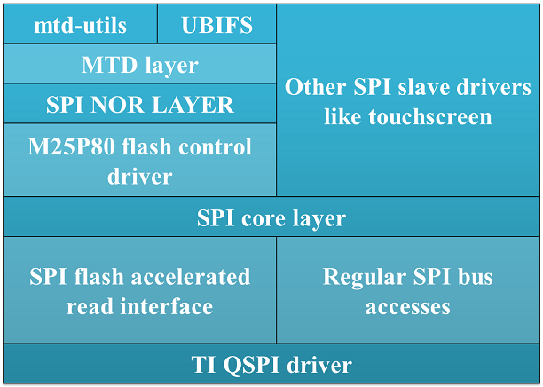
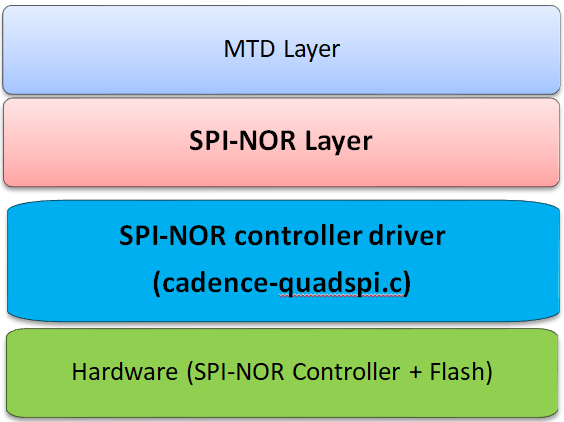

.. include:: /replacevars.rst.inc

OSPI/QSPI
---------------------------------

.. rubric:: Introduction
   :name: introduction-linux-qspi-ug

Octal Serial Peripheral Interface (OSPI) is a SPI module that has x8 IO
lines. Quad Serial Peripheral Interface (QSPI) has x4 IO lines. These
controllers are mainly used to interface with Octal or Quad SPI flashes. OSPI
is backward compatible with QSPI. These modules can also work in dual
(x2) and single (x1) modes.

OSPI and QSPI controllers on TI SoCs support memory mapped IO interfaces,
which provide a direct interface for accessing data from the external SPI
flash, thereby simplifying software requirements. These controllers work
only in master mode.

.. rubric:: Supported Devices
   :name: supported-devices-kernel-qspi

There are two variants of OSPI/QSPI controller IPs on various TI SoCs.
The table below provides a mapping of driver and capabilities for
different TI SoCs:

+---------------+-----------+--------------------------------------+
| SoC Family    | capability| Driver                               |
+===============+===========+======================================+
| AM437x        | QSPI      | drivers/spi/spi-ti-qspi.c            |
+---------------+-----------+--------------------------------------+
| DRA7xx/AM57xx | QSPI      | drivers/spi/spi-ti-qspi.c            |
+---------------+-----------+--------------------------------------+
| 66AK2Gx       | QSPI      | drivers/spi/spi-cadence-quadspi.c    |
+---------------+-----------+--------------------------------------+
| AM654/J721e   | 1x OSPI,  | drivers/spi/spi-cadence-quadspi.c    |
|               | 1x QSPI   |                                      |
+---------------+-----------+--------------------------------------+
| AM62x         | 1x OSPI,  | drivers/spi/cadence_qspi.c           |
|               | 1x QSPI   |                                      |
+---------------+-----------+--------------------------------------+

.. note::

    Not all OSPI flashes can be supported. Users are recommended to check
    whether or not the OSPI flash part chosen for custom board designs meets all
    the criteria listed at https://e2e.ti.com/support/processors/f/791/t/946418

.. rubric:: Driver Features

OSPI controllers support Double Data Rate (DDR) mode in Octal
configuration wherein data can be read on both edges of the clock.

.. rubric:: Memory mapped read support
   :name: memory-mapped-read-support

Once the controller is configured in memory map mode, the whole
flash memory is available as a memory region at SoC specific address.
This region can be accessed using normal memcpy() (or mem-to-mem dma
copy). Controller hardware will internally communicate with
SPI flash over SPI bus and get the requested data. This mode provides
the best throughput and is the default mode in the SDK.

.. rubric:: Supported SPI modes
   :name: supported-spi-modes

spi-ti-qspi.c driver supports all clock and polarity modes defined in
the table "SPI Clock Modes Definition" of particular SoC's TRM. But make
sure that the selected mode is supported by the clocking requirements of
the device as per the device's datasheet.

spi-cadence-quadspi.c driver supports standard SPI mode 0 only.

.. rubric:: DMA support
   :name: dma-support

Driver uses mem-to-mem DMA copy on top of OSPI/QSPI memory mapped port during
read from flash for maximum throughput and reduced CPU load.

.. rubric:: Driver Architecture
   :name: driver-architecture-kernel-qspi

Following diagram shows the QSPI driver stack:

    QSPI driver software stack

The QSPI driver can be used both to access SPI flash devices via mtd
subsystem or access generic SPI devices (like SPI touchscreen) via SPI
framework.

The OSPI driver stack is shown in the following diagram:

    OSPI driver software stack

OSPI does not support interfacing with non flash SPI slaves.

.. rubric:: Driver Configuration
   :name: driver-configuration-qspi

.. rubric:: Source Location
   :name: source-location-qspi

The source file for the QSPI driver can be found at: drivers/spi/spi-ti-qspi.c under Linux kernel source tree.

OSPI driver is at: drivers/spi/spi-cadence-quadspi.c under Linux kernel source tree.
This driver also supports QSPI version of the same IP.

.. rubric:: Kernel Configuration Options
   :name: kconfig-options-qspi

The driver can be built into the kernel or can be compiled as module and
loaded into the kernel dynamically.

.. rubric:: Enabling OSPI/QSPI Driver Configurations
   :name: enabling-qspi-driver-configurations

Following needs to be enabled to access OSPI/QSPI flash: TI QSPI controller
driver, Cadence OSPI controller driver, and SPI NOR framework in the kernel via
menuconfig.

.. note::
    OSPI/QSPI drivers and their dependencies are enabled by default in
    the SDK images. So this section can be skipped in that case.

Start the Linux Kernel Configuration tool:

::

        $ make menuconfig  ARCH=arm

To enable QSPI controller driver:

.. code-block:: text

              Device Drivers  --->
               [*] SPI support  --->
                 <*>   DRA7xxx QSPI controller support

To enable SPI NOR framework:

.. code-block:: text

              Device Drivers  --->
                <*> Memory Technology Device (MTD) support  --->
                  <*>   SPI-NOR device support  --->  

To enable spi-cadence-quadspi driver:

.. code-block:: text

              Device Drivers  --->
                [*] SPI support --->
                  <*>   Cadence Quad SPI controller

To enable them as modules, make <\*> as <M>.

Enabling UBIFS filesystem support:

.. code-block:: text

              File systems  --->
                [*] Miscellaneous filesystems  --->
                  <*>   UBIFS file system support

.. rubric:: DT Configuration
   :name: dt-configuration-kernel-qspi

Refer to Documentation/devicetree/bindings/spi/ti\_qspi.txt under
kernel source tree for spi-ti-qspi controller driver's DT bindings and
their usage.

For spi-cadence-quadspi controller refer to Documentation/devicetree/bindings/mtd/cadence-quadspi.txt
for DT bindings and their usage.

To configure OSPI/QSPI flash partitions and flash related DT bindings refer
to Documentation/devicetree/bindings/mtd/jedec,spi-nor.txt and
Documentation/devicetree/bindings/mtd/partition.txt.

.. rubric:: Driver Usage
   :name: driver-usage-qspi

.. note::
    Although OSPI and QSPI are different at hardware level, from
    Linux point of view, both OSPI and QSPI are managed in the same way and
    are exposed as /dev/mtdX devices to the user space. Therefore, there is
    virtually no difference to end user even though OSPI and QSPI use
    different drivers underneath. Therefore this section applies to both
    OSPI and QSPI.

.. ifconfig:: CONFIG_part_family in ('J7_family')

    .. note::
        On J721E EVM, switch SW3.1 should be in OFF position at the time
	of powering on the board to access OSPI flash.

Load QSPI or OSPI module as required using modprobe (this will take care
of dependencies and load those modules as well):

::

       $modprobe spi-ti-qspi
       $modprobe spi-cadence-quadspi

This should create /dev/mtdX entries for every partition defined in DT
or via command line arguments. MTD abstracts all types of flashes and,
therefore, both OSPI and QSPI appear as MTD devices. To see all MTD
partitions in the system run:

::

       $cat /proc/mtd

Here is an example output (name varies depending on what is passed in DT
or via command line arguments):

.. code-block:: text

        dev:    size   erasesize  name
        mtd0: 00080000 00010000 "QSPI.U_BOOT"
        mtd1: 00080000 00010000 "QSPI.U_BOOT.backup"
        mtd2: 00010000 00010000 "QSPI.U-BOOT-SPL_OS"
        mtd3: 00010000 00010000 "QSPI.U_BOOT_ENV"
        mtd4: 00010000 00010000 "QSPI.U-BOOT-ENV.backup"
        mtd5: 00800000 00010000 "QSPI.KERNEL"
        mtd6: 036d0000 00010000 "QSPI.FILESYSTEM"

.. _testing-kernel-qspi-label:

.. rubric:: Testing
   :name: testing-kernel-qspi

.. rubric:: Using mtd-utils
   :name: using-mtd-utils

::

         $ cat /proc/mtd       /* Should list QSPI partitions */
         $ flash_erase  /dev/mtd6 0 0  /* Erase entire /dev/mtd6 */
         $ dd if=/dev/random of=tmp_write.txt bs=1 count=num  /* num = bytes to write to flash */
         $ mtd_debug write /dev/mtd6 0 num tmp_write.txt  /* write to num bytes to flash */
         $ mtd_debug read /dev/mtd6 0 num tmp_read.txt /* /* read to num bytes to flash */
         $ diff tmp_read.txt tmp_write.txt /* should be NULL */

.. rubric:: Using dd command
   :name: using-dd-command

::

         $ cat /proc/mtd       /* Should list QSPI partitions */
         $ flash_erase  /dev/mtd6 0 0  /* Erase entire /dev/mtd6 */
         $ dd if=/dev/random of=tmp_write.txt bs=1 count=num  /* num = bytes to write to flash */
         $ dd if=tmp_write.txt of=/dev/mtd6 bs=num count=1 /* write to num bytes to flash */
         $ dd if=/dev/mtd6 of=tmp_read.txt bs=num count=1  /* read to num bytes to flash */
         $ diff tmp_read.txt tmp_write.txt /* should be NULL */

.. rubric:: Using UBIFS on flash
   :name: using-ubifs-on-flash

Make sure UBIFS filesystem is enabled in the kernel (refer to `this
section <#enabling-qspi-driver-configurations>`__ for more information).

::

         root~# ubiformat /dev/mtd9
         ubiformat: mtd9 (nor), size 23199744 bytes (22.1 MiB), 354 eraseblocks of 65536 bytes (64.0 KiB), min. I/O size 1 bytes
         libscan: scanning eraseblock 353 -- 100 % complete 
         ubiformat: 354 eraseblocks are supposedly empty
         ubiformat: formatting eraseblock 353 -- 100 % complete 
         root:~# ubiattach -p /dev/mtd9
         [  270.874428] ubi0: attaching mtd9
         [  270.914131] ubi0: scanning is finished
         [  270.921788] ubi0: attached mtd9 (name "QSPI.file-system", size 22 MiB)
         [  270.928405] ubi0: PEB size: 65536 bytes (64 KiB), LEB size: 65408 bytes
         [  270.935210] ubi0: min./max. I/O unit sizes: 1/256, sub-page size 1
         [  270.941491] ubi0: VID header offset: 64 (aligned 64), data offset: 128
         [  270.948102] ubi0: good PEBs: 354, bad PEBs: 0, corrupted PEBs: 0
         [  270.954215] ubi0: user volume: 0, internal volumes: 1, max. volumes count: 128
         [  270.961602] ubi0: max/mean erase counter: 0/0, WL threshold: 4096, image sequence number: 2077421476
         [  270.970887] ubi0: available PEBs: 350, total reserved PEBs: 4, PEBs reserved for bad PEB handling: 0
         [  270.980204] ubi0: background thread "ubi_bgt0d" started, PID 863
         UBI device number 0, total 354 LEBs (23154432 bytes, 22.1 MiB), available 350 LEBs (22892800 bytes, 21.8 MiB), LEB size 65408 bytes (63.9 KiB)
         root:~# ubimkvol /dev/ubi0 -N flash_fs -s 20MiB
         Volume ID 0, size 321 LEBs (20995968 bytes, 20.0 MiB), LEB size 65408 bytes (63.9 KiB), dynamic, name "flash_fs", alignment 1
         root:~# mkdir /mnt/flash
         root:~# mount -t ubifs ubi0:flash_fs /mnt/flash/   
         [  326.002602] UBIFS (ubi0:0): default file-system created
         [  326.008309] UBIFS (ubi0:0): background thread "ubifs_bgt0_0" started, PID 866
         [  326.027530] UBIFS (ubi0:0): UBIFS: mounted UBI device 0, volume 0, name "flash_fs"
         [  326.035157] UBIFS (ubi0:0): LEB size: 65408 bytes (63 KiB), min./max. I/O unit sizes: 8 bytes/256 bytes
         [  326.044615] UBIFS (ubi0:0): FS size: 20341888 bytes (19 MiB, 311 LEBs), journal size 1046528 bytes (0 MiB, 16 LEBs)
         [  326.055123] UBIFS (ubi0:0): reserved for root: 960797 bytes (938 KiB)
         [  326.061610] UBIFS (ubi0:0): media format: w4/r0 (latest is w4/r0), UUID 828AA98E-3A51-4B35-AD50-9E90144AD4C7, small LPT model
         root:~#

Now you can access filesystem at /mnt/flash/.

.. ifconfig:: CONFIG_part_family in ('J7_family')

    .. rubric:: Using Cypress S28HS512TGABHM010 flash on J721E
       :name: using-cypress-s28-on-j721e

    J721E by default comes with with the Micron MT35XU512ABA1G12-0AAT flash. But the
    Cypress S28HS512TGABHM010 flash can be used with it with some slight
    modifications to the device tree properties. The below patch should allow using
    the flash on J721E. Note that applying it will likely make the Micron flash unusable.

    ::

             diff --git a/arch/arm64/boot/dts/ti/k3-j721e-som-p0.dtsi b/arch/arm64/boot/dts/ti/k3-j721e-som-p0.dtsi
             index 90bcc6be3834..7c43b56cf849 100644
             --- a/arch/arm64/boot/dts/ti/k3-j721e-som-p0.dtsi
             +++ b/arch/arm64/boot/dts/ti/k3-j721e-som-p0.dtsi
             @@ -181,13 +181,13 @@
              		cdns,tsd2d-ns = <60>;
              		cdns,tchsh-ns = <60>;
              		cdns,tslch-ns = <60>;
             -		cdns,read-delay = <0>;
             +		cdns,read-delay = <4>;
              		cdns,phy-mode;
              		#address-cells = <1>;
              		#size-cells = <1>;
             -		partition@3fe0000 {
             +		partition@3fc0000 {
              			label = "ospi.phypattern";
             -			reg = <0x3fe0000 0x20000>;
             +			reg = <0x3fc0000 0x40000>;
              		};
              	};
              };

    .. rubric:: Using Micron MT35XU512ABA1G12-0AAT flash on J7200
       :name: using-micron-mt35-on-j7200

    J7200 by default comes with with the Cypress S28HS512TGABHM010 flash. But the
    Micron MT35XU512ABA1G12-0AAT flash can be used with it with some slight
    modifications to the device tree properties. The below patch should allow using
    the flash on J7200. Note that applying it will likely make the Cypress flash
    unusable.

    ::

             diff --git a/arch/arm64/boot/dts/ti/k3-j7200-som-p0.dtsi b/arch/arm64/boot/dts/ti/k3-j7200-som-p0.dtsi
             index df8d9e2ad3dd..8decb9c0de9a 100644
             --- a/arch/arm64/boot/dts/ti/k3-j7200-som-p0.dtsi
             +++ b/arch/arm64/boot/dts/ti/k3-j7200-som-p0.dtsi
             @@ -168,13 +168,13 @@
              		cdns,tsd2d-ns = <60>;
              		cdns,tchsh-ns = <60>;
              		cdns,tslch-ns = <60>;
             -		cdns,read-delay = <4>;
             +		cdns,read-delay = <0>;
              		cdns,phy-mode;
              		#address-cells = <1>;
              		#size-cells = <1>;
             -		partition@3fc0000 {
             +		partition@3fe0000 {
              			label = "ospi.phypattern";
             -			reg = <0x3fc0000 0x40000>;
             +			reg = <0x3fe0000 0x20000>;
              		};
              	};
              };

.. ifconfig:: CONFIG_part_family in ('AM62X_family')

    .. rubric:: Using Micron MT35XU512ABA1G12-0AAT flash on AM62x

    AM62x Starter Kit (SK) by default comes with with the Cypress S28HS512TGABHM010 flash. But the
    Micron MT35XU512ABA1G12-0AAT flash can be used with it with some slight
    modifications to the device tree properties. The patch below should allow using
    the flash on AM62x SK. Note that applying it will likely make the Cypress flash unusable.

    ::

             diff --git a/arch/arm64/boot/dts/ti/k3-am625-sk.dts b/arch/arm64/boot/dts/ti/k3-am625-sk.dts
             index 618e1efb7344..0fe52818f16b 100644
             --- a/arch/arm64/boot/dts/ti/k3-am625-sk.dts
             +++ b/arch/arm64/boot/dts/ti/k3-am625-sk.dts
             @@ -763,7 +763,7 @@ flash@0{
                             cdns,tsd2d-ns = <60>;
                             cdns,tchsh-ns = <60>;
                             cdns,tslch-ns = <60>;
             -               cdns,read-delay = <4>;
             +               cdns,read-delay = <0>;
                             cdns,phy-mode;
 
                             partitions {
             @@ -801,9 +801,9 @@ partition@800000 {
                                             reg = <0x800000 0x37c0000>;
                                     };
 
             -                       partition@3fc0000 {
             +                       partition@3fe0000 {
                                             label = "ospi.phypattern";
             -                               reg = <0x3fc0000 0x40000>;
             +                               reg = <0x3fe0000 0x20000>;
                                     };
                              };
                     };
