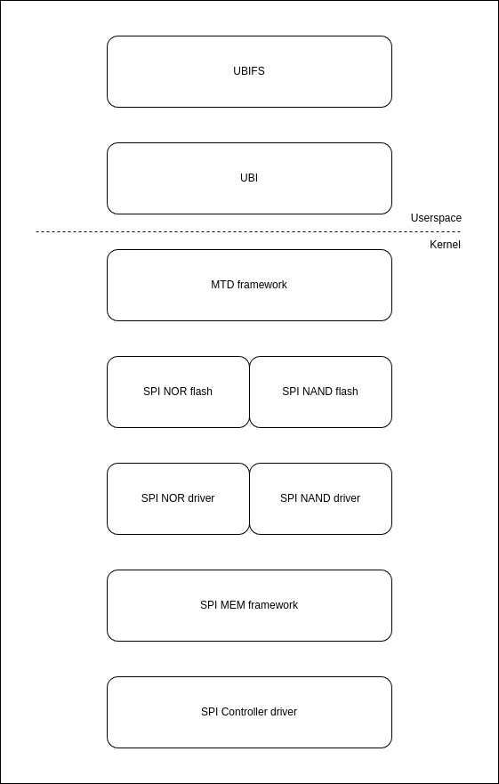

OSPI/QSPI NOR/NAND
------------------

.. rubric:: Introduction
   :name: introduction-linux-qspi-ug

Octal Serial Peripheral Interface (OSPI) and Quad Serial Peripheral Interface
(QSPI) are SPI modules that have x8 IO lines and x4 IO lines respectively.
These controllers are mainly used to interface with Octal and Quad SPI flashes.
OSPI is backward compatible with QSPI. These modules can also work in dual (x2)
and single (x1) modes. OSPI and QSPI controllers on TI SoCs support memory
mapped IO interfaces, which provide a direct interface for accessing data from
the external SPI flash, thereby simplifying software requirements. These
controllers work only in master mode.

.. ifconfig:: CONFIG_part_variant in ('AM64X')

   +------------+------------+-------------------------------------------+
   | SoC Family | Capability | Driver                                    |
   +============+============+===========================================+
   | AM64x      | OSPI NOR   | :file:`drivers/spi/spi-cadence-quadspi.c` |
   +------------+------------+-------------------------------------------+

.. ifconfig:: CONFIG_part_variant in ('AM62X')

   +-------------+------------+-------------------------------------------+
   | SoC Family  | Capability | Driver                                    |
   +=============+============+===========================================+
   | AM62x SK    | OSPI NOR   | :file:`drivers/spi/spi-cadence-quadspi.c` |
   +-------------+------------+-------------------------------------------+
   | AM62x LP SK | OSPI NAND  | :file:`drivers/spi/spi-cadence-quadspi.c` |
   +-------------+------------+-------------------------------------------+

.. ifconfig:: CONFIG_part_variant in ('AM62AX')

   +------------+------------+-------------------------------------------+
   | SoC Family | Capability | Driver                                    |
   +============+============+===========================================+
   | AM62Ax     | OSPI NAND  | :file:`drivers/spi/spi-cadence-quadspi.c` |
   +------------+------------+-------------------------------------------+

.. ifconfig:: CONFIG_part_variant in ('AM62PX', 'J7200')

   +--------------+------------+-------------------------------------------+
   | SoC Family   | Capability | Driver                                    |
   +==============+============+===========================================+
   | AM62Px/J7200 | OSPI NOR   | :file:`drivers/spi/spi-cadence-quadspi.c` |
   +--------------+------------+-------------------------------------------+

.. ifconfig:: CONFIG_part_variant in ('AM437X')

   +------------+------------+-----------------------------------+
   | SoC Family | Capability | Driver                            |
   +============+============+===================================+
   | AM437x     | QSPI NOR   | :file:`drivers/spi/spi-ti-qspi.c` |
   +------------+------------+-----------------------------------+

.. ifconfig:: CONFIG_part_variant in ('AM57X')

   +---------------+------------+-----------------------------------+
   | SoC Family    | Capability | Driver                            |
   +===============+============+===================================+
   | DRA7xx/AM57xx | QSPI NOR   | :file:`drivers/spi/spi-ti-qspi.c` |
   +---------------+------------+-----------------------------------+

.. ifconfig:: CONFIG_part_variant in ('J721E')

   +-------------+--------------+-------------------------------------------+
   | SoC Family  | Capability   | Driver                                    |
   +=============+==============+===========================================+
   | AM654/J721e | 1x QSPI NOR, | :file:`drivers/spi/spi-cadence-quadspi.c` |
   |             | 1x OSPI NOR  |                                           |
   +-------------+--------------+-------------------------------------------+

.. ifconfig:: CONFIG_part_variant in ('J722S')

   +------------+--------------+-------------------------------------------+
   | SoC Family | Capability   | Driver                                    |
   +============+==============+===========================================+
   |            | 1x OSPI NOR  | :file:`drivers/spi/spi-cadence-quadspi.c` |
   + J722S      +--------------+-------------------------------------------+
   |            | 1x OSPI NAND | :file:`drivers/spi/spi-cadence-quadspi.c` |
   +------------+--------------+-------------------------------------------+

.. ifconfig:: CONFIG_part_variant in ('J721S2', 'J784S4','J742S2')

   +---------------+--------------+-------------------------------------------+
   | SoC Family    | Capability   | Driver                                    |
   +===============+==============+===========================================+
   |               | 1x QSPI NOR, | :file:`drivers/spi/spi-cadence-quadspi.c` |
   | J721S2/J784S4 | 1x OSPI NOR  |                                           |
   +               +--------------+-------------------------------------------+
   |               | 1x OSPI NAND | :file:`drivers/spi/spi-cadence-quadspi.c` |
   +---------------+--------------+-------------------------------------------+

.. note::

   Not all OSPI flashes can be supported. Users are recommended to check
   whether or not the OSPI flash part chosen for custom board designs meets all
   the criteria listed at https://e2e.ti.com/support/processors/f/791/t/946418

.. rubric:: Driver Features

OSPI controllers supports Double Data Rate (DDR) mode for OSPI/QSPI NOR flashes
in Octal configuration wherein data can be read on both edges of the clock, and
Single Data Rate (SDR) mode for OSPI/QSPI NAND flashes in Quad and Octal
configuration.

.. rubric:: Memory mapped read support
   :name: memory-mapped-read-support

Once the controller is configured in memory map mode, the whole
flash memory is made available as a memory region at an SoC specific address.
This region can be accessed using normal memcpy() (or mem-to-mem dma
copy). Controller hardware will internally communicate with
SPI flash over SPI bus and get the requested data. This mode provides
the best throughput and is the default mode in the SDK.

.. rubric:: Supported SPI modes
   :name: supported-spi-modes

.. ifconfig:: CONFIG_part_variant in ('AM437X', 'AM57X')

   :file:`spi-ti-qspi.c` driver supports all clock and polarity modes defined
   in the table "SPI Clock Modes Definition" of particular SoC's TRM. But make
   sure that the selected mode is supported by the clocking requirements of
   the device as per the device's datasheet.

The :file:`spi-cadence-quadspi.c` driver supports standard SPI mode 0 only.

.. rubric:: DMA support
   :name: dma-support

The driver uses mem-to-mem DMA copy on top of an OSPI/QSPI memory mapped port
during flash read operations for maximum throughput and reduced CPU load.

.. rubric:: Driver Architecture
   :name: driver-architecture-kernel-qspi

   OSPI/QSPI NOR/NAND software stack

The OSPI Controller does not support interfacing with non-flash SPI slaves.

.. rubric:: Driver Configuration
   :name: driver-configuration-qspi

.. rubric:: Source Location
   :name: source-location-qspi

.. ifconfig:: CONFIG_part_variant in ('AM437X', 'AM57X')

   The source file for the QSPI driver can be found at:
   :file:`drivers/spi/spi-ti-qspi.c` under Linux kernel source tree.

OSPI driver is at: :file:`drivers/spi/spi-cadence-quadspi.c` under Linux kernel
source tree. This driver also supports QSPI version of the same IP.

.. rubric:: Kernel Configuration Options
   :name: kconfig-options-qspi

The driver can be built into the kernel or can be compiled as module and
loaded into the kernel dynamically.

.. rubric:: Enabling OSPI/QSPI Driver Configurations
   :name: enabling-qspi-driver-configurations

Following needs to be enabled to access OSPI/QSPI flash: TI QSPI controller
driver, Cadence OSPI controller driver, SPI NOR framework, and/or SPI NAND
framework in the kernel via menuconfig.

.. note::
   OSPI/QSPI drivers and their dependencies are enabled by default in
   the SDK images. So this section can be skipped in that case.

Start the Linux Kernel Configuration tool:

.. code-block:: console

   $ make menuconfig ARCH=<architecture_name>

To enable QSPI controller driver:

.. code-block:: menuconfig

   Device Drivers  --->
   [*] SPI support  --->
      <*>   DRA7xxx QSPI controller support

To enable SPI NOR framework:

.. code-block:: menuconfig

   Device Drivers  --->
      <*> Memory Technology Device (MTD) support  --->
      <*>   SPI-NOR device support  --->

To enable SPI NAND framework:

.. code-block:: menuconfig

   Device Drivers  --->
      <*> Memory Technology Device (MTD) support  --->
      <*>   NAND  --->
         <*>   SPI NAND device Support  --->

To enable spi-cadence-quadspi driver:

.. code-block:: menuconfig

   Device Drivers  --->
      [*] SPI support --->
      <*>   Cadence Quad SPI controller

To enable them as modules, make <\*> as <M>.

Enabling UBIFS filesystem support:

.. code-block:: menuconfig

   File systems  --->
      [*] Miscellaneous filesystems  --->
      <*>   UBIFS file system support

.. rubric:: DT Configuration
   :name: dt-configuration-kernel-qspi

.. ifconfig:: CONFIG_part_variant in ('AM437X', 'AM57X')

   Refer to :file:`Documentation/devicetree/bindings/spi/ti\_qspi.txt` under
   kernel source tree for spi-ti-qspi controller driver's DT bindings and
   their usage.

For spi-cadence-quadspi controller refer to
:file:`Documentation/devicetree/bindings/spi/cdns,qspi-nor.yaml` for DT
bindings and their usage.

To configure OSPI/QSPI NOR/NAND flash partitions and flash related DT bindings
refer to :file:`Documentation/devicetree/bindings/mtd/jedec,spi-nor.yaml`,
:file:`Documentation/devicetree/bindings/mtd/spi-nand.yaml` and
:file:`Documentation/devicetree/bindings/mtd/partitions/partition.yaml`.

.. ifconfig:: CONFIG_part_variant in ('AM64X', 'AM62X', 'AM62PX', 'J7200', 'J721E', 'J722S', 'J721S2', 'J784S4','J742S2')

   The following is an example device-tree node for an OSPI NOR device

   .. code-block:: dts

      &ospi0 {

         flash@0{
            compatible = "jedec,spi-nor";
            reg = <0x0>;
            spi-tx-bus-width = <8>;
            spi-rx-bus-width = <8>;
            spi-max-frequency = <25000000>;
            cdns,tshsl-ns = <60>;
            cdns,tsd2d-ns = <60>;
            cdns,tchsh-ns = <60>;
            cdns,tslch-ns = <60>;
            cdns,read-delay = <4>;

            partitions {
               compatible = "fixed-partitions";
               #address-cells = <1>;
               #size-cells = <1>;
               bootph-all;

               partition@0 {
                  label = "ospi.tiboot3";
                  reg = <0x00 0x80000>;
               };

               partition@80000 {
                  label = "ospi.tispl";
                  reg = <0x80000 0x200000>;
               };

               // other partitions
            };
         };
      };

.. ifconfig:: CONFIG_part_variant in ('AM62X', 'AM62AX', 'J722S', 'J721S2', 'J784S4','J742S2')

   The following is an example device-tree node for an OSPI NAND device

   .. code-block:: dts

      &ospi0 {

         flash@0 {
            compatible = "spi-nand";
            reg = <0x0>;
            spi-tx-bus-width = <8>;
            spi-rx-bus-width = <8>;
            spi-max-frequency = <25000000>;
            cdns,tshsl-ns = <60>;
            cdns,tsd2d-ns = <60>;
            cdns,tchsh-ns = <60>;
            cdns,tslch-ns = <60>;
            cdns,read-delay = <2>;

            partitions {
               compatible = "fixed-partitions";
               #address-cells = <1>;
               #size-cells = <1>;

               partition@0 {
                  label = "ospi_nand.tiboot3";
                  reg = <0x0 0x80000>;
               };

               partition@80000 {
                  label = "ospi_nand.tispl";
                  reg = <0x80000 0x200000>;
               };

               // other partitions
            };
         };
      };

Flash properties:

1. **compatible:** specifies the compatible string for the device, the
   operating system uses this string to identify and the match the driver for
   the device. Use 'jedec,spi-nor' for OSPI/QSPI NOR flashes and 'spi-nand' for
   OSPI/QSPI NAND flashes.

2. **spi-tx-bus-width and spi-rx-bus-width:** specifies the bus width in bits
   for SPI transactions when transmitting (tx) and receiving (rx) data. Set for
   '8' for OSPI flashes and '4' for QSPI flashes.

3. **spi-max-frequency:** defines the maximum frequency in Hertz at which the
   SPI bus can operate. Set 1/4th or 1/8th of 'assigned-clocks' value of
   'ospi0' node for SDR and DDR mode respectively.

4. **cdns,read-delay:** specifies the delay in clock cycles between the fetch
   of a command and responding to that command by the flash devices. This
   differs with flashes, try with different read delays starting from 0 and
   find the minimum read-delay at which the flash driver probes correctly.

.. rubric:: Driver Usage
   :name: driver-usage-qspi

.. note::

   Although OSPI/QSPI NOR/NAND are different at hardware level, from
   Linux point of view, they are managed in the same way and are exposed as
   /dev/mtdX devices to the user space. Therefore, there is virtually no
   difference to end user even though OSPI/QSPI NOR/NAND use different drivers
   underneath. Therefore this section applies to both OSPI/QSPI NOR/NAND.

.. ifconfig:: CONFIG_part_family in ('J7_family')

   .. important::

      On J721E EVM, switch SW3.1 should be in OFF position at the time
      of powering on the board to access OSPI flash.

Load UBI module for using ubi commands:

.. code-block:: console

   $ modprobe ubi

This should create /dev/mtdX entries for every partition defined in DT
or via command line arguments. MTD abstracts all types of flashes and,
therefore, both OSPI/QSPI NOR/NAND appear as MTD devices. To see all MTD
partitions in the system run:

.. code-block:: console

   $ cat /proc/mtd

Here is an example output (name varies depending on what is passed in DT
or via command line arguments):

.. code-block:: text

   dev:    size   erasesize  name
   mtd0: 00080000 00010000 "QSPI.U_BOOT"
   mtd1: 00080000 00010000 "QSPI.U_BOOT.backup"
   mtd2: 00010000 00010000 "QSPI.U-BOOT-SPL_OS"
   mtd3: 00010000 00010000 "QSPI.U_BOOT_ENV"
   mtd4: 00010000 00010000 "QSPI.U-BOOT-ENV.backup"
   mtd5: 00800000 00010000 "QSPI.KERNEL"
   mtd6: 036d0000 00010000 "QSPI.FILESYSTEM"

.. _testing-kernel-qspi-label:

.. rubric:: Testing
   :name: testing-kernel-qspi

.. rubric:: Using mtd-utils
   :name: using-mtd-utils

.. code-block:: console

   $ cat /proc/mtd # Should list OSPI/QSPI partitions
   $ flash_erase  /dev/mtd6 0 0 # Erase entire /dev/mtd6
   $ dd if=/dev/random of=tmp_write.txt bs=1 count=num # num = bytes to write to flash
   $ mtd_debug write /dev/mtd6 0 num tmp_write.txt # write to num bytes to flash
   $ mtd_debug read /dev/mtd6 0 num tmp_read.txt # read to num bytes to flash
   $ diff tmp_read.txt tmp_write.txt # should be NULL

.. rubric:: Using dd command
   :name: using-dd-command

.. code-block:: console

   $ cat /proc/mtd # Should list OSPI/QSPI partitions
   $ flash_erase  /dev/mtd6 0 0 # Erase entire /dev/mtd6
   $ dd if=/dev/random of=tmp_write.txt bs=1 count=num # num = bytes to write to flash
   $ dd if=tmp_write.txt of=/dev/mtd6 bs=num count=1 # write to num bytes to flash
   $ dd if=/dev/mtd6 of=tmp_read.txt bs=num count=1 # read to num bytes to flash
   $ diff tmp_read.txt tmp_write.txt # should be NULL

.. rubric:: Using UBIFS on flash
   :name: using-ubifs-on-flash

Make sure UBIFS filesystem is enabled in the kernel (refer to `this
section <#enabling-qspi-driver-configurations>`__ for more information).

.. code-block:: console

   root~# ubiformat /dev/mtd9
   ubiformat: mtd9 (nor), size 23199744 bytes (22.1 MiB), 354 eraseblocks of 65536 bytes (64.0 KiB), min. I/O size 1 bytes
   libscan: scanning eraseblock 353 -- 100 % complete
   ubiformat: 354 eraseblocks are supposedly empty
   ubiformat: formatting eraseblock 353 -- 100 % complete
   root:~# ubiattach -p /dev/mtd9
   [  270.874428] ubi0: attaching mtd9
   [  270.914131] ubi0: scanning is finished
   [  270.921788] ubi0: attached mtd9 (name "QSPI.file-system", size 22 MiB)
   [  270.928405] ubi0: PEB size: 65536 bytes (64 KiB), LEB size: 65408 bytes
   [  270.935210] ubi0: min./max. I/O unit sizes: 1/256, sub-page size 1
   [  270.941491] ubi0: VID header offset: 64 (aligned 64), data offset: 128
   [  270.948102] ubi0: good PEBs: 354, bad PEBs: 0, corrupted PEBs: 0
   [  270.954215] ubi0: user volume: 0, internal volumes: 1, max. volumes count: 128
   [  270.961602] ubi0: max/mean erase counter: 0/0, WL threshold: 4096, image sequence number: 2077421476
   [  270.970887] ubi0: available PEBs: 350, total reserved PEBs: 4, PEBs reserved for bad PEB handling: 0
   [  270.980204] ubi0: background thread "ubi_bgt0d" started, PID 863
   UBI device number 0, total 354 LEBs (23154432 bytes, 22.1 MiB), available 350 LEBs (22892800 bytes, 21.8 MiB), LEB size 65408 bytes (63.9 KiB)
   root:~# ubimkvol /dev/ubi0 -N flash_fs -s 20MiB
   Volume ID 0, size 321 LEBs (20995968 bytes, 20.0 MiB), LEB size 65408 bytes (63.9 KiB), dynamic, name "flash_fs", alignment 1
   root:~# mkdir /mnt/flash
   root:~# mount -t ubifs ubi0:flash_fs /mnt/flash/
   [  326.002602] UBIFS (ubi0:0): default file-system created
   [  326.008309] UBIFS (ubi0:0): background thread "ubifs_bgt0_0" started, PID 866
   [  326.027530] UBIFS (ubi0:0): UBIFS: mounted UBI device 0, volume 0, name "flash_fs"
   [  326.035157] UBIFS (ubi0:0): LEB size: 65408 bytes (63 KiB), min./max. I/O unit sizes: 8 bytes/256 bytes
   [  326.044615] UBIFS (ubi0:0): FS size: 20341888 bytes (19 MiB, 311 LEBs), journal size 1046528 bytes (0 MiB, 16 LEBs)
   [  326.055123] UBIFS (ubi0:0): reserved for root: 960797 bytes (938 KiB)
   [  326.061610] UBIFS (ubi0:0): media format: w4/r0 (latest is w4/r0), UUID 828AA98E-3A51-4B35-AD50-9E90144AD4C7, small LPT model
   root:~#

Now you can access filesystem at :file:`/mnt/flash/`.

.. ifconfig:: CONFIG_part_family in ('J7_family')

   .. rubric:: Using Cypress S28HS512TGABHM010 flash on J721E
      :name: using-cypress-s28-on-j721e

   J721E by default comes with the Micron MT35XU512ABA1G12-0AAT flash. But the
   Cypress S28HS512TGABHM010 flash can also be used with some slight
   modifications to the device tree properties. The below patch should allow
   using the flash on J721E. Note that applying it will likely make the Micron
   flash unusable.

   .. code-block:: diff

      diff --git a/arch/arm64/boot/dts/ti/k3-j721e-som-p0.dtsi b/arch/arm64/boot/dts/ti/k3-j721e-som-p0.dtsi
      index c16facf3d33d..9e50e40b453d 100644
      --- a/arch/arm64/boot/dts/ti/k3-j721e-som-p0.dtsi
      +++ b/arch/arm64/boot/dts/ti/k3-j721e-som-p0.dtsi
      @@ -385,7 +385,7 @@ flash@0 {
                     cdns,tsd2d-ns = <60>;
                     cdns,tchsh-ns = <60>;
                     cdns,tslch-ns = <60>;
      -              cdns,read-delay = <0>;
      +              cdns,read-delay = <4>;

                     partitions {
                              compatible = "fixed-partitions";
      @@ -427,9 +427,9 @@ partition@800000 {
                                    reg = <0x800000 0x37c0000>;
                              };

      -                       partition@3fe0000 {
      +                       partition@3fc0000 {
                                    label = "ospi.phypattern";
      -                             reg = <0x3fe0000 0x20000>;
      +                             reg = <0x3fc0000 0x40000>;
                              };
                     };
            };

   .. rubric:: Using Micron MT35XU512ABA1G12-0AAT flash on J7200
      :name: using-micron-mt35-on-j7200

   J7200 by default comes with with the Cypress S28HS512TGABHM010 flash. But
   the Micron MT35XU512ABA1G12-0AAT flash can be used with it with some slight
   modifications to the device tree properties. The below patch should allow
   using the flash on J7200. Note that applying it will likely make the
   Cypress flash unusable.

   .. code-block:: diff

      diff --git a/arch/arm64/boot/dts/ti/k3-j7200-som-p0.dtsi b/arch/arm64/boot/dts/ti/k3-j7200-som-p0.dtsi
      index 0e7b52a89177..4f752d9f7d28 100644
      --- a/arch/arm64/boot/dts/ti/k3-j7200-som-p0.dtsi
      +++ b/arch/arm64/boot/dts/ti/k3-j7200-som-p0.dtsi
      @@ -463,7 +463,7 @@ flash@0 {
                     cdns,tsd2d-ns = <60>;
                     cdns,tchsh-ns = <60>;
                     cdns,tslch-ns = <60>;
      -              cdns,read-delay = <4>;
      +              cdns,read-delay = <0>;

                     partitions {
                              compatible = "fixed-partitions";
      @@ -500,9 +500,9 @@ partition@800000 {
                                    reg = <0x800000 0x37c0000>;
                              };

      -                       partition@3fc0000 {
      +                       partition@3fe0000 {
                                    label = "ospi.phypattern";
      -                             reg = <0x3fc0000 0x40000>;
      +                             reg = <0x3fe0000 0x20000>;
                              };
                     };
            };

.. ifconfig:: CONFIG_part_family in ('AM62X_family', 'AM62PX_family')

   .. rubric:: Using Micron MT35XU512ABA1G12-0AAT flash on AM62x and AM62P

   The AM62x and AM62P-LP Starter Kits (SK) by default come with the Cypress
   S28HS512TGABHM010 flash. But the Micron MT35XU512ABA1G12-0AAT flash can
   also be used with some slight modifications to the device tree properties.
   The patch below should allow to use the Micron flash. Note that applying it
   will likely make the Cypress flash unusable.

   .. code-block:: diff

      diff --git a/arch/arm64/boot/dts/ti/k3-am625-sk.dts b/arch/arm64/boot/dts/ti/k3-am625-sk.dts
      index f353db3664ac..bb2ef6a88455 100644
      --- a/arch/arm64/boot/dts/ti/k3-am625-sk.dts
      +++ b/arch/arm64/boot/dts/ti/k3-am625-sk.dts
      @@ -253,7 +253,7 @@ flash@0 {
                     cdns,tsd2d-ns = <60>;
                     cdns,tchsh-ns = <60>;
                     cdns,tslch-ns = <60>;
      -              cdns,read-delay = <4>;
      +              cdns,read-delay = <0>;

                     partitions {
                              bootph-all;
      @@ -291,10 +291,10 @@ partition@800000 {
                                    reg = <0x800000 0x37c0000>;
                              };

      -                       partition@3fc0000 {
      +                       partition@3fe0000 {
                                    bootph-pre-ram;
                                    label = "ospi.phypattern";
      -                             reg = <0x3fc0000 0x40000>;
      +                             reg = <0x3fe0000 0x20000>;
                              };
                     };
            };

.. rubric:: Runtime Power Management

The OSPI Controller supports runtime power management where it can suspend
when there is no activity concerning the OSPI peripheral.

It suspends after a certain period of inactivity based on the value of
``CQSPI_AUTOSUSPEND_TIMEOUT`` which is set to 2000 ms in it's driver :file:`spi-cadence-quadspi.c`

.. ifconfig:: CONFIG_part_family in ('J7_family')

   .. code-block:: console

      root@j784s4-evm:~# head /sys/bus/platform/devices/47040000.spi/power/*
      ==> /sys/bus/platform/devices/47040000.spi/power/autosuspend_delay_ms <==
      2000

      ==> /sys/bus/platform/devices/47040000.spi/power/control <==
      auto

      ==> /sys/bus/platform/devices/47040000.spi/power/runtime_active_time <==
      4781

      ==> /sys/bus/platform/devices/47040000.spi/power/runtime_status <==
      suspended

      ==> /sys/bus/platform/devices/47040000.spi/power/runtime_suspended_time <==
      1189722715

   To increase the auto suspend delay value, one can write into the autosuspend_delay_ms
   sysfs entry like below,

   .. code-block:: console

      echo <delay> > /sys/bus/platform/devices/47040000.spi/power/autosuspend_delay_ms

.. ifconfig:: CONFIG_part_variant in ('AM64X', 'AM62X', 'AM62AX', 'AM62PX')

   .. code-block:: console

      root@am62xx-evm:~# head /sys/bus/platform/devices/fc40000.spi/power/*
      ==> /sys/bus/platform/devices/fc40000.spi/power/autosuspend_delay_ms <==
      2000

      ==> /sys/bus/platform/devices/fc40000.spi/power/control <==
      auto

      ==> /sys/bus/platform/devices/fc40000.spi/power/runtime_active_time <==
      5808

      ==> /sys/bus/platform/devices/fc40000.spi/power/runtime_status <==
      suspended

      ==> /sys/bus/platform/devices/fc40000.spi/power/runtime_suspended_time <==
      112684

   To increase the auto suspend delay value, one can write into the autosuspend_delay_ms
   sysfs entry like below,

   .. code-block:: console

      echo <delay> > /sys/bus/platform/devices/fc40000.spi/power/autosuspend_delay_ms

One can verify that OSPI has actually suspended by also looking at the
k3conf output as shown below.

.. ifconfig:: CONFIG_part_family in ('J7_family')

   .. code-block:: console

      root@j784s4-evm:~# k3conf dump device 161
      |-------------------------------------------------------------------------------|
      | VERSION INFO                                                                  |
      |-------------------------------------------------------------------------------|
      | K3CONF | (version 0.3-nogit built Thu Jul 25 14:13:02 UTC 2024)               |
      | SoC    | J784S4 SR1.0                                                         |
      | SYSFW  | ABI: 4.0 (firmware version 0x000a '10.0.8--v10.00.08 (Fiery Fox))')  |
      |-------------------------------------------------------------------------------|

      |----------------------------------------------------------|
      | Device ID | Device Name                | Device Status   |
      |----------------------------------------------------------|
      |   161     | J784S4_DEV_MCU_FSS0_OSPI_0 | DEVICE_STATE_OFF|
      |----------------------------------------------------------|

.. ifconfig:: CONFIG_part_variant in ('AM64X', 'AM62X', 'AM62AX', 'AM62PX')

   .. code-block:: console

      root@am62xx-evm:~# k3conf dump device 75
      |------------------------------------------------------------------------------|
      | VERSION INFO                                                                 |
      |------------------------------------------------------------------------------|
      | K3CONF | (version 0.3-nogit built Thu Jul 25 14:13:02 UTC 2024)              |
      | SoC    | AM62X SR1.0                                                         |
      | SYSFW  | ABI: 4.0 (firmware version 0x000a '10.0.8--v10.00.08 (Fiery Fox))') |
      |------------------------------------------------------------------------------|

      |------------------------------------------------------|
      | Device ID | Device Name           | Device Status    |
      |------------------------------------------------------|
      |    75     | AM62X_DEV_FSS0_OSPI_0 | DEVICE_STATE_OFF |
      |------------------------------------------------------|

This shows that the OSPI controller is physically turned off and
thus no longer contributing to active power consumed by the system.

When a transaction is initiated from userspace or otherwise, the driver resumes
the OSPI controller automatically.
