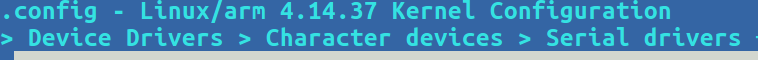
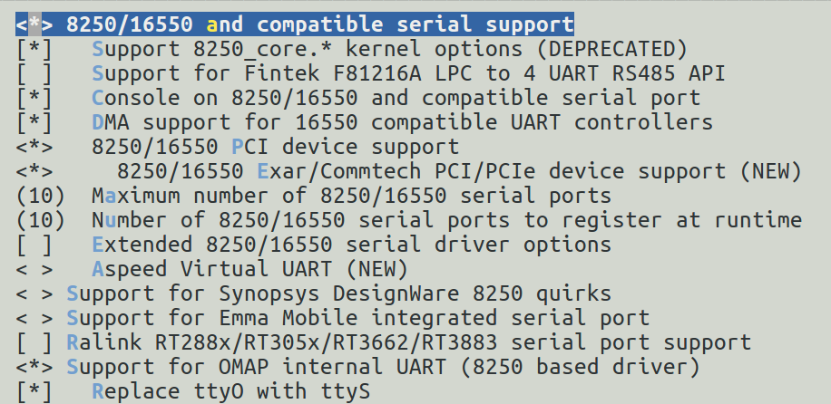

.. include:: /replacevars.rst.inc

UART
---------------------------------

Introduction
^^^^^^^^^^^^^^^^^^^^^^^^^^^^^^^^^

This guide covers 8250 OMAP serial driver found at
drivers/tty/serial/8250/8250_omap.c. It supports UART IP found on
TI's |__PART_FAMILY_NAME__| SoCs. These SoCs have
8250 compliant UART IPs and hence use common 8250 serial driver
framework support of Linux kernel.

This documentation applies to Kernel v4.14 and higher.

.. rubric:: Suppported Devices

• |__PART_FAMILY_DEVICE_NAMES__|

Driver Features
^^^^^^^^^^^^^^^^^^^^^^^^^^^^^^^^^

.. rubric:: Driver Features

Driver supports the following features:

• Hardware flow control
• Standard Baudrates upto 3MBaud
• DMA support (except AM437x)

.. rubric:: Driver Configuration
   :name: driver-configuration

Driver Source Location: drivers/tty/serial/8250/8250_omap.c

.. rubric:: Kernel configuration options
   :name: kernel-configuration-options

.. code-block:: text

    Configs to be enabled in kernel
    CONFIG_SERIAL_8250 (8250 core support)
    CONFIG_SERIAL_8250_CONSOLE (for console on 8250 UARTs)
    CONFIG_SERIAL_8250_DMA (for DMA support)
    SERIAL_8250_OMAP (Enable 8250 based driver for TI SoCs)

.. rubric:: Example DT configuration

From k3-j721e.dtsi

.. code-block:: text

    aliases {
            ...
            serial0 = &wkup_uart0;
            serial1 = &mcu_uart0;
            serial2 = &main_uart0;
            serial3 = &main_uart1;
            ...
    };

From k3-j721e-main.dtsi

.. code-block:: text

    main_uart0: serial@2800000 {
            compatible = "ti,j721e-uart", "ti,am654-uart";
            reg = <0x00 0x02800000 0x00 0x100>;
            reg-shift = <2>;
            reg-io-width = <4>;
            interrupts = <GIC_SPI 192 IRQ_TYPE_LEVEL_HIGH>;
            clock-frequency = <48000000>;
            current-speed = <115200>;
            power-domains = <&k3_pds 146 TI_SCI_PD_SHARED>;
            clocks = <&k3_clks 146 0>;
            clock-names = "fclk";
    };

    main_uart1: serial@2810000 {
            compatible = "ti,j721e-uart", "ti,am654-uart";
            reg = <0x00 0x02810000 0x00 0x100>;
            reg-shift = <2>;
            reg-io-width = <4>;
            interrupts = <GIC_SPI 193 IRQ_TYPE_LEVEL_HIGH>;
            clock-frequency = <48000000>;
            current-speed = <115200>;
            power-domains = <&k3_pds 278 TI_SCI_PD_EXCLUSIVE>;
            clocks = <&k3_clks 278 0>;
            clock-names = "fclk";
    };

.. rubric:: Driver Usage
   :name: linux-kernel-omap-uart-driver-usage

Once the driver is probed, each of serial ports are exposed as a character
device file by the kernel to be used by userspace:

.. code-block:: text

    /dev/ttySX        X- Serial port number (zero indexed)

Therefore UART0 -> /dev/ttyS0

Reading from serial port:

.. code-block:: bash

    cat /dev/ttyS0

Writing to serial port:

.. code-block:: bash

    echo "hello" > /dev/ttyS0

Changing serial port baudrate:

.. code-block:: bash

    stty -F /dev/ttyS0 <baudrate>
    stty -F /dev/ttyS0 115200

.. rubric:: Testing UART communication

Either connect two UART ports to one other with flow control lines,
or connect a single UART in external loopback mode(RTS-CTS, RX-TX).
Internal loopback mode cannot be used for testing UART, as there is no
guarantee that HW flow control will work reliably.

Basic External loopback testing
^^^^^^^^^^^^^^^^^^^^^^^^^^^^^^^^^

.. code-block:: bash

    stty -F /dev/ttySX 115200 /* Set baudrate to 115200: */
    cat /dev/ttySX &
    echo hello > /de/ttySX

This should print "hello" on the shell. That verifies RX-TX external loopback.

.. rubric:: Testing UART communication with HW flow control

Make sure all the pins are connected properly (RTS-CTS, RX-TX) and pinmux
is setup. Clone the following repo for tool to test serial port:

    https://github.com/nsekhar/serialcheck

Compile serialcheck tool:

.. code-block:: bash

    ~/serialcheck$ gcc -o serialcheck serialcheck.c CROSS_COMPILE=arm-linux-gnueabihf-

Compile serialstats tool:

.. code-block:: bash

    ~/serialcheck$ gcc -o serialstats serialstats.c CROSS_COMPILE=arm-linux-gnueabihf-

**serialcheck**: Used to configure UART and then send/receive data over UART.
The tool reports any inconsistencies observed during UART transfer by comparing
it with a reference file.

For more information run:

.. code-block:: bash

    serialcheck --help

**serialstats**: Prints UART statistics provided by Kernel's tty layer.

For more information run:

.. code-block:: bash

    serialstats --help

Create a random file:

.. code-block:: bash

    dd if=/dev/urandom of=binary count=1 bs=4096

Copy the random file to both nodes (TX side and RX side).

Start serialstats in the background to collect stats/errors:

.. code-block:: bash

    serialstats -d /dev/ttySX -i 1 &

Start the test (with HW flow control enabled at 3MBaud):

.. code-block:: bash

    receiving node(-m r):
        serialcheck -h -d /dev/ttyS0 -f binary -m r -l 10 -b 3000000

.. code-block:: bash

    sending node(-m t):
        serialcheck -h -d /dev/ttyS0 -f binary -m t -l 10 -b 3000000

Start the receiving side before the sending side. This will transfer the
"binary" file 10 times, and the other side will expect the file 10 times.

Once the program completes both sides should write something similar
if the test was successful.

.. code-block:: text

    Needed 0 reads 1 writes loops 10 / 10
    cts: 3 dsr: 0 rng: 0 dcd: 0 rx: 40960 tx: 40960 frame 0 ovr 0 par: 0 brk: 0 buf_ovrr: 0

Or an example output if there is an error:

.. code-block:: text

    Needed 20 reads 0 writes Oh oh, inconsistency at pos 2273 (0x8e1).
    Original sample:
    000008b0: 28 b2 18 c9 ec b5 2c b3  3a a1 29 b1 fc 27 20 7f   (.....,.:.)..' .
    000008c0: 42 f8 d5 cb d8 52 ec b5  c8 76 d3 4b d2 57 44 6a   B....R...v.K.WDj
    000008d0: 40 81 6a 82 27 fd 8d 50  84 70 bc 24 6b 3d 88 fd   @.j.'..P.p.$k=..
    000008e0: 9f ac 78 a4 76 9b f9 1c  74 2c d6 79 22 60 c5 de   ..x.v...t,.y"`..
    000008f0: 02 9c fb 52 21 4b 40 6f  80 69 2e 80 df 12 ba a0   ...R!K@o.i......
    00000900: 75 57 d5 22 33 c0 f3 bc  94 f8 aa 22 9d 02 59 20   uW."3......"..Y

    Received sample:
    000008b0: 28 b2 18 c9 ec b5 2c b3  3a a1 29 b1 fc 27 20 7f   (.....,.:.)..' .
    000008c0: 42 f8 d5 cb d8 52 ec b5  c8 76 d3 4b d2 57 44 6a   B....R...v.K.WDj
    000008d0: 40 81 6a 82 27 fd 8d 50  84 70 bc 24 6b 3d 88 fd   @.j.'..P.p.$k=..
    000008e0: 9f 00 ac 78 a4 76 9b f9  1c 74 2c d6 79 22 60 c5   ...x.v...t,.y"`.
    000008f0: de 02 9c fb 52 21 4b 40  6f 80 69 2e 80 df 12 ba   ....R!K@o.i.....
    00000900: a0 75 57 d5 22 33 c0 f3  bc 94 f8 aa 22 9d 02 59   .uW."3......"..Y
    loops 54878 / 4294967295

    cts: 0 dsr: 0 rng: 0 dcd: 0 rx: 224792017 tx: 223379456 frame 0 ovr 1 par: 0 brk: 0 buf_ovrr: 0

.. rubric:: Meaning of different counters

**cts**: Number of times flow control lines was asserted

**dsr/rng/dcd**: Correspond to Modem control line statistics

**rx/tx**: The rx and tx counters. Denotes number of bytes sent/received in the
session. A mismatch here would indicate data loss.

**frame**: Number of framing errors

**ovr**: Number of times UART HW FIFO overruns

**par**: Number of parity errors

**brk**: Number of times break character was received.
(For more details on above errors see:
https://en.wikipedia.org/wiki/Universal_asynchronous_receiver-transmitter)

**buf_ovrr**: Number of bytes lost due to overrun software buffer at
kernel's tty layer.

.. rubric:: Standalone Testing of HW flow control

Start only TX side of serial check:

.. code-block:: bash

    serialcheck -h -d /dev/ttySX -f binary -m t -l 10 -b 3000000

Run only serialstats on the RX side without starting RX receiver process.

.. code-block:: bash

    serialstats -d /dev/ttySX -i 1

If cts is non zero and ovr and buf_ovrr are not reported,
then HW flow control is working.

.. note::

    - Make sure to start the RX side before starting TX.

    - RX side waits for 100s before reporting timeout. Make sure TX side
      starts sending data before 100s.

    - serialcheck tool does not support duplex mode(-m d -> simulatenous
      RX and TX). Workaround would be to start second send/receive pair in
      reverse direction.

.. rubric:: Probable reason for different errors

**Frame error/parity error**: Mostly due to faulty external loopback connection
or signal interference on the wire

**overruns**: This field corresponds to HW FIFO overruns. TI's 8250 UART IP
supports auto HW flow control as long as flow control is enabled in
IP by the driver and the RTS-CTS lines are connected. Overrun indicates either
the HW flow control lines are not connected or it is not turned on by
userspace (pass -h option when using serialcheck).

**buf_ovrr**: indicates either a driver bug or tty ldisc driver bug (default
ldisc is n_tty drivers/tty/n_tty.c). It is the duty of ldisc layer to call the
uart_throttle() function if the receiver is overwhelmed to avoid buf_ovrr.

- One other tool to test the UART driver would be:
  https://github.com/cbrake/linux-serial-test

- To explore/use other features of UART port, please use system calls provided
  by termios.h: http://man7.org/linux/man-pages/man3/termios.3.html

- This file shows an example of how to enable HW flow control, set
  baudrate, and change other tty settings:
  https://github.com/nsekhar/serialcheck/blob/master/serialcheck.c

.. note::

    It is always recommended to connect HW flow control lines for UART
    communication. Also, software should enable HW flow control explicitly.
    Otherwise, there will be data loss and data corruption.
