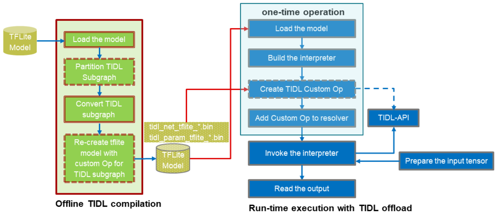
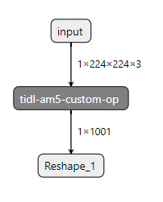
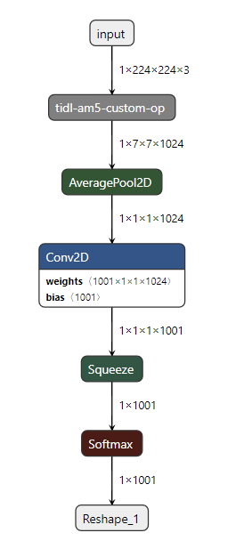

TensorFlow Lite
==============================

Introduction
-------------

Processor SDK Linux has integrated open source `TensorFlow Lite <https://www.tensorflow.org/lite>`__ for deep learning inference at the edge.
TensorFlow Lite runs on Arm for Sitara devices (AM3/AM4/AM5/AM6).

Supported version
------------------

  - TensorFlow Lite 1.18

TensorFlow Lite example applications
-------------------------------------

TensoreFlow Lite example applications are installed on filesystem at /usr/share/tensorflow-lite/examples.
One TensorFlow Lite model (mobilenet_v1_1.0_224_quant.tflite) is also installed at the same place for demonstration.
To use other TensorFlow Lite models, such as `TensorFlow Lite Hosted Models <https://www.tensorflow.org/lite/guide/hosted_models>`__,
please download those models and then copy them to the target.

.. code-block:: bash

    root@am57xx-evm:/usr/share/tensorflow-lite/examples# ls -l
    total 8356
    -rwxr-xr-x 1 root root 1158612 Sep 21  2019 benchmark_model
    -rw-r--r-- 1 root root  940650 Sep 21  2019 grace_hopper.bmp
    -rwxr-xr-x 1 root root 1076716 Sep 21  2019 label_image
    -rw-r--r-- 1 root root   10484 Sep 21  2019 labels.txt
    -rwxr-xr-x 1 root root 1055900 Sep 21  2019 minimal
    -rw-r--r-- 1 root root 4276352 Sep 21  2019 mobilenet_v1_1.0_224_quant.tflite

Running benchmark_model
^^^^^^^^^^^^^^^^^^^^^^^

The *benchmark_model* binary performs computation benchmarking for Tensorflow Lite models. Usage of *benchmark_model*:

::

    usage: ./benchmark_model
    Flags:
            --num_runs=50   int32   number of runs
            --run_delay=-1  float   delay between runs in seconds
            --num_threads=1 int32   number of threads
            --benchmark_name=       string  benchmark name
            --output_prefix=        string  benchmark output prefix
            --warmup_runs=1 int32   how many runs to initialize model
            --graph=        string  graph file name
            --input_layer=  string  input layer names
            --input_layer_shape=    string  input layer shape
            --use_nnapi=false       bool    use nnapi api

Example of running *benchmark_model* on target using the pre-installed mobilenet_v1_1.0_224_quant.tflite model:

::

    # cd /usr/share/tensorflow-lite/examples
    # ./benchmark_model --graph=mobilenet_v1_1.0_224_quant.tflite
    STARTING!
    Num runs: [50]
    Inter-run delay (seconds): [-1]
    Num threads: [1]
    Benchmark name: []
    Output prefix: []
    Warmup runs: [1]
    Graph: [mobilenet_v1_1.0_224_quant.tflite]
    Input layers: []
    Input shapes: []
    Use nnapi : [0]
    Loaded model mobilenet_v1_1.0_224_quant.tflite
    resolved reporter
    Initialized session in 4.452ms
    Running benchmark for 1 iterations
    count=1 curr=146161

    Running benchmark for 50 iterations
    count=50 first=137789 curr=137254 min=137079 max=143416 avg=137722 std=896

    Average inference timings in us: Warmup: 146161, Init: 4452, no stats: 137722

Running label_image example
^^^^^^^^^^^^^^^^^^^^^^^^^^^

The *label_image* provides an image classification example using TensorFlow Lite.
Options for *label_image*:

::

    --accelerated, -a: [0|1], use Android NNAPI or not
    --count, -c: loop interpreter->Invoke() for certain times
    --input_mean, -b: input mean
    --input_std, -s: input standard deviation
    --image, -i: image_name.bmp
    --labels, -l: labels for the model
    --tflite_model, -m: model_name.tflite
    --profiling, -p: [0|1], profiling or not
    --num_results, -r: number of results to show
    --threads, -t: number of threads
    --verbose, -v: [0|1] print more information

Example of running *label_image* on target, using the pre-installed mobilenet_v1_1.0_224_quant.tflite model,
`grace_hopper.bmp <https://raw.githubusercontent.com/tensorflow/tensorflow/r1.12/tensorflow/contrib/lite/examples/label_image/testdata/grace_hopper.bmp>`__, and labels.txt.

::

    # cd /usr/share/tensorflow-lite/examples
    # ./label_image -i grace_hopper.bmp -l labels.txt -m mobilenet_v1_1.0_224_quant.tflite
    Loaded model mobilenet_v1_1.0_224_quant.tflite
    resolved reporter
    invoked
    average time: 345.13 ms
    0.780392: 653 military uniform
    0.105882: 907 Windsor tie
    0.0156863: 458 bow tie
    0.0117647: 466 bulletproof vest
    0.00784314: 835 suit

TensorFlow Lite classification and segmentation demos with OpenCV
-----------------------------------------------------------------
Processor SDK Linux provides Tensorflow Lite classification and segmentation demos,
covering the complete pipeline from camera/video/image input to GUI display via OpenCV.
The demos binaries (tflite_classification and tflite_segmentation) are installed on filesystem
at /usr/share/tensorflow-lite/demos, along with
sample images and Tensorflow Lite models for out of box experience.

.. code-block:: bash

    root@am57xx-evm:/usr/share/tensorflow-lite/demos# ls -l
    -rw-r--r--    1 root     root       5116854 Mar 11 02:10 bird_segmentation.bmp
    -rw-r--r--    1 root     root       2779264 Mar 11 02:10 deeplabv3_257_mv_gpu.tflite
    -rw-r--r--    1 root     root      16900760 Mar 11 02:10 mobilenet_v1_1.0_224.tflite
    -rwxr-xr-x    1 root     root          1630 Mar 11 02:10 run_classification.sh
    -rwxr-xr-x    1 root     root           355 Mar 11 02:10 run_segmentation.sh
    -rwxr-xr-x    1 root     root          2725 Mar 11 02:10 run_tidl_compiler.sh
    -rwxr-xr-x    1 root     root          3107 Mar 11 02:10 run_tidl_compiler1.sh
    -rwxr-xr-x    1 root     root       1541324 Mar 11 02:10 tflite_classification
    -rwxr-xr-x    1 root     root       1541320 Mar 11 02:10 tflite_segmentation

Running classification demo
^^^^^^^^^^^^^^^^^^^^^^^^^^^
Run *tflite_classification* binary with the command usage below to demonstrates GUI based Tensorflow Lite classification.

::

    --tflite_model, -m: model_name.tflite
    --input_src, -r: [0|1|2] input source: image 0, video 1, camera 2
    --input_path, -i: path of the input image/video or video port for camera, e.g., 1 for /dev/video1
    --labels, -l: labels for the model
    --frame_cnt, -c: the number of frames to be used
    --input_mean, -b: input mean
    --input_std, -s: input standard deviation
    --profiling, -p: [0|1], profiling or not
    --threads, -t: number of threads

Below is an example of running *tflite_classification* on target, using the pre-installed mobilenet_v1_1.0_224.tflite model,
and grace_hopper.bmp/labels.txt reused from /usr/share/tensorflow-lite/examples folder. When the demo runs,
the input image along with the classification label will be displayed. Right click the image window to exit the demo.

::

    # cd /usr/share/tensorflow-lite/demos
    # ./tflite_classification -m ./mobilenet_v1_1.0_224.tflite -i ../examples/grace_hopper.bmp -l ../examples/labels.txt -p 1
    Loading model...
    Image input: ../examples/grace_hopper.bmp
    init done
    Using Wayland-EGL
    Using the 'wl-shell' shell integration
    xkbcommon: ERROR: couldn't find a Compose file for locale "C"
    Running inference...
    Inference time for frame 0: 310.575 ms
    label: military uniform with probability 0.857757

Running segmentation demo
^^^^^^^^^^^^^^^^^^^^^^^^^
Run *tflite_segmentation* binary with the command usage below to demonstrates GUI based Tensorflow Lite segmentation.

::

    --tflite_model, -m: model_name.tflite
    --input_src, -r: [0|1|2] input source: image 0, video 1, camera 2
    --input_path, -i: path of the input image/video or video port for camera, e.g., 1 for /dev/video1
    --frame_cnt, -c: the number of frames to be used
    --input_mean, -b: input mean
    --input_std, -s: input standard deviation
    --profiling, -p: [0|1], profiling or not
    --threads, -t: number of threads

Below is an example of running *tflite_segmentation* on target, using the pre-installed deeplabv3_257_mv_gpu.tflite model
and bird_segmentation.bmp at the same folder of /usr/share/tensorflow-lite/demos. When the demo runs,
the input image, the segmentation map, and overlay of the former two will be displayed in a single image window from
the left to the right. Right click the image window to exit the demo.

::

    # cd /usr/share/tensorflow-lite/demos
    # ./tflite_segmentation -m ./deeplabv3_257_mv_gpu.tflite -i .ird_segmentation.bmp -p 1
    Loading model...
    Image input: ./bird_segmentation.bmp
    init done
    Using Wayland-EGL
    Using the 'wl-shell' shell integration
    xkbcommon: ERROR: couldn't find a Compose file for locale "C"
    Running inference...
    Inference time for frame 0: 455.068 ms

Using video clip and camera capture as input
^^^^^^^^^^^^^^^^^^^^^^^^^^^^^^^^^^^^^^^^^^^^
For both demo binaries (*tflite_classification* and *tflite_segmentation*), the default is using a single image as the input.
To use a video clip or camera capture as the input, set the input source (-r, or --input_src),
input path (-i, or --input_path), and the frame count (-c, or --frame_cnt) accordingly from the command line.

Example command for using a video clip as the input.

::

    # cd /usr/share/tensorflow-lite/demos
    # ./tflite_classification -m ./mobilenet_v1_1.0_224.tflite -r 1 -i /usr/share/ti/tidl/examples/classification/clips/test10.mp4 -c 99999 -l ../examples/labels.txt

Example command for using camera capture as the input, with the video port detected as /dev/video1.

::

    # cd /usr/share/tensorflow-lite/demos
    # ./tflite_classification -m ./mobilenet_v1_1.0_224.tflite -r 2 -i 1 -c 999999 -l ../examples/labels.txt

To exit the demo with video/camera input, use the same way with a right-click on the image window.

Rebuild the Tensorflow Lite demos
^^^^^^^^^^^^^^^^^^^^^^^^^^^^^^^^^

Source code of the Tensorflow Lite demos can be found from `here <https://git.ti.com/cgit/apps/tensorflow-lite-examples/>`__.
When modifications/additions are made for the source code, the Tensorflow Lite demos need to be rebuilt. Below is the procedure
to rebuild the demos with Processor SDK Linux installer.

* `Download and install Processor SDK Linux <../../Overview/Download_and_Install_the_SDK.html>`__
* Go to [sdk_install_dir]/linux-devkit and run "source environment-setup"
* Set environment variables

  * export SYSROOT_INCDIR="$SDK_PATH_TARGET/usr/include"
  * export SYSROOT_LIBDIR="$SDK_PATH_TARGET/usr/lib"
  * export TARGET_TOOLCHAIN_PREFIX=arm-linux-gnueabihf-
* Go to "tensorflow-lite-examples" directory which is created from "git clone git://git.ti.com/apps/tensorflow-lite-examples.git"
  and has further modifications/additions
* Run "make" from the "tensorflow-lite-examples" directory to build the demos

Tensorflow Lite heterogeneous execution with TIDL compute offload
-----------------------------------------------------------------

For AM5729 and AM5749 devices, `TIDL <tidl.html>`__ acceleration of a Tensorflow Lite model is supported
by leveraging full/partial offload to EVEs and DSPs. In the case of partial offload,
operators which are not offloaded run on Arm, enabling Tensorflow Lite heterogeneous execution.
To enable TIDL compute offload, a two stage approach is used as shown in the figure below.

#. Offline TIDL compilation of Tensorflow Lite mode
#. Tensorflow Lite runtime execution with TIDL offload

Offline TIDL compilation of Tensorflow Lite mode
^^^^^^^^^^^^^^^^^^^^^^^^^^^^^^^^^^^^^^^^^^^^^^^^
At the first stage, the tidl import tool is
enhanced to convert an original Tensorflow Lite model into a TIDL compiled Tensorflow Lite model.
Besides the converted TIDL network which are stored into tidl_net*.bin and tidl_param_*.bin files as before,
operators in the TIDL supported subgraph are grouped as a single custom operator (tidl-am5-custom-op)
in Tensorflow Lite format. For the partial offload, operators outside of the TIDL supported subgraph will remain as
Tensorflow Lite operators in the TIDL compiled Tensorflow Lite model.

Example command to compile mobilenet_v1_1.0_224.tflite model for full TIDL offload:

.. code-block:: bash

    #1. Prepare the input: tensorflow lite model

    cd /usr/share/ti/tidl/utils
    mkdir -p ./test/testvecs/config/tflite_models
    mkdir -p ./test/testvecs/config/tidl_models/tflite/
    cp /usr/share/tensorflow-lite/demos/mobilenet_v1_1.0_224.tflite ./test/testvecs/config/tflite_models

    #2. Run tidl_model_import.out
    tidl_model_import.out ./test/testvecs/config/import/tflite/tidl_import_mobileNetv1.txt

Example command to compile mobilenet_v1_1.0_224.tflite model for partial TIDL offload, by specifying "MobilenetV1/MobilenetV1/Conv2d_13_pointwise/Relu6"
as the output of the TIDL supported subgraph when running the TIDL import tool. The input model is prepared using the same way as above in step #1.

.. code-block:: bash

    #2. Run tidl_model_import.out with the output tensor (other than the model output) specified for partial TIDL offload
    tidl_model_import.out ./test/testvecs/config/import/tflite/tidl_import_mobileNetv1.txt MobilenetV1/MobilenetV1/Conv2d_13_pointwise/Relu6

After the conversion above, the TIDL network files (tidl_net_tflite_mobilenet_v1_1.0_224.bin, and tidl_param_tflite_mobilenet_v1_1.0_224.bin)
are generated at /usr/share/ti/tidl/utils/test/testvecs/config/tidl_models/tflite.
In addition, the TIDL compiled Tensorflow Lite model (mobilenet_v1_1.0_224_tidl_am5.tflite) is generated
at /usr/share/ti/tidl/utils/test/testvecs/config/tflite_models. The Netron representation of the TIDL compiled
Tensorflow Lite model for mobilenetv1 (mobilenet_v1_1.0_224_tidl_am5.tflite) is shown as below,
for full TIDL offload and partial TIDL offload, respectively.

   TIDL compiled Tensorflow Lite model for mobilenet_v1_1.0_224.tflite with full offload

   TIDL compiled Tensorflow Lite model for mobilenet_v1_1.0_224.tflite  with partial offload

Tensorflow Lite runtime execution with TIDL offload
^^^^^^^^^^^^^^^^^^^^^^^^^^^^^^^^^^^^^^^^^^^^^^^^^^^
At the second stage, the TIDL compiled Tensorflow Lite model is fed into Tensorflow Lite runtime.
In order to allow Tensorflow Lite recognize the newly created TIDL custom operator (tidl-am5-custom-op)
from the offline TIDL compilation above, a custom operator is created and registered with Tensorflow Lite.
This custom operator is calling TIDL subgraph APIs
to initialize, free, and run the TIDL supported subgraph on EVEs and DSPs. When there are operators
outside of the TIDL supported subgraph in the input model, those operators will run through
Tensorflow Lite runtime on Arm.

The Tensorflow Lite demo code in the previous section is used to demonstrate the Tensorflow Lite runtime execution
with TIDL offload above. The custom TIDL operator is registered and added in
`tidl_op.cc <https://git.ti.com/cgit/apps/tensorflow-lite-examples/tree/tidl_op.cc>`__ and
`model_utils.cc <https://git.ti.com/cgit/apps/tensorflow-lite-examples/tree/model_utils.cc>`__, respectively, as shown below:

.. code-block:: cpp

    TfLiteRegistration* RegisterTidlSubgraphOp() {
      static TfLiteRegistration r = {
          tidl_subgraph_op::Init, tidl_subgraph_op::Free,
          tidl_subgraph_op::Prepare, tidl_subgraph_op::Eval};
      return &r;
    }

.. code-block:: cpp

    std::unique_ptr<tflite::Interpreter> BuildTfliteInterpreter(
        const tflite::FlatBufferModel& model, int num_threads) {
      tflite::ops::builtin::BuiltinOpResolver resolver;
    #ifdef TIDL_OFFLOAD
      resolver.AddCustom(tidl::kTidlSubgraphOp, tidl::RegisterTidlSubgraphOp());
    #endif

The TIDL subgraph handling from tidl-api requires supplying subgraph<subgraph_id>.cfg, which specifies
locations of the TIDL network files, as well as the boundary conversion parameters
(`see details here <https://downloads.ti.com/mctools/esd/docs/tidl-api/api.html>`__)
of the TIDL supported subgraph. For the single TIDL custom operator which corresponds to a single subgraph,
subgraph0.cfg shall be created and placed at the directory from which the demo runs, or the directory
specified by environment variable "TIDL_SUBGRAPH_DIR".

Below is an example subgraph0.cfg for partial offloading "mobilenet_v1_1.0_224.tflite" with
"MobilenetV1/MobilenetV1/Conv2d_13_pointwise/Relu6" as the subgraph output.

::

    netBinFile      = /usr/share/ti/tidl/utils/test/testvecs/config/tidl_models/tflite/tidl_net_tflite_mobilenet_v1_1.0_224.bin
    paramsBinFile   = /usr/share/ti/tidl/utils/test/testvecs/config/tidl_models/tflite/tidl_param_tflite_mobilenet_v1_1.0_224.bin
    # The input is in NHWC format and ranges [-1,1]
    inConvType = 0
    inIsSigned = 1
    inScaleF2Q = 128
    inIsNCHW = 0
    # The output is in NHWC format and ranges [0,6]
    outConvType = 0
    outIsSigned = 0
    outScaleF2Q = 42.5
    outIsNCHW = 0

Example command to run the classification demo with TIDL compiled Tensorflow Lite model
for partial offload (mobilenet_v1_1.0_224_tidl_am5.tflite) with subgraph0.cfg above.

.. code-block:: bash

    cd /usr/share/tensorflow-lite/demos
    ./tflite_classification -m /usr/share/ti/tidl/utils/test/testvecs/config/tflite_models/mobilenet_v1_1.0_224_tidl_am5.tflite \
                            -i ../examples/grace_hopper.bmp -l ../examples/labels.txt -p 1

Helper scripts for out of box experience
^^^^^^^^^^^^^^^^^^^^^^^^^^^^^^^^^^^^^^^^
Helper scripts are provided at "/usr/share/tensorflow-lite/demos" to demonstrate the offline TIDL compilation and run-time Tensorflow
Lite execution with TIDL offload, using the classification demo for Arm only execution, full TIDL offload,
and partial TIDL offload (heterogeneous execution).

::

    # cd /usr/share/tensorflow-lite/demos

    # ./run_tidl_compiler.sh  [This is creating mobilenet_v1_1.0_224_tidl_am5.tflite, .bin files, and subgraph0.cfg for full TIDL offload]
    # ./run_classification.sh [This runs Arm only classification first, and then with full TIDL offload]

    # ./run_tidl_compiler1.sh [This is creating mobilenet_v1_1.0_224_tidl_am5.tflite, .bin files, and subgraph0.cfg for partial TIDL offload,]
                              [specifying MobilenetV1/MobilenetV1/Conv2d_13_pointwise/Relu6 as the output tensor of the TIDL subgraph]
    # ./run_classification.sh [This runs Arm only classification first, and then with partial TIDL offload]

Limitations
^^^^^^^^^^^
This is the first version of running TIDL offload from Tensorflow Lite runtime engine, using mobilenet_v1
floating point Tensorflow Lite model as the example. While it covers the full flow
from offline compilation, to runtime execution with Tensorflow Lite and TIDL offload via TIDL API, it has limitations
and optimization/enhancements can be further made.

* Supports floating point Tensorflow lite models only, due to limitation of TIDL import tool in general
* Supports a single subgraph starting from the first operator in the original model
* The demo code uses a single EVE with batch size of 1, single input tensor, and single output tensor
  - this can be generalized to utilize multiple EVEs
