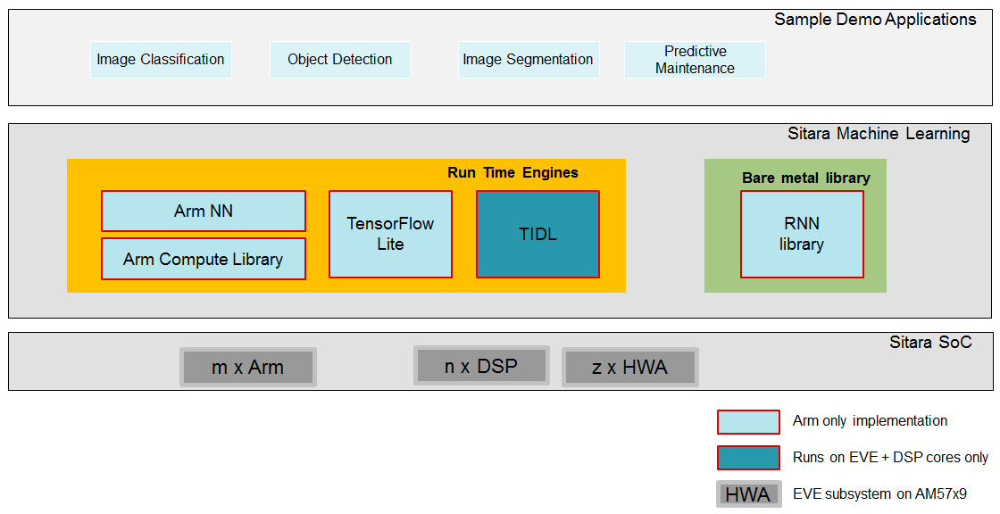

********************
Machine Learning
********************
Sitara Machine Learning toolkit brings machine learning to the edge by enabling machine learning inference on all Sitara devices (Arm only, Arm + specialized hardware accelerators). It is provided as part of TI's Processor SDK Linux, free to download and use. Sitara machine learning today consists of TI Deep Learning (TIDL), Arm NN, TensorFlow Lite, and RNN bare metal library.

    Sitara Machine Learnining Offering

.. rubric:: `TI Deep Learning (TIDL) <Foundational_Components/Machine_Learning/tidl.html>`__

* Available on AM57x device only, runs on C66x DSP cores and/or on Embedded Vision Engine (EVE) subsystems.
* Supports CNN models only.
* Provides acceleration of NNs.

.. rubric:: `Arm NN <Foundational_Components/Machine_Learning/armnn.html>`__

* Open-source Linux software available from Arm.
* Runs on all Cortex-A ARM cores (AM3x, AM4x, AM5x, AM6x Sitara devices).
* Integrated into TI's Processor SDK Linux.

.. rubric:: `TensorFlow Lite <Foundational_Components/Machine_Learning/tflite.html>`__

* Open source deep learning runtime for on-device inference. It was created based on TensorFlow primarily to help with implementing machine learning on mobile and IoT devices.
* Runs on all Cortex-A ARM cores (AM3x, AM4x, AM5x, AM6x Sitara devices).
* Integrated into TI's Processor SDK Linux.

.. rubric:: `RNN Bare Metal Library <Examples_and_Demos_Application_Demos.html#deploy-and-integration>`__

* The LSTM (Long Short-Term Memory) and fully connected layers have been provided in a standalone library to allow for rapid prototyping of inference applications that require recurrent neural networks.
* Runs on all Cortex-A ARM cores (AM3x, AM4x, AM5x, AM6x Sitara devices).
* Integrated into TI's Processor SDK Linux in an OOB demo for `Predictive Maintenance <Examples_and_Demos_Application_Demos.html#predictive-maintenance-demo>`__.

.. toctree::
   :hidden:

   Foundational_Components/Machine_Learning/tidl
   Foundational_Components/Machine_Learning/armnn
   Foundational_Components/Machine_Learning/tflite
