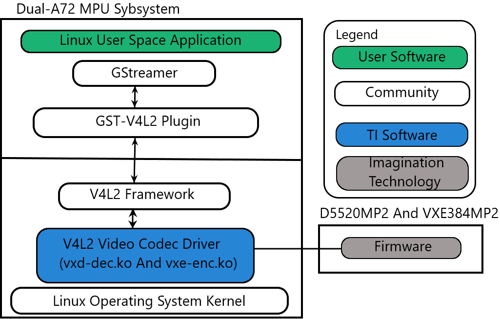
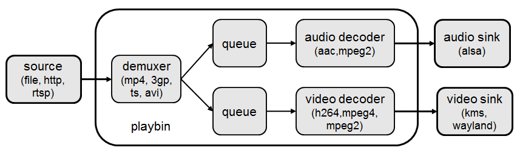

.. include:: /replacevars.rst.inc

.. _foundational-components-multimedia:

*************************
Multimedia Video Codec
*************************

Introduction
============

TI's embedded processors such as |__PART_FAMILY_DEVICE_NAMES__| have the
following hardware accelerators:

     #.  Multi-Standard HD Video Decoder (DECODER) based on D5520MP2 from
         Imagination Technologies for accelerating multimedia decode
     #.  Multi-Standard HD Video Encoder (ENCODER) based on VXE384MP2 from
         Imagination Technologies for accelerating multimedia encode

In order to make it easy for customers to write applications, and to
leverage open source elements that provide functionality such as AVI
stream demuxing, audio encode/decode, etc, TI's |__SDK_FULL_NAME__|
supplies ARM-based GStreamer plugins that abstract the hardware
acceleration.

This multimedia training page will cover the following topics:

     #.  Capabilities of DECODER and ENCODER
     #.  Out-of-box Multimedia Demos in |__SDK_FULL_NAME__|
     #.  Software Stack of Accelerated Codec Encoding/Decoding
     #.  V4L2 Driver-level Test Application
     #.  GStreamer Pipelines for Multimedia Applications
     #.  Limitations of GStreamer Plugins
     #.  Memory Optimisation
     #.  Rebuilding the V4L2 encode/decode driver modules
     #.  Enabling Debug Features

|

.. rubric:: Capabilities of DECODER, ENCODER, and ARM
   :name: capabilities-of-decoder-encoder-and-arm

In |__SDK_FULL_NAME__|, DECODER hardware supports the following codecs:

        -  Video Decode: H.264, HEVC/H.265, MPEG4/H.263, WMV9, VC-1, MPEG2,
           DivX, AVS, RealVideo, VP8, VP6, Sorenson
        -  Image Decode: MJPEG

The multimedia decoding applications, however, support a subset of the
codecs supported by the DECODER hardware. The decoding applications
support these codecs:

        -  Video Decode: H.264 and HEVC/H.265
        -  Image Decode: MJPEG

The ENCODER hardware supports the following codecs:

        - Video Encode: H.264, MPEG4, H.263, MPEG2
        - Image Encode: JPEG

The multimedia encoding applications, however, support a subset of the
codecs supported by the ENCODER hardware. The encoding applications
support these codecs:

        -  Video Encode: H.264

Demo applications also demonstrate the following ARM-based coding
capabilities:

        -  Audio encoding and decoding on ARM: AAC, MPEG2 (leveraging open
           source codecs)

|

Demos
=====

The multimedia video decode capabilities can be demonstrated by using
the GStreamer pipeline to decode to the display. Please refer to the section
`GStreamer Pipelines`_  for further details. The decoder can also be
tested at the V4L2 driver level using the standalone test application
detailed in the section :ref:`v4l2-video-decoder-test-app`.

At this time, GStreamer for encode using the ENCODER hardware is not supported.
The encoder can be tested at the V4L2 driver level using the standalone
test app detailed in the section :ref:`v4l2-video-encoder-test-app`.

|

Software Architecture
=====================

Software Stack of Accelerated Codec Encoding/Decoding
-----------------------------------------------------

As shown in the figures below, the software stack of the accelerated
encoding and decoding has two parts:

        -  A V4L2 (Video4Linux version 2) software driver running on Linux on the A72 MPU subsystem
        -  The firmware running on the DECODER and ENCODER

The driver communicates with the firmware running on the ENCODER/DECODER
through its own IPC (inter-processor communication).
For the DECODER, at the highest level in the MPU subsystem on the A72,
there is a Linux user space application which is based on GStreamer. GStreamer
is an open source framework that simplifies the development of multimedia
applications. The GStreamer library loads and interfaces with the GStreamer
plugin (V4L2 plugin), which handles all the details specific to the use of
the hardware accelerator. Specifically, the GStreamer plugin interfaces
with the V4L2 decoder and encoder kernel driver interface. The V4L2 decoder driver
controls the DECODER to enable the accelerated decoding and the V4L2 encoder
driver controls the Encoder to enable the accelerated encoding.

.. raw:: html

   

.. raw:: html

   

   CODEC Software Stack

|

Linux Kernel Drivers
--------------------

.. rubric:: TI-Provided V4L2 Drivers for Multimedia
   :name: ti-provided-v4l2-drivers-for-multimedia

Video4Linux version 2 (V4L2) is an open source framework that
provides a media interface to all Linux-based applications. V4L2 is
a collection of device drivers and an API for supporting realtime
video capture and video memory-to-memory operations on Linux systems.

Video encode and decode using the ENCODER and DECODER hardware, respectively,
are enabled as V4L2 drivers. The V4L2 is integrated with the ENCODER and
DECODER drivers by a thin layer that implements the V4L2 node ioctls
and translates the V4L2 data structures to those understood by the
ENCODER/DECODER.

V4L2 Video Decoder
^^^^^^^^^^^^^^^^^^

The V4L2 video decoder driver is a memory-to-memory device that receives
the encoded data on its "output" stream and generates the decoded data to
its "capture" stream. The module name is "vxd-dec.ko".

.. rubric:: Codec Support
   :name: v4l2-dec-codec-support

The V4L2 decoder driver supports receiving the following encoded bitstream
formats on its "output" stream:

        -  V4L2_PIX_FMT_H264
        -  V4L2_PIX_FMT_HEVC
        -  V4L2_PIX_FMT_MJPEG

.. rubric:: Color Format Support
   :name: v4l2-dec-color-format-support

The DECODER supports outputting several color formats. There is no color
conversion performed. The selected color format should be the same as the
native color format of the encoded stream. The V4L2 decoder driver supports
several standard V4L2 color formats, plus two custom color formats. The
formats supported are:

Standard Formats:

        -  V4L2_PIX_FMT_NV12
        -  V4L2_PIX_FMT_NV16
        -  V4L2_PIX_FMT_YUV420M
        -  V4L2_PIX_FMT_YUV422M

Custom Formats:

        - V4L2_PIX_FMT_TI1210 (NV12 10-bit)
        - V4L2_PIX_FMT_TI1610 (NV16 10-bit)

.. note::
    Formats with an "M" at the end of their name are multi-planar formats,
    meaning that the planes are non-contiguous in memory.

The following table shows the native color format support for each of the supported codecs:

+--------------+------------------------------+
| **Codec**    | **Supported Color Format**   |
+--------------+------------------------------+
| H.264        | V4L2_PIX_FMT_NV12            |
|              |                              |
|              | V4L2_PIX_FMT_NV16            |
|              |                              |
|              | V4L2_PIX_FMT_TI1210          |
|              |                              |
|              | V4L2_PIX_FMT_TI1610          |
+--------------+------------------------------+
| HEVC/H.265   | V4L2_PIX_FMT_NV12            |
|              |                              |
|              | V4L2_PIX_FMT_NV16            |
|              |                              |
|              | V4L2_PIX_FMT_TI1210          |
|              |                              |
|              | V4L2_PIX_FMT_TI1610          |
+--------------+------------------------------+
| MJPEG        | V4L2_PIX_FMT_YUV420M         |
|              |                              |
|              | V4L2_PIX_FMT_YUV422M         |
+--------------+------------------------------+

.. _v4l2-video-decoder-test-app:

V4L2 Video Decoder Test Application
^^^^^^^^^^^^^^^^^^^^^^^^^^^^^^^^^^^

A test application that interfaces directly through the V4L2 API is provided
along with the release. The test application used for verifying the DECODER
functionality through the V4L2 API is "tidec_decode".

.. note:: tidec_decode is only able to handle raw streams, not container formats.

Usage:

.. code-block:: text

    tidec_decode -i <input_file> [OPTIONS]
    The final output file/s will be '<output_file_base>_xx.out'
    where xx ranges from 00, 01, 02, ...
    depending on how many fds are specified to -n

    OPTIONS:
            -h                              help
            -b                              DO NOT use drm dss device capture buffer (instead, use v4l2)
            -n <number>                     number of fds to open
            -o <output_file_base>           Dump output stream to file
                                            The final output file/s will be '<output_file_base>_xx.out'
                                            where xx ranges from 00, 01, 02, ...
                                            depending on how many fds are specified to -n
            -f <number of frames to decode> Maximum number of frames to decode
            -d <path>                       Path to which drm device to use for buffer allocation
            -t                              for enable time profiling
            -e <number of ms>               Number of milliseconds to sleep between
                                            queueing the last bitstream buffer and sending CMD_STOP
                                            Used to test various timing scenarios for EOS
            -v <dev_name>                   Used to specify which device node is the decoder

Verification:

In order to verify basic functionality, runs can be done with no output file specified.
In this case, the command line would be simply:

.. code-block:: text

    tidec_decode -i <input_file>

At the end of a successful run, the test application prints:

.. code-block:: text

    test app completed successfully

which can be used to verify a run to completion.

In order to verify the decoded output, a YUV player or mplayer can be used
on the host PC. In this case, an output file needs to be specified. The total
command line would be:

.. code-block:: text

    tidec_decode -i <input_file> -o <output_file>

The output could then be played back on the host PC. For example, to play back
raw QCIF NV12 output:

.. code-block:: text

    mplayer output.yuv -demuxer rawvideo -rawvideo w=176:h=144:format=NV12

V4L2 Video Encoder
^^^^^^^^^^^^^^^^^^

The V4L2 video encoder driver is a memory-to-memory device that receives
the raw frame data on its "output" stream and generates the encoded data to
its "capture" stream. The module name is "vxe-enc.ko".

.. rubric:: Codec Support
   :name: v4l2-enc-codec-support

The V4L2 encoder driver supports encoding to the following encoded bitstream
formats on its "capture" stream:

        -  V4L2_PIX_FMT_H264

.. rubric:: Color Format Support
   :name: v4l2-enc-color-format-support

The V4L2 encoder driver supports encoding of the following color formats for
the raw data "output" stream:

        -  V4L2_PIX_FMT_NV12

.. rubric:: Configurable Controls
   :name: v4l2-enc-config-controls

The V4L2 encoder driver has the following configurable controls:

+-------------------------------------+---------+-------------+----------+--------------+
| **Ctrl**                            | **Min** | **Max**     | **Step** | **Default**  |
+-------------------------------------+---------+-------------+----------+--------------+
| V4L2_CID_MPEG_VIDEO_GOP_SIZE        |      1  |       7200  |       1  |        1800  |
+-------------------------------------+---------+-------------+----------+--------------+
| V4L2_CID_MPEG_VIDEO_BITRATE         |  50000  |  100000000  |       1  |      500000  |
+-------------------------------------+---------+-------------+----------+--------------+
| V4L2_CID_MPEG_VIDEO_H264_I_PERIOD   |      1  |        600  |       1  |        3600  |
+-------------------------------------+---------+-------------+----------+--------------+

.. note::

   The controls should be set before calling VIDIOC_S_FMT.

The following table gives recommended values for bitrate based on resolution and frame type:

+---------------------+---------------------------------------+------------------------------+
| **Resolution**      | **Bitrate for I-frame Only sequence** | **Bitrate for IPP sequence** |
+---------------------+---------------------------------------+------------------------------+
| QCIF (176x144)      |                   1000000             |             500000           |
+---------------------+---------------------------------------+------------------------------+
| CIF (352x288)       |                   2000000             |            1000000           |
+---------------------+---------------------------------------+------------------------------+
| VGA (640x480)       |                   6000000             |            4000000           |
+---------------------+---------------------------------------+------------------------------+
| HD (1280x720)       |                  12000000             |            7000000           |
+---------------------+---------------------------------------+------------------------------+
| Full HD (1920x1080) |                  15000000             |           10000000           |
+---------------------+---------------------------------------+------------------------------+

.. _v4l2-video-encoder-test-app:

V4L2 Video Encoder Test Application
^^^^^^^^^^^^^^^^^^^^^^^^^^^^^^^^^^^

A test application that interfaces directly through the V4L2 API is provided
along with the release. The test application used for verifying the ENCODER
functionality through the V4L2 API is "tienc_encode".

Usage:

.. code-block:: text

    tienc_encode -i <input_file> -w <width> -h <height> [OPTIONS]
    OPTIONS:
            -o <output_file_name>
                    Dump output stream to file
            -d <device>
                    Location of device node (ex. /dev/video0)
            -e <device_path>
                    Directory of device node (ex. /dev/)
                    Not needed if -d argument is provided
            -f <format>
                    Input image format. Available formats:
                            NV12
            -c <codec>
                    Output stream codec. Available codecs
                            H264
            -n <n_frames>
                    Number of frames to encode
            -b <bitrate>
                    Bitrate in bits per second
            -g <gop_size>
                    IDR frame interval
            -p <i_period>
                    I frame period in H264
            -r <framerate>
                    Framerate in frames per second
            -j
                    Use DMA buffers for output stream
            -k
                    Use DMA buffers for capture stream
            -l <drm_device_name>
                    Location of drm device (ex. /dev/dri/card0)
            -m <drm_device-path>
                    Directory of drm device node (ex. /dev/dri/)
                    Not needed if -l argument is provided

Verification:

In order to verify basic functionality, defaults can be used for most
configurable options except for input file, width, height, and output file.
In this case, the command line would be simply:

.. code-block:: text

    tienc_encode -i <input_file> -w <width> -h <height> -o <output_file>

At the end of a successful run, the test application prints:

.. code-block:: text

    Got EPIPE, exiting

which can be used to verify a run to completion.

In order to verify the encoded bitstream, mplayer can be used on the host
PC. The total command line would be:

.. code-block:: text

    tienc_encode -i <input_file> -w <width> -h <height> -o <output_file>

The encoded bitstream could then be played back on the host PC. For example,
to play back a raw H.264 bitstream:

.. code-block:: text

    mplayer -fps 30 output.h264

GStreamer Plugins for Multimedia
--------------------------------

.. rubric:: Open Source GStreamer Overview
   :name: open-source-gstreamer-overview

GStreamer is an open source framework that simplifies the development of
multimedia applications, such as media players and capture encoders. It
encapsulates existing multimedia software components, such as codecs,
filters, and platform-specific I/O operations, by using a standard
interface and providing a uniform framework across applications.

The modular nature of GStreamer facilitates the addition of new
functionality, transparent inclusion of component advancements and
allows for flexibility in application development and testing.
Processing nodes are implemented via GStreamer plugins with several sink
and/or source pads. Many plugins are running as ARM software
implementations, but for more complex SoCs, certain functions are better
executed on hardware-accelerated IPs like D5520MP2 (DECODER) and
VXE384MP2 (ENCODER).

GStreamer is a multimedia framework based on data flow paradigm. It allows
easy plugin registration just by deploying new shared objects to the
/usr/lib/gstreamer-1.0 folder. The shared libraries in this folder are
scanned for reserved data structures identifying capabilities of
individual plugins. Individual processing nodes can be interconnected as
a pipeline at run-time, creating complex topologies. Node interfacing
compatibility is verified at that time - before the pipeline is started.

GStreamer brings a lot of value-added features to |__SDK_FULL_NAME__|,
including audio encoding/decoding, audio/video synchronization, and
interaction with a wide variety of open source plugins (muxers,
demuxers, codecs, and filters). New GStreamer features are continuously
being added, and the core libraries are actively supported by
participants in the GStreamer community. Additional information about
the GStreamer framework is available on the GStreamer project site:
http://gstreamer.freedesktop.org/.

.. rubric:: Hardware-Accelerated GStreamer Plugins
   :name: video-decode-gstreamer-plugins

One benefit of using GStreamer as a multimedia framework is that the
core libraries already build and run on ARM Linux. Only a GStreamer
plugin is required to enable additional hardware features on TI's
embedded processors with both ARM and hardware accelerators for
multimedia. The open source GStreamer plugins provide elements for
GStreamer pipelines that enable the use of hardware-accelerated video
decoding through the V4L2 GStreamer plugin.

Below is a list of GStreamer plugins that utilize the hardware-accelerated
video decoding in the |__PART_FAMILY_DEVICE_NAMES__|.

-  DECODER

        #. v4l2h264dec
        #. v4l2h265dec
        #. v4l2jpegdec

-  ENCODER

        #. v4l2h264enc

GStreamer Pipelines
===================

.. rubric:: Visual Representation of Typical GStreamer Pipelines
   :name: visual-representation-of-typical-gstreamer-pipelines

A typical GStreamer pipeline starts with one or more source elements,
uses zero or more filter elements, and ends in a sink or multiple sinks.

This section provides visual representation of one typical GStreamer
pipeline: multimedia decoding and playout.

.. rubric:: Decode Pipeline
   :name: decode-pipeline

The example pipeline shown in the figure :ref:`gst-dec-playout-fig`
demonstrates the demuxing and playback of a transport stream. The input
is first read using the source element, and then processed by
GStreamer playbin2 (Player Bin 2). To use playbin2 in the pipeline,
we use the playbin element (as shown in the figure below). Inside playbin2,
demuxer first demuxes the stream into its audio and video stream components.

The video stream is then queued and sent to V4L2
GStreamer plugin for decoding. Finally, it is sent to a video sink to
display the decoded video on the screen. The audio stream is queued and
then decoded by the ARM audio GStreamer plugin, and then reaches its
destination at the alsasink element to play the decoded audio.

.. raw:: html

   

.. raw:: html

   

.. _gst-dec-playout-fig:

   GStreamer Decode Playout

.. raw:: html

   

.. raw:: html

   

|

Running a GStreamer pipeline
----------------------------

GStreamer pipelines can also run from the command line. In order to do so,
exit Weston by pressing Ctrl-Alt-Backspace from the keyboard which
connects to the EVM. Then, if the LCD screen stays in "Please wait...",
press Ctrl-Alt-F1 to go to the command line on the LCD console. After that,
the command line can be used from serial console, SSH console, or LCD
console.

One can run an audio video file using the GStreamer playbin from the
console. Currently, the supported Audio/video sink is kmssink,
waylandsink and alsassink.

.. note::
   playbin is currently supported only with kmssink and only for NV12 output.

.. code-block:: text

    kmssink:
      target #  gst-launch-1.0 playbin uri=file:///<path_to_file> video-sink=kmssink audio-sink=alsasink

One can also run an audio video file without playbin. This is required
for decode to any sink except kmssink due to the need to use the video
format filter, which can not be used with playbin. The following pipelines
show how to playback to kmssink and waylandsink without playbin.

.. code-block:: text

    kmssink (video only playback):
      target #  gst-launch-1.0 filesrc location=/<path_to_file> ! qtdemux ! h264parse ! v4l2h264dec ! video/x-raw,format=NV12 ! kmssink

.. code-block:: text

    kmssink (audio + video playback):
      target #  gst-launch-1.0 filesrc location=/<path_to_file> ! qtdemux name=demux \
                demux.video_0 ! queue ! h264parse ! v4l2h264dec ! video/x-raw,format=NV12 ! kmssink \
                demux.audio_0 ! queue ! decodebin ! alsasink

The following pipelines show playback to waylandsink. Please refer
`Wayland/Weston <Foundational_Components_Graphics.html#wayland-weston>`__
to start Weston before running the pipelines.

.. code-block:: text

    waylandsink (video only playback):
      target #  gst-launch-1.0 filesrc location=/<path_to_file> ! qtdemux ! h264parse ! v4l2h264dec ! video/x-raw,format=NV12 ! waylandsink

.. code-block:: text

    waylandsink (audio + video playback):
      target #  gst-launch-1.0 filesrc location=/<path_to_file> ! qtdemux name=demux \
                demux.video_0 ! queue ! h264parse ! v4l2h264dec ! video/x-raw,format=NV12 ! waylandsink \
                demux.audio_0 ! queue ! decodebin ! alsasink

.. note::
   #.  The V4L2 Plugin (and TI V4L2 Video Decode driver) will not select the
       native color format on its own. The video format filter MUST be used to
       ensure proper decoding. The required filter is highlighted in the below
       example pipeline. The format can be changed according to the input stream:

        gst-launch-1.0 ! filesrc location=/<path_to_file> ! qtdemux ! h264parse ! v4l2h264dec ! **video/x-raw,format=NV12** ! waylandsink

   #.  If the native format is not supported by the sink, then a color converter
       plugin will need to be used in the pipeline.
   #.  playbin is currently supported ONLY with kmssink and ONLY for NV12 format.

   For full list of limitations, see `Limitations of GStreamer Plugins`_.

The following pipelines show examples of using the v4l2h265dec and v4l2jpegdec elements.

.. code-block:: text

    HEVC/H.265 video playback to waylandsink
      target #  gst-launch-1.0 filesrc location=/<path_to_file> ! qtdemux ! h265parse ! v4l2h265dec ! video/x-raw,format=NV12 ! waylandsink

.. code-block:: text

    MJPEG video playback to waylandsink
      target #  gst-launch-1.0 filesrc location=/<path_to_file> ! qtdemux ! jpegparse ! v4l2jpegdec ! video/x-raw,format=I420 ! videoconvert ! video/x-raw,format=NV12 ! waylandsink

Scaling of the decoded video to fit the display with kmssink can be achieved by
selecting a kms plane with scaling support.

.. code-block:: text

    To enumerate all the connector IDs and plane IDs, modetest can be used:
      target #  modetest -M tidss -p

    kmssink playback using VID plane that supports display scaling:
      target #  gst-launch-1.0 playbin uri=file:///<path_to_file> video-sink="kmssink plane-id=41" audio-sink=alsasink

    Or
      target #  gst-launch-1.0 filesrc location=/<path_to_file> ! qtdemux ! h264parse ! v4l2h264dec ! video/x-raw,format=NV12 ! kmssink plane-id=41

The following pipeline shows example of using the v4l2h264enc element.

.. code-block:: text

   H.264 video encoding to filesink
      target #  gst-launch-1.0 filesrc location=/<path_to_file> rawvideoparse width=1280 height=720 framerate=30/1 format=23 ! v4l2h264enc ! filesink location=/<path_to_file>

|

Limitations of GStreamer Plugins
--------------------------------

.. rubric:: Limitations of GStreamer Plugins
   :name: gstreamer-plugins-limitations

* GStreamer V4L2 plugin decoder elements need video filter
  (video/x-raw,format=<format>) to select the native color format for decoding.
* playbin is supported ONLY with kmssink and ONLY with NV12 format due to need
  for video filter with other sinks.

|

GStreamer Plugin Internals
--------------------------

.. rubric:: V4L2 GStreamer Plugin Support
   :name: v4l2-gstreamer-plugin-support

Each V4L2 decode element has one sink pad and one src pad. The sink pad
is for receiving the encoded bitstream, and the src pad is for outputting the
raw video data.

.. rubric:: Element Src and Sink Pads
   :name: element-src-and-sink-pads

The following table gives the format support for the sink and src pads for each
supported element.

+----------------------------+----------------------------+----------------------------+
| **Element**                | **Sink Pad Format**        | **Src Pad Format**         |
+----------------------------+----------------------------+----------------------------+
| v4l2h264dec                | H.264                      | NV12                       |
|                            |                            |                            |
|                            |                            | NV16                       |
+----------------------------+----------------------------+----------------------------+
| v4l2h265dec                | HEVC/H.265                 | NV12                       |
|                            |                            |                            |
|                            |                            | NV16                       |
+----------------------------+----------------------------+----------------------------+
| v4l2jpegdec                | MJPEG                      | I420                       |
|                            |                            |                            |
|                            |                            | Y42B                       |
+----------------------------+----------------------------+----------------------------+

.. note::
   #.  No color conversion is performed in the plugin or v4l2 decode driver. The
       color format selected should be that of the native color format of the encoded bitstream.
   #.  To select the appropriate color format, it is important to provide the color
       format filter to the GStreamer pipeline. See `Running a GStreamer pipeline`_ for more
       information on how to provide this filter. Example:

        gst-launch-1.0 filesrc location=<file_location> ! h264parse ! v4l2h264dec ! **video/x-raw,format=NV12** ! kmssink

   #.  The v4l2 decode driver supports some
       `custom 10-bit color formats <Foundational_Components_Multimedia_D5520_VXE384.html#v4l2-dec-color-format-support>`__,
       but that support is not available at GStreamer plugin side.

   For full list of limitations, see `Limitations of GStreamer Plugins`_.

.. rubric:: Inspecting an Element
   :name: inspecting-an-element

To get the full information about an element, the gst-inspect-1.0 utility can be used on
the target. For example:

.. code-block:: text

    target #  gst-inspect-1.0 v4l2h264dec
    target #  gst-inspect-1.0 v4l2h264enc

.. note::
   gst-inspect-1.0 will show that all color formats are available for every element.
   However, not all color formats are supported by every element. The table
   `here <Foundational_Components_Multimedia_D5520_VXE384.html#element-src-and-sink-pads>`__
   summarizes the actual support per element.

.. rubric:: Buffer Flow Considerations
   :name: buffer-flow-considerations

The V4L2 GStreamer Plugin provides the ability to either allocate its own buffers,
or import buffers from a downstream plugin such as kmssink or waylandsink. This
buffer io-mode can be selected using the property "capture-io-mode". To request
the decoder element (and in turn the TI V4L2 decoder driver) to do the allocation,
"dmabuf" (GST_V4L2_IO_DMABUF) is used. To request the element to import buffers
allocated downstream, "dmabuf-import" (GST_V4L2_IO_DMABUF_IMPORT) is used. By
default for the decode elements, GST_V4L2_IO_DMABUF will be selected due to V4L2
decoder driver support for it.

With the TI V4L2 Video Decoder Driver, the best latency performance to display is achieved
with the default of "dmabuf" (GST_V4L2_IO_DMABUF). This default provides
the best performance because internally the V4L2 decoder allocates contiguous
buffers that can be sent to display without any buffer copies.

|

Memory Optimisation
===================

Decoder Driver Memory Optimisation
----------------------------------

   To optimise the Decoder driver memory allocation with performance degradation less than 10%.
   Change the Macro in Makefile as CAPTURE_CONTIG_ALLOC ?=n, and follow the driver rebuild instructions.

   .. code-block:: text

       drivers/media/platform/vxe-vxd/makefile

   Make the following change:

   .. code-block:: text

       -                 CAPTURE_CONTIG_ALLOC ?=y
       +                 CAPTURE_CONTIG_ALLOC ?=n

|

Rebuilding and Debugging
========================

Rebuilding V4L2 Drivers
-----------------------

The V4L2 Encode and Decode drivers can be rebuilt using the
"linux-ti-staging" Yocto recipe available with the release.
If the recipe needs to be modified (for example, to enable/disable
config options), the recipe can be found in the meta-ti
sources, in the path "recipes-kernel/linux/linux-ti-staging-<version>/".

After modifications/additions are made to the recipe or source code,
the module needs to be rebuilt, and this can be done from the Yocto
build.

First, please refer to `Building The SDK <Overview_Building_the_SDK.html>`__
to set up the build environment and bitbake the original recipe for
ti-img-encode-decode, i.e.,

``MACHINE=j7-evm bitbake linux-ti-staging``

After the bitbake command above is successfully done,
./build/arago-tmp-external-arm-toolchain/work/j7_evm-linux/ti-img-encode-decode/<\*>
will be created with the original source code under the git sub-folder.
Copy the modified and/or the newly added files to the git sub-folder,
and rebuild the module referring to `Rebuild
Recipe <Overview_Building_the_SDK.html#recipes>`__.

Last, install the rebuilt module(s) on target filesystem referring to
`Installing Package <Overview_Building_the_SDK.html#installing-package>`__.
After the installation, the following files will be updated and/or
added.

        -  /lib/modules/<version>/kernel/drivers/media/platform/vxe-vxd/vxd-dec.ko
        -  /lib/modules/<version>/kernel/drivers/media/platform/vxe-vxd/vxe-enc.ko

For rebuilding individual recipes in |__SDK_FULL_NAME__|, please refer to
`Recipes <Overview_Building_the_SDK.html#recipes>`__.

Debug Logs
----------

In case additional logs are needed from the V4L2 Encode or Decode
drivers, debug tracing can be enabled by rebuilding the module
with the appropriate options selected.

.. rubric:: V4L2 Decoder Debug Options
   :name: v4l2-dec-debug-options

DEBUG_DECODER_DRIVER can be set to 'y' to enable all the debug tracing
in the decoder driver. This should only be used for debugging
purposes. To enable it, set DEBUG_DECODER_DRIVER to 'y' and rebuild
the decoder module following the instructions in `Rebuilding V4L2 Drivers`_.

.. rubric:: V4L2 Encoder Debug Options
   :name: v4l2-enc-debug-options

DEBUG_ENCODER_DRIVER can be set to 'y' to enable all the debug tracing
in the encoder driver. This should only be used for debugging
purposes. To enable it, set DEBUG_ENCODER_DRIVER to 'y' and rebuild
the encoder module following the instructions in `Rebuilding V4L2 Drivers`_.

Latency Profiling
-----------------

The decode latency of the V4L2 Decoder can be measured at the picture or
firmware level. Only one can be enabled at a time.

.. rubric:: Decoder Firmware Latency Profiling
   :name: decoder-firmware-latency-profiling

To enable firmware latency profiling, follow these steps:

#. Enable the print in the driver code by modifying the following file:

   .. code-block:: text

       drivers/media/platform/vxe-vxd/decoder/vxd_pvdec.c

   Make the following change:

   .. code-block:: text

       -                 dev_info(dev,
       +                 dev_err(dev,
                                  "fw decode time is %llu us for msg_id x%0x\n",

#. Follow the instructions in the section `Rebuilding V4L2 Drivers`_ in
   order to rebuild the module and copy the updated module to the target.
   The module to copy is vxd-dec.ko.
#. Collect the logs and look for the traces that look like:

   .. code-block:: text

       [  802.626314] img_dec 4300000.video-decoder: fw decode time is 5314 us for msg_id xc60f

#. Each trace gives the firmware decode time per frame. All numbers are in
   micro seconds.

.. rubric:: Decoder V4L2-level Picture Decode Latency Profiling
   :name: decoder-v4l2-picture-dec-latency-profiling

To enable V4L2-level picture decode latency profiling, follow these steps:

#. Enable the print in the driver code by modifying the following file:

   .. code-block:: text

       ti-img-encode-decode/linux/decoder/vxd_v4l2.c

   Make the following change:

   .. code-block:: text

       -                 dev_info(dev,
       +                 dev_err(dev,
                                 "picture buf decode time is %llu us for buf_map_id 0x%x\n",

#. Follow the instructions in the section `Rebuilding V4L2 Drivers`_ in
   order to rebuild the module and copy the updated module to the target.
   The module to copy is vxd-dec.ko.
#. Collect the logs and look for the traces that look like:

   .. code-block:: text

       [  511.316237] img_dec 4300000.video-decoder: picture buf decode time is 9901 us for buf_map_id 0x4000025

#. Each trace gives the v4l2-level picture decode time per frame. All numbers are in
   micro seconds.

.. note::
   Known limitations:
      #. DMA Buf import on encoder works only for 16 byte width and height aligned buffers from the upstream element.
         For Non 16 byte aligned resolution, the pipeline exits safely with buffer size negotiation error.
