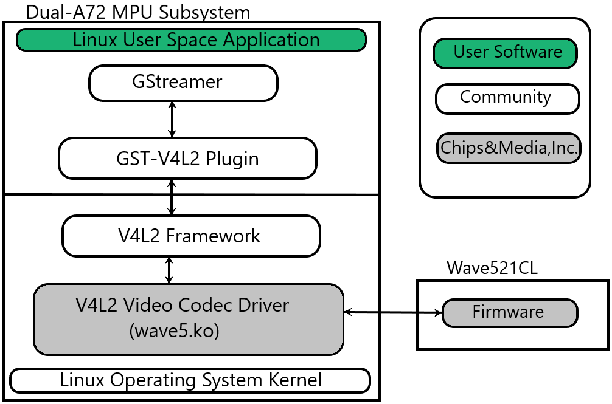

.. _foundational-components-multimedia:

######################
Multimedia Video Codec
######################

************
Introduction
************

The Wave5 Codec IP is a combined H.264 and H.265 stateful encoder/decoder. It is found on the Texas Instruments |__PART_FAMILY_DEVICE_NAMES__| SoC.

Hardware capabilities:
   - Maximum resolution: 8192x8192 (It can handle this resolution, but not
     necessarily in real-time.)
   - Minimum resolution: 256x128

Constraints :
   - A picture width shall be multiple of 8.
   - A picture height shall be multiple of 8.

Multiple concurrent encode/decode streams :
   - Number of concurrent streams dependant on resolution and framerate.

Encoder :
   - Capable of encoding H.265 Main and Main Still Picture Profile @ L5.1 High tier.
   - Capable of encoding H.264 Baseline/Constrained Baseline/Main/High Profiles Level @ L5.2.

Decoder :
   - Capable of decoding H.265 Main and Main Still Picture Profile @ L5.1 High tier.
   - Capable of decoding H.264 Baseline/Constrained Baseline/Main/High Profiles @ L5.2.

*********************
Software Architecture
*********************

Software Stack of Accelerated Codec Encoding/Decoding
=====================================================

As shown in the figures below, the software stack of the accelerated
encoding and decoding has two parts:

.. ifconfig:: CONFIG_part_variant in ('AM62AX', 'AM62PX', 'J722S', 'AM67')

   - A V4L2 (Video4Linux version 2) software driver running on Linux on the A53 MPU subsystem
   - The firmware running on the DECODER and ENCODER

.. ifconfig:: CONFIG_part_variant in ('J721S2', 'J784S4', 'J742S2')

   - A V4L2 (Video4Linux version 2) software driver running on Linux on the A72 MPU subsystem
   - The firmware running on the DECODER and ENCODER

The driver communicates with the firmware running on the ENCODER/DECODER
through its own IPC (inter-processor communication).

.. ifconfig:: CONFIG_part_variant in ('AM62AX', 'AM62PX', 'J722S', 'AM67')

   For the DECODER, at the highest level in the MPU subsystem on the A53,
   there is a Linux user space application which is based on GStreamer. GStreamer
   is an open source framework that simplifies the development of multimedia
   applications. The GStreamer library loads and interfaces with the GStreamer
   plugin (V4L2 plugin), which handles all the details specific to the use of
   the hardware accelerator. Specifically, the GStreamer plugin interfaces
   with the V4L2 decoder kernel driver interface.

.. ifconfig:: CONFIG_part_variant in ('J721S2', 'J784S4', 'J742S2')

   For the DECODER, at the highest level in the MPU subsystem on the A72,
   there is a Linux user space application which is based on GStreamer. GStreamer
   is an open source framework that simplifies the development of multimedia
   applications. The GStreamer library loads and interfaces with the GStreamer
   plugin (V4L2 plugin), which handles all the details specific to the use of
   the hardware accelerator. Specifically, the GStreamer plugin interfaces
   with the V4L2 decoder kernel driver interface.

   CODEC Software Stack

Linux Kernel Drivers
====================

.. rubric:: TI-Provided V4L2 Drivers for Multimedia
   :name: ti-provided-v4l2-drivers-for-multimedia

Video4Linux version 2 (V4L2) is an open source framework that
provides a media interface to all Linux-based applications. V4L2 is
a collection of device drivers and an API for supporting realtime
video capture and video memory-to-memory operations on Linux systems.

Video encode and decode using the ENCODER and DECODER hardware, respectively,
are enabled as V4L2 drivers. The V4L2 is integrated with the ENCODER and
DECODER drivers by a thin layer that implements the V4L2 node ioctls
and translates the V4L2 data structures to those understood by the
ENCODER/DECODER.

The V4L2 drivers that are integrated with ENCODER and DECODER are fully conformant
with the upstream standards. This can be tested as follows:

.. code-block:: console

   v4l2-compliance -d0

.. code-block:: text

   Compliance test for wave5-dec device /dev/video0:

   Driver Info:
      Driver name      : wave5-dec
      Card type        : wave5-dec
      Bus info         : platform:4210000.video-codec
      Driver version   : 6.6.44
      Capabilities     : 0x84204000
         Video Memory-to-Memory Multiplanar
         Streaming
         Extended Pix Format
         Device Capabilities
      Device Caps      : 0x04204000
         Video Memory-to-Memory Multiplanar
         Streaming
         Extended Pix Format
      Detected Stateful Decoder

   Required ioctls:
      test VIDIOC_QUERYCAP: OK
      test invalid ioctls: OK

   Allow for multiple opens:
      test second /dev/video0 open: OK
      test VIDIOC_QUERYCAP: OK
      test VIDIOC_G/S_PRIORITY: OK
      test for unlimited opens: OK

   Debug ioctls:
      test VIDIOC_DBG_G/S_REGISTER: OK (Not Supported)
      test VIDIOC_LOG_STATUS: OK (Not Supported)

   Input ioctls:
      test VIDIOC_G/S_TUNER/ENUM_FREQ_BANDS: OK (Not Supported)
      test VIDIOC_G/S_FREQUENCY: OK (Not Supported)
      test VIDIOC_S_HW_FREQ_SEEK: OK (Not Supported)
      test VIDIOC_ENUMAUDIO: OK (Not Supported)
      test VIDIOC_G/S/ENUMINPUT: OK (Not Supported)
      test VIDIOC_G/S_AUDIO: OK (Not Supported)
      Inputs: 0 Audio Inputs: 0 Tuners: 0

   Output ioctls:
      test VIDIOC_G/S_MODULATOR: OK (Not Supported)
      test VIDIOC_G/S_FREQUENCY: OK (Not Supported)
      test VIDIOC_ENUMAUDOUT: OK (Not Supported)
      test VIDIOC_G/S/ENUMOUTPUT: OK (Not Supported)
      test VIDIOC_G/S_AUDOUT: OK (Not Supported)
      Outputs: 0 Audio Outputs: 0 Modulators: 0

   Input/Output configuration ioctls:
      test VIDIOC_ENUM/G/S/QUERY_STD: OK (Not Supported)
      test VIDIOC_ENUM/G/S/QUERY_DV_TIMINGS: OK (Not Supported)
      test VIDIOC_DV_TIMINGS_CAP: OK (Not Supported)
      test VIDIOC_G/S_EDID: OK (Not Supported)

   Control ioctls:
      test VIDIOC_QUERY_EXT_CTRL/QUERYMENU: OK
      test VIDIOC_QUERYCTRL: OK
      test VIDIOC_G/S_CTRL: OK
      test VIDIOC_G/S/TRY_EXT_CTRLS: OK
      test VIDIOC_(UN)SUBSCRIBE_EVENT/DQEVENT: OK
      test VIDIOC_G/S_JPEGCOMP: OK (Not Supported)
      Standard Controls: 2 Private Controls: 0

   Format ioctls:
      test VIDIOC_ENUM_FMT/FRAMESIZES/FRAMEINTERVALS: OK
      test VIDIOC_G/S_PARM: OK (Not Supported)
      test VIDIOC_G_FBUF: OK (Not Supported)
      test VIDIOC_G_FMT: OK
      test VIDIOC_TRY_FMT: OK
      test VIDIOC_S_FMT: OK
      test VIDIOC_G_SLICED_VBI_CAP: OK (Not Supported)
      test Cropping: OK (Not Supported)
      test Composing: OK
      test Scaling: OK (Not Supported)

   Codec ioctls:
      test VIDIOC_(TRY_)ENCODER_CMD: OK (Not Supported)
      test VIDIOC_G_ENC_INDEX: OK (Not Supported)
      test VIDIOC_(TRY_)DECODER_CMD: OK

   Buffer ioctls:
         warn: v4l2-test-buffers.cpp(693): VIDIOC_CREATE_BUFS not supported
         warn: v4l2-test-buffers.cpp(693): VIDIOC_CREATE_BUFS not supported
      test VIDIOC_REQBUFS/CREATE_BUFS/QUERYBUF: OK
      test CREATE_BUFS maximum buffers: OK
      test VIDIOC_EXPBUF: OK
      test Requests: OK (Not Supported)

   Total for wave5-dec device /dev/video0: 46, Succeeded: 46, Failed: 0, Warnings: 2

Similarly for the encoder, V4L2 compliance tests report can be generated by following command:

.. code-block:: console

   v4l2-compliance -d1

.. code-block:: text

   Compliance test for wave5-enc device /dev/video1:

   Driver Info:
      Driver name      : wave5-enc
      Card type        : wave5-enc
      Bus info         : platform:4210000.video-codec
      Driver version   : 6.6.44
      Capabilities     : 0x84204000
         Video Memory-to-Memory Multiplanar
         Streaming
         Extended Pix Format
         Device Capabilities
      Device Caps      : 0x04204000
         Video Memory-to-Memory Multiplanar
         Streaming
         Extended Pix Format
      Detected Stateful Encoder

   Required ioctls:
      test VIDIOC_QUERYCAP: OK
      test invalid ioctls: OK

   Allow for multiple opens:
      test second /dev/video1 open: OK
      test VIDIOC_QUERYCAP: OK
      test VIDIOC_G/S_PRIORITY: OK
      test for unlimited opens: OK

   Debug ioctls:
      test VIDIOC_DBG_G/S_REGISTER: OK (Not Supported)
      test VIDIOC_LOG_STATUS: OK (Not Supported)

   Input ioctls:
      test VIDIOC_G/S_TUNER/ENUM_FREQ_BANDS: OK (Not Supported)
      test VIDIOC_G/S_FREQUENCY: OK (Not Supported)
      test VIDIOC_S_HW_FREQ_SEEK: OK (Not Supported)
      test VIDIOC_ENUMAUDIO: OK (Not Supported)
      test VIDIOC_G/S/ENUMINPUT: OK (Not Supported)
      test VIDIOC_G/S_AUDIO: OK (Not Supported)
      Inputs: 0 Audio Inputs: 0 Tuners: 0

   Output ioctls:
      test VIDIOC_G/S_MODULATOR: OK (Not Supported)
      test VIDIOC_G/S_FREQUENCY: OK (Not Supported)
      test VIDIOC_ENUMAUDOUT: OK (Not Supported)
      test VIDIOC_G/S/ENUMOUTPUT: OK (Not Supported)
      test VIDIOC_G/S_AUDOUT: OK (Not Supported)
      Outputs: 0 Audio Outputs: 0 Modulators: 0

   Input/Output configuration ioctls:
      test VIDIOC_ENUM/G/S/QUERY_STD: OK (Not Supported)
      test VIDIOC_ENUM/G/S/QUERY_DV_TIMINGS: OK (Not Supported)
      test VIDIOC_DV_TIMINGS_CAP: OK (Not Supported)
      test VIDIOC_G/S_EDID: OK (Not Supported)

   Control ioctls:
      test VIDIOC_QUERY_EXT_CTRL/QUERYMENU: OK
      test VIDIOC_QUERYCTRL: OK
      test VIDIOC_G/S_CTRL: OK
      test VIDIOC_G/S/TRY_EXT_CTRLS: OK
      test VIDIOC_(UN)SUBSCRIBE_EVENT/DQEVENT: OK
      test VIDIOC_G/S_JPEGCOMP: OK (Not Supported)
      Standard Controls: 47 Private Controls: 0

   Format ioctls:
      test VIDIOC_ENUM_FMT/FRAMESIZES/FRAMEINTERVALS: OK
      test VIDIOC_G/S_PARM: OK
      test VIDIOC_G_FBUF: OK (Not Supported)
      test VIDIOC_G_FMT: OK
      test VIDIOC_TRY_FMT: OK
      test VIDIOC_S_FMT: OK
      test VIDIOC_G_SLICED_VBI_CAP: OK (Not Supported)
      test Cropping: OK
      test Composing: OK (Not Supported)
      test Scaling: OK (Not Supported)

   Codec ioctls:
      test VIDIOC_(TRY_)ENCODER_CMD: OK
      test VIDIOC_G_ENC_INDEX: OK (Not Supported)
      test VIDIOC_(TRY_)DECODER_CMD: OK (Not Supported)

   Buffer ioctls:
      test VIDIOC_REQBUFS/CREATE_BUFS/QUERYBUF: OK
      test CREATE_BUFS maximum buffers: OK
      test VIDIOC_EXPBUF: OK
      test Requests: OK (Not Supported)

   Total for wave5-enc device /dev/video1: 46, Succeeded: 46, Failed: 0, Warnings: 0

GStreamer Plugins for Multimedia
================================

.. rubric:: Open Source GStreamer Overview
   :name: open-source-gstreamer-overview

GStreamer is an open source framework that simplifies the development of
multimedia applications, such as media players and capture encoders. It
encapsulates existing multimedia software components, such as codecs,
filters, and platform-specific I/O operations, by using a standard
interface and providing a uniform framework across applications.

The modular nature of GStreamer facilitates the addition of new
functionality, transparent inclusion of component advancements and
allows for flexibility in application development and testing.
Processing nodes are implemented via GStreamer plugins with several sink
and/or source pads. Many plugins are running as ARM software
implementations, but for more complex SoCs, certain functions are better
executed on hardware-accelerated IPs like wave5 (DECODER and ENCODER).

GStreamer is a multimedia framework based on data flow paradigm. It allows
easy plugin registration just by deploying new shared objects to the
:file:`/usr/lib/gstreamer-1.0` folder. The shared libraries in this folder are
scanned for reserved data structures identifying capabilities of
individual plugins. Individual processing nodes can be interconnected as
a pipeline at run-time, creating complex topologies. Node interfacing
compatibility is verified at that time - before the pipeline is started.

GStreamer brings a lot of value-added features to |__SDK_FULL_NAME__|,
including audio encoding/decoding, audio/video synchronization, and
interaction with a wide variety of open source plugins (muxers,
demuxers, codecs, and filters). New GStreamer features are continuously
being added, and the core libraries are actively supported by
participants in the GStreamer community. Additional information about
the GStreamer framework is available on the GStreamer project site:
https://gstreamer.freedesktop.org/

.. rubric:: Hardware-Accelerated GStreamer Plugins
   :name: video-decode-gstreamer-plugins

One benefit of using GStreamer as a multimedia framework is that the
core libraries already build and run on ARM Linux. Only a GStreamer
plugin is required to enable additional hardware features on TI's
embedded processors with both ARM and hardware accelerators for
multimedia. The open source GStreamer plugins provide elements for
GStreamer pipelines that enable the use of hardware-accelerated video
decoding through the V4L2 GStreamer plugin.

Below is a list of GStreamer plugins that utilize the hardware-accelerated
video decoding/encoding in the |__PART_FAMILY_DEVICE_NAMES__|.

   - ENCODER
      #. v4l2h264enc
      #. v4l2h265enc
   - DECODER
      #. v4l2h264dec
      #. v4l2h265dec

V4L2 Video Encoder/Decoder
--------------------------

The V4L2 encoder/decoder driver supports the following bitstream
formats:

   - V4L2_PIX_FMT_H264
   - V4L2_PIX_FMT_HEVC

Wave5 encoder/decoder can work on raw data in the following formats:

   - V4L2_PIX_FMT_YUV420
   - V4L2_PIX_FMT_NV12
   - V4L2_PIX_FMT_NV21
   - V4L2_PIX_FMT_YUV420M
   - V4L2_PIX_FMT_NV12M
   - V4L2_PIX_FMT_NV21M
   - V4L2_PIX_FMT_YUV422P
   - V4L2_PIX_FMT_NV16
   - V4L2_PIX_FMT_NV61
   - V4L2_PIX_FMT_YUV422M
   - V4L2_PIX_FMT_NV16M
   - V4L2_PIX_FMT_NV61M

Encoder also has support for a few packed YUV422 formats. These formats only
apply to the input to encoder - decoder has no support for them. The formats include:

   - V4L2_PIX_FMT_YUYV
   - V4L2_PIX_FMT_YVYU
   - V4L2_PIX_FMT_UYVY

.. note::

   Raw data means input for the encoder and output for the decoder. For example, when
   encoding, your incoming camera feed can be in any of the previously mentioned formats
   and work with the encoder without any color conversion elements. Decoder can take an
   NV12 H264/H265 encoded stream and output raw data to display in any of the formats
   mentioned above assuming the display has support.

The V4L2 gstreamer plugins are only able to handle a subset of colorimetries. If the
colorimetry is not supported, the gstreamer pipeline will fail to negotiate the format even
if the pixel formats are compatible. Wave5 supports all the colorimetries supported by the
V4L2 gstreamer elements. The supported colorimetries are:

   - V4L2_COLORIMETRY_BT601
   - V4L2_COLORIMETRY_BT709
   - V4L2_COLORIMETRY_BT2020

********************************
Encoder and Decoder Capabilities
********************************

.. ifconfig:: CONFIG_part_variant in ('J721S2', 'AM62PX', 'J722S')

   The Max Capability of the Encoder/Decoder is 4K60fps equivalent load.

   .. code-block:: text

      Maximum instances supported is 32 (Encode/Decode/Encode+Decode).
      Eg: MAX 32 can be
      (16 Enc + 16 Dec) OR (32 Enc) OR (32 Dec).
      (32 Enc + 32 Dec) - Not possible

.. ifconfig:: CONFIG_part_variant in ('J784S4','J742S2')

   The Max Capability of the Encoder/Decoder is 2x4K60fps equivalent load.

   .. code-block:: text

      Maximum instances supported is 64 (Encode/Decode/Encode+Decode).
      Eg: MAX 64 can be
      (32 Enc + 32 Dec) OR (64 Enc) OR (64 Dec).
      (64 Enc + 64 Dec) - Not possible

.. ifconfig:: CONFIG_part_variant in ('AM62AX')

   The Max Capability of the Encoder/Decoder is 4K30fps equivalent load.

   .. code-block:: text

      Maximum instances supported is 32 (Encode/Decode/Encode+Decode).
      Eg: MAX 32 can be
      (16 Enc + 16 Dec) OR (32 Enc) OR (32 Dec).
      (32 Enc + 32 Dec) - Not possible

.. note::

   The number of instances is bound to the available CMA Memory.

The external controls supported by Encoder and Decoder can be seen using below command.

.. code-block:: text

   Encoder: v4l2-ctl -d 1 -l
   Decoder: v4l2-ctl -d 0 -l

*******************
GStreamer Pipelines
*******************

Encode from raw YUV (I420) file:
   - H.264

      .. code-block:: console

         target # gst-launch-1.0 filesrc location=/<path_to_file>  ! rawvideoparse width=1920 height=1080 format=i420 framerate=30/1 colorimetry=bt709 ! v4l2h264enc ! filesink location=/<path_to_file>  sync=true

   - H.265

      .. code-block:: console

         target # gst-launch-1.0 filesrc location=/<path_to_file>  ! rawvideoparse width=1920 height=1080 format=i420 framerate=30/1 colorimetry=bt709 ! v4l2h265enc ! filesink location=/<path_to_file>  sync=true

Decode from raw file:
   - H.264

      .. code-block:: console

         target # gst-launch-1.0 filesrc location=/<path_to_file>  ! h264parse ! queue ! v4l2h264dec ! video/x-raw,format='(string)'I420 ! videocodectestsink location=/<path_to_file>

   - H.265:

      .. code-block:: console

         target # gst-launch-1.0 filesrc location=/<path_to_file>  ! h265parse ! queue ! v4l2h265dec ! video/x-raw,format='(string)'I420 ! videocodectestsink location=/<path_to_file>

Video only file playback:

.. code-block:: console

   target # gst-launch-1.0 filesrc location=./bbb_1080p60_30s.h264 ! h264parse ! v4l2h264dec capture-io-mode=dmabuf ! kmssink driver-name=tidss -v

Audio/Video file playback (h264/aac muxed file as example):

.. code-block:: console

   target # gst-launch-1.0 filesrc location=bbb_1080p_aac.mp4 ! qtdemux name=demux demux.video_0 ! h264parse ! v4l2h264dec capture-io-mode=dmabuf ! queue ! kmssink driver-name=tidss demux.audio_0 ! queue ! faad ! audioconvert ! audioresample ! audio/x-raw, channels=2, rate=48000 ! autoaudiosink

Transcode use-case (h264->h265 conversion as example):

.. code-block:: console

   target # gst-launch-1.0 filesrc location=./sample_file.264 ! h264parse ! v4l2h264dec capture-io-mode=4 ! v4l2h265enc output-io-mode=5 ! filesink location=./output.265

Video Streaming use-case:
   - Server (imx219 rawcamera->isp->encode->streamout):

      .. code-block:: console

         target # gst-launch-1.0 v4l2src device=/dev/video2 io-mode=dmabuf ! video/x-bayer,width=1920,height=1080, framerate=30/1, format=bggr ! tiovxisp sensor-name=SENSOR_SONY_IMX219_RPI dcc-isp-file=/opt/imaging/imx219/dcc_viss.bin sink_0::dcc-2a-file=/opt/imaging/imx219/dcc_2a.bin sink_0::device=/dev/v4l-subdev2 ! video/x-raw,format=NV12 ! v4l2h264enc output-io-mode=dmabuf-import extra-controls="controls,h264_i_frame_period=60" ! rtph264pay ! udpsink port=5000 host=<ip_address>

   - Client (streamin->decode->display):

      .. code-block:: console

         target # gst-launch-1.0 -v udpsrc port=5000 caps = "application/x-rtp, media=(string)video, clock-rate=(int)90000, encoding-name=(string)H264, payload=(int)96" ! rtpjitterbuffer latency=50 ! rtph264depay ! h264parse ! v4l2h264dec capture-io-mode=dmabuf ! queue ! fpsdisplaysink text-overlay=false name=fpssink video-sink="kmssink driver-name=tidss sync=true show-preroll-frame=false" sync=true -v

.. note::

   In Encode testcases, ``colorimetry`` should be specified to avoid negotiation failures. For example:

   .. code-block:: console

      target # gst-launch-1.0 filesrc location=sample_1072.yuv blocksize=3087360 ! rawvideoparse width=1920 height=1072 framerate=30/1 format=nv12 colorimetry=bt709 ! v4l2h264enc ! h264parse ! fakesink

*****************************
FFmpeg Plugins for Multimedia
*****************************

:command:`ffmpeg` is an open-source multimedia framework. This is useful for decoding, encoding and transcoding videos. This is a command line tool.

The library comes with :command:`ffplay` and :command:`ffprobe`.

:command:`ffplay` is a very simple and portable media player using the :command:`ffmpeg` libraries and the SDL library. It is mostly used as a testbed for the various :command:`ffmpeg` APIs.

:command:`ffprobe` gathers information from multimedia streams and prints it in human and machine-readable fashion.

For example, it can be used to check the format of the container used and the format and type of each media stream contained in it.

To enable :command:`ffplay`, the following needs to be added to :file:`local.conf`:

.. code-block::  text

   PACKAGECONFIG:append:pn-ffmpeg = " sdl2"

More information about the :command:`ffmpeg` tools can be found here:
   - https://ffmpeg.org/ffmpeg.html
   - https://ffmpeg.org/ffplay.html
   - https://ffmpeg.org/ffprobe.html

ffmpeg
======

Help Flags
----------
``-h`` or ``-?`` or ``-help``
   Topic show help
``-codecs``
   Displays all codecs supported
``-decoders``
   Displays all decoders supported
``-formats``
   Displays all available formats
``-pix_fmts``
   Displays all available pixel formats

``-codec:v``
   Specifies the stream decoder. For decoding, we only ``hevc_v4l2m2m`` and ``h264_v4l2m2m``. :v stands for video

Stream Specific Flags
---------------------
``-re``
   Reads input at native frame rate
``-i [filename]``
   Input stream
``-fps_mode passthrough``
   Allows for frames to pass even if out of sync. Needed since there are no timestamps in decoded h264/5 streams that use the hardware GPU to decode. Must be placed in between input and output stream
``-pix_fmt``
   Specifies the pixel format for the output stream. NV12 is recommended for wave5
``-f``
   Forces format of output stream
``-frames``
   Set the number of frames to record

ffplay
======
``-framerate``
   Specifies framerate of display stream
``-video_size``
   Specifies video size of video. It may be the string of the form or *widthxheigh*. For example, 2k or 2048x1080 are equivalent.
``-pixel_format``
   Specifies pixel format of display stream
``-f``
   Forces format of display stream
``-fs``
   Start in fullscreen mode
``-autoexit``
   Exits ffplay after stream is finished

ffprobe
=======
``-show_data``
   Show payload data, as a hexadecimal and ASCII dump. Coupled with -show_packets, it will dump the packets’ data. Coupled with -show_streams, it will dump the codec extradata
   The dump is printed as the "data" field. It may contain newlines
``-show_packets``
   Show information about each packet contained in the input multimedia stream
   The information for each single packet is printed within a dedicated section with name "PACKET"
``-show_frames``
   Show information about each frame and subtitle contained in the input multimedia stream
   The information for each single frame is printed within a dedicated section with name "FRAME" or "SUBTITLE"
``-show_format``
   Show information about the container format of the input multimedia stream
   All the container format information is printed within a section with name "FORMAT"

Example Commands
================

To convert a HEVC file to a raw video with pixel format NV12 named :file:`foo.yuv` with software acceleration, the following can be used:

.. code-block:: console

   ffmpeg -i foo.265 -f rawvideo -pix_fmt nv12 foo.yuv

To convert a H264 file to a raw video named :file:`bar.yuv` with hardware acceleration and each frame passed, the following can be used:

.. code-block:: console

   ffmpeg -codec:v h264_v4l2m2m -i bar.h264 -f rawvideo -fps_mode passthrough bar.yuv

To play a H264 video and output to the display at fullscreen and exit once the video is done playing, the following can be used:

.. code-block:: console

   ffplay -fs -autoexit foobar.264

To pipe the output from ffmpeg to ffplay with hardware acceleration, the following can be used:

.. code-block:: console

   ffmpeg -re -codec:v hevc_v4l2m2m -i input.h265 -fps_mode passthrough -f rawvideo - | ffplay -framerate 30 -video_size 1920x1080 -f rawvideo -autoexit -

To print out the packet's data and payload data in hexadecimal from a given multimedia stream named :file:`foo.h265`, the following can be used:

.. code-block:: console

   ffprobe -show_data -show_packets foo.h265

To print information about each frame and/or subtitle in the given multimedia stream named :file:`bar.h264`, the following can be used:

.. code-block:: console

   ffprobe -show_frames bar.h264

**************************
MPV Plugins for Multimedia
**************************

mpv is a media player based on MPlayer and mplayer2. It supports a wide variety of video file formats, audio and video codecs, and subtitle types.
Special input URL types are available to read input from a variety of sources other than disk files.
Depending on platform, a variety of different video and audio output methods are supported.

This is a command line tool that can also use keyboard shortcuts.

https://mpv.io/manual/stable/

:command:`yt-dlp` can be combined with mpv to play videos from the web. (YouTube, TikTok, etc.)

To install :command:`yt-dlp` run the following command

.. code-block:: console

   python3 -m pip install yt-dlp

Useful Flags
============

``--vo=[driver]``

Specify the video output backend to be used. See `VIDEO OUTPUT DRIVERS <https://mpv.io/manual/stable/#video-output-drivers>`_ for details and descriptions of available drivers.

``--hwdec=[api1,api2,...|no|auto|auto-safe|auto-copy]``

Specify the hardware video decoding API that should be used if possible. Whether hardware decoding is actually done depends on the video codec. If hardware decoding is not possible, mpv will fall back on software decoding.
Hardware decoding is not enabled by default, to keep the out-of-the-box configuration as reliable as possible. However, when using modern hardware, hardware video decoding should work correctly, offering reduced CPU usage, and possibly lower power consumption.

``--gpu-context=[sys]``

The value auto (the default) selects the GPU context. You can also pass help to get a complete list of compiled in backends (sorted by autoprobe order).

``--fs``

Fullscreen playback.

``--autofit=<[W[xH]]>``

Set the initial window size to a maximum size specified by WxH, without changing the window's aspect ratio. The size is measured in pixels, or if a number is followed by a percentage sign (%), in percents of the screen size.
This option never changes the aspect ratio of the window. If the aspect ratio mismatches, the window's size is reduced until it fits into the specified size.

``--no-correct-pts``

Switches mpv to a mode where video timing is determined using a fixed framerate value (either using the --container-fps-override option, or using file information). Sometimes, files with very broken timestamps can be played somewhat well in this mode.

``--fps=[framerate]``

Set framerate of output stream. Can be combined with --no-correct-pts for streams with incorrect/no timestamps

Example Commands
================

To play a H264 video to display at 30 frames per seconds, the following can be used:

.. code-block:: console

   mpv --no-correct-pts --fps=30 foo.h264

To play a HEVC video with full/assisted hardware acceleration at 30 frames per second, the following can be used:

.. code-block:: console

   mpv --vo=gpu --hwdec=auto --no-correct-pts --fps=30 bar.h265

To play a mp4 video to display in fullscreen and set the gpu context to wayland, the following can be used:

.. code-block:: console

   mpv --vo=gpu --gpu-context=wayland --fs foobar.mp4

To download a video from a link and pipe the video to mpv with no correct points at 30 frames per seconds, the following can be used:

.. code-block:: console

   yt-dlp -o - <link> | mpv --no-correct-pts --fps=30 -

Tp download a video from a link at 1080p and play the video with mpv, the following can be used:

.. code-block:: console

   yt-dlp -f 270 -o - <link> | mpv -

``-f 232`` can be used to get a 720p video.

In instances where running yt-dlp doesn't work because of a protocol issue, updating to the newest version of yt-dlp or changing
the format/quality by running ``-f 270`` or ``-f 232`` for example, or playing other videos might solve the issue.

******************
Memory Requirement
******************

The following calculations are taken for 1080p single channel 30fps stream using vmstat.

   - Encoder
      #. v4l2h264enc : 31.78 MB
      #. v4l2h265enc : 31.90 MB
   - Decoder
      #. v4l2h264dec : 51.47 MB
      #. v4l2h265dec : 39.59 MB

.. note::

   The Actual Memory foot print may vary depending on the input stream.

*******************
Performance metrics
*******************

The following figures illustrate the theoretical latency of the IP with
regards to different resolutions.

   +---------------+------------+---------+
   | CodecH265/264 | Resolution | Latency |
   +---------------+------------+---------+
   |               | 4K         | 33.3 ms |
   |               +------------+---------+
   |               | 1080p      | 8.3 ms  |
   | Encoder       +------------+---------+
   |               | 720p       | 3.7 ms  |
   |               +------------+---------+
   |               | 480p       | 1.2 ms  |
   +---------------+------------+---------+

**********************************************************
Calculation of Performance metrics using native driver API
**********************************************************

The FW reports tick information and the wave5 driver can print the cycle information for each frame.
Please refer the below source code.

.. code-block:: c
   :caption: wave5_vpu_dec.c

   static void wave5_vpu_dec_finish_decode(struct vpu_instance *inst)
   {
       ...
       dev_dbg(inst->dev->dev, "%s: frame_cycle %8u (payload %lu)\n",
                        __func__, dec_info.frame_cycle,
                        vb2_get_plane_payload(&disp_buf->vb2_buf, 0));
       ...
   }

.. code-block:: c
   :caption: wave5_vpu_enc.c

   static void wave5_vpu_enc_finish_encode(struct vpu_instance *inst)
   {
       ...
       dev_dbg(inst->dev->dev, "%s: frame_cycle %8u\n",
                        __func__, enc_output_info.frame_cycle);
       ...
   }

Dividing the cycle information by the CPU Hz value, we can get the millisecond value.
For example,

Test environment : CPU 400MHz

#1 frame_cycle 489472 => 489472 / 400000000 = 0.00122368 millisecond

#2 frame_cycle 442368 => 442368 / 400000000 = 0.00110592 millisecond

#3 frame_cycle 429824 => 429824 / 400000000 = 0.00107456 millisecond

**************************************************
Calculation of Performance metrics using gstreamer
**************************************************

Latency
=======

The instantaneous pipeline and encoder latency be calculated using gstreamer tracer which provides latency in nanoseconds, as mentioned in the `upstream documentation <https://gstreamer.freedesktop.org/data/doc/gstreamer/head/gstreamer-plugins/html/gstreamer-plugins-latencytracer.html>`__.

Example:

Measuring Pipeline latency:
This is to measure total pipeline latency.

.. code-block:: text

   target # GST_TRACERS="latency" GST_DEBUG=GST_TRACER:7 GST_DEBUG_FILE="/run/latency.txt" gst-launch-1.0 videotestsrc ! v4l2h264enc ! fakesink sync=true -v

.. note::

   The per frame instantaneous latency is printed as "time=(guint64)<latency_in_ns>" at latency.txt

Measuring Per Element latency:

This is useful in case you have multiple elements in the pipeline after source element and you only want to measure latency impact of a particular element. Below example shows how to measure encoder
and decoder latencies in streamling pipeline described above.

Measuring encoder latency in server pipeline:

.. code-block:: console

   target # GST_TRACERS="latency(flags=pipeline+element)" GST_DEBUG=GST_TRACER:7 GST_DEBUG_FILE="/run/latency_server.txt" gst-launch-1.0 v4l2src io-mode=dmabuf device=/dev/video2 ! video/x-bayer,width=1920,height=1080,format=bggr ! tiovxisp sensor-name=SENSOR_SONY_IMX219_RPI dcc-isp-file=/opt/imaging/imx219/dcc_viss.bin sink_0::dcc-2a-file=/opt/imaging/imx219/dcc_2a.bin sink_0::device=/dev/v4l-subdev2 ! video/x-raw,format=NV12 ! v4l2h264enc output-io-mode=dmabuf-import extra-controls="controls,h264_i_frame_period=60" ! rtph264pay ! udpsink port=5000 host=<ip_address>

Instantaneous encoder latency (ns):

.. code-block:: console

   target # grep v4l2h264enc /run/latency_server.txt
   GST_TRACER :0:: element-latency, element-id=(string)0x901c90, element=(string)v4l2h264enc0, src=(string)src, time=(guint64)8493225, ts=(guint64)927133155;
   GST_TRACER :0:: element-latency, element-id=(string)0x901c90, element=(string)v4l2h264enc0, src=(string)src, time=(guint64)5777835, ts=(guint64)957085270;
   GST_TRACER :0:: element-latency, element-id=(string)0x901c90, element=(string)v4l2h264enc0, src=(string)src, time=(guint64)6741725, ts=(guint64)992160910;

.. note::

   The per frame instantaneous latency of video encoder can be found by searching for element name i.e. v4l2h264enc0 and which will be printed as "time=(guint64)<latency_in_ns>": as shown above.

Average encoder latency (ns):

.. code-block:: console

   target # cat /run/latency_server.txt | grep v4l2h264enc | awk -F"guint64)" '{print $2}' | awk -F"," '{total +=$1; count++} END { print total/count }'
   8.30307e+06

.. note::

   The average latency of video encoder (in nanoseconds) can be found by taking the average of instantaneous latencies for each frame as shown above.

Measuring decoder latency in client pipeline:

.. code-block:: console

   target # GST_TRACERS="latency(flags=pipeline+element)" GST_DEBUG_FILE="/run/latency_client.txt" gst-launch-1.0 -v udpsrc port=5000 caps = "application/x-rtp, media=(string)video, clock-rate=(int)90000, encoding-name=(string)H264, payload=(int)96" ! rtpjitterbuffer latency=50 ! rtph264depay ! h264parse ! v4l2h264dec capture-io-mode=dmabuf ! kmssink

Instantaneous decoder latency (ns):

.. code-block:: console

   target # grep v4l2h264dec /run/latency_client.txt
   GST_TRACER :0:: element-latency, element-id=(string)0x3c290540, element=(string)v4l2h264dec0, src=(string)src, time=(guint64)72057650, ts=(guint64)5330984535;
   GST_TRACER :0:: element-latency, element-id=(string)0x3c290540, element=(string)v4l2h264dec0, src=(string)src, time=(guint64)72092165, ts=(guint64)5396039490;
   ...

Average decoder latency (ns)

.. code-block:: console

   target # cat /run/latency_client.txt | grep v4l2h264dec | awk -F"guint64)" '{print $2}' | awk -F"," '{total +=$1; count++} END { print total/count }'
   7.70918e+07

.. ifconfig:: CONFIG_part_variant in ('AM62AX')

   +---------------+------------+---------+
   | Codec H264    | Resolution | Latency |
   +---------------+------------+---------+
   | Encoder       | 1080p      | 8.3 ms  |
   +---------------+------------+---------+
   | Decoder       | 1080p      | 77 ms   |
   +---------------+------------+---------+

Performance
===========

The max throughput of encoder and decoder elements can be measured using ``fpsdisplaysink`` element as mentioned below:

Encoder framerate:

.. code-block:: console

   target # gst-launch-1.0 filesrc location=/<path_to_file>  ! rawvideoparse width=1920 height=1080 format=i420 framerate=30/1 ! v4l2h264enc ! fpsdisplaysink text-overlay=false name="fakesink sync=false" sync=false -v

Decoder framerate:

.. code-block:: console

   target # gst-launch-1.0 filesrc location=./sample_file.264 ! h264parse ! v4l2h264dec capture-io-mode=dmabuf ! fpsdisplaysink name=fpssink text-overlay=false video-sink="fakevideosink sync=false" sync=false -v

.. note::

   Frames per Second achieved by the pipeline will be shown on console logs as seen below:

   .. code-block:: text

      /GstPipeline:pipeline0/GstFPSDisplaySink:fpssink/GstFakeVideoSink:fakevideosink0/GstFakeSink:sink: sync = false
      /GstPipeline:pipeline0/GstFPSDisplaySink:fpssink: last-message = rendered: 102, dropped: 0, current: 202.05, average: 202.05
      /GstPipeline:pipeline0/GstFPSDisplaySink:fpssink: last-message = rendered: 203, dropped: 0, current: 200.04, average: 201.04
      /GstPipeline:pipeline0/GstFPSDisplaySink:fpssink: last-message = rendered: 303, dropped: 0, current: 199.99, average: 200.69

************************
DMA Buffer Import/Export
************************

Buffer import on encoder can be tested by setting the ``output-io-mode`` to ``5`` or ``dmabuf-import``. Example below:

.. code-block:: console

   target # gst-launch-1.0 filesrc location=./sample_file.264 ! h264parse ! v4l2h264dec capture-io-mode=4 ! v4l2h264enc output-io-mode=5 ! filesink location=./output.264
   target # gst-launch-1.0 filesrc location=./sample_file.264 ! h264parse ! v4l2h264dec capture-io-mode=4 ! v4l2h264enc output-io-mode=dmabuf-import ! filesink location=./output.264

Buffer export on decoder can be tested by setting the ``capture-io-mode`` to ``4`` or ``dmabuf``. Example below:

.. code-block:: console

   target # gst-launch-1.0 filesrc location=./sample_file.264 ! h264parse ! v4l2h264dec capture-io-mode=dmabuf ! kmssink driver-name="tidss" -v

Buffer import on decoder can be tested by setting the ``capture-io-mode`` to ``5`` or ``dmabuf-import``. Example below:

.. code-block:: console

   target # gst-launch-1.0 filesrc location=./sample_file.264 ! h264parse ! v4l2h264dec capture-io-mode=5 ! kmssink driver-name="tidss" -v

.. note::

   Known Limitations:

      #. The full set of encoder configurations is not currently exposed through
         the V4L2 interface. See compliance data for what is available.
      #. Current driver supports 8 channel 1080p Encode and 8ch 1080p Decode
         owing to the default CMA Memory configuration.
