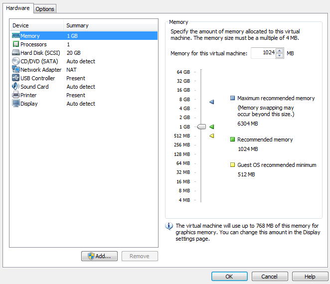

.. http://processors.wiki.ti.com/index.php/How_to_Build_a_Ubuntu_Linux_host_under_VMware

.. _how-to-build-a-ubuntu-linux-host-under-vmware:

How to Build a Ubuntu Linux host under VMware
==================================================================

.. rubric:: Warning
   :name: warning

**This content is no longer maintained. It has been left here in case it
can help someone, but it will not be maintained and will eventually move
out of date. If you choose to use a Virtual Machine to host your
development version of Linux on a PC, the VM provider will provide up to
date information that is better and more complete than what we've
provided here.**

.. rubric:: Introduction
   :name: introduction-build-ubuntu-linux-host-under-vmware

This guide demonstrates how to get a virtual Ubuntu Linux machine
running with VMware under Windows 7.  Please use only the 32-bit Ubuntu
14.04 release as this is what is called an LTS (Long Term Support). 
There are SDK scripts that will be checking for this release identity.

**Requirements**:

-  Windows 7 host with internet connection, at least 1G of RAM and 40G
   of free hard drive space.

The instructions here are for setting up a 40G virtual machine.  The
entire 40G is not taken at once, but as the machine is used and software
is installed, the machine can grow and take up as much as 40G. 

.. rubric:: Download the Ubuntu 14.04 LTS ISO image
   :name: download-the-ubuntu-14.04-ltsiso-image

Get the Ubuntu 14.04 LTS CD ISO image from:
http://releases.ubuntu.com/14.04/. Select PC (Intel x86) desktop CD
under the Desktop CD section.

Click download and the follow instructions to download and save the ISO
image somewhere. Remember where you save this - you will need the ISO
soon!(CD image).

.. rubric:: Download VMware and install
   :name: download-vmware-and-install

Get VMware from: http://www.vmware.com

Vmware Player is a free download from the website and enables the user
to create an entire virtual machine from scratch using just the ISO
image downloaded from Ubuntu.  It is necessary to sign up for an account
at VMware in order to get to the download areas.  The general steps to
getting VMware are as follows:

-  Login to the vmware website
-  Select VMware Player from the products menu
-  Follow the steps to download VMware Player

**NOTE - We have tested with v7.0.0 with no known issues.  As of
Feburary, 2015, v7.0.0 is the latest version.**

-  Run the executable to install VMware
-  Accept license and all default settings.

.. rubric:: Create a New Virtual Machine with VMware
   :name: create-a-new-virtual-machine-with-vmware

Before starting a new installation it is assumed that the Windows host
has a proper internet connection to a DHCP server and that the Windows
host has enough hard drive space for the new virtual machine.

The following steps are performed with VMware 7.0.0.  The exact steps
with other versions may vary slightly

-  Start VMware.
-  From the File menu select "Create a New Virtual Machine..."
-  Choose to install the operating system later.  Click "Next".
-  Select Linux as the "Guest Operating System" and then choose Ubuntu
   as the "Version".  Click "next".
-  Provide a "Virtual machine name" and "Location" where the machine
   will be stored on the Windows host.  The defaults are fine here. 
   Click "Next".
-  For "Maximum disk size (GB)" it is good to start with 40G if
   possible.  This means that it will take up 40G on the Windows host.
   Make sure that the Windows host has at least this much before
   proceeding. It is also a good practice to tell VMware to split the
   virtual disk into 2G files. This will makes the image easier to copy
   and transport if necessary. Click "Next".
-  Click "Finish" to complete the creation of the virtual machine.

The machine name will now be listed under the home page of VMware. It is
necessary to modify some machine settings before playing the machine for
the first time. Select the machine in the home page and then click on
"Edit virtual machine settings" on the right.

Click on CD/DVD and change the connection to "Use ISO image file". Click
on "Browse..." and select the Ubuntu ISO image file that was previously
downloaded. Click on Network Adapter and change the Network connection
to "Bridged" and then check the box to "Replicate physical network
connection state".

.. rubric:: Adding a serial port to the virtual machine
   :name: adding-a-serial-port-to-the-virtual-machine

If you plan to use a serial terminal application, a serial port must be
added to the virtual machine.  This port must be a physical serial port
which exists on the host PC.  Click on "Add..." and select "Serial
Port".  Click "Next".  Choose "Use physical serial port on host".  Click
"Next".  Click Finish.  Click "Ok".

| 

Since this is a physical port on the host PC, it cannot be used by the
host PC and the virtual machine at the same time.  When the virtual
machine is started, the serial port will be unavailable for use by the
host PC.  If the serial port is being used at the time that the virtual
machine is started, the virtual machine will not be able to access the
serial port after it is booted up.  So if you want the virtual machine
to gain control of the physical serial port of the host PC, there can
not be any application like hyperterminal or teraterm running on the
host PC at the time that the virtual machine is started.

Further instructions for using the serial port with minicom inside of
Ubuntu are
`here <http://processors.wiki.ti.com/index.php/Setting_up_Minicom_in_Ubuntu>`__.

| Minicom is the preferred application for use with the Sitara SDK.  And
  the installation and setup of minicom is done automattically by the
  Sitara SDK installer. 

| 

Now click on "Play virtual machine".  Since this is the first time
starting the machine and the Ubuntu ISO image is in the virtual CD
drive, the Ubuntu OS will install itself in the virtual machine.

Click through the Ubuntu installation, making the appropriate choices as
you go.  This will help with SDK installation scripts.

.. Image:: /images/Vmware-player.PNG

| 
| The full installation will take 20-30 minutes.  When it completes the
  machine will reboot.  The machine will now prompt for the username and
  password that you created during the installation.

After the machine reboots into Ubuntu it is helpful to take the Ubuntu
ISO out of the virtual CD drive.  Click on the VM menu and select
"Settings...".  Click on CD/DVD and change the connection from "Use
ISO image file" to "Use physical drive".  The actual drive letter can be
selected from the drop down list.  If there is no physical drive on the
host machine, the CD/DVD device can be simply removed from the machine.

.. rubric:: Install VMware Tools
   :name: install-vmware-tools

VMware tools is a very useful addition to VMware.  It allows you to
resize the VMware screen ,cut-and-paste of text and drag and drop files
from the Ubuntu machine to and from the Windows host.

Within the virtual machine window click the Player -> Manage ->
Install VMware Tools

.. Image:: /images/Install_vmware_tools.png

The VMware tools are contained in an ISO image that VMware
will automatically mount.  This drive will show up on the Ubuntu
desktop as if it were a disk in a DVD drive.

.. Image:: /images/Vmware-tools-cd.png

There will be a single tarball on the drive named
VMwareTools-9.9.0-2304977.tar.gz (or with a slightly different version
number). Extract the tarball somewhere in your /home/<user>
directory.  You will see that a vmware-tools-distrib folder was
created and a file name vmware-install.pl inside. Execute
vmware-install.pl to install VMware Tools.  The Perl script must be
executed as a super-user.  This is done in Ubuntu by pre-pending the
command with "sudo".  When prompted for a password, enter the
password for the user account.  In Ubuntu, there is no "root"
account.  However, the first user account created when Ubuntu is
installed can become a super-user with the "sudo" command. Select all
of defaults during installation of VMware Tools.

An example is shown below. 

::

    sitara@sitara-virtual-machine:~$ cd
    sitara@sitara-virtual-machine:~$ tar -xzvf /media/sitara/VMware\ Tools/VMwareTools-9.9.0-2304977.tar.gz
    sitara@sitara-virtual-machine:~$ sudo ./vmware-tools-distrib/vmware-install.pl

.. rubric:: Confirming a Valid Network Connection
   :name: confirming-a-valid-network-connection

After logging into the machine for the first time, bring up a terminal
window.  This can be found under the Applications menu in Ubuntu. 
Applications --> Accessories --> Terminal.  Type **pwd** in this
terminal.  This should return **/home/<user>**.  Now type **ifconfig**. 
This should return information about the network connection.  Under
**eth0** the IP address should be similar (but not the same) as the IP
address owned by the Windows host.

::

    sitara@sitara-virtual-machine:~$ ifconfig
    eth0 Link encap:Ethernet HWaddr 00:0c:29:da:a8:6e
    inet addr:128.247.107.65 Bcast:128.247.107.255 Mask:255.255.254.0
    inet6 addr: fe80::20c:29ff:feda:a86e/64 Scope:Link
    UP BROADCAST RUNNING MULTICAST MTU:1500 Metric:1
    RX packets:759 errors:0 dropped:0 overruns:0 frame:0
    TX packets:32 errors:0 dropped:0 overruns:0 carrier:0
    collisions:0 txqueuelen:1000
    RX bytes:62873 (62.8 KB) TX bytes:4937 (4.9 KB)
    Interrupt:19 Base address:0x2024

    lo Link encap:Local Loopback
    inet addr:127.0.0.1 Mask:255.0.0.0
    inet6 addr: ::1/128 Scope:Host
    UP LOOPBACK RUNNING MTU:16436 Metric:1
    RX packets:12 errors:0 dropped:0 overruns:0 frame:0
    TX packets:12 errors:0 dropped:0 overruns:0 carrier:0
    collisions:0 txqueuelen:0
    RX bytes:720 (720.0 B) TX bytes:720 (720.0 B)

| 

.. rubric:: How to Read a USB SD Card Reader in VMware
   :name: how-to-read-a-usbsdcard-reader-in-vmware

| Sometimes there will be a need to connect a SD Card to the Virtual
  Machine (for example, to run the create SD card script provided with
  the SDK that partitions, formats, and populates a SD card that can be
  used with a target board). When a USB card reader with an SD card is
  inserted into the USB slot of the host machine, the virtual machine
  will automatically detect the drive and mount partitions from the SD
  card, making the card available to Linux running in the virtual
  machine.
| If this does not happen automatically (i.e. the SD card cannot be
  accessed from the Linux VM), it can be done manually by clicking the
  Player menu -> Removable Devices and then selecting the card reader.
  From this sub-menu it is possible to connect or disconnect the USB
  card reader.

| 

.. Image:: /images/Sd_card_reader.png

